# UIRefreshControl

Below is a comprehensive and organized set of Mermaid diagrams for the `UIRefreshControl` class. These diagrams cover various aspects of `UIRefreshControl`, including its class structure, initializers, properties, methods, protocol conformances, relationships with other classes, extensions, lifecycle, use cases, feature timeline, data handling, integration with drawing contexts, and best practices.

---

## **1. Class Structure and Hierarchy**

### **a. Core Class Diagram**
- **Purpose**: Illustrate the primary structure of `UIRefreshControl`, including its properties, methods, and enumerations.
- **Diagram Type**: `classDiagram`

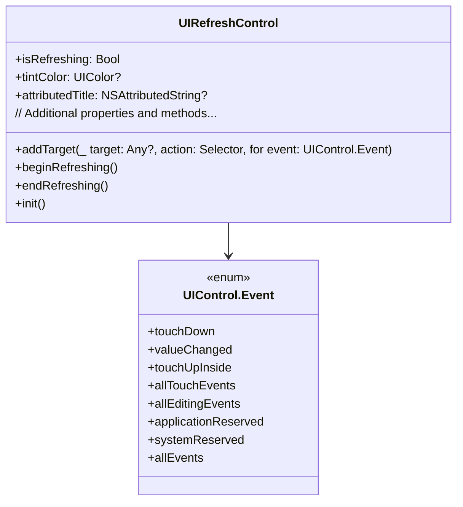

---

## **2. Initializers Overview**

### **a. Initialization Methods Diagram**
- **Purpose**: Break down the various ways to instantiate `UIRefreshControl`.
- **Diagram Type**: `flowchart LR`

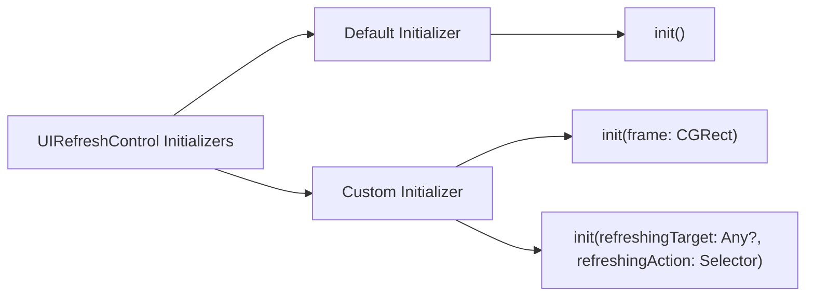

---

## **3. Properties Breakdown**

### **a. Key Properties Diagram**
- **Purpose**: Detail the main properties of `UIRefreshControl`.
- **Diagram Type**: `graph LR`

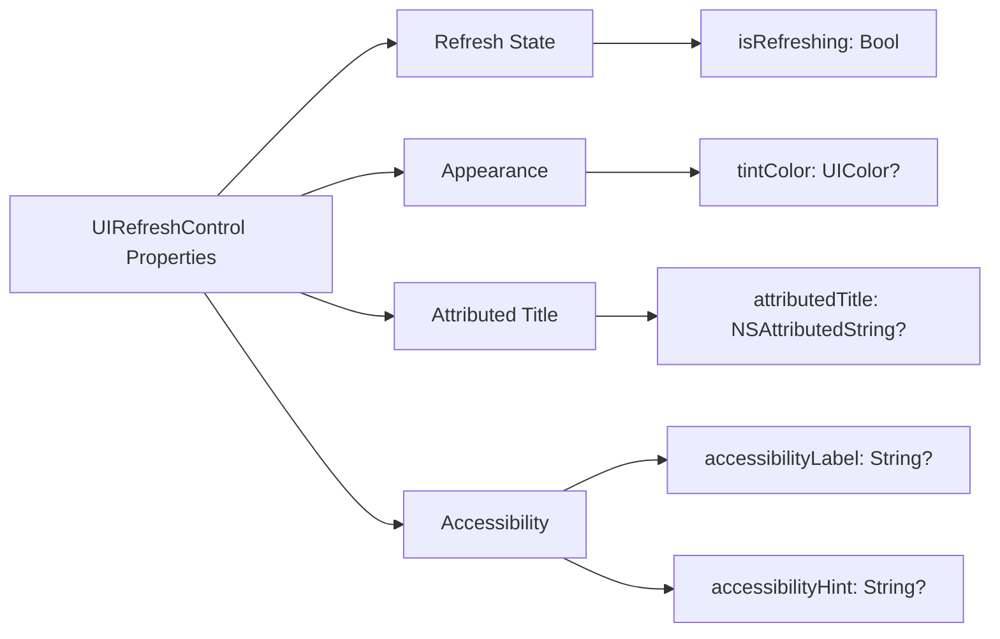

---

## **4. Methods Grouped by Functionality**

### **a. Refresh Control Methods**
- **Purpose**: Categorize methods based on their roles in controlling the refresh behavior.
- **Diagram Type**: `flowchart TD`

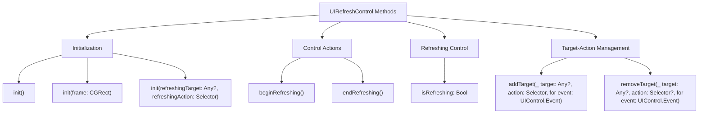

---

## **5. Enumerations and Configurations**

### **a. Enumerations Diagram**
- **Purpose**: Highlight the enums used within `UIRefreshControl` and their possible values.
- **Diagram Type**: `classDiagram`

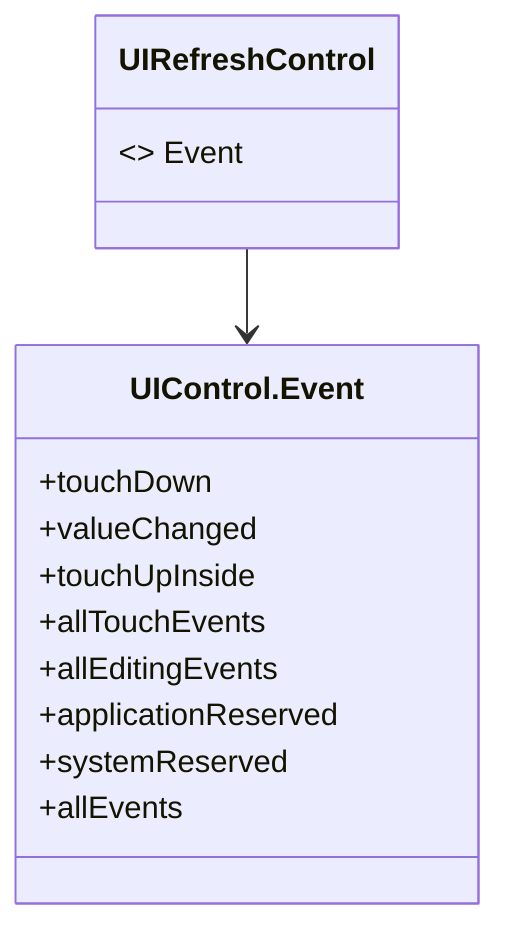

### **b. Configuration Classes Diagram**
- **Purpose**: Show the relationship between `UIRefreshControl` and its configuration classes.
- **Diagram Type**: `classDiagram`

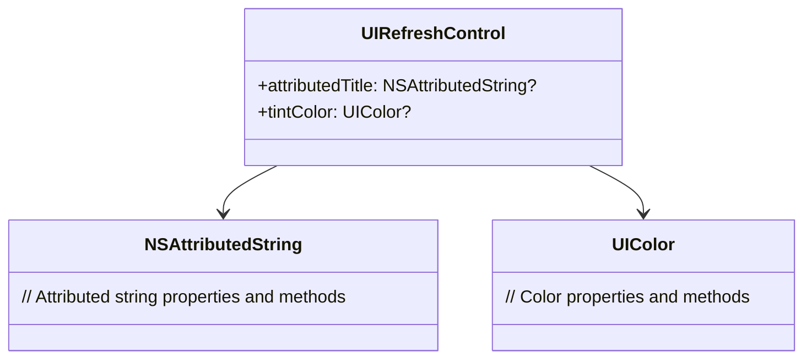

---

## **6. Protocol Conformances**

### **a. Protocols Diagram**
- **Purpose**: Display the protocols that `UIRefreshControl` conforms to and their impact.
- **Diagram Type**: `classDiagram`

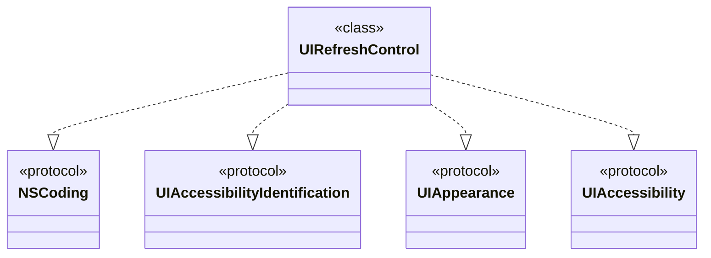

---

## **7. Relationships with Other Classes**

### **a. Related Classes Diagram**
- **Purpose**: Illustrate how `UIRefreshControl` interacts with other UIKit classes and frameworks.
- **Diagram Type**: `flowchart TD`

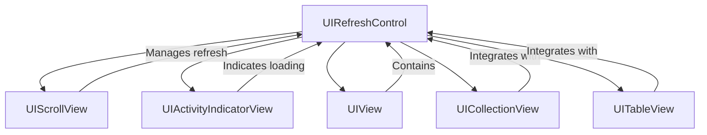

---

## **8. Extensions and Additional Functionalities**

### **a. UIRefreshControl Extensions Diagram**
- **Purpose**: Showcase the additional functionalities provided through extensions.
- **Diagram Type**: `classDiagram`

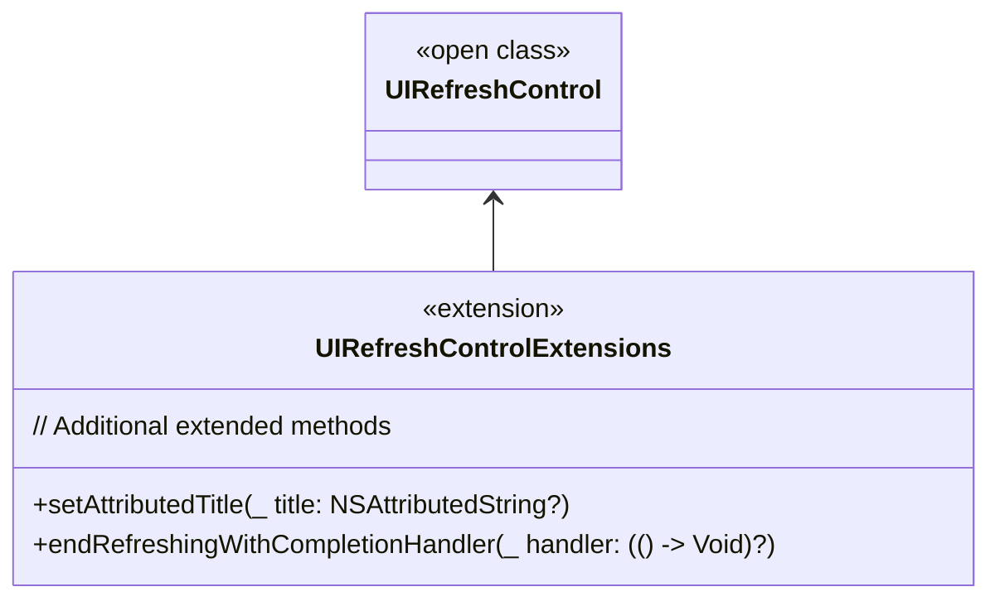

### **b. Extensions Functionalities Flowchart**
- **Purpose**: Detail specific extended methods and their purposes.
- **Diagram Type**: `flowchart LR`

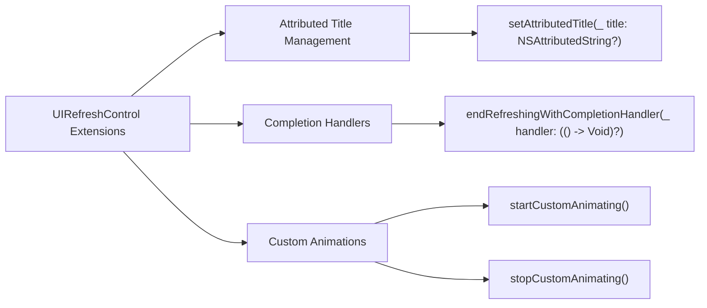

---

## **9. Lifecycle and Use Cases**

### **a. Lifecycle Flowchart**
- **Purpose**: Demonstrate the typical lifecycle of a `UIRefreshControl` within an application.
- **Diagram Type**: `flowchart TD`

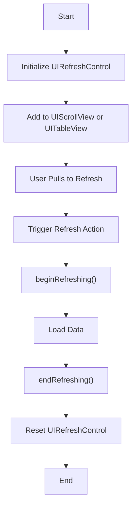

### **b. Common Use Cases Diagram**
- **Purpose**: Outline the typical scenarios where `UIRefreshControl` is utilized.
- **Diagram Type**: `flowchart TD`

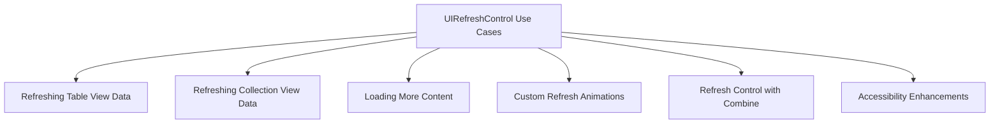

---

## **10. Feature Availability Timeline**

### **a. Feature Availability Gantt Chart**
- **Purpose**: Show when various `UIRefreshControl` features were introduced across iOS versions.
- **Diagram Type**: `gantt`

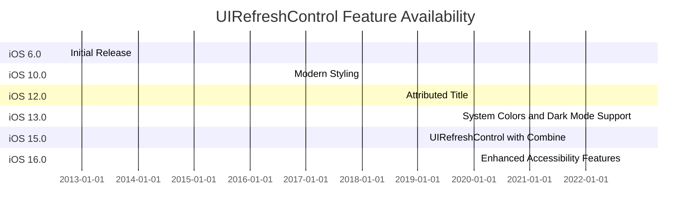

---

## **11. Data Handling and Formats**

### **a. Refresh Control Data Handling Diagram**
- **Purpose**: Explain how `UIRefreshControl` handles data and state management.
- **Diagram Type**: `graph LR`

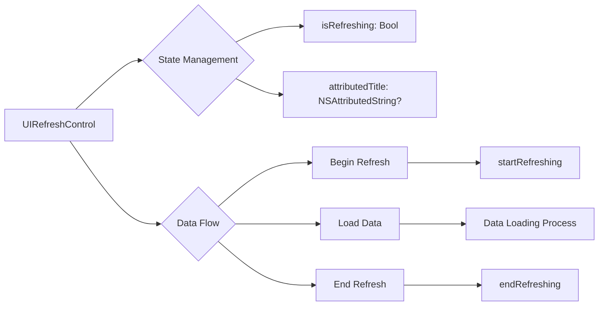

---

## **12. Integration with Drawing Contexts**

### **a. Refresh Control Appearance Customization Diagram**
- **Purpose**: Show how `UIRefreshControl` methods are used to customize its appearance within drawing contexts.
- **Diagram Type**: `flowchart TD`

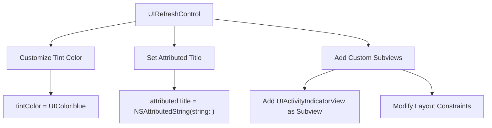

---

## **13. Summary and Best Practices**

### **a. Summary Diagram**
- **Purpose**: Provide a high-level overview of `UIRefreshControl`'s key characteristics and functionalities.
- **Diagram Type**: `graph LR`

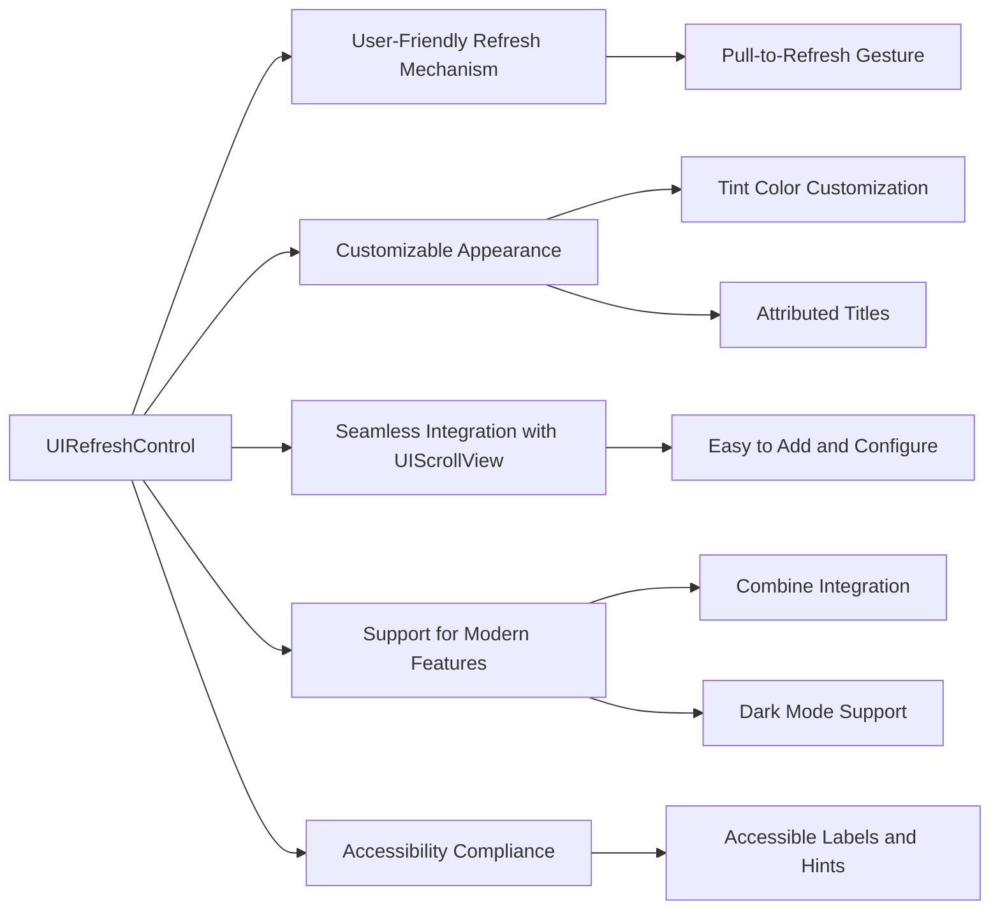

### **b. Best Practices Diagram**
- **Purpose**: Outline best practices for using `UIRefreshControl` effectively.
- **Diagram Type**: `flowchart LR`

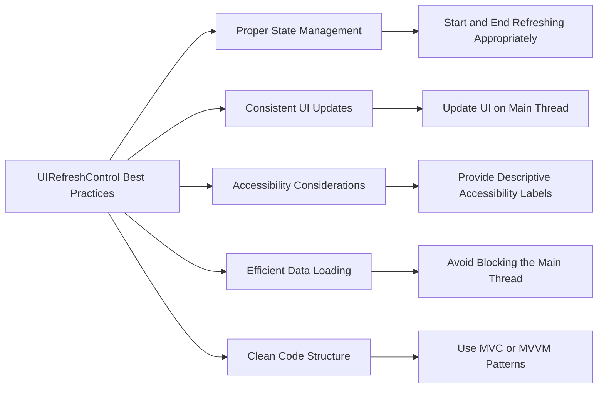

---

## **14. Additional Diagrams (Optional)**

### **a. UIRefreshControl View Hierarchy Diagram**
- **Purpose**: Illustrate the view hierarchy involving `UIRefreshControl`.
- **Diagram Type**: `graph TD`

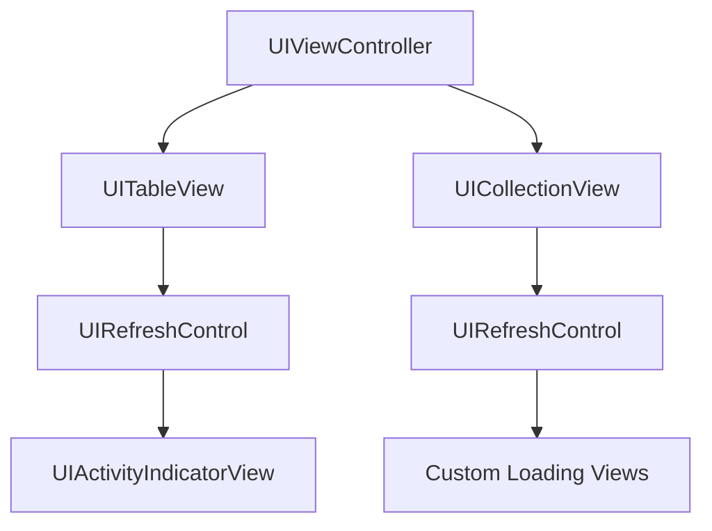

### **b. UIRefreshControl Usage in Code Sequence Diagram**
- **Purpose**: Show the sequence of method calls when using `UIRefreshControl`.
- **Diagram Type**: `sequenceDiagram`

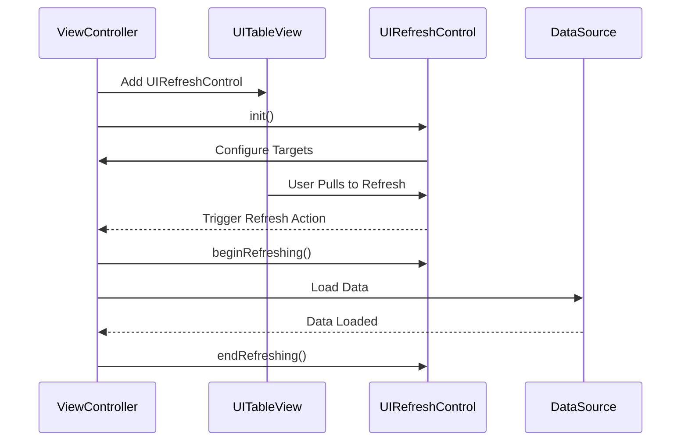

---
