# UIScrollView
> This content is dual-licensed under your choice of the following licenses:
> 1.  **MIT License:** For the code implementations in Swift and Mermaid provided in this document.
> 2.  **Creative Commons Attribution 4.0 International License (CC BY 4.0):** For all other content, including the text, explanations, and the Mermaid diagrams and illustrations.

---

Below is a comprehensive and organized set of Mermaid diagrams for the `UIScrollView` class. These diagrams cover various aspects of `UIScrollView`, including its class structure, initializers, properties, methods, enumerations, protocol conformances, relationships with other classes, extensions, lifecycle, data handling, integration with drawing contexts, and best practices.

---

## **1. Class Structure and Hierarchy**

### **a. Core Class Diagram**
- **Purpose**: Illustrate the primary structure of `UIScrollView`, including its properties, methods, and enumerations.
- **Diagram Type**: `classDiagram`
- **Contents**:
  - **Properties**: Key attributes like `contentSize`, `contentOffset`, `delegate`, etc.
  - **Methods**: Essential functions like `setContentOffset(_:animated:)`, `scrollRectToVisible(_:animated:)`, etc.
  - **Enumerations**: Nested enums such as `IndicatorStyle`, `DecelerationRate`, and `KeyboardDismissMode`.

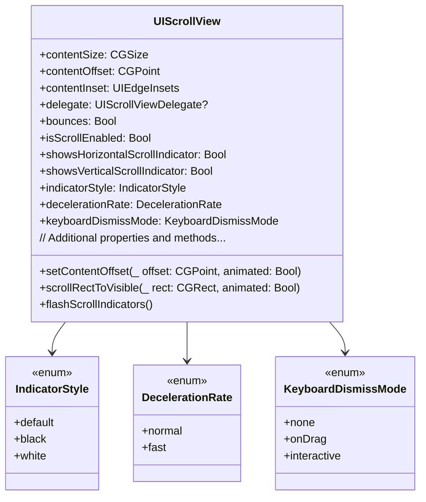

---

## **2. Initializers Overview**

### **a. Initialization Methods Diagram**
- **Purpose**: Break down the various ways to instantiate `UIScrollView`.
- **Diagram Type**: `flowchart LR`
- **Contents**:
  - **Programmatic Initialization**: `init(frame:)`
  - **Interface Builder Initialization**: `init(coder:)`
  - **Configuration Methods**: Methods to configure scroll view properties post-initialization.

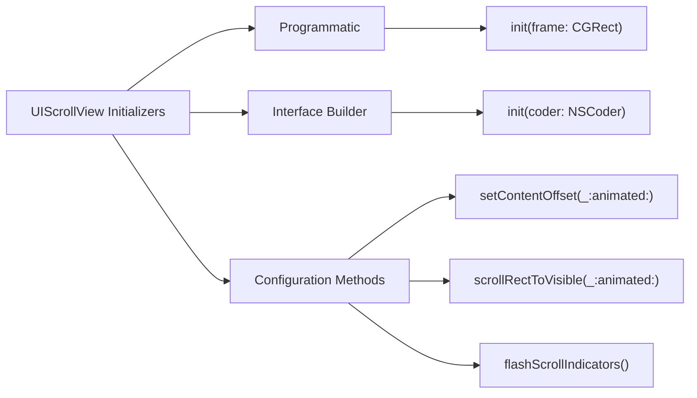

---

## **3. Properties Breakdown**

### **a. Key Properties Diagram**
- **Purpose**: Detail the main properties of `UIScrollView`.
- **Diagram Type**: `classDiagram`
- **Contents**:
  - **Content Management**: `contentSize`, `contentOffset`, `contentInset`
  - **Behavioral Attributes**: `bounces`, `isScrollEnabled`, `decelerationRate`
  - **Indicator Attributes**: `showsHorizontalScrollIndicator`, `showsVerticalScrollIndicator`, `indicatorStyle`
  - **Keyboard Management**: `keyboardDismissMode`
  - **Additional Attributes**: `delegate`, `panGestureRecognizer`, `pinchGestureRecognizer`

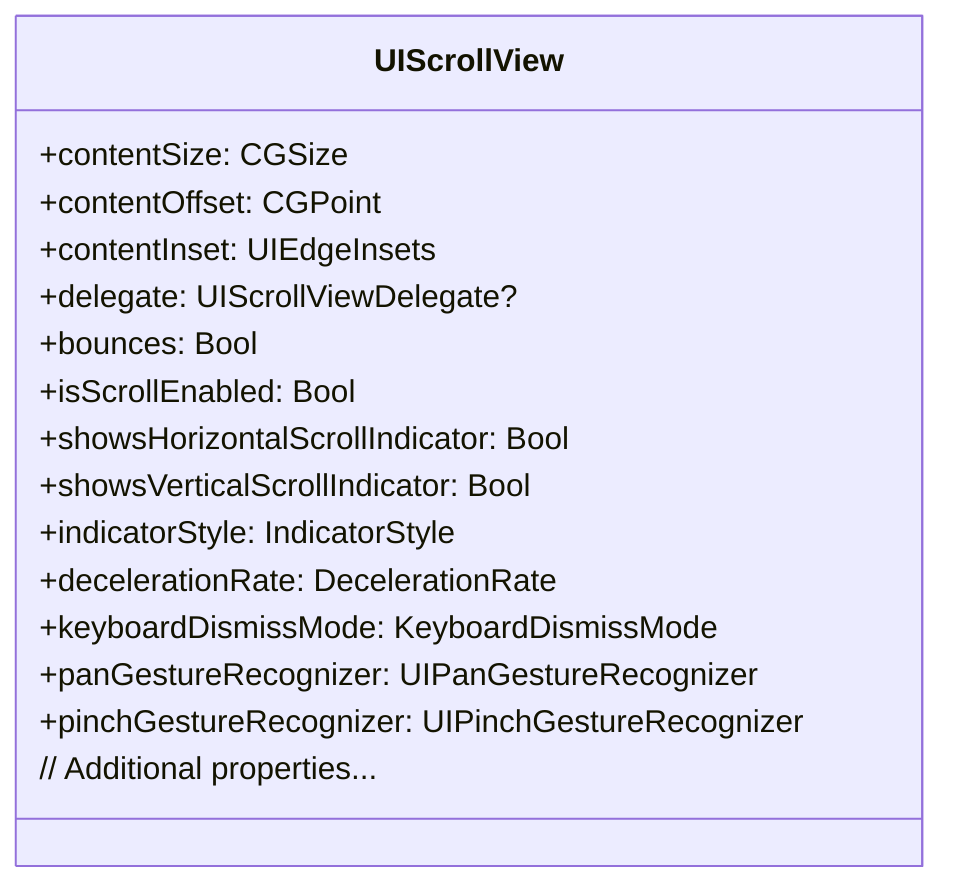

---

## **4. Methods Grouped by Functionality**

### **a. Scrolling Methods**
- **Purpose**: Categorize methods based on their roles in scrolling behavior.
- **Diagram Type**: `flowchart TD`
- **Contents**:
  - **Content Offset Management**: `setContentOffset(_:animated:)`, `scrollRectToVisible(_:animated:)`
  - **Indicator Management**: `flashScrollIndicators()`
  - **Zooming Methods**: `setZoomScale(_:animated:)`, `zoom(to:rect, animated:)`
  - **Paging Methods**: Methods related to enabling and managing paging behavior.

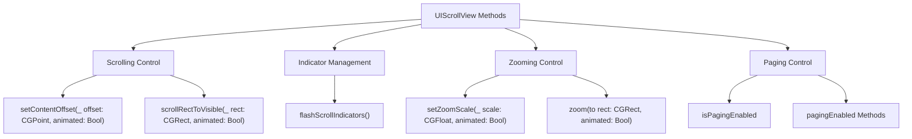

---

## **5. Enumerations and Configurations**

### **a. Enumerations Diagram**
- **Purpose**: Highlight the enums used within `UIScrollView` and their possible values.
- **Diagram Type**: `classDiagram`
- **Contents**:
  - **IndicatorStyle**
  - **DecelerationRate**
  - **KeyboardDismissMode**
  - **ScrollViewKeyboardDismissMode**
  
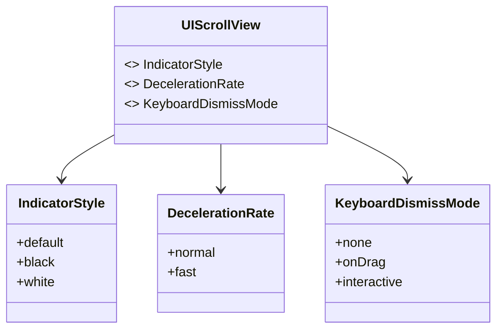

### **b. Configuration Classes Diagram**
- **Purpose**: Show the relationship between `UIScrollView` and its configuration classes.
- **Diagram Type**: `classDiagram`
- **Contents**:
  - **UIScrollViewConfiguration**
  - **UIScrollViewDelegate**

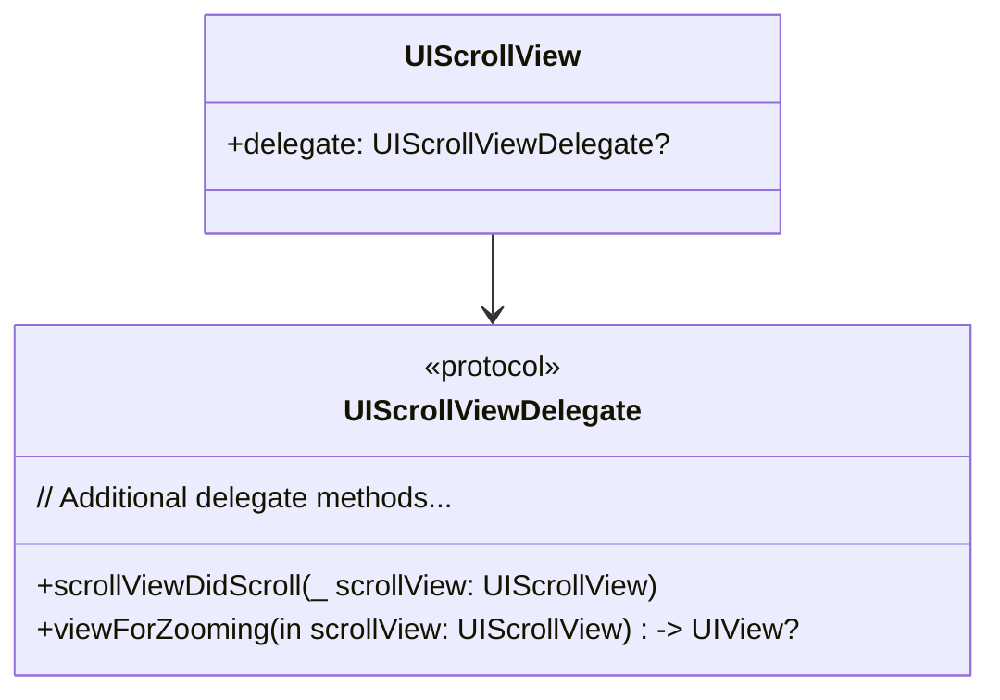

---

## **6. Protocol Conformances**

### **a. Protocols Diagram**
- **Purpose**: Display the protocols that `UIScrollView` conforms to and their impact.
- **Diagram Type**: `classDiagram`
- **Contents**:
  - **UIScrollViewDelegate**
  - **NSCoding**
  - **UIAppearance**
  - **UICollectionViewDelegate**
  
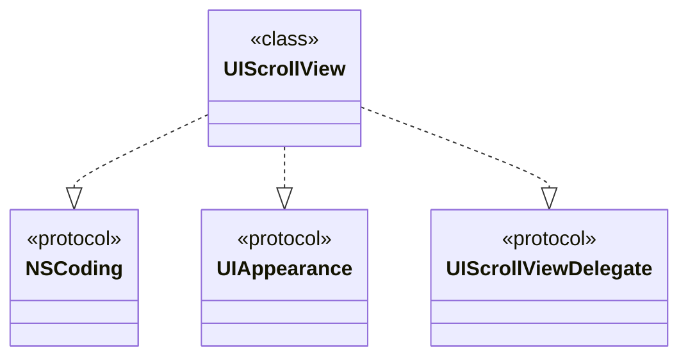

---

## **7. Relationships with Other Classes**

### **a. Related Classes Diagram**
- **Purpose**: Illustrate how `UIScrollView` interacts with other UIKit classes and frameworks.
- **Diagram Type**: `flowchart TD`
- **Contents**:
  - **UIImageView**: Often embedded within a `UIScrollView` for zooming and panning.
  - **UITableView**: A subclass of `UIScrollView`.
  - **UICollectionView**: Also a subclass of `UIScrollView`.
  - **UITextView**: Contains a `UIScrollView` for text scrolling.
  - **UIPageControl**: Often used in conjunction with a `UIScrollView` for paging.

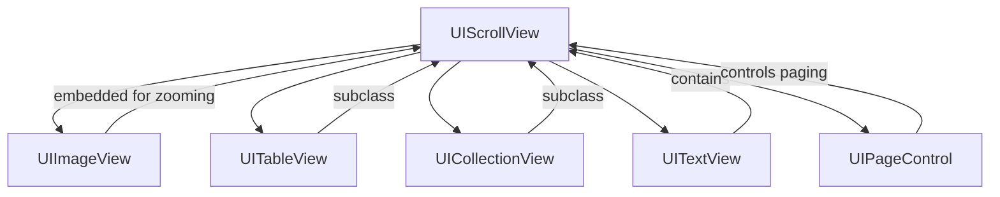

---

## **8. Extensions and Additional Functionalities**

### **a. UIScrollView Extensions Diagram**
- **Purpose**: Showcase the additional functionalities provided through extensions.
- **Diagram Type**: `classDiagram`
- **Contents**:
  - **Snap Scrolling**
  - **Infinite Scrolling**
  - **Pull-to-Refresh**
  - **Keyboard Handling**

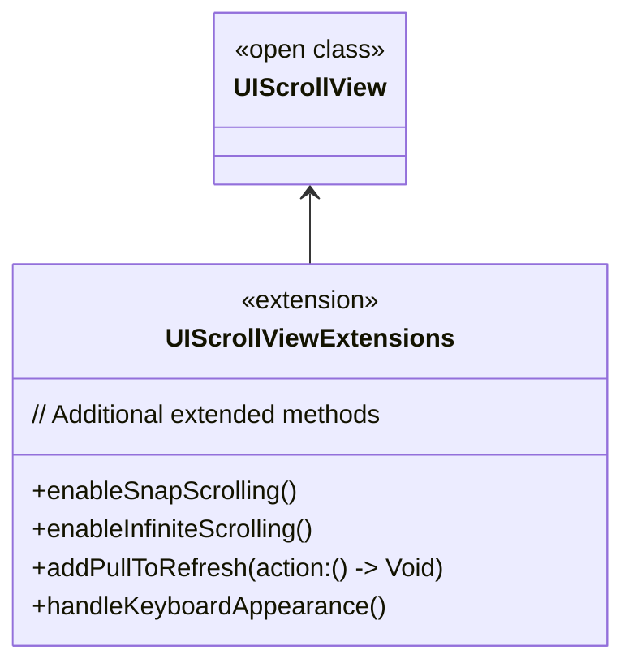

### **b. Extensions Functionalities Flowchart**
- **Purpose**: Detail specific extended methods and their purposes.
- **Diagram Type**: `flowchart LR`
- **Contents**:
  - **Snap Scrolling**
  - **Infinite Scrolling**
  - **Pull-to-Refresh**
  - **Keyboard Handling**

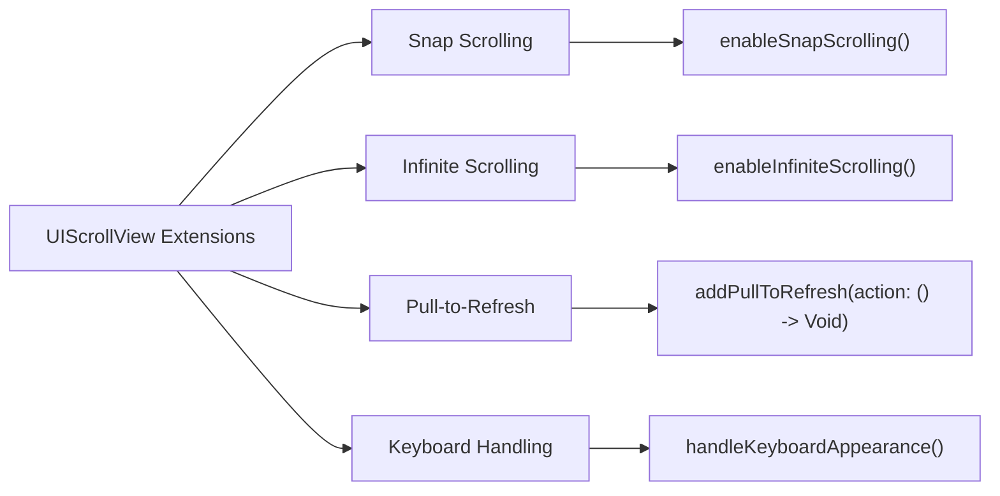

---

## **9. Lifecycle and Use Cases**

### **a. Lifecycle Flowchart**
- **Purpose**: Demonstrate the typical lifecycle of a `UIScrollView` within an application.
- **Diagram Type**: `flowchart TD`
- **Contents**:
  - **Initialization**
  - **Configuration**
  - **Adding Content**
  - **User Interaction**
  - **Scrolling and Zooming**
  - **Updating Content**
  - **Cleanup**

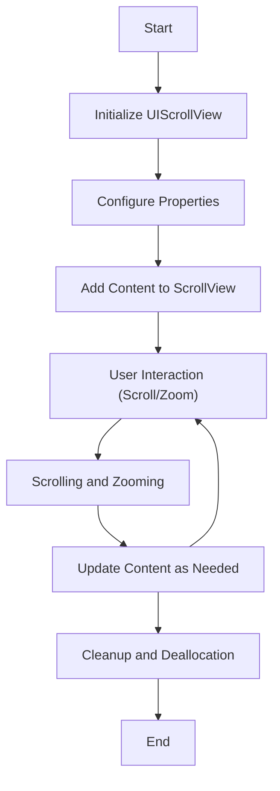


### **b. Common Use Cases Diagram**
- **Purpose**: Outline the typical scenarios where `UIScrollView` is utilized.
- **Diagram Type**: `flowchart TD`
- **Contents**:
  - **Displaying Large Content**
  - **Zooming Features**
  - **Paging Between Views**
  - **Creating Image Galleries**
  - **Implementing Infinite Scrolling**
  - **Pull-to-Refresh Mechanism**

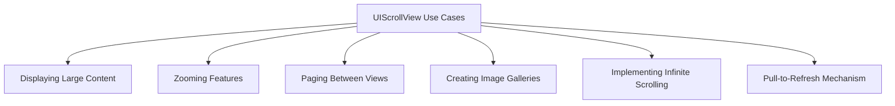

---

## **10. Feature Availability Timeline**

### **a. Feature Availability Gantt Chart**
- **Purpose**: Show when various `UIScrollView` features were introduced across iOS versions.
- **Diagram Type**: `gantt`
- **Contents**:
  - **iOS Versions**: 2.0, 3.0, 4.0, 5.0, 6.0, 7.0, 8.0, 10.0, 11.0, 13.0, 14.0, 15.0, 16.0, 17.0
  - **Features Introduced**: Paging Enabled, Zooming, Delegate Methods, Pull-to-Refresh, Snap Scrolling, Infinite Scrolling, Keyboard Dismiss Modes, etc.

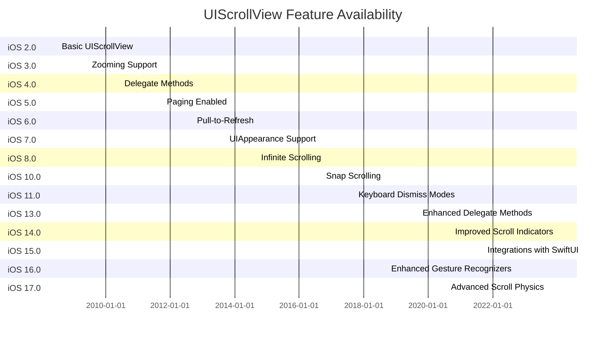

---

## **11. Data Handling and Formats**

### **a. Content Management Diagram**
- **Purpose**: Explain how `UIScrollView` handles different types of content and data formats.
- **Diagram Type**: `graph LR`
- **Contents**:
  - **Content Size Management**: `contentSize`
  - **Content Offset Handling**: `contentOffset`
  - **Content Insets**: `contentInset`
  - **Zooming Content**: `zoomScale`, `minimumZoomScale`, `maximumZoomScale`
  - **Paging**: `isPagingEnabled`
  - **Scroll Indicators**: `showsHorizontalScrollIndicator`, `showsVerticalScrollIndicator`

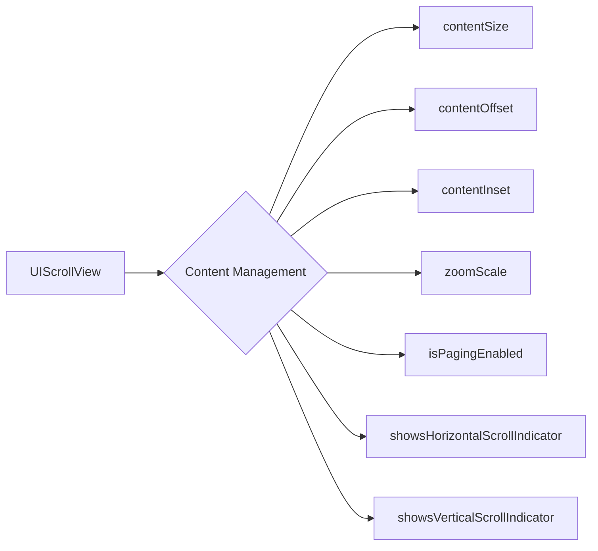

---

## **12. Integration with Drawing Contexts**

### **a. Drawing Methods Usage Diagram**
- **Purpose**: Show how `UIScrollView` interacts with drawing contexts and rendering.
- **Diagram Type**: `flowchart TD`
- **Contents**:
  - **Layer Management**: Adding subviews, managing layers
  - **Custom Drawing**: Drawing within scroll view's content area
  - **Rendering Updates**: Handling layout and rendering updates during scrolling

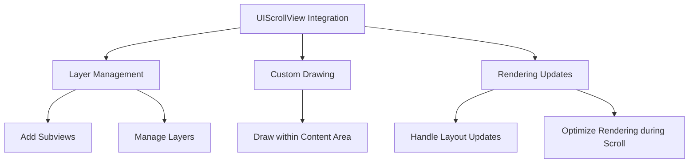

---

## **13. Summary and Best Practices**

### **a. Summary Diagram**
- **Purpose**: Provide a high-level overview of `UIScrollView`'s key characteristics and functionalities.
- **Diagram Type**: `graph LR`
- **Contents**:
  - **Versatile Content Display**
  - **Advanced Scrolling & Zooming**
  - **Performance Optimizations**
  - **Seamless Integration with UIKit Components**
  - **Customizable Behavior through Delegates and Extensions**

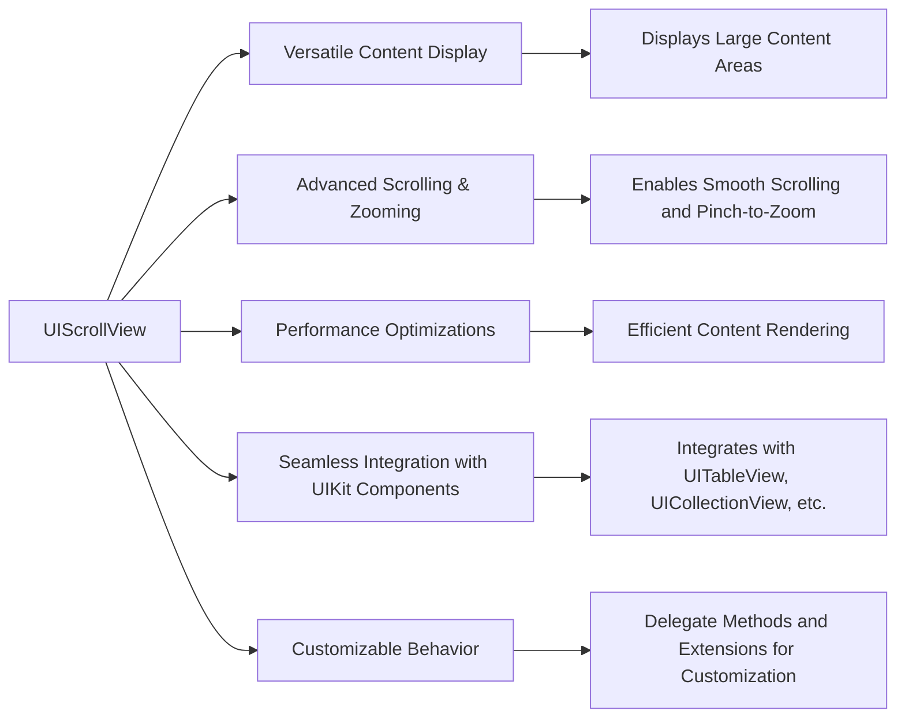

### **b. Best Practices Diagram**
- **Purpose**: Highlight best practices when utilizing `UIScrollView`.
- **Diagram Type**: `graph TD`
- **Contents**:
  - **Proper Content Size Management**
  - **Efficient View Hierarchy**
  - **Optimized Scrolling Performance**
  - **Responsive to Orientation Changes**
  - **Effective Use of Delegates**

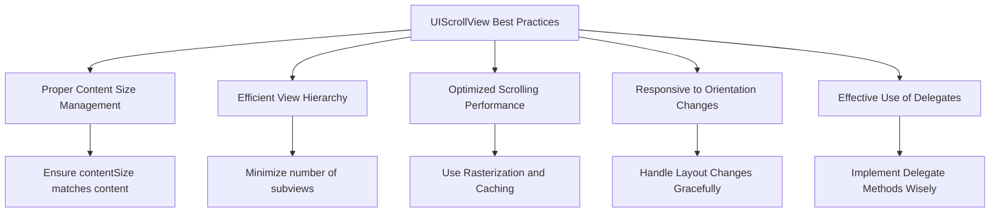

---

## **14. Additional Features and Extensions**

### **a. Accessibility Integration Diagram**
- **Purpose**: Demonstrate how `UIScrollView` integrates with accessibility features.
- **Diagram Type**: `flowchart LR`
- **Contents**:
  - **VoiceOver Support**
  - **Dynamic Type Adjustments**
  - **Accessibility Elements Management**

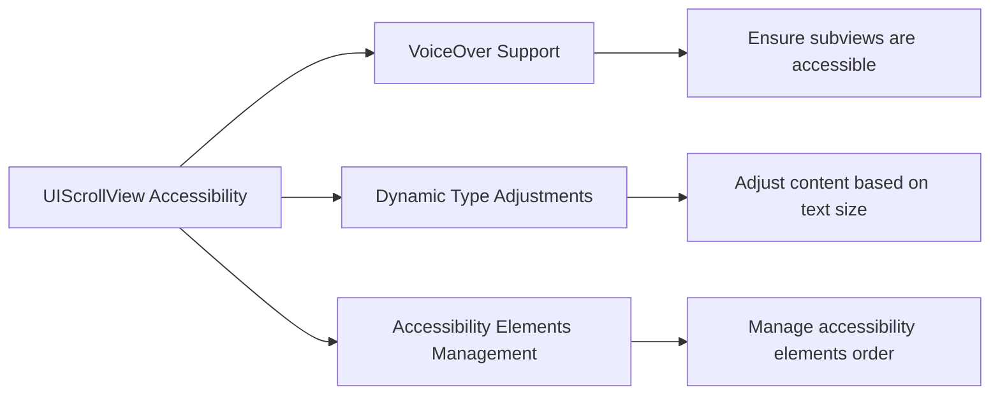

### **b. Gesture Recognizers Integration Diagram**
- **Purpose**: Show how gesture recognizers interact with `UIScrollView`.
- **Diagram Type**: `flowchart TD`
- **Contents**:
  - **Pan Gesture**
  - **Pinch Gesture**
  - **Tap Gesture**
  - **Custom Gestures**

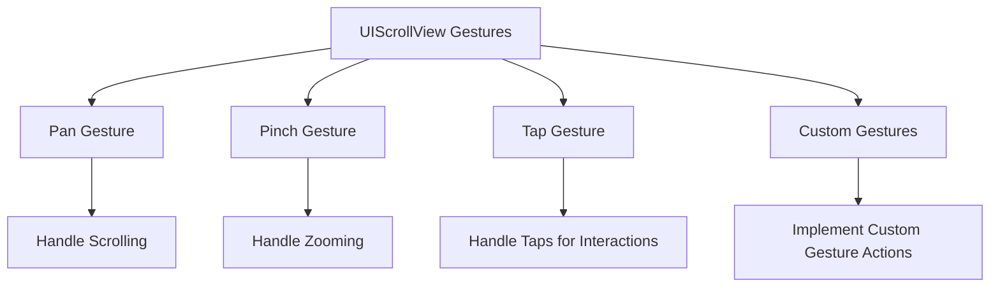

---

## **15. Troubleshooting and Debugging**

### **a. Common Issues Diagram**
- **Purpose**: Identify common issues encountered when working with `UIScrollView` and their solutions.
- **Diagram Type**: `flowchart LR`
- **Contents**:
  - **Content Size Misconfiguration**
  - **Scrolling Not Enabled**
  - **Zooming not Working**
  - **Gesture Conflicts**
  - **Performance Lag**

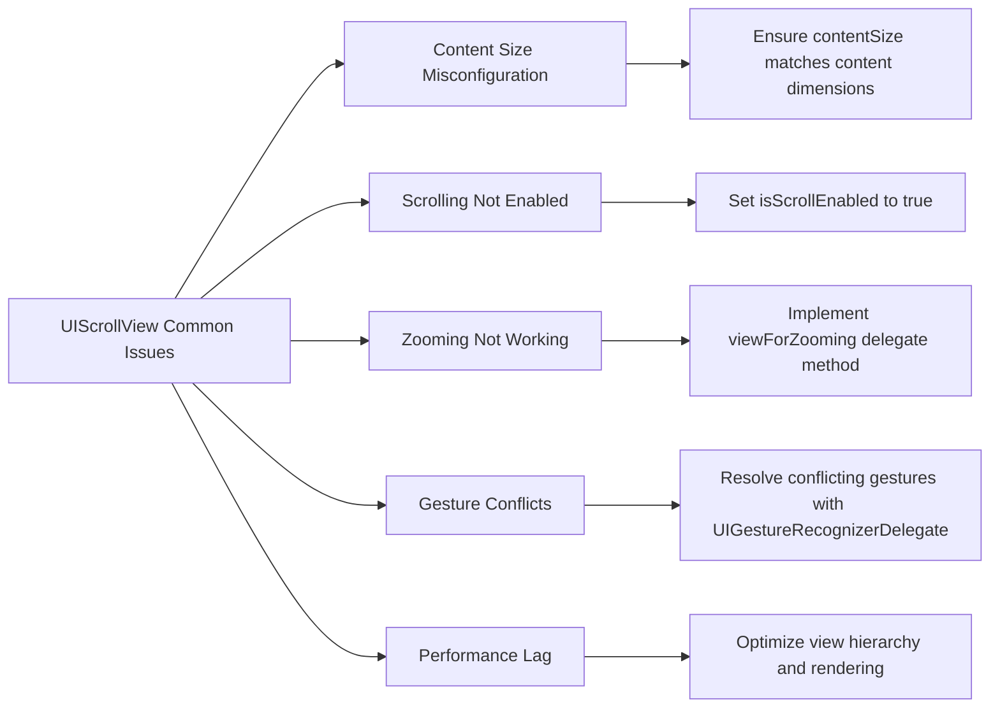

### **b. Debugging Tools Diagram**
- **Purpose**: Highlight tools and methods for debugging `UIScrollView` issues.
- **Diagram Type**: `flowchart TD`
- **Contents**:
  - **Xcode Debugger**
  - **Instruments Tool**
  - **Logging and Breakpoints**
  - **View Hierarchy Debugging**
  - **Accessibility Inspector**

```mermaid
flowchart TD
    A[UIScrollView Debugging Tools] --> B[Xcode Debugger]
    A --> C[Instruments Tool]
    A --> D[Logging and Breakpoints]
    A --> E[View Hierarchy Debugging]
    A --> F[Accessibility Inspector]

    B --> B1["Inspect scroll view properties at runtime"]
    C --> C1["Profile performance and memory usage"]
    D --> D1["Log outputs and set breakpoints in delegate methods"]
    E --> E1["Visualize view hierarchy to identify layout issues"]
    F --> F1["Ensure accessibility elements are correctly configured"]
```

---

## **16. Advanced Customizations**

### **a. Custom Scroll Behaviors Diagram**
- **Purpose**: Illustrate how to implement custom scroll behaviors in `UIScrollView`.
- **Diagram Type**: `flowchart TD`
- **Contents**:
  - **Custom Deceleration**
  - **Snapping to Specific Points**
  - **Custom Bounce Effects**
  - **Dynamic Content Loading**

```mermaid
flowchart TD
    A[Custom Scroll Behaviors] --> B[Custom Deceleration]
    A --> C[Snapping to Specific Points]
    A --> D[Custom Bounce Effects]
    A --> E[Dynamic Content Loading]

    B --> B1["Override decelerationRate or implement custom physics"]
    C --> C1["Implement snapping logic in scrollViewDidEndDragging"]
    D --> D1["Customize bounceInsets or use CAAnimations"]
    E --> E1["Load content dynamically based on scroll position"]
```

### **b. Integrating with SwiftUI Diagram**
- **Purpose**: Show how to integrate `UIScrollView` within SwiftUI environments.
- **Diagram Type**: `flowchart LR`
- **Contents**:
  - **UIViewRepresentable**
  - **Coordinator Pattern**
  - **Handling Data Binding**
  - **Synchronizing Scroll Position**

```mermaid
flowchart LR
    A[Integrating UIScrollView with SwiftUI] --> B[UIViewRepresentable]
    A --> C[Coordinator Pattern]
    A --> D[Handling Data Binding]
    A --> E[Synchronizing Scroll Position]

    B --> B1["Create SwiftUI wrapper for UIScrollView"]
    C --> C1["Use Coordinator for delegate methods"]
    D --> D1["Bind UIScrollView properties to SwiftUI state"]
    E --> E1["Update SwiftUI views based on scroll position"]
```

---

## **17. Performance Optimization Techniques**

### **a. Optimizing Scrolling Performance Diagram**
- **Purpose**: Highlight techniques to enhance the performance of `UIScrollView`.
- **Diagram Type**: `flowchart TD`
- **Contents**:
  - **Lazy Loading of Content**
  - **Reducing View Hierarchy Depth**
  - **Using Rasterization**
  - **Minimizing Repaints**
  - **Efficient Delegate Implementations**

```mermaid
flowchart TD
    A[Performance Optimization] --> B[Lazy Loading of Content]
    A --> C[Reducing View Hierarchy Depth]
    A --> D[Using Rasterization]
    A --> E[Minimizing Repaints]
    A --> F[Efficient Delegate Implementations]

    B --> B1["Load content as it becomes visible"]
    C --> C1["Flatten view hierarchy to reduce rendering overhead"]
    D --> D1["Enable rasterization for static content"]
    E --> E1["Avoid unnecessary layout passes"]
    F --> F1["Implement lightweight delegate methods"]
```

### **b. Memory Management Diagram**
- **Purpose**: Explain best practices for memory management within `UIScrollView`.
- **Diagram Type**: `flowchart LR`
- **Contents**:
  - **Reusing Views**
  - **Clearing Unused Resources**
  - **Avoiding Memory Leaks**
  - **Using Weak References for Delegates**

```mermaid
flowchart LR
    A[Memory Management in UIScrollView] --> B[Reusing Views]
    A --> C[Clearing Unused Resources]
    A --> D[Avoiding Memory Leaks]
    A --> E[Using Weak References for Delegates]

    B --> B1["Implement view reuse mechanisms similar to UITableView"]
    C --> C1["Remove or nil out views that are no longer visible"]
    D --> D1["Use tools like Instruments to detect leaks"]
    E --> E1["Ensure delegate properties are weak to prevent retain cycles"]
```

---

## **18. Accessibility Best Practices**

### **a. Accessibility Enhancements Diagram**
- **Purpose**: Showcase best practices to make `UIScrollView` accessible.
- **Diagram Type**: `flowchart TD`
- **Contents**:
  - **VoiceOver Optimization**
  - **Dynamic Type Support**
  - **Accessible Custom Controls**
  - **Proper Labeling and Hints**

```mermaid
flowchart TD
    A[Accessibility Best Practices] --> B[VoiceOver Optimization]
    A --> C[Dynamic Type Support]
    A --> D[Accessible Custom Controls]
    A --> E[Proper Labeling and Hints]

    B --> B1["Ensure all interactive elements are accessible"]
    C --> C1["Support scalable text and adjust layouts accordingly"]
    D --> D1["Make custom controls conform to accessibility protocols"]
    E --> E1["Provide meaningful labels and hints for assistive technologies"]
```

---

## **19. Security Considerations**

### **a. Secure Content Handling Diagram**
- **Purpose**: Highlight security best practices when handling sensitive content within `UIScrollView`.
- **Diagram Type**: `flowchart LR`
- **Contents**:
  - **Secure Data Loading**
  - **Preventing Data Exposure**
  - **Handling Sensitive Information**
  - **Using HTTPS for Network Content**

```mermaid
flowchart LR
    A[Security Considerations] --> B[Secure Data Loading]
    A --> C[Preventing Data Exposure]
    A --> D[Handling Sensitive Information]
    A --> E[Using HTTPS for Network Content]

    B --> B1["Validate and sanitize all data before display"]
    C --> C1["Use proper access controls for content"]
    D --> D1["Encrypt sensitive data if necessary"]
    E --> E1["Ensure all network requests use secure protocols"]
```

---

## **20. Migrating to Latest iOS Versions**

### **a. Migration Steps Diagram**
- **Purpose**: Outline steps to migrate existing `UIScrollView` implementations to the latest iOS versions.
- **Diagram Type**: `flowchart TD`
- **Contents**:
  - **Review Deprecated APIs**
  - **Adopt New Features**
  - **Test Across Devices**
  - **Optimize for Latest OS**
  - **Update Documentation**

```mermaid
flowchart TD
    A[Migration to Latest iOS] --> B[Review Deprecated APIs]
    A --> C[Adopt New Features]
    A --> D[Test Across Devices]
    A --> E[Optimize for Latest OS]
    A --> F[Update Documentation]

    B --> B1["Identify and replace deprecated UIScrollView methods"]
    C --> C1["Incorporate new scrolling and zooming features"]
    D --> D1["Ensure compatibility across all target devices"]
    E --> E1["Optimize performance for the latest hardware"]
    F --> F1["Document changes and update code comments"]
```

---

## **21. Integrating with Third-Party Libraries**

### **a. Third-Party Integration Diagram**
- **Purpose**: Show how `UIScrollView` can be integrated with popular third-party libraries.
- **Diagram Type**: `flowchart LR`
- **Contents**:
  - **SnapKit for Layouts**
  - **Alamofire for Networking Content**
  - **SDWebImage for Image Loading**
  - **RxSwift for Reactive Scrolling**
  - **Kingfisher for Image Caching**

```mermaid
flowchart LR
    A[UIScrollView Third-Party Integrations] --> B[SnapKit for Layouts]
    A --> C[Alamofire for Networking Content]
    A --> D[SDWebImage for Image Loading]
    A --> E[RxSwift for Reactive Scrolling]
    A --> F[Kingfisher for Image Caching]

    B --> B1["Use SnapKit to define scroll view layouts"]
    C --> C1["Fetch content data using Alamofire"]
    D --> D1["Load images asynchronously with SDWebImage"]
    E --> E1["Implement reactive scrolling behaviors with RxSwift"]
    F --> F1["Cache images efficiently using Kingfisher"]
```

---

## **22. Animations and Transitions**

### **a. Animations Diagram**
- **Purpose**: Illustrate how to implement animations and transitions within `UIScrollView`.
- **Diagram Type**: `flowchart TD`
- **Contents**:
  - **Smooth Scrolling Animations**
  - **Custom Transition Effects**
  - **Interactive Animations**
  - **Content Movement Synchronization**

```mermaid
flowchart TD
    A[UIScrollView Animations] --> B[Smooth Scrolling Animations]
    A --> C[Custom Transition Effects]
    A --> D[Interactive Animations]
    A --> E[Content Movement Synchronization]

    B --> B1["Use setContentOffset(_:animated:) for smooth scrolling"]
    C --> C1["Implement UIView animations for custom transitions"]
    D --> D1["Incorporate gesture recognizers for interactive animations"]
    E --> E1["Synchronize animations with scroll events"]
```

---

## **23. Accessibility Compliance**

### **a. Accessibility Compliance Diagram**
- **Purpose**: Ensure `UIScrollView` implementations comply with accessibility standards.
- **Diagram Type**: `flowchart LR`
- **Contents**:
  - **VoiceOver Support**
  - **Dynamic Type Compatibility**
  - **Accessible Touch Targets**
  - **Properly Labeled Elements**
  - **Testing with Accessibility Inspector**

```mermaid
flowchart LR
    A[Accessibility Compliance] --> B[VoiceOver Support]
    A --> C[Dynamic Type Compatibility]
    A --> D[Accessible Touch Targets]
    A --> E[Properly Labeled Elements]
    A --> F[Testing with Accessibility Inspector]

    B --> B1["Ensure scrollable content is navigable via VoiceOver"]
    C --> C1["Adapt layouts to accommodate different text sizes"]
    D --> D1["Ensure touch targets meet minimum size requirements"]
    E --> E1["Provide meaningful labels and hints for UI elements"]
    F --> F1["Use Accessibility Inspector to verify compliance"]
```

---

## **24. Multithreading and Concurrency**

### **a. Multithreading Diagram**
- **Purpose**: Explain how `UIScrollView` interacts with multithreading and concurrency for optimal performance.
- **Diagram Type**: `flowchart TD`
- **Contents**:
  - **Asynchronous Content Loading**
  - **Background Processing**
  - **Main Thread Updates**
  - **Concurrency Safety**

```mermaid
flowchart TD
    A[UIScrollView Multithreading] --> B[Asynchronous Content Loading]
    A --> C[Background Processing]
    A --> D[Main Thread Updates]
    A --> E[Concurrency Safety]

    B --> B1["Load images and data asynchronously to avoid blocking UI"]
    C --> C1["Process heavy computations in background queues"]
    D --> D1["Update UI elements on the main thread"]
    E --> E1["Ensure thread-safe operations when accessing shared resources"]
```

---

## **25. Best Practices for Subclassing UIScrollView**

### **a. Subclassing Best Practices Diagram**
- **Purpose**: Provide guidelines for subclassing `UIScrollView` effectively.
- **Diagram Type**: `flowchart LR`
- **Contents**:
  - **Override Necessary Methods**
  - **Maintain Delegate Responsibilities**
  - **Handle Touch Events Properly**
  - **Optimize for Performance**
  - **Follow UIKit Conventions**

```mermaid
flowchart LR
    A[Subclassing UIScrollView Best Practices] --> B[Override Necessary Methods]
    A --> C[Maintain Delegate Responsibilities]
    A --> D[Handle Touch Events Properly]
    A --> E[Optimize for Performance]
    A --> F[Follow UIKit Conventions]

    B --> B1["Override layoutSubviews() for custom layout"]
    C --> C1["Ensure delegate methods are correctly implemented"]
    D --> D1["Properly manage touch event handling"]
    E --> E1["Minimize computational overhead in overridden methods"]
    F --> F1["Adhere to naming and behavioral conventions of UIKit"]
```

---

## **26. Integrating UIScrollView with Auto Layout**

### **a. Auto Layout Integration Diagram**
- **Purpose**: Demonstrate how to effectively integrate `UIScrollView` with Auto Layout.
- **Diagram Type**: `flowchart TD`
- **Contents**:
  - **Defining Constraints**
  - **Content View Setup**
  - **Handling Dynamic Content**
  - **Resolving Ambiguities**

```mermaid
flowchart TD
    A[UIScrollView Auto Layout Integration] --> B[Defining Constraints]
    A --> C[Content View Setup]
    A --> D[Handling Dynamic Content]
    A --> E[Resolving Ambiguities]

    B --> B1["Set constraints for scroll view's edges to superview"]
    C --> C1["Add a content view inside scroll view with constraints"]
    D --> D1["Ensure content view's size adjusts with dynamic content"]
    E --> E1["Avoid conflicting or ambiguous constraints"]
```

---

## **27. Handling Orientation Changes**

### **a. Orientation Handling Diagram**
- **Purpose**: Showcase techniques to handle device orientation changes within `UIScrollView`.
- **Diagram Type**: `flowchart LR`
- **Contents**:
  - **Adjusting Content Size**
  - **Recalculating Content Offset**
  - **Updating Layout Constraints**
  - **Maintaining Scroll Position**

```mermaid
flowchart LR
    A[Handling Orientation Changes] --> B[Adjusting Content Size]
    A --> C[Recalculating Content Offset]
    A --> D[Updating Layout Constraints]
    A --> E[Maintaining Scroll Position]

    B --> B1["Update contentSize based on new dimensions"]
    C --> C1["Calculate new contentOffset to preserve visibility"]
    D --> D1["Modify constraints to fit new orientation"]
    E --> E1["Ensure current content remains in view after rotation"]
```

---

## **28. Implementing Refresh Control**

### **a. Pull-to-Refresh Diagram**
- **Purpose**: Illustrate how to implement pull-to-refresh functionality within `UIScrollView`.
- **Diagram Type**: `flowchart TD`
- **Contents**:
  - **Adding UIRefreshControl**
  - **Configuring Refresh Action**
  - **Integrating with Content Loading**

```mermaid
flowchart TD
    A[Implementing Pull-to-Refresh] --> B[Adding UIRefreshControl]
    A --> C[Configuring Refresh Action]
    A --> D[Integrating with Content Loading]

    B --> B1["Initialize UIRefreshControl and add to scroll view"]
    
    C --> C1["Set target-action for refresh control"]
    
    D --> D1["Trigger data loading upon refresh"]
    D --> D2["End refreshing after data is loaded"]
```

---

## **29. Customizing Scroll Indicators**

### **a. Scroll Indicators Customization Diagram**
- **Purpose**: Demonstrate how to customize scroll indicators within `UIScrollView`.
- **Diagram Type**: `flowchart LR`
- **Contents**:
  - **Changing Indicator Style**
  - **Modifying Indicator Insets**
  - **Custom Indicator Appearance**

```mermaid
flowchart LR
    A[Customizing Scroll Indicators] --> B[Changing Indicator Style]
    A --> C[Modifying Indicator Insets]
    A --> D[Custom Indicator Appearance]

    B --> B1["Set indicatorStyle property to define appearance"]
    
    C --> C1["Adjust scrollIndicatorInsets to position indicators"]
    
    D --> D1["Implement custom indicator views for unique designs"]
```

---

## **30. Conclusion**

### **a. Comprehensive Overview Diagram**
- **Purpose**: Summarize the key aspects and functionalities of `UIScrollView`.
- **Diagram Type**: `graph LR`
- **Contents**:
  - **Core Functionalities**
  - **Customization Options**
  - **Integration Capabilities**
  - **Performance Considerations**
  - **Accessibility and Security**

```mermaid
graph LR
    A[UIScrollView Overview] --> B[Core Functionalities]
    A --> C[Customization Options]
    A --> D[Integration Capabilities]
    A --> E[Performance Considerations]
    A --> F[Accessibility and Security]

    B --> B1["Scrolling and Zooming"]
    B --> B2["Content Management"]
    
    C --> C1["Delegate Methods"]
    C --> C2["Extensions and Customizations"]
    
    D --> D1["Integration with UIKit Components"]
    D --> D2["Third-Party Library Support"]
    
    E --> E1["Optimized Rendering"]
    E --> E2["Memory Management"]
    
    F --> F1["Accessibility Compliance"]
    F --> F2["Secure Content Handling"]
```


---
**Licenses:**

- **MIT License:**  [](LICENSE) - Full text in [LICENSE](LICENSE) file.
- **Creative Commons Attribution 4.0 International:** [](LICENSE-CC-BY) - Legal details in [LICENSE-CC-BY](LICENSE-CC-BY) and at [Creative Commons official site](http://creativecommons.org/licenses/by/4.0/).


---
**Licenses:**

- **MIT License:**  [](LICENSE) - Full text in [LICENSE](LICENSE) file.
- **Creative Commons Attribution 4.0 International:** [](LICENSE-CC-BY) - Legal details in [LICENSE-CC-BY](LICENSE-CC-BY) and at [Creative Commons official site](http://creativecommons.org/licenses/by/4.0/).

---