# UITableView

Below is a comprehensive and organized set of Mermaid diagrams for the `UITableView` framework. These diagrams cover various aspects of `UITableView`, including class hierarchy, initializers, properties, methods, enumerations, protocol conformances, relationships with other classes, extensions, lifecycle, feature availability, data handling, drawing contexts, and best practices.

---

## **1. Class Structure and Hierarchy**

### **a. Core Class Diagram**
- **Purpose**: Illustrate the primary structure of `UITableView`, including its properties, methods, and enumerations.
- **Diagram Type**: `classDiagram`
- **Contents**:
  - **Properties**: Key attributes like `dataSource`, `delegate`, `rowHeight`, etc.
  - **Methods**: Essential functions like `reloadData()`, `register()`, `dequeueReusableCell()`, etc.
  - **Enumerations**: Nested enums such as `UITableView.Style`, `UITableView.RowAnimation`, etc.

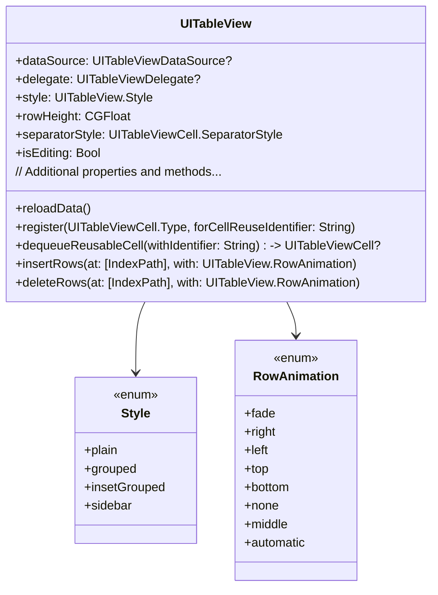

---

## **2. Initializers Overview**

### **a. Initialization Methods Diagram**
- **Purpose**: Break down the various ways to instantiate `UITableView`.
- **Diagram Type**: `flowchart` or `graph LR`
- **Contents**:
  - **Style-Based Initializers**: `init(frame:style:)`
  - **Storyboard & XIB**: Initialization via Interface Builder
  - **Programmatic Initialization**: Creating tables programmatically

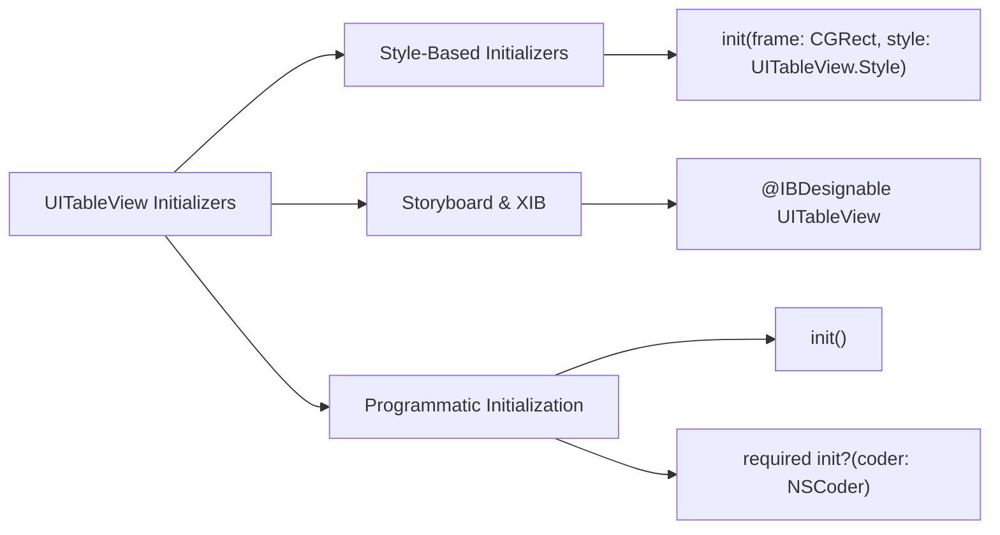

---

## **3. Properties Breakdown**

### **a. Key Properties Diagram**
- **Purpose**: Detail the main properties of `UITableView`.
- **Diagram Type**: `graph LR` or `classDiagram`
- **Contents**:
  - **Data Management**: `dataSource`, `delegate`, `numberOfSections`
  - **Appearance**: `rowHeight`, `separatorStyle`, `backgroundView`
  - **Behavioral Attributes**: `isEditing`, `allowsSelection`, `allowsMultipleSelection`

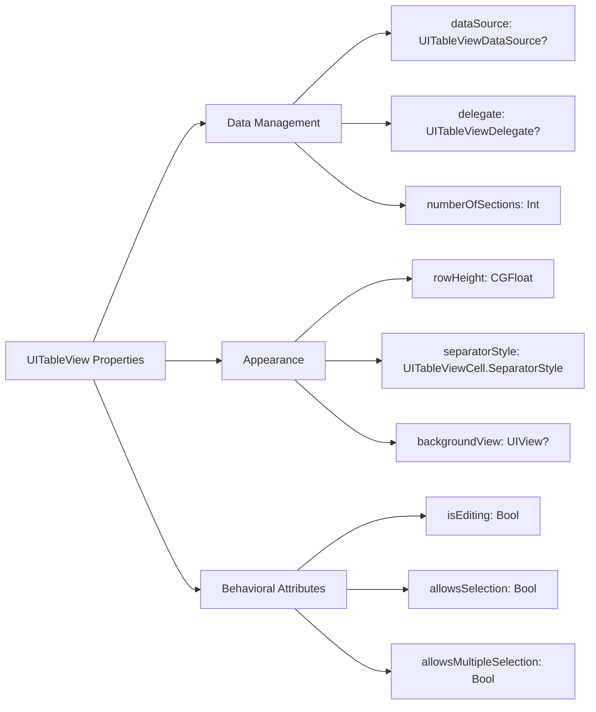

---

## **4. Methods Grouped by Functionality**

### **a. Data Management Methods**
- **Purpose**: Categorize methods based on their roles in managing table data.
- **Diagram Type**: `flowchart TD`
- **Contents**:
  - **Reloading Data**: `reloadData()`
  - **Inserting and Deleting Rows/Sections**: `insertRows()`, `deleteRows()`, etc.
  - **Moving Rows**: `moveRow(at:to:)`
  - **Batch Updates**: `beginUpdates()`, `endUpdates()`

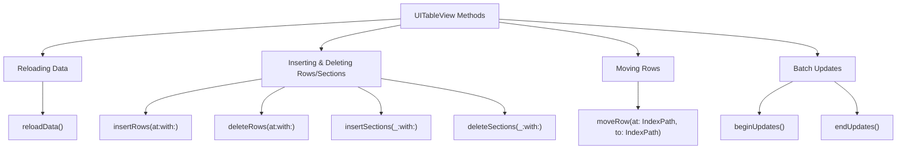

### **b. Cell Management Methods**
- **Purpose**: Categorize methods related to cell creation and reuse.
- **Diagram Type**: `flowchart TD`
- **Contents**:
  - **Registering Cells**: `register(_:forCellReuseIdentifier:)`
  - **Dequeuing Cells**: `dequeueReusableCell(withIdentifier:for:)`
  - **Configuring Cells**: `cellForRow(at:)`

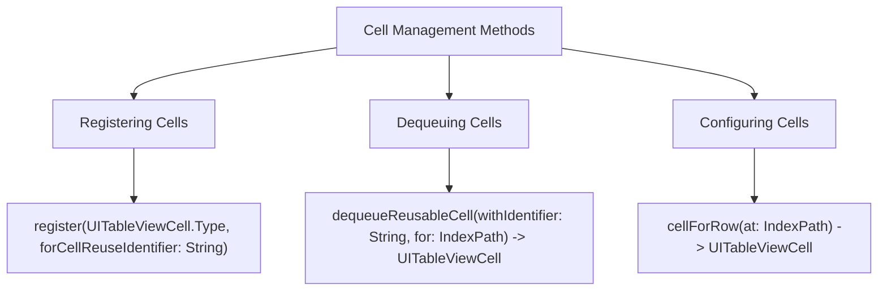

### **c. Editing Methods**
- **Purpose**: Categorize methods that facilitate editing operations.
- **Diagram Type**: `flowchart TD`
- **Contents**:
  - **Begin/End Editing**: `setEditing(_:animated:)`
  - **Commit Editing**: `commit(_:forRowAt:)`

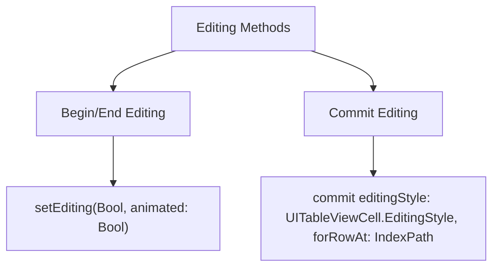

---

## **5. Enumerations and Configurations**

### **a. Enumerations Diagram**
- **Purpose**: Highlight the enums used within `UITableView` and their possible values.
- **Diagram Type**: `classDiagram`
- **Contents**:
  - **UITableView.Style**
  - **UITableView.RowAnimation**
  - **UITableViewCell.SelectionStyle**
  - **UITableViewCell.SeparatorStyle**

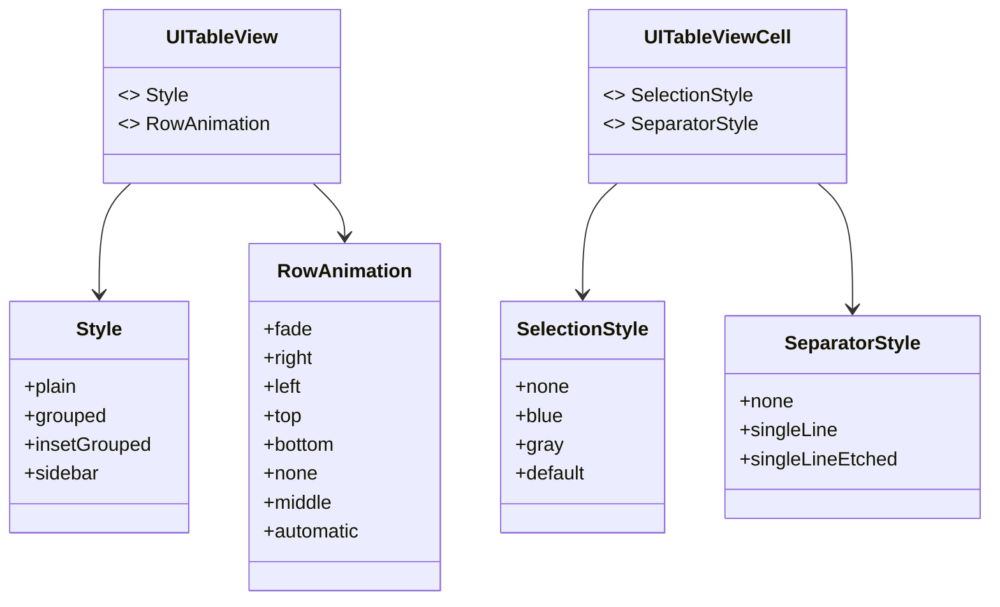

### **b. Configuration Classes Diagram**
- **Purpose**: Show the relationship between `UITableView` and its configuration classes.
- **Diagram Type**: `classDiagram`
- **Contents**:
  - **UITableViewConfiguration**
  - **UITableViewRowAction** (Deprecated but relevant)
  - **UITableViewDragDelegate**
  - **UITableViewDropDelegate**

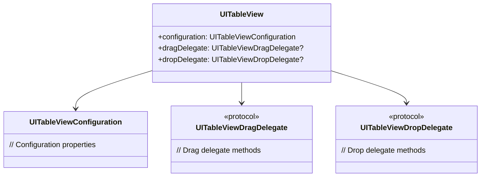

---

## **6. Protocol Conformances**

### **a. Protocols Diagram**
- **Purpose**: Display the protocols that `UITableView` conforms to and their impact.
- **Diagram Type**: `classDiagram`
- **Contents**:
  - **UIScrollViewDelegate**
  - **UITableViewDataSource**
  - **UITableViewDelegate**
  - **NSCoding**
  - **UIDataSourcePrefetching**

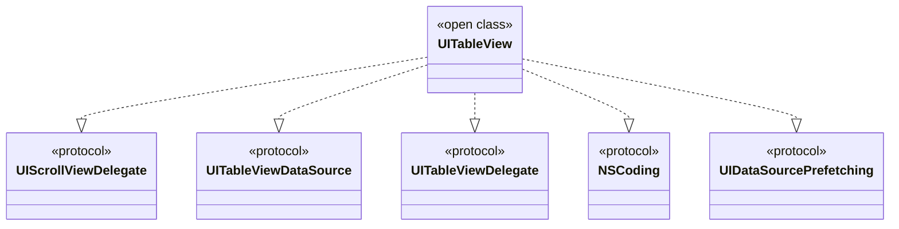

---

## **7. Relationships with Other Classes**

### **a. Related Classes Diagram**
- **Purpose**: Illustrate how `UITableView` interacts with other UIKit classes and frameworks.
- **Diagram Type**: `flowchart TD`
- **Contents**:
  - **UITableViewCell**: Represents individual cells.
  - **UITableViewHeaderFooterView**: Represents header and footer views.
  - **UIScrollView**: As a superclass.
  - **UIRefreshControl**: For pull-to-refresh functionality.
  - **UITableViewController**: Controller managing the table view.
  - **NSIndexPath**: Identifies sections and rows.
  - **UITableViewDiffableDataSource**: Modern data source management.
  - **UITableViewRowAction**: For swipe actions (deprecated in favor of UIContextualAction).

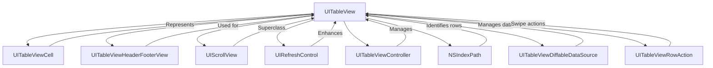

---

## **8. Extensions and Additional Functionalities**

### **a. UITableView Extensions Diagram**
- **Purpose**: Showcase the additional functionalities provided through extensions.
- **Diagram Type**: `classDiagram`
- **Contents**:
  - **Convenience Methods**
  - **Registration Helpers**
  - **Batch Updates Enhancements**

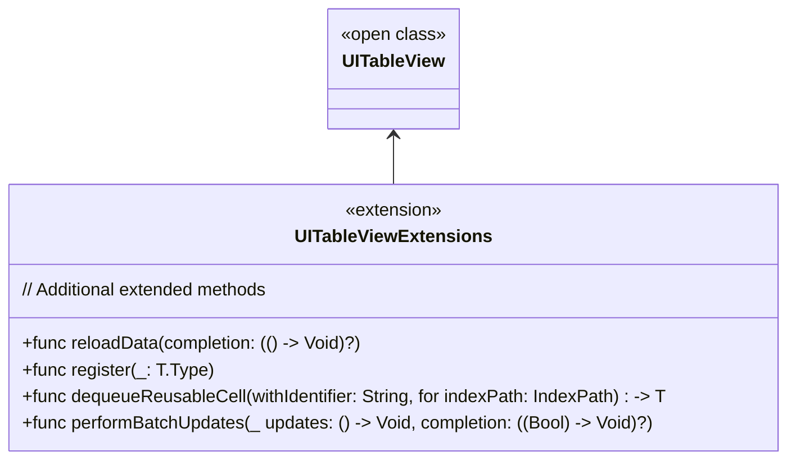

### **b. Extensions Functionalities Flowchart**
- **Purpose**: Detail specific extended methods and their purposes.
- **Diagram Type**: `flowchart LR`
- **Contents**:
  - **Reload with Completion**
  - **Generic Cell Registration**
  - **Generic Cell Dequeuing**
  - **Enhanced Batch Updates**

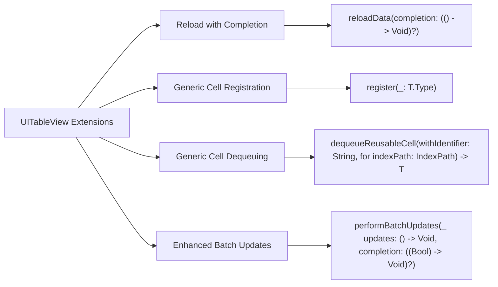

---

## **9. Lifecycle and Use Cases**

### **a. Lifecycle Flowchart**
- **Purpose**: Demonstrate the typical lifecycle of a `UITableView` within an application.
- **Diagram Type**: `flowchart TD`
- **Contents**:
  - **Initialization**
  - **Registration of Cells**
  - **Data Loading**
  - **User Interaction**
  - **Updating Data**
  - **Reloading and Refreshing**
  - **Deallocation**

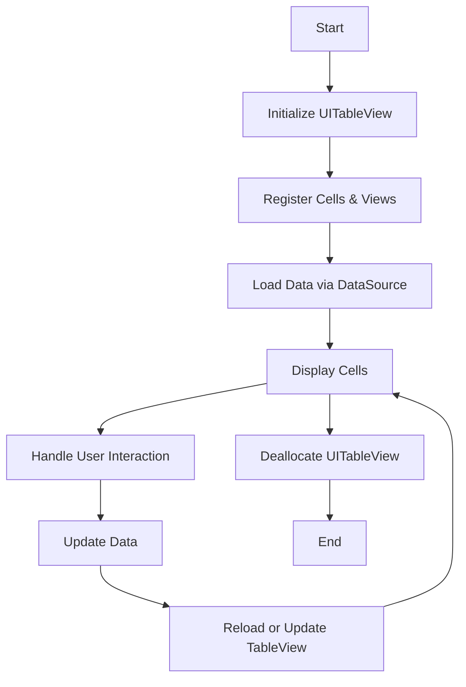

### **b. Common Use Cases Diagram**
- **Purpose**: Outline the typical scenarios where `UITableView` is utilized.
- **Diagram Type**: `flowchart TD`
- **Contents**:
  - **Displaying Lists**
  - **Form Inputs**
  - **Settings Screens**
  - **Nested Tables**
  - **Dynamic Content Loading**
  - **Swipe Actions**
  - **Drag and Drop**

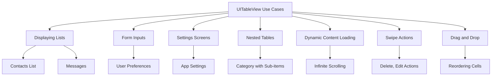

---

## **10. Feature Availability Timeline**

### **a. Feature Availability Gantt Chart**
- **Purpose**: Show when various `UITableView` features were introduced across iOS versions.
- **Diagram Type**: `gantt`
- **Contents**:
  - **iOS Versions**: 2.0, 3.0, 4.0, 5.0, 6.0, 7.0, 8.0, 10.0, 11.0, 13.0, 14.0, 15.0, 16.0, 17.0
  - **Features Introduced**: Automatic Dimension, Swipe Actions, Drag and Drop, Diffable Data Sources, Self-Sizing Cells, etc.

## TODO: Fix diagram syntax error

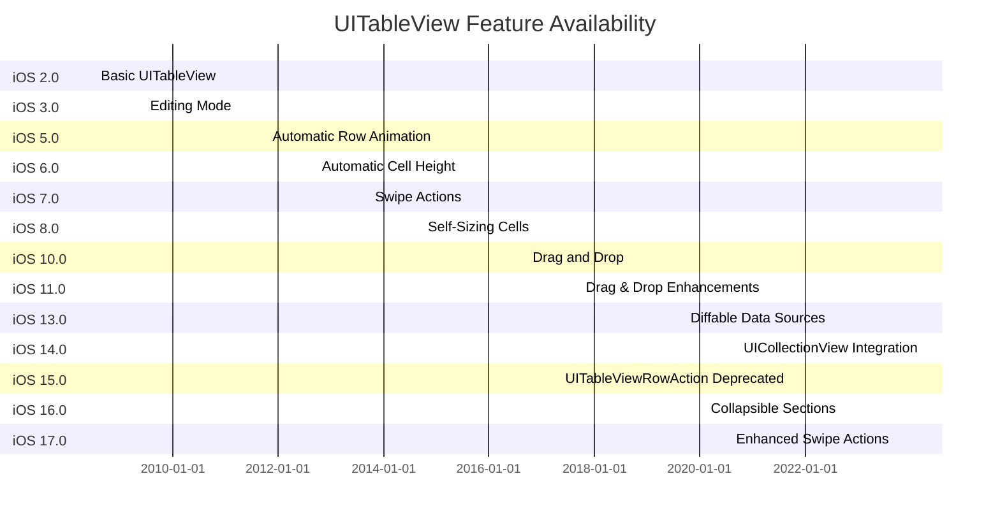

---

## **11. Data Handling and Formats**

### **a. Data Source Protocol Diagram**
- **Purpose**: Explain how `UITableView` handles different data sources.
- **Diagram Type**: `flowchart LR`
- **Contents**:
  - **UITableViewDataSource**
  - **UITableViewDiffableDataSource**
  - **UIDataSourcePrefetching**

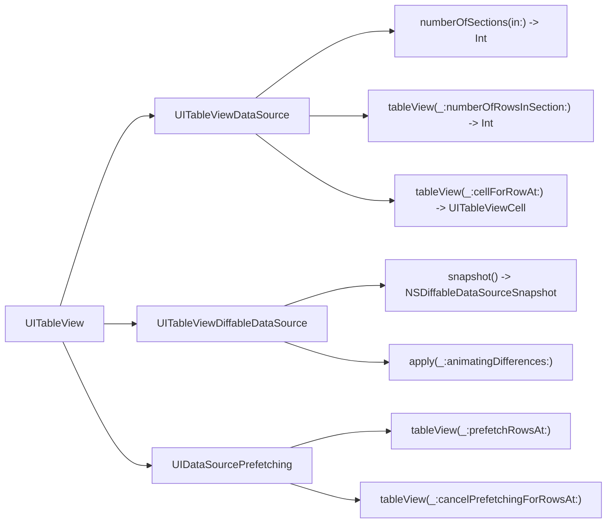

### **b. Data Handling Diagram**
- **Purpose**: Detail how `UITableView` manages data and interacts with data sources.
- **Diagram Type**: `flowchart TD`
- **Contents**:
  - **Data Source Methods**
  - **Diffable Data Source**
  - **Prefetching Data**
  - **Snapshot Management**

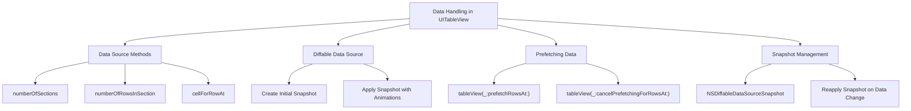

---

## **12. Integration with Drawing Contexts**

### **a. Custom Drawing in Cells Diagram**
- **Purpose**: Show how `UITableView` integrates with custom drawing contexts within cells.
- **Diagram Type**: `flowchart TD`
- **Contents**:
  - **Custom UITableViewCell**
  - **Drawing with Core Graphics**
  - **Animating Drawings**
  - **Performance Considerations**

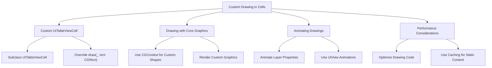

### **b. Highlighting and Selection Diagram**
- **Purpose**: Detail how drawing contexts are used for cell highlighting and selection.
- **Diagram Type**: `flowchart LR`
- **Contents**:
  - **Selection States**
  - **Highlighted State Drawing**
  - **Accessory Views Customization**

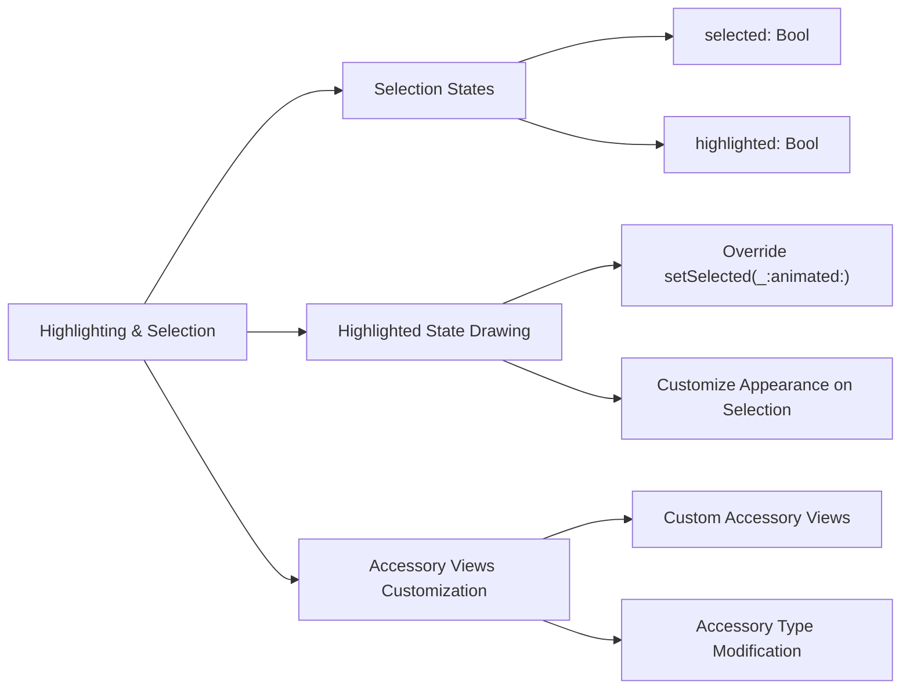

---

## **13. Summary and Best Practices**

### **a. Summary Diagram**
- **Purpose**: Provide a high-level overview of `UITableView`'s key characteristics and functionalities.
- **Diagram Type**: `graph LR` or `mindmap`
- **Contents**:
  - **Versatile Data Management**
  - **Customizable Appearance**
  - **Efficient Cell Reuse**
  - **Enhanced User Interaction**
  - **Performance Optimizations**
  - **Modern Data Sources**

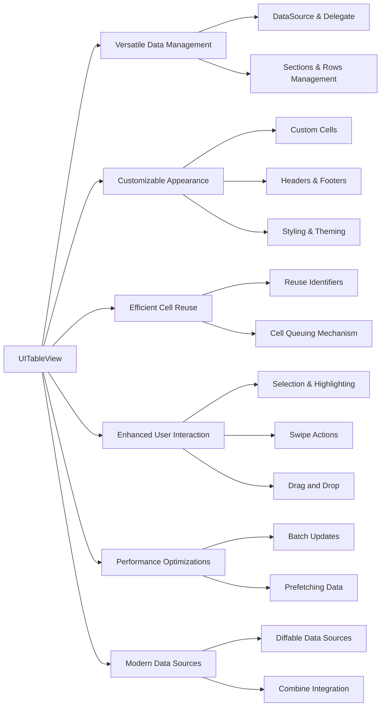

### **b. Best Practices Diagram**
- **Purpose**: Outline best practices for using `UITableView` effectively.
- **Diagram Type**: `flowchart LR`
- **Contents**:
  - **Reuse Identifiers Properly**
  - **Optimize Data Loading**
  - **Implement Prefetching**
  - **Use Diffable Data Sources**
  - **Customize Cells Efficiently**
  - **Handle Dynamic Heights**
  - **Ensure Smooth Scrolling**

```mermaid
flowchart LR
    A[Best Practices for UITableView] --> B[Reuse Identifiers Properly]
    A --> C[Optimize Data Loading]
    A --> D[Implement Prefetching]
    A --> E[Use Diffable Data Sources]
    A --> F[Customize Cells Efficiently]
    A --> G[Handle Dynamic Heights]
    A --> H[Ensure Smooth Scrolling]

    B --> B1["Register Cells Once"]
    B --> B2["Dequeue Reusable Cells"]

    C --> C3["Lazy Loading of Data"]
    C --> C4["Asynchronous Data Fetching"]

    D --> D5["Implement UIDataSourcePrefetching"]
    D --> D6["Cancel Unnecessary Prefetches"]

    E --> E7["Adopt NSDiffableDataSourceSnapshot"]
    E --> E8["Simplify Data Updates"]

    F --> F9["Use Lightweight Cell Configurations"]
    F --> F10["Avoid Heavy Operations in Cell"]

    G --> G11["Use Automatic Dimension"]
    G --> G12["Ensure Proper Constraints"]

    H --> H13["Optimize Cell Layout"]
    H --> H14["Minimize Overdraw"]
```

---
