# UITableViewCell
> This content is dual-licensed under your choice of the following licenses:
> 1.  **MIT License:** For the code implementations in Swift and Mermaid provided in this document.
> 2.  **Creative Commons Attribution 4.0 International License (CC BY 4.0):** For all other content, including the text, explanations, and the Mermaid diagrams and illustrations.

---

Below is a comprehensive and organized set of Mermaid diagrams for the `UITableViewCell` class. These diagrams cover various aspects of `UITableViewCell`, including its class structure, initializers, properties, methods, protocol conformances, relationships with other classes, extensions, lifecycle, feature availability, data handling, integration with drawing contexts, and best practices.

---

## **1. Class Structure and Hierarchy**

### **a. Core Class Diagram**
- **Purpose**: Illustrate the primary structure of `UITableViewCell`, including its properties, methods, and enumerations.
- **Diagram Type**: `classDiagram`
- **Contents**:
  - **Properties**: Key attributes like `reuseIdentifier`, `contentView`, `selectedBackgroundView`, etc.
  - **Methods**: Essential functions like `init(style:reuseIdentifier:)`, `prepareForReuse()`, `setSelected(_:animated:)`, etc.
  - **Enumerations**: Nested enums such as `Style`, `AccessoryType`, `SelectionStyle`.

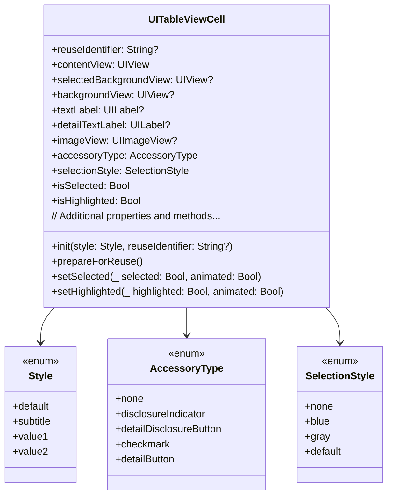

---

## **2. Initializers Overview**

### **a. Initialization Methods Diagram**
- **Purpose**: Break down the various ways to instantiate `UITableViewCell`.
- **Diagram Type**: `flowchart LR`
- **Contents**:
  - **Default Initializers**: `init(style:reuseIdentifier:)`
  - **Storyboard/Interface Builder**: `init?(coder:)`
  - **Custom Initializers**: Extensions providing additional initializers

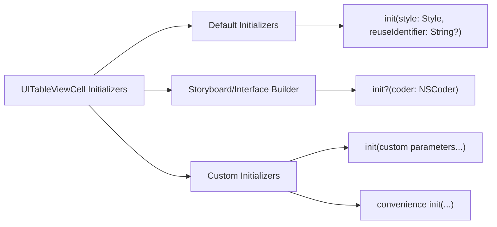

---

## **3. Properties Breakdown**

### **a. Key Properties Diagram**
- **Purpose**: Detail the main properties of `UITableViewCell`.
- **Diagram Type**: `graph LR`
- **Contents**:
  - **Identification**: `reuseIdentifier`, `tag`
  - **Content Views**: `contentView`, `backgroundView`, `selectedBackgroundView`
  - **Default Subviews**: `textLabel`, `detailTextLabel`, `imageView`
  - **Accessory Views**: `accessoryType`, `accessoryView`
  - **Selection Attributes**: `selectionStyle`, `isSelected`, `isHighlighted`
  - **Other Attributes**: `indentationLevel`, `indentationWidth`, `showsReorderControl`

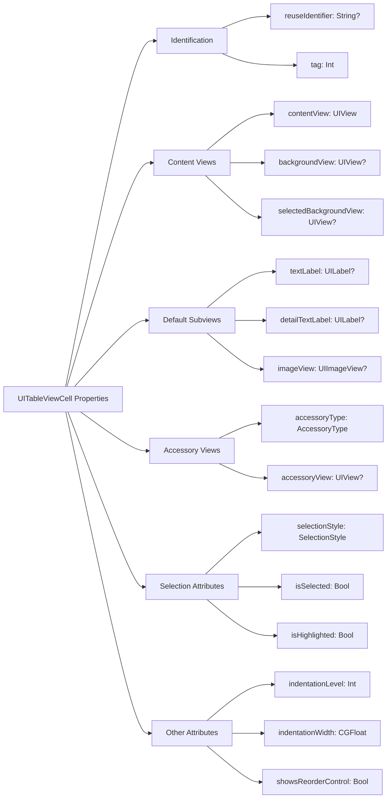

---

## **4. Methods Grouped by Functionality**

### **a. Cell Lifecycle Methods**
- **Purpose**: Categorize methods based on their roles in the cell's lifecycle management.
- **Diagram Type**: `flowchart TD`
- **Contents**:
  - **Initialization and Deinitialization**: `init(style:reuseIdentifier:)`, `init?(coder:)`, `deinit`
  - **Reuse Management**: `prepareForReuse()`
  - **State Management**: `setSelected(_:animated:)`, `setHighlighted(_:animated:)`
  - **Layout Management**: `layoutSubviews()`, `updateConstraints()`

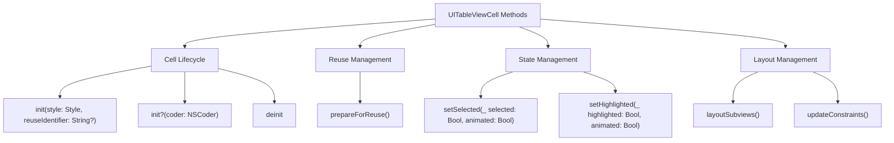

### **b. Accessory and Editing Methods**
- **Purpose**: Group methods related to accessory views and editing capabilities.
- **Diagram Type**: `flowchart TD`
- **Contents**:
  - **Accessory Management**: `setAccessoryView(_:)`, `accessoryAction()`
  - **Editing Support**: `setEditing(_:animated:)`, `prepareForReuse()`

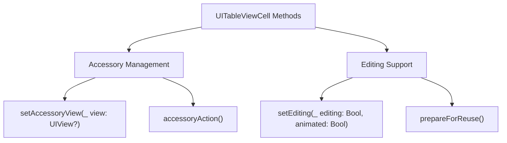

### **c. Configuration Methods**
- **Purpose**: Categorize methods that configure the cell's appearance and behavior.
- **Diagram Type**: `flowchart TD`
- **Contents**:
  - **Content Configuration**: `configure(with:)`, `updateContent()`
  - **Accessory Configuration**: `configureAccessoryView()`
  - **Selection Configuration**: `configureSelectionStyle()`

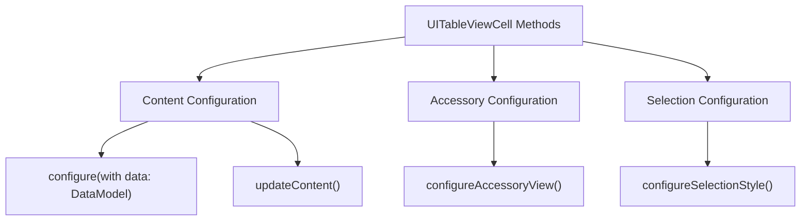

---

## **5. Enumerations and Configurations**

### **a. Enumerations Diagram**
- **Purpose**: Highlight the enums used within `UITableViewCell` and their possible values.
- **Diagram Type**: `classDiagram`
- **Contents**:
  - **Style**
  - **AccessoryType**
  - **SelectionStyle**
  - **SeparatorInsetReference**

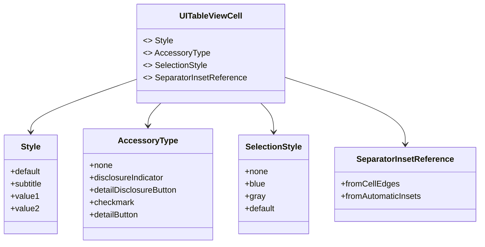

### **b. Configuration Classes Diagram**
- **Purpose**: Show the relationship between `UITableViewCell` and its configuration classes.
- **Diagram Type**: `classDiagram`
- **Contents**:
  - **UITableViewCellConfiguration**
  - **UIContextMenuConfiguration**

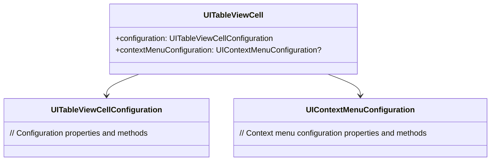

---

## **6. Protocol Conformances**

### **a. Protocols Diagram**
- **Purpose**: Display the protocols that `UITableViewCell` conforms to and their impact.
- **Diagram Type**: `classDiagram`
- **Contents**:
  - **UIContextMenuInteractionDelegate**
  - **UIAppearance**
  - **UIContentConfiguration**
  - **UIContentView**
  - **Sendable**

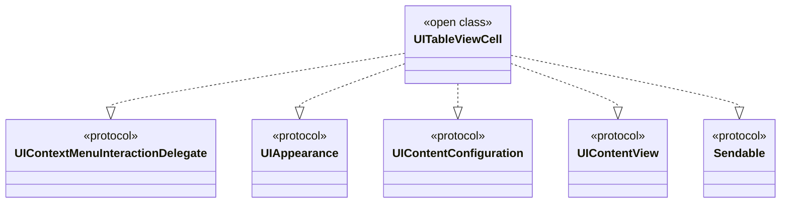

---

## **7. Relationships with Other Classes**

### **a. Related Classes Diagram**
- **Purpose**: Illustrate how `UITableViewCell` interacts with other UIKit classes and frameworks.
- **Diagram Type**: `flowchart TD`
- **Contents**:
  - **UITableView**: Manages and reuses cells.
  - **UITableViewDataSource**: Provides cells to the table view.
  - **UITableViewDelegate**: Handles cell selection and actions.
  - **UIView**: Base class for `UITableViewCell` content views.
  - **NSIndexPath**: Specifies the cell's position in the table view.
  - **UIStoryboard**: Loads cells from Interface Builder.
  - **UINib**: Registers cells from nib files.
  - **UIContextMenuInteraction**: Manages context menus for cells.

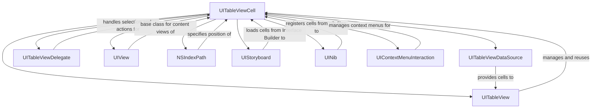

---

## **8. Extensions and Additional Functionalities**

### **a. UITableViewCell Extensions Diagram**
- **Purpose**: Showcase the additional functionalities provided through extensions.
- **Diagram Type**: `classDiagram`
- **Contents**:
  - **Styling Extensions**
  - **Configuration Extensions**
  - **Accessory Extensions**

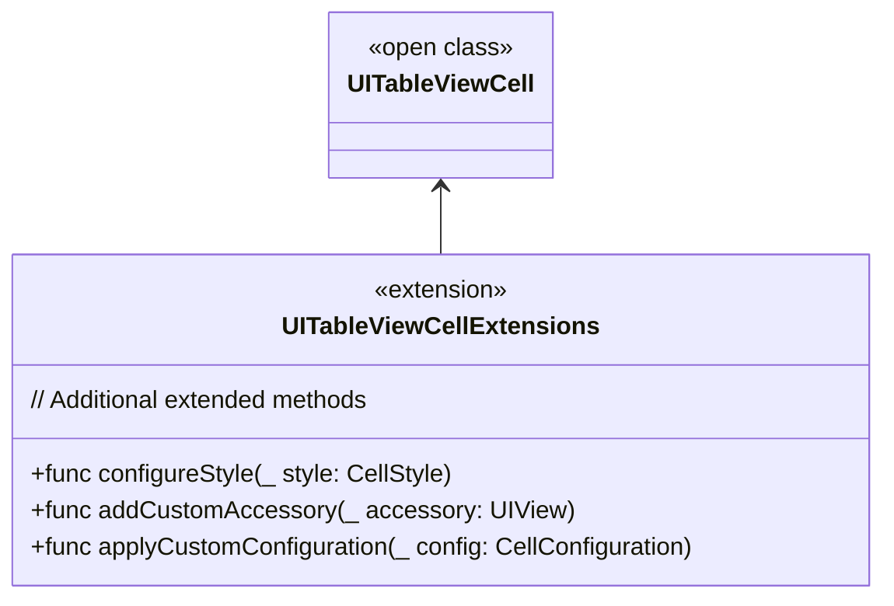

### **b. Extensions Functionalities Flowchart**
- **Purpose**: Detail specific extended methods and their purposes.
- **Diagram Type**: `flowchart LR`
- **Contents**:
  - **Styling Methods**
  - **Configuration Methods**
  - **Accessory Methods**

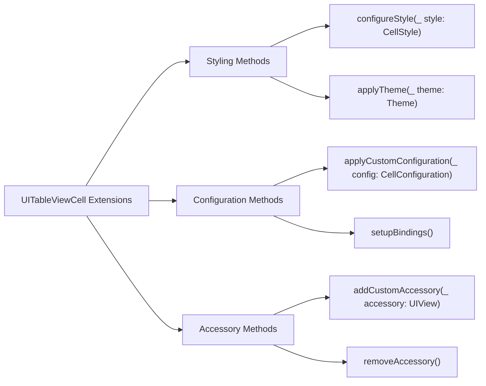

---

## **9. Lifecycle and Use Cases**

### **a. Lifecycle Flowchart**
- **Purpose**: Demonstrate the typical lifecycle of a `UITableViewCell` within an application.
- **Diagram Type**: `flowchart TD`
- **Contents**:
  - **Initialization**
  - **Registration**
  - **Dequeuing**
  - **Configuration**
  - **Display**
  - **Reuse Preparation**
  - **Destruction**

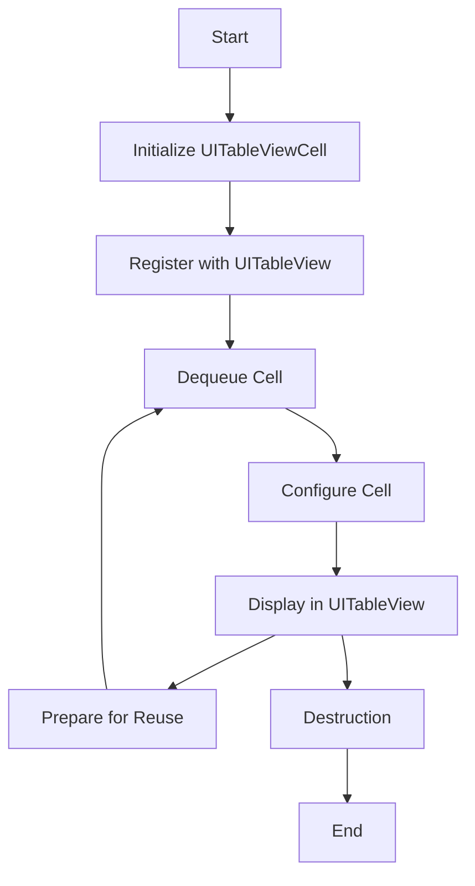

### **b. Common Use Cases Diagram**
- **Purpose**: Outline the typical scenarios where `UITableViewCell` is utilized.
- **Diagram Type**: `flowchart TD`
- **Contents**:
  - **Displaying Lists of Data**
  - **Custom Cell Designs**
  - **Dynamic Content**
  - **Accessory Interaction**
  - **Context Menus**
  - **Editing and Reordering**

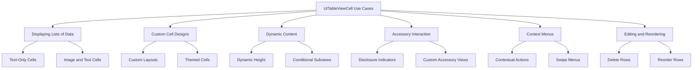

---

## **10. Feature Availability Timeline**

### **a. Feature Availability Gantt Chart**
- **Purpose**: Show when various `UITableViewCell` features were introduced across iOS versions.
- **Diagram Type**: `gantt`
- **Contents**:
  - **iOS Versions**: 2.0, 3.0, 4.0, 5.0, 6.0, 7.0, 8.0, 10.0, 11.0, 13.0, 14.0, 15.0, 16.0, 17.0
  - **Features Introduced**: Custom initializers, self-sizing cells, context menus, drag and drop, swipe actions, etc.

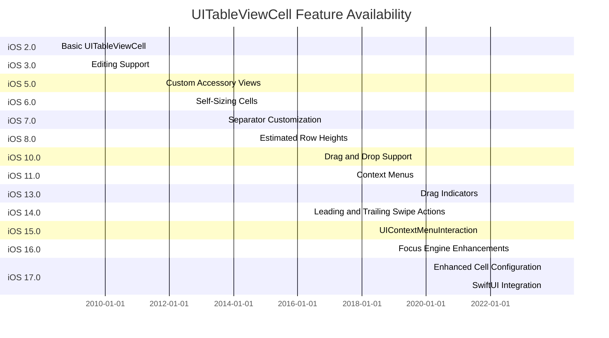

---

## **11. Data Handling and Formats**

### **a. Data Binding and Configuration Diagram**
- **Purpose**: Explain how `UITableViewCell` handles data binding and configuration.
- **Diagram Type**: `graph LR`
- **Contents**:
  - **Data Source Interaction**: `UITableViewDataSource`
  - **Model Binding**: `configure(with:)`, `updateContent()`
  - **Dynamic Content Handling**: `dynamicHeight`, `conditional Subviews`

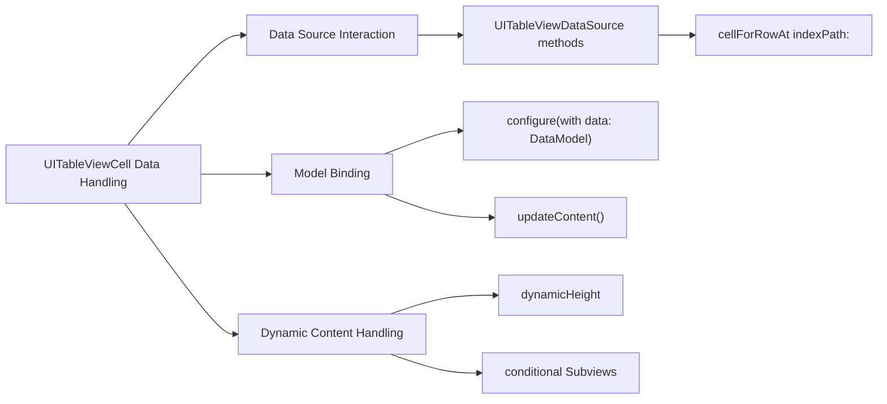

---

## **12. Integration with Drawing Contexts**

### **a. Custom Drawing Methods Diagram**
- **Purpose**: Show how `UITableViewCell` can integrate with custom drawing contexts.
- **Diagram Type**: `flowchart TD`
- **Contents**:
  - **Custom Drawing Setup**: `draw(_:)`
  - **Using Core Graphics**: `CGContext`, `UIBezierPath`
  - **Layer Customization**: `CALayer`, `cornerRadius`, `shadow`

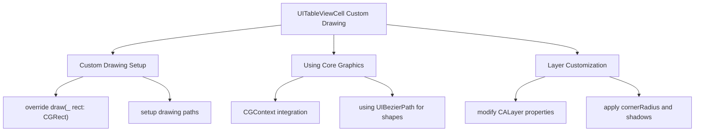

---

## **13. Summary and Best Practices**

### **a. Summary Diagram**
- **Purpose**: Provide a high-level overview of `UITableViewCell`'s key characteristics and functionalities.
- **Diagram Type**: `graph LR`
- **Contents**:
  - **Versatile Initialization**
  - **Customizable Appearance**
  - **Efficient Reuse Mechanism**
  - **Advanced Interaction Support**
  - **Seamless Integration with UITableView**
  - **Performance Optimizations**

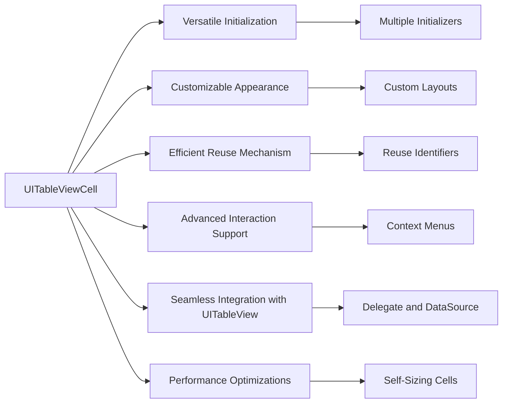

### **b. Best Practices Diagram**
- **Purpose**: Outline best practices when working with `UITableViewCell`.
- **Diagram Type**: `mindmap`
- **Contents**:
  - **Cell Reuse Optimization**
  - **Efficient Layout with Auto Layout**
  - **Asynchronous Image Loading**
  - **Minimize Subview Complexity**
  - **Proper State Management**
  - **Accessibility Considerations**

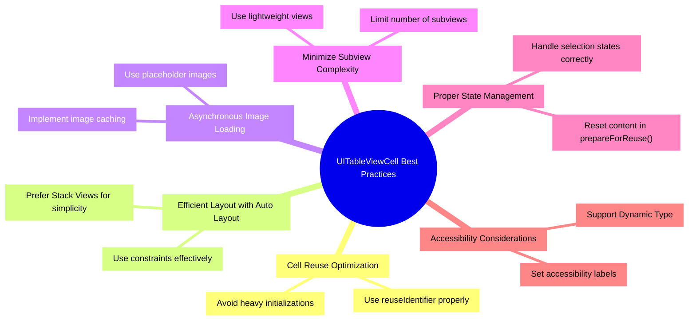


---

## **14. Accessibility Integration**

### **a. Accessibility Properties Diagram**
- **Purpose**: Detail the accessibility properties and methods that `UITableViewCell` supports.
- **Diagram Type**: `graph LR`
- **Contents**:
  - **Accessibility Labels**
  - **Traits**
  - **Hints**
  - **Identifiers**
  - **Dynamic Type Support**

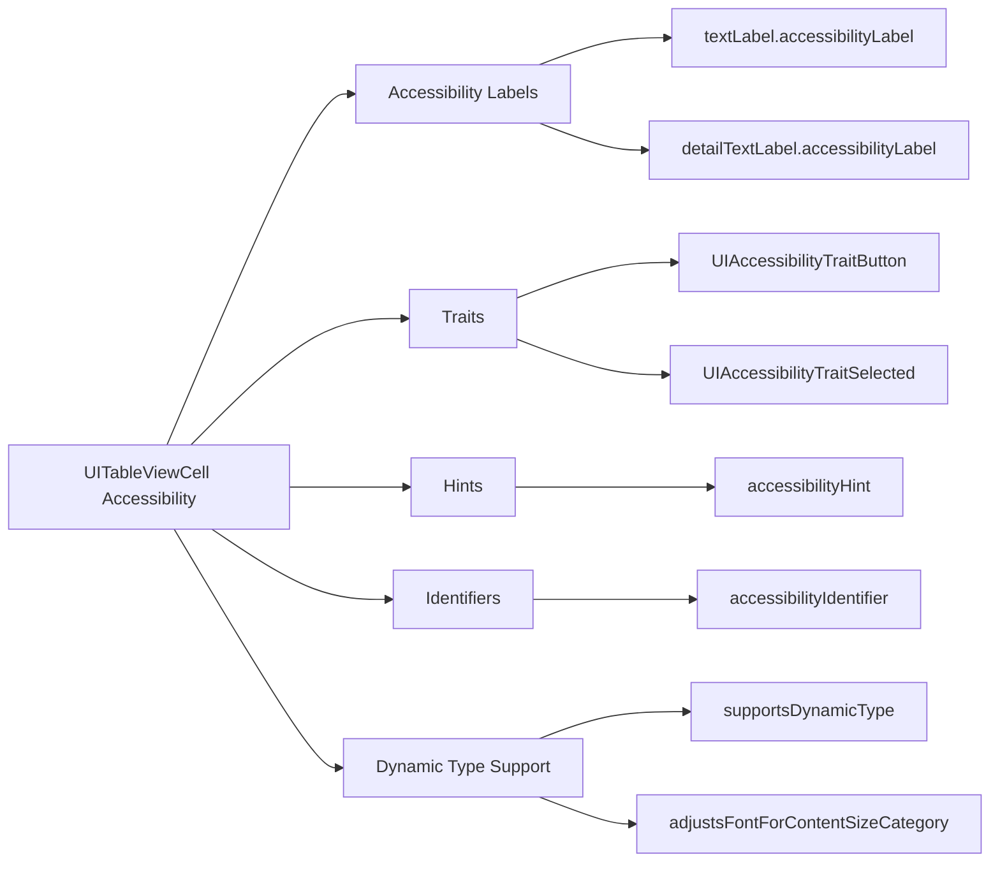

---

## **15. Performance Optimization Techniques**

### **a. Performance Optimization Diagram**
- **Purpose**: Highlight strategies to optimize the performance of `UITableViewCell`.
- **Diagram Type**: `flowchart LR`
- **Contents**:
  - **Reuse Cells Efficiently**
  - **Optimize Auto Layout Constraints**
  - **Asynchronous Data Loading**
  - **Reduce Overdraw**
  - **Use Lightweight Views**

```mermaid
flowchart LR
    A[UITableViewCell Performance Optimization] --> B[Reuse Cells Efficiently]
    A --> C[Optimize Auto Layout Constraints]
    A --> D[Asynchronous Data Loading]
    A --> E[Reduce Overdraw]
    A --> F[Use Lightweight Views]

    B --> B1["Proper reuseIdentifier management"]
    B --> B2["Avoid unnecessary cell creation"]
    
    C --> C1["Simplify constraints"]
    C --> C2["Use stack views where possible"]
    
    D --> D1["Load images asynchronously"]
    D --> D2["Implement caching mechanisms"]
    
    E --> E1["Minimize overlapping views"]
    E --> E2["Use opaque views"]
    
    F --> F1["Limit number of subviews"]
    F --> F2["Use optimized view hierarchies"]
```

---

## **16. Customization and Theming**

### **a. Theming Techniques Diagram**
- **Purpose**: Show how to apply custom themes to `UITableViewCell`.
- **Diagram Type**: `flowchart LR`
- **Contents**:
  - **Custom Backgrounds**
  - **Themed Text Styles**
  - **Dynamic Colors**
  - **Custom Accessory Views**
  - **Selection Styles**

```mermaid
flowchart LR
    A[UITableViewCell Theming] --> B[Custom Backgrounds]
    A --> C[Themed Text Styles]
    A --> D[Dynamic Colors]
    A --> E[Custom Accessory Views]
    A --> F[Selection Styles]
    
    B --> B1["Set backgroundView with custom UIView"]
    B --> B2["Use gradient backgrounds"]
    
    C --> C1["Apply custom fonts and colors to textLabel"]
    C --> C2["Use attributed strings"]
    
    D --> D1["Support dark and light modes"]
    D --> D2["Use UIColor.dynamic providers"]
    
    E --> E1["Add custom accessoryView (e.g., switches)"]
    E --> E2["Use CAIcons for custom indicators"]
    
    F --> F1["Customize selectionStyle property"]
    F --> F2["Animate selection changes"]
```

---

## **17. Debugging and Troubleshooting**

### **a. Debugging Techniques Diagram**
- **Purpose**: Outline methods to debug and troubleshoot issues related to `UITableViewCell`.
- **Diagram Type**: `flowchart TD`
- **Contents**:
  - **Visual Debugging with Xcode**
  - **Logging and Assertions**
  - **Performance Profiling**
  - **Handling Layout Issues**
  - **Tracking Cell Reuse Problems**

```mermaid
flowchart TD
    A[UITableViewCell Debugging] --> B[Visual Debugging with Xcode]
    A --> C[Logging and Assertions]
    A --> D[Performance Profiling]
    A --> E[Handling Layout Issues]
    A --> F[Tracking Cell Reuse Problems]
    
    B --> B1["Use View Hierarchy Debugger"]
    B --> B2["Inspect Auto Layout constraints"]
    
    C --> C1["Add print statements"]
    C --> C2["Use assert() for critical conditions"]
    
    D --> D1["Profile with Instruments (Time Profiler, Core Animation)"]
    D --> D2["Analyze rendering performance"]
    
    E --> E1["Check constraint warnings"]
    E --> E2["Ensure proper view hierarchy setup"]
    
    F --> F1["Avoid data duplication in cells"]
    F --> F2["Ensure prepareForReuse resets state"]
```

---

## **18. Accessibility Best Practices**

### **a. Accessibility Best Practices Diagram**
- **Purpose**: Provide best practices for making `UITableViewCell` accessible.
- **Diagram Type**: `graph LR`
- **Contents**:
  - **Assign Meaningful Labels**
  - **Support Dynamic Type**
  - **Ensure Sufficient Contrast**
  - **Provide Accessibility Hints**
  - **Test with VoiceOver**

```mermaid
graph LR
    A[UITableViewCell Accessibility Best Practices] --> B[Assign Meaningful Labels]
    A --> C[Support Dynamic Type]
    A --> D[Ensure Sufficient Contrast]
    A --> E[Provide Accessibility Hints]
    A --> F[Test with VoiceOver]
    
    B --> B1["Set accessibilityLabel for textLabel and detailTextLabel"]
    B --> B2["Assign labels to custom subviews"]
    
    C --> C1["Use scalable fonts"]
    C --> C2["Enable adjustsFontForContentSizeCategory"]
    
    D --> D1["Choose high-contrast color combinations"]
    D --> D2["Avoid relying solely on color to convey information"]
    
    E --> E1["Set accessibilityHint to describe actions"]
    E --> E2["Provide context for accessory views"]
    
    F --> F1["Navigate cells using VoiceOver"]
    F --> F2["Ensure all interactive elements are reachable"]
```

---

## **19. Localization and Internationalization**

### **a. Localization Strategies Diagram**
- **Purpose**: Explain how to localize and internationalize content within `UITableViewCell`.
- **Diagram Type**: `flowchart LR`
- **Contents**:
  - **Localized Strings**
  - **Dynamic Text Sizing**
  - **Right-to-Left Layout Support**
  - **Localized Images**
  - **Date and Number Formatting**

```mermaid
flowchart LR
    A[UITableViewCell Localization] --> B[Localized Strings]
    A --> C[Dynamic Text Sizing]
    A --> D[Right-to-Left Layout Support]
    A --> E[Localized Images]
    A --> F[Date and Number Formatting]
    
    B --> B1["Use NSLocalizedString for text labels"]
    B --> B2["Support multiple languages in strings files"]
    
    C --> C1["Enable adjustsFontForContentSizeCategory"]
    C --> C2["Use scalable fonts"]
    
    D --> D1["Use Auto Layout to adapt to RTL languages"]
    D --> D2["Flip image assets using asset catalogs"]
    
    E --> E1["Provide localized image assets"]
    
    F --> F1["Format dates and numbers based on locale"]
    F --> F2["Use NumberFormatter and DateFormatter"]
```

---

## **20. Interaction with Gestures**

### **a. Gesture Handling Diagram**
- **Purpose**: Detail how `UITableViewCell` can handle various gestures.
- **Diagram Type**: `flowchart TD`
- **Contents**:
  - **Tap Gestures**
  - **Swipe Gestures**
  - **Long Press Gestures**
  - **Custom Gesture Recognizers**
  - **Gesture Conflict Resolution**

```mermaid
flowchart TD
    A[UITableViewCell Gesture Handling] --> B[Tap Gestures]
    A --> C[Swipe Gestures]
    A --> D[Long Press Gestures]
    A --> E[Custom Gesture Recognizers]
    A --> F[Gesture Conflict Resolution]
    
    B --> B1["Handle cell selection"]
    B --> B2["Detect taps on accessory views"]
    
    C --> C1["Implement swipe actions for edit/delete"]
    C --> C2["Customize swipe behavior"]
    
    D --> D1["Show context menus on long press"]
    D --> D2["Trigger custom actions"]
    
    E --> E1["Add UILongPressGestureRecognizer"]
    E --> E2["Add UITapGestureRecognizer for custom views"]
    
    F --> F1["Use UIGestureRecognizerDelegate"]
    F --> F2["Prioritize gesture recognizers appropriately"]
```

---

## **21. Dependency Management**

### **a. Dependency Integration Diagram**
- **Purpose**: Illustrate how external dependencies can be integrated into `UITableViewCell`.
- **Diagram Type**: `flowchart LR`
- **Contents**:
  - **Using CocoaPods**
  - **Using Swift Package Manager**
  - **Incorporating Third-Party Libraries**
  - **Managing Assets**
  - **Version Control Considerations**

```mermaid
flowchart LR
    A[UITableViewCell Dependency Management] --> B[Using CocoaPods]
    A --> C[Using Swift Package Manager]
    A --> D[Incorporating Third-Party Libraries]
    A --> E[Managing Assets]
    A --> F[Version Control Considerations]
    
    B --> B1["Add pod to Podfile"]
    B --> B2["Run pod install"]
    
    C --> C1["Add package in Xcode"]
    C --> C2["Import package in code"]
    
    D --> D1["Integrate UI libraries (e.g., SnapKit)"]
    D --> D2["Use image loading libraries (e.g., SDWebImage)"]
    
    E --> E1["Organize asset catalogs"]
    E --> E2["Localize asset names"]
    
    F --> F1["Track Podfile.lock"]
    F --> F2["Manage package versions"]
```

---

## **22. Security Considerations**

### **a. Security Best Practices Diagram**
- **Purpose**: Outline security best practices when implementing `UITableViewCell`.
- **Diagram Type**: `flowchart TD`
- **Contents**:
  - **Data Sanitization**
  - **Secure Image Loading**
  - **Handling Sensitive Data**
  - **Preventing Injection Attacks**
  - **Using HTTPS for Data Sources**

```mermaid
flowchart TD
    A[UITableViewCell Security Considerations] --> B[Data Sanitization]
    A --> C[Secure Image Loading]
    A --> D[Handling Sensitive Data]
    A --> E[Preventing Injection Attacks]
    A --> F[Using HTTPS for Data Sources]
    
    B --> B1["Validate and sanitize input data"]
    B --> B2["Escape special characters in text"]
    
    C --> C1["Use secure image loading libraries"]
    C --> C2["Handle image caching securely"]
    
    D --> D1["Avoid displaying sensitive information"]
    D --> D2["Use secure storage for sensitive data"]
    
    E --> E1["Avoid HTML or script injection"]
    E --> E2["Use parameterized queries if applicable"]
    
    F --> F1["Ensure all data fetched over HTTPS"]
    F --> F2["Validate SSL certificates"]
```

---

## **23. Localization and Internationalization**

### **a. Localization Strategies Diagram**
- **Purpose**: Explain how to localize and internationalize content within `UITableViewCell`.
- **Diagram Type**: `flowchart LR`
- **Contents**:
  - **Localized Strings**
  - **Dynamic Text Sizing**
  - **Right-to-Left Layout Support**
  - **Localized Images**
  - **Date and Number Formatting**

```mermaid
flowchart LR
    A[UITableViewCell Localization] --> B[Localized Strings]
    A --> C[Dynamic Text Sizing]
    A --> D[Right-to-Left Layout Support]
    A --> E[Localized Images]
    A --> F[Date and Number Formatting]
    
    B --> B1["Use NSLocalizedString for text labels"]
    B --> B2["Support multiple languages in strings files"]
    
    C --> C1["Enable adjustsFontForContentSizeCategory"]
    C --> C2["Use scalable fonts"]
    
    D --> D1["Use Auto Layout to adapt to RTL languages"]
    D --> D2["Flip image assets using asset catalogs"]
    
    E --> E1["Provide localized image assets"]
    
    F --> F1["Format dates and numbers based on locale"]
    F --> F2["Use NumberFormatter and DateFormatter"]
```

---

## **24. Testing and Quality Assurance**

### **a. Testing Strategies Diagram**
- **Purpose**: Outline testing strategies for `UITableViewCell`.
- **Diagram Type**: `flowchart TD`
- **Contents**:
  - **Unit Testing**
  - **Snapshot Testing**
  - **UI Testing**
  - **Performance Testing**
  - **Accessibility Testing**

```mermaid
flowchart TD
    A[UITableViewCell Testing Strategies] --> B[Unit Testing]
    A --> C[Snapshot Testing]
    A --> D[UI Testing]
    A --> E[Performance Testing]
    A --> F[Accessibility Testing]
    
    B --> B1["Test configuration methods"]
    B --> B2["Validate state management"]
    
    C --> C1["Capture and compare cell appearance"]
    C --> C2["Detect unintended UI changes"]
    
    D --> D1["Simulate user interactions"]
    D --> D2["Verify navigation and actions"]
    
    E --> E1["Measure cell rendering times"]
    E --> E2["Optimize for smooth scrolling"]
    
    F --> F1["Ensure VoiceOver compatibility"]
    F --> F2["Check dynamic type support"]
```

---

## **25. Integration with SwiftUI**

### **a. SwiftUI Integration Diagram**
- **Purpose**: Show how `UITableViewCell` can be integrated within SwiftUI views.
- **Diagram Type**: `flowchart LR`
- **Contents**:
  - **UIViewRepresentable**
  - **Previews**
  - **Data Binding**
  - **Custom Cell Representations**
  - **Interoperability with SwiftUI Lists**

```mermaid
flowchart LR
    A[SwiftUI Integration with UITableViewCell] --> B[UIViewRepresentable]
    A --> C[Previews]
    A --> D[Data Binding]
    A --> E[Custom Cell Representations]
    A --> F[Interoperability with SwiftUI Lists]
    
    B --> B1["Create UITableViewCellWrapper"]
    B --> B2["Implement makeUIView and updateUIView"]
    
    C --> C1["Use SwiftUI Previews for cells"]
    
    D --> D1["Bind data models to cell content"]
    D --> D2["Handle state changes"]
    
    E --> E1["Design custom SwiftUI views for cells"]
    
    F --> F1["Integrate with List view in SwiftUI"]
    F --> F2["Manage data sources dynamically"]
```

---

## **26. Memory Management Considerations**

### **a. Memory Management Diagram**
- **Purpose**: Highlight memory management practices when using `UITableViewCell`.
- **Diagram Type**: `flowchart TD`
- **Contents**:
  - **Avoiding Strong Reference Cycles**
  - **Properly Releasing Resources**
  - **Managing Image Caching**
  - **Optimizing Subview Usage**
  - **Monitoring Memory Usage**

```mermaid
flowchart TD
    A[UITableViewCell Memory Management] --> B[Avoiding Strong Reference Cycles]
    A --> C[Properly Releasing Resources]
    A --> D[Managing Image Caching]
    A --> E[Optimizing Subview Usage]
    A --> F[Monitoring Memory Usage]
    
    B --> B1["Use weak references for delegates"]
    B --> B2["Avoid retain cycles in closures"]
    
    C --> C1["Release heavy resources in prepareForReuse"]
    C --> C2["Nullify unused views"]
    
    D --> D1["Implement image caching strategies"]
    D --> D2["Use image loading libraries efficiently"]
    
    E --> E1["Limit number of subviews"]
    E --> E2["Reuse subviews when possible"]
    
    F --> F1["Use Xcode Instruments to track memory"]
    F --> F2["Optimize memory footprint of cells"]
```

---

## **27. Animations and Transitions**

### **a. Animation Techniques Diagram**
- **Purpose**: Detail how to implement animations and transitions within `UITableViewCell`.
- **Diagram Type**: `flowchart LR`
- **Contents**:
  - **Cell Selection Animations**
  - **Accessory View Animations**
  - **Content Update Animations**
  - **Custom Transition Animations**
  - **Using UIView Animations**

```mermaid
flowchart LR
    A[UITableViewCell Animations] --> B[Cell Selection Animations]
    A --> C[Accessory View Animations]
    A --> D[Content Update Animations]
    A --> E[Custom Transition Animations]
    A --> F[Using UIView Animations]
    
    B --> B1["Animate selection highlight"]
    B --> B2["Smooth transition between selected and unselected states"]
    
    C --> C1["Animate accessory view changes"]
    C --> C2["Rotate accessory indicators"]
    
    D --> D1["Fade in/out content changes"]
    D --> D2["Slide content views"]
    
    E --> E1["Implement custom transition effects on cell insertions/deletions"]
    E --> E2["Use UIViewPropertyAnimator for advanced transitions"]
    
    F --> F1["Use UIView.animate methods"]
    F --> F2["Leverage spring animations for natural effects"]
```

---

## **28. Accessibility Testing**

### **a. Accessibility Testing Diagram**
- **Purpose**: Outline steps to test the accessibility of `UITableViewCell`.
- **Diagram Type**: `flowchart TD`
- **Contents**:
  - **VoiceOver Testing**
  - **Dynamic Type Testing**
  - **Color Contrast Testing**
  - **Accessibility Inspector Usage**
  - **User Testing with Assistive Technologies**

```mermaid
flowchart TD
    A[UITableViewCell Accessibility Testing] --> B[VoiceOver Testing]
    A --> C[Dynamic Type Testing]
    A --> D[Color Contrast Testing]
    A --> E[Accessibility Inspector Usage]
    A --> F[User Testing with Assistive Technologies]
    
    B --> B1["Navigate cells with VoiceOver"]
    B --> B2["Ensure meaningful accessibility labels"]
    
    C --> C1["Adjust font sizes and verify scalability"]
    C --> C2["Ensure layout adapts to text size changes"]
    
    D --> D1["Check color contrast ratios"]
    D --> D2["Use accessibility guidelines for color choices"]
    
    E --> E1["Use Xcode Accessibility Inspector to audit cells"]
    E --> E2["Identify and fix accessibility issues"]
    
    F --> F1["Conduct user studies with visually impaired users"]
    F --> F2["Gather feedback and make improvements"]
```

---

## **29. Internationalization Considerations**

### **a. Internationalization Diagram**
- **Purpose**: Explain how to ensure `UITableViewCell` supports multiple languages and locales.
- **Diagram Type**: `flowchart LR`
- **Contents**:
  - **Dynamic Text Handling**
  - **Locale-Specific Formatting**
  - **Localized Assets**
  - **Bidirectional Text Support**
  - **Testing Across Locales**

```mermaid
flowchart LR
    A[UITableViewCell Internationalization] --> B[Dynamic Text Handling]
    A --> C[Locale-Specific Formatting]
    A --> D[Localized Assets]
    A --> E[Bidirectional Text Support]
    A --> F[Testing Across Locales]
    
    B --> B1["Support multiple languages for text labels"]
    B --> B2["Use Auto Layout for varying text lengths"]
    
    C --> C1["Format dates and numbers based on locale"]
    C --> C2["Use Locale-aware string interpolation"]
    
    D --> D1["Provide localized images and icons"]
    D --> D2["Adjust asset layouts for different languages"]
    
    E --> E1["Support Right-to-Left (RTL) languages"]
    E --> E2["Ensure layout mirrors appropriately"]
    
    F --> F1["Test cell in all supported languages"]
    F --> F2["Verify layout and content integrity"]
```

---

## **30. Summary and Best Practices**

### **a. Comprehensive Summary Diagram**
- **Purpose**: Provide an overarching summary of `UITableViewCell`'s capabilities and best practices.
- **Diagram Type**: `graph LR`
- **Contents**:
  - **Initialization and Reuse**
  - **Customization and Theming**
  - **Performance Optimization**
  - **Accessibility and Internationalization**
  - **Integration with Other Components**
  - **Testing and Quality Assurance**

```mermaid
graph LR
    A[UITableViewCell Overview] --> B[Initialization and Reuse]
    A --> C[Customization and Theming]
    A --> D[Performance Optimization]
    A --> E[Accessibility and Internationalization]
    A --> F[Integration with Other Components]
    A --> G[Testing and Quality Assurance]
    
    B --> B1["Use reuseIdentifier effectively"]
    B --> B2["Implement prepareForReuse properly"]
    
    C --> C1["Apply custom styles and themes"]
    C --> C2["Customize accessory views and selection styles"]
    
    D --> D1["Optimize layout with Auto Layout"]
    D --> D2["Minimize subview complexity"]
    
    E --> E1["Ensure VoiceOver compatibility"]
    E --> E2["Support multiple languages and locales"]
    
    F --> F1["Integrate with UITableViewDataSource and UITableViewDelegate"]
    F --> F2["Manage interactions with gesture recognizers"]
    
    G --> G1["Perform unit and UI testing"]
    G --> G2["Use snapshot and performance testing tools"]
```

---

## **31. Example Implementations**

### **a. Example Code for Custom UITableViewCell**
- **Purpose**: Provide an example of a custom `UITableViewCell` implementation.
- **Diagram Type**: `classDiagram` (with UML notes)

```mermaid
classDiagram
    class CustomTableViewCell {
        +titleLabel: UILabel
        +subtitleLabel: UILabel
        +customImageView: UIImageView
        +init(style: UITableViewCell.Style, reuseIdentifier: String?)
        +setupViews()
        +configure(with data: DataModel)
    }

    class DataModel {
        +title: String
        +subtitle: String
        +imageURL: URL
    }

    CustomTableViewCell --> DataModel : Configures with
```

### **b. Code Flow Diagram for Cell Configuration**
- **Purpose**: Illustrate the flow of data configuration within a `UITableViewCell`.
- **Diagram Type**: `flowchart TD`
- **Contents**:
  - **Data Source Method**
  - **Cell Configuration**
  - **Updating UI Elements**

```mermaid
flowchart TD
    A[UITableViewDataSource] --> B[cellForRowAt]
    B --> C[Dequeue CustomTableViewCell]
    C --> D[Configure Cell with DataModel]
    D --> E[Update titleLabel]
    D --> F[Update subtitleLabel]
    D --> G[Load image asynchronously]
```

---

## **32. Integration with Core Data**

### **a. Core Data Integration Diagram**
- **Purpose**: Show how `UITableViewCell` can display data from Core Data.
- **Diagram Type**: `flowchart LR`
- **Contents**:
  - **Managed Object Context**
  - **Fetch Requests**
  - **Configuring Cells with Managed Objects**
  - **Handling Data Changes**
  - **Persisting Data from Cells**

```mermaid
flowchart LR
    A[Core Data Integration with UITableViewCell] --> B[Managed Object Context]
    A --> C[Fetch Requests]
    A --> D[Configuring Cells with Managed Objects]
    A --> E[Handling Data Changes]
    A --> F[Persisting Data from Cells]
    
    B --> B1["Access NSManagedObjectContext"]
    
    C --> C1["Perform Fetch Request"]
    C --> C2["Retrieve Managed Objects"]
    
    D --> D1["Pass managed object to cell"]
    D --> D2["Configure cell's UI based on object"]
    
    E --> E1["Observe NSManagedObjectContext changes"]
    E --> E2["Update cells accordingly"]
    
    F --> F1["Save changes from cell interactions"]
    F --> F2["Handle insertions, deletions, updates"]
```

---

## **33. Handling Dynamic Content**

### **a. Dynamic Content Management Diagram**
- **Purpose**: Outline strategies to handle dynamic content within `UITableViewCell`.
- **Diagram Type**: `flowchart TD`
- **Contents**:
  - **Dynamic Text**
  - **Dynamic Images**
  - **Conditional Subviews**
  - **Expandable/Collapsible Content**
  - **Variable Cell Heights**

```mermaid
flowchart TD
    A[Handling Dynamic Content in UITableViewCell] --> B[Dynamic Text]
    A --> C[Dynamic Images]
    A --> D[Conditional Subviews]
    A --> E[Expandable/Collapsible Content]
    A --> F[Variable Cell Heights]
    
    B --> B1["Update textLabel with variable content"]
    B --> B2["Support multi-line labels"]
    
    C --> C1["Load images asynchronously"]
    C --> C2["Handle image placeholders"]
    
    D --> D1["Show/hide subviews based on data"]
    D --> D2["Use stack views for dynamic layouts"]
    
    E --> E1["Implement expand/collapse gestures"]
    E --> E2["Adjust cell height dynamically"]
    
    F --> F1["Use Auto Layout for height calculation"]
    F --> F2["Set estimatedRowHeight for performance"]
```

---
