# UITableViewController


Below is a comprehensive and organized set of Mermaid diagrams for the `UITableViewController` class. These diagrams will cover various aspects of `UITableViewController`, including its class hierarchy, initialization methods, properties, methods, protocol conformances, relationships with other classes, extensions, lifecycle, use cases, feature availability, data handling, integrations, and best practices.

---

## **1. Class Structure and Hierarchy**

### **a. Core Class Diagram**
- **Purpose**: Illustrate the primary structure of `UITableViewController`, including its properties, methods, and relevant inherited classes.
- **Diagram Type**: `classDiagram`
- **Contents**:
  - **Properties**: Key attributes like `tableView`, `clearsSelectionOnViewWillAppear`, etc.
  - **Methods**: Essential functions like initializers, lifecycle methods (`viewDidLoad()`, `viewWillAppear(_:)`, etc.), and table view management methods.
  - **Inheritance**: Shows that `UITableViewController` inherits from `UIViewController` and conforms to `UITableViewDelegate` and `UITableViewDataSource`.

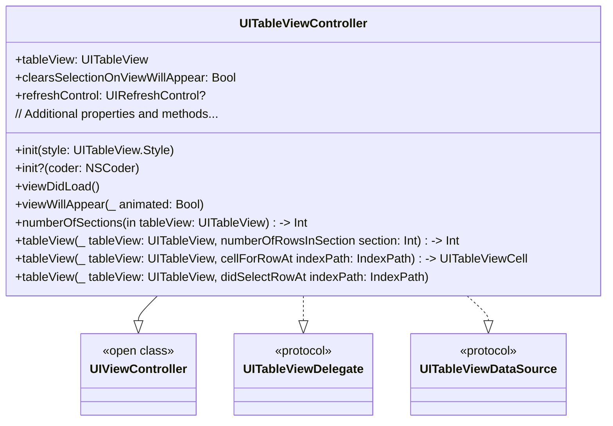

---

## **2. Initializers Overview**

### **a. Initialization Methods Diagram**
- **Purpose**: Break down the various ways to instantiate `UITableViewController`.
- **Diagram Type**: `flowchart LR`
- **Contents**:
  - **Designated Initializers**: `init(style:)`
  - **Convenience Initializers**: `init(coder:)`
  - **Storyboard Integration**: Initializing via Storyboards and Nibs

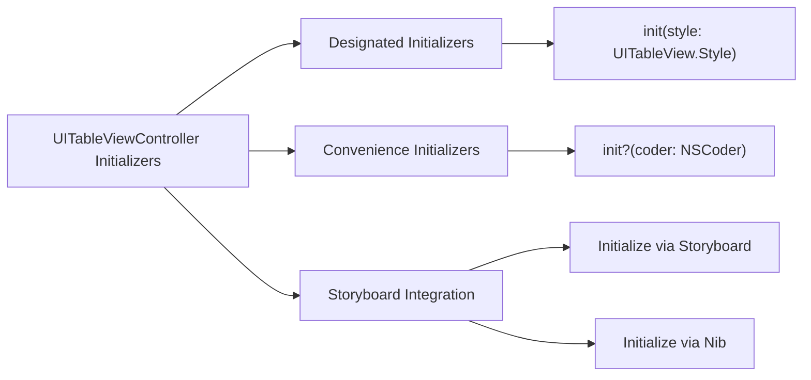

---

## **3. Properties Breakdown**

### **a. Key Properties Diagram**
- **Purpose**: Detail the main properties of `UITableViewController`.
- **Diagram Type**: `graph LR`
- **Contents**:
  - **Table View Management**: `tableView`
  - **Selection Handling**: `clearsSelectionOnViewWillAppear`
  - **Refresh Control**: `refreshControl`
  - **Editing Mode**: `isEditing`
  - **Style**: `style`
  - **Additional Properties**: `definesPresentationContext`, `extendedLayoutIncludesOpaqueBars`, etc.

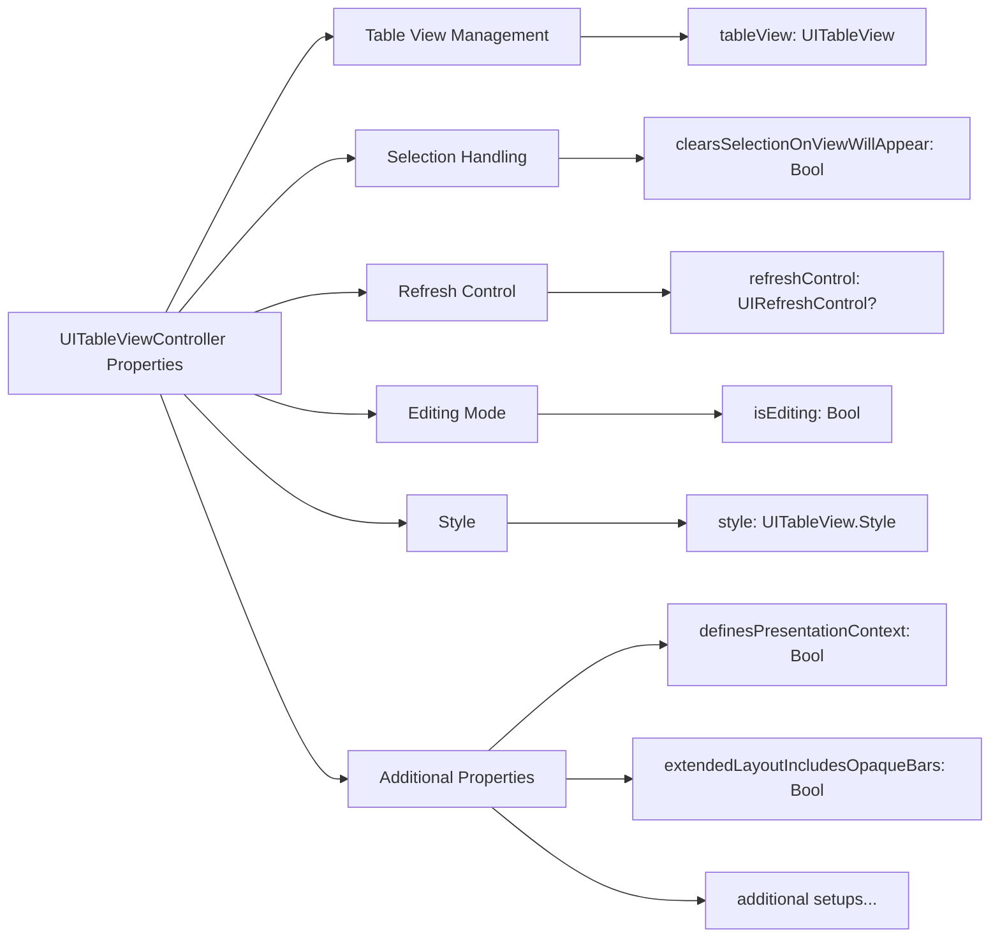

---

## **4. Methods Grouped by Functionality**

### **a. Lifecycle Methods**
- **Purpose**: Categorize lifecycle-related methods of `UITableViewController`.
- **Diagram Type**: `flowchart TD`
- **Contents**:
  - **View Loading**: `viewDidLoad()`, `viewWillAppear(_:)`, `viewDidAppear(_:)`, etc.
  - **View Unloading**: `viewWillDisappear(_:)`, `viewDidDisappear(_:)`
  - **Memory Management**: `didReceiveMemoryWarning()`

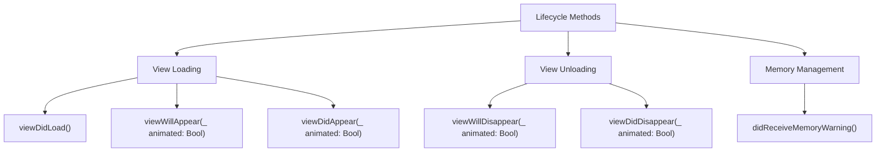

### **b. Table View Data Source Methods**
- **Purpose**: Group methods responsible for providing data to the table view.
- **Diagram Type**: `flowchart TD`
- **Contents**:
  - **Section Management**: `numberOfSections(in:)`
  - **Row Management**: `tableView(_:numberOfRowsInSection:)`, `tableView(_:cellForRowAt:)`
  - **Dynamic Row Heights**: `tableView(_:heightForRowAt:)`
  - **Editing Procedures**: `tableView(_:canEditRowAt:)`, `tableView(_:commit:forRowAt:)`

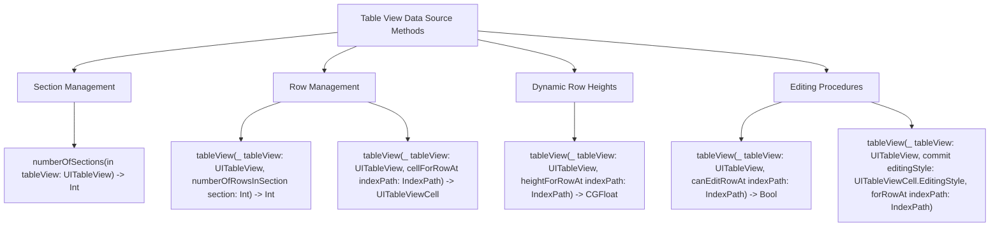

### **c. Table View Delegate Methods**
- **Purpose**: Group methods that handle user interactions and table view behavior.
- **Diagram Type**: `flowchart TD`
- **Contents**:
  - **Row Selection**: `tableView(_:didSelectRowAt:)`, `tableView(_:didDeselectRowAt:)`
  - **Row Actions**: `tableView(_:editActionsForRowAt:)`
  - **Header and Footer Management**: `tableView(_:viewForHeaderInSection:)`, `tableView(_:heightForHeaderInSection:)`, etc.
  - **Accessory Type Handling**: `tableView(_:accessoryButtonTappedForRowWith:)`

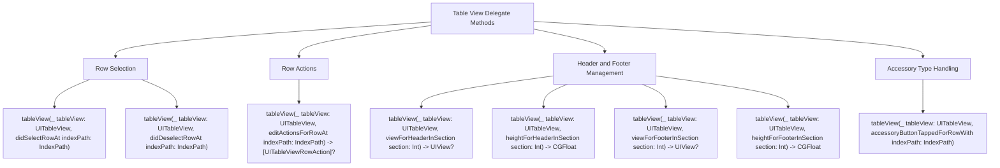

### **d. Editing and Reordering Methods**
- **Purpose**: Categorize methods related to editing and reordering table view cells.
- **Diagram Type**: `flowchart TD`
- **Contents**:
  - **Commit Editing Style**: `tableView(_:commit:forRowAt:)`
  - **Move Row**: `tableView(_:moveRowAt:to:)`
  - **Can Move Row**: `tableView(_:canMoveRowAt:)`

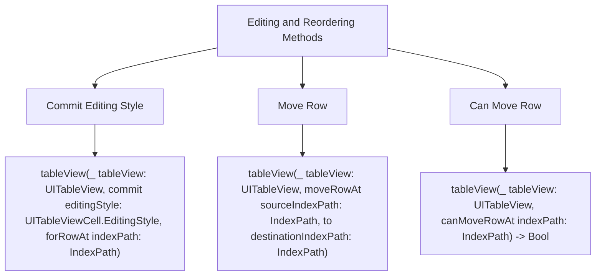

---

## **5. Enumerations and Configurations**

### **a. Enumerations Diagram**
- **Purpose**: Highlight the enums used within `UITableViewController` and related to its configurations.
- **Diagram Type**: `classDiagram`
- **Contents**:
  - **Table View Styles**: `UITableView.Style`
  - **Editing Styles**: `UITableViewCell.EditingStyle`
  - **Row Actions**: `UITableView.RowAction`
  - **Section Types**: `UITableView.Section`

## TODO: Fix diagram syntax error 

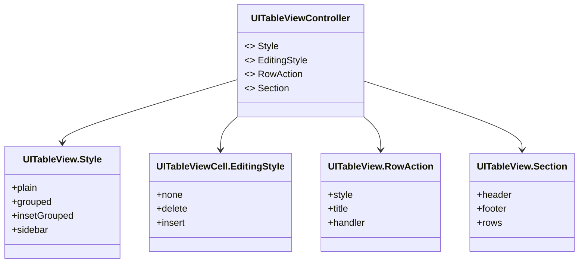

### **b. Configuration Classes Diagram**
- **Purpose**: Show the relationship between `UITableViewController` and its configuration classes.
- **Diagram Type**: `classDiagram`
- **Contents**:
  - **UITableView**: Managed table view instance
  - **UIRefreshControl**: For pull-to-refresh functionality

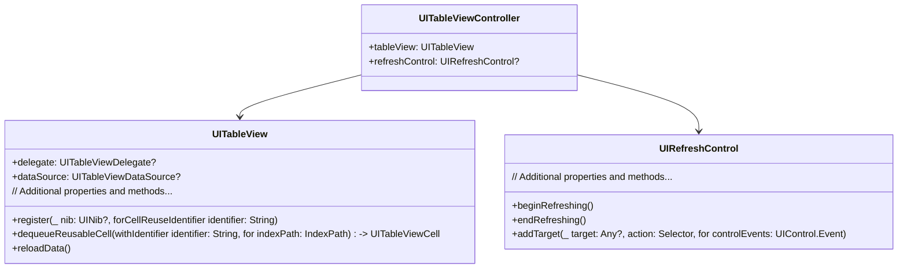

---

## **6. Protocol Conformances**

### **a. Protocols Diagram**
- **Purpose**: Display the protocols that `UITableViewController` conforms to and their impact.
- **Diagram Type**: `classDiagram`
- **Contents**:
  - **UITableViewDelegate**
  - **UITableViewDataSource**
  - **UISearchResultsUpdating** (if applicable)
  - **UIContextMenuInteractionDelegate** (for context menus)

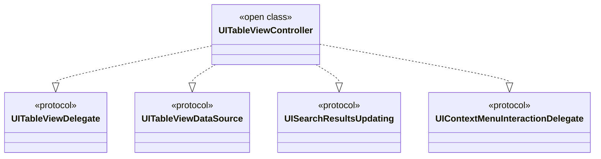

---

## **7. Relationships with Other Classes**

### **a. Related Classes Diagram**
- **Purpose**: Illustrate how `UITableViewController` interacts with other UIKit classes and frameworks.
- **Diagram Type**: `flowchart TD`
- **Contents**:
  - **UITableView**: Primary table view managed by the controller.
  - **UITableViewCell**: Cells displayed within the table view.
  - **UIViewController**: Parent class providing view lifecycle.
  - **UISearchController**: For adding search capabilities.
  - **UIRefreshControl**: For pull-to-refresh functionality.
  - **Navigation Controllers**: For managing navigation stacks.
  - **Storyboard & Nib Files**: For UI design and instantiation.

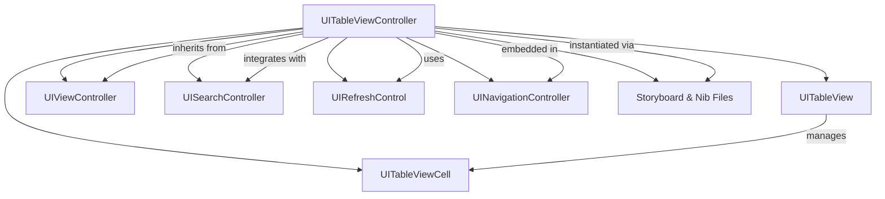

---

## **8. Extensions and Additional Functionalities**

### **a. UITableViewController Extensions Diagram**
- **Purpose**: Showcase the additional functionalities provided through extensions.
- **Diagram Type**: `classDiagram`
- **Contents**:
  - **Data Handling Extensions**: Methods for handling data sources and delegates.
  - **UI Enhancements**: Methods for customizing table view appearance and behavior.
  - **Convenience Methods**: Helper functions for common tasks.

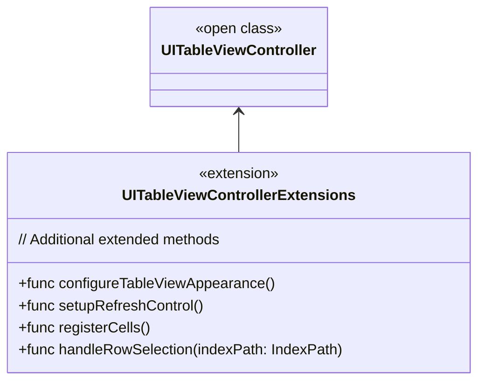

### **b. Extensions Functionalities Flowchart**
- **Purpose**: Detail specific extended methods and their purposes.
- **Diagram Type**: `flowchart LR`
- **Contents**:
  - **Table View Configuration**
  - **Data Binding**
  - **UI Customization**

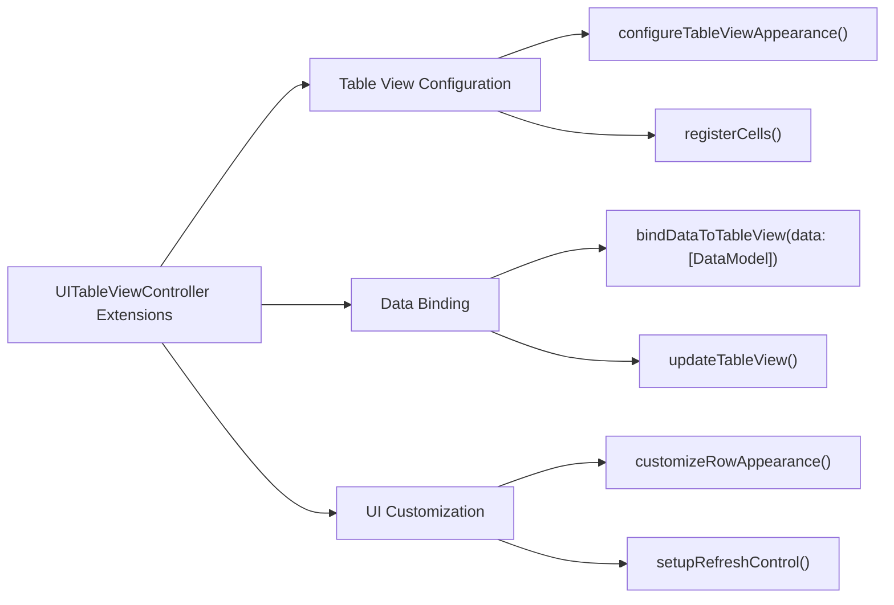

---

## **9. Lifecycle and Use Cases**

### **a. Lifecycle Flowchart**
- **Purpose**: Demonstrate the typical lifecycle of a `UITableViewController` within an application.
- **Diagram Type**: `flowchart TD`
- **Contents**:
  - **Initialization**
  - **View Loading**
  - **Displaying Data**
  - **User Interaction**
  - **Data Refreshing**
  - **View Unloading**
  - **Deinitialization**

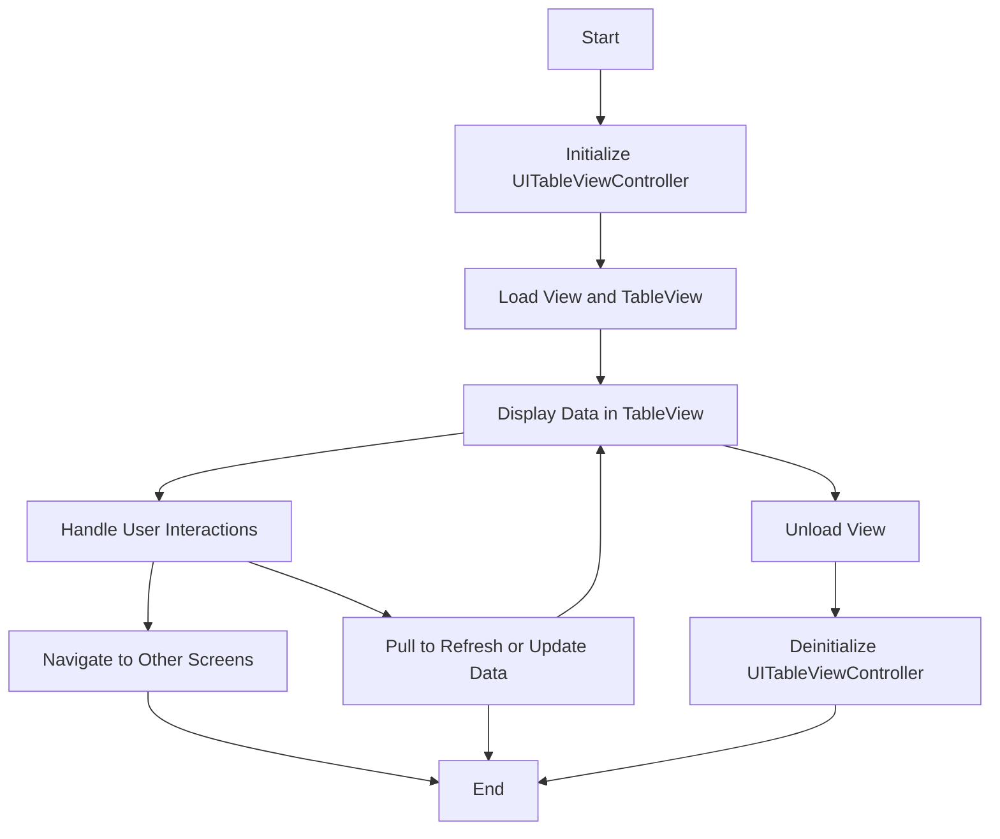

### **b. Common Use Cases Diagram**
- **Purpose**: Outline the typical scenarios where `UITableViewController` is utilized.
- **Diagram Type**: `flowchart TD`
- **Contents**:
  - **Displaying Lists**: Static and dynamic lists.
  - **Form Inputs**: Creating forms with multiple input fields.
  - **Settings Screens**: Managing app settings.
  - **Data-Driven Interfaces**: Displaying data from APIs or local databases.
  - **Interactive Tables**: Drag-and-drop reordering, swipe actions.
  - **Nested Tables**: Master-detail interfaces.

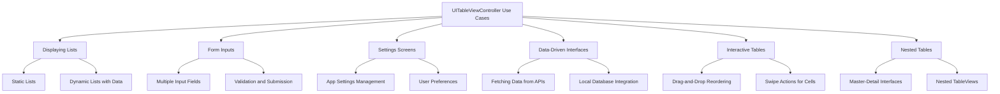

---

## **10. Feature Availability Timeline**

### **a. Feature Availability Gantt Chart**
- **Purpose**: Show when various `UITableViewController` features were introduced across iOS versions.
- **Diagram Type**: `gantt`
- **Contents**:
  - **iOS Versions**: 3.0, 4.0, 5.0, 6.0, 7.0, 8.0, 9.0, 10.0, 11.0, 12.0, 13.0, 14.0, 15.0, 16.0, 17.0
  - **Features Introduced**: Pull-to-Refresh, Self-Sizing Cells, Swipe Actions, Context Menus, Diffable Data Sources, UIRefreshControl enhancements, etc.

## TODO: Fix diagram syntax error

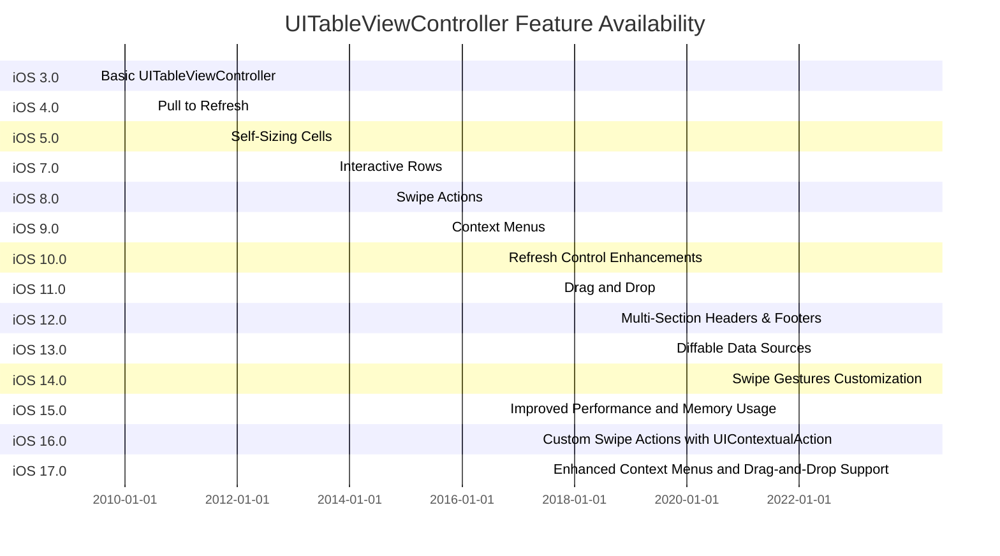

---

## **11. Data Handling and Formats**

### **a. Data Source Management Diagram**
- **Purpose**: Explain how `UITableViewController` handles different data sources and formats.
- **Diagram Type**: `graph LR`
- **Contents**:
  - **Static Data Sources**: Hardcoded data within the controller.
  - **Dynamic Data Sources**: Data fetched from APIs or databases.
  - **Core Data Integration**: Using `NSFetchedResultsController` for managing Core Data.
  - **JSON Parsing**: Handling JSON responses for dynamic content.
  - **Local Storage**: Integrating with `UserDefaults` or local databases.

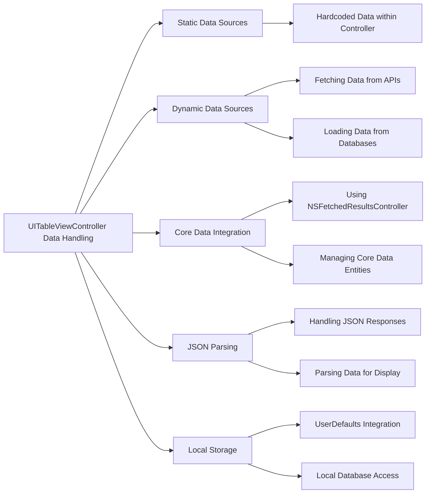

---

## **12. Integration with Drawing Contexts**

### **a. Table View Customization Diagram**
- **Purpose**: Show how `UITableViewController` methods are used to customize the appearance and behavior of table views.
- **Diagram Type**: `flowchart TD`
- **Contents**:
  - **Custom Cell Rendering**
  - **Header and Footer Customization**
  - **Row Animations**
  - **Accessory Views**
  - **Section Indexing**

## TODO: Fix diagram syntax error

```mermaid
flowchart TD
    UIImageController[UITableViewController] -->|Customizes| CustomCells[Custom Cell Rendering]
    UIImageController -->|Customizes| HeadersFooters[Header and Footer Customization]
    UIImageController -->|Handles| RowAnimations[Row Animations]
    UIImageController -->|Adds| AccessoryViews[Accessory Views]
    UIImageController -->|Manages| SectionIndexing[Section Indexing]

    CustomCells -->|Implement| tableView(_:cellForRowAt:)
    HeadersFooters -->|Implement| tableView(_:viewForHeaderInSection:)
    HeadersFooters -->|Implement| tableView(_:heightForHeaderInSection:)
    RowAnimations -->|Use| beginUpdates()/endUpdates()
    AccessoryViews -->|Configure| UITableViewCell.AccessoryType
    SectionIndexing -->|Implement| sectionIndexTitles(for:)
    
```

---

## **13. Summary and Best Practices**

### **a. Summary Diagram**
- **Purpose**: Provide a high-level overview of `UITableViewController`'s key characteristics and functionalities.
- **Diagram Type**: `graph LR`
- **Contents**:
  - **Efficient Data Management**
  - **Seamless User Interactions**
  - **Customization Flexibility**
  - **Integration Capabilities**
  - **Performance Optimizations**

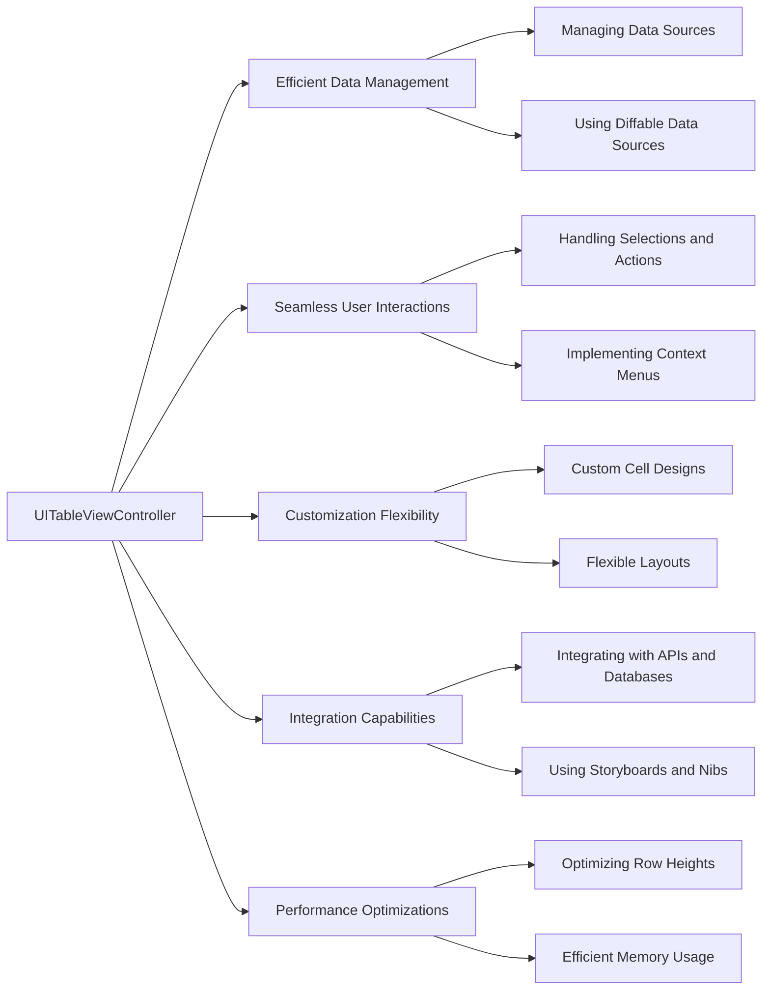

### **b. Best Practices Checklist Diagram**
- **Purpose**: Outline best practices when using `UITableViewController`.
- **Diagram Type**: `flowchart LR`
- **Contents**:
  - **Data Source Management**
  - **Cell Reuse Optimization**
  - **Efficient Layouts**
  - **Accessibility Compliance**
  - **Performance Monitoring**
  - **Smooth Animations**

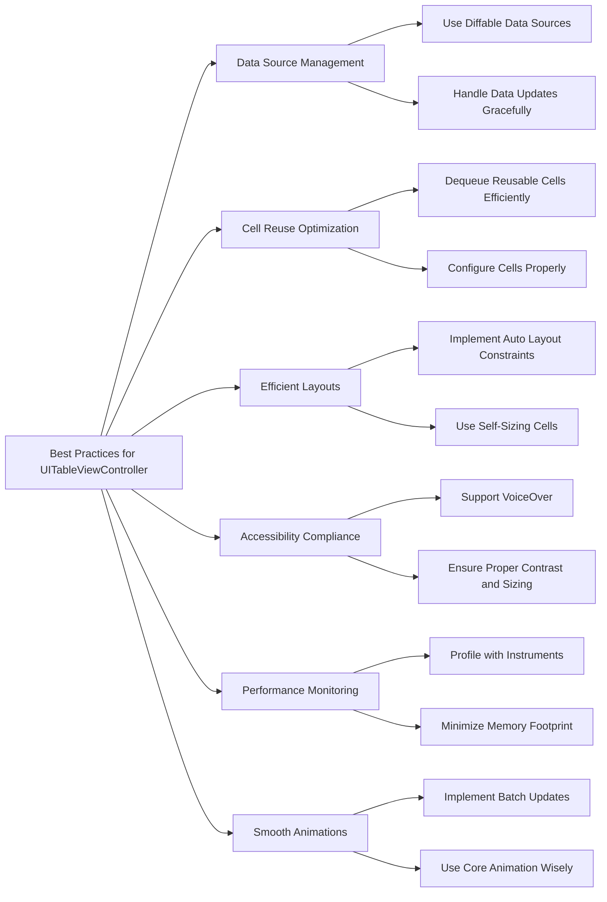

---