# UITableViewDiffableDataSource

Below is a comprehensive and organized set of Mermaid diagrams for the `UITableViewDiffableDataSource` class. These diagrams cover various aspects of the `UITableViewDiffableDataSource`, including its class structure, initialization methods, properties, methods, enumerations, protocol conformances, relationships with other classes, extensions, lifecycle, feature availability, data handling, integration with UITableView, and best practices.

---

## **1. Class Structure and Hierarchy**

### **a. Core Class Diagram**
- **Purpose**: Illustrate the primary structure of `UITableViewDiffableDataSource`, including its properties, methods, and associated types.
- **Diagram Type**: `classDiagram`
- **Contents**:
  - **Properties**: Key attributes like `tableView`, `defaultRowAnimation`.
  - **Methods**: Essential functions like `snapshot()`, `apply(_:animatingDifferences:completion:)`, `cellProvider`.
  - **Associated Types**: `SectionIdentifierType`, `ItemIdentifierType`.

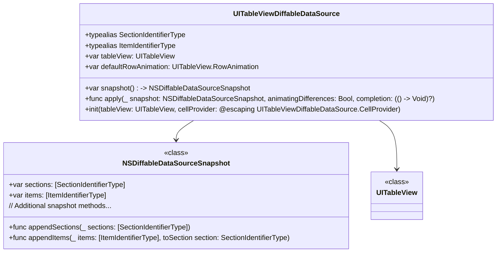

---

## **2. Initializers Overview**

### **a. Initialization Methods Diagram**
- **Purpose**: Break down the various ways to instantiate `UITableViewDiffableDataSource`.
- **Diagram Type**: `flowchart TD`
- **Contents**:
  - **Basic Initializer**: `init(tableView:cellProvider:)`
  - **Custom Initializer**: Initializers with additional configurations or custom behaviors.
  - **Closure-Based Initializer**: Using closures for cell configuration.

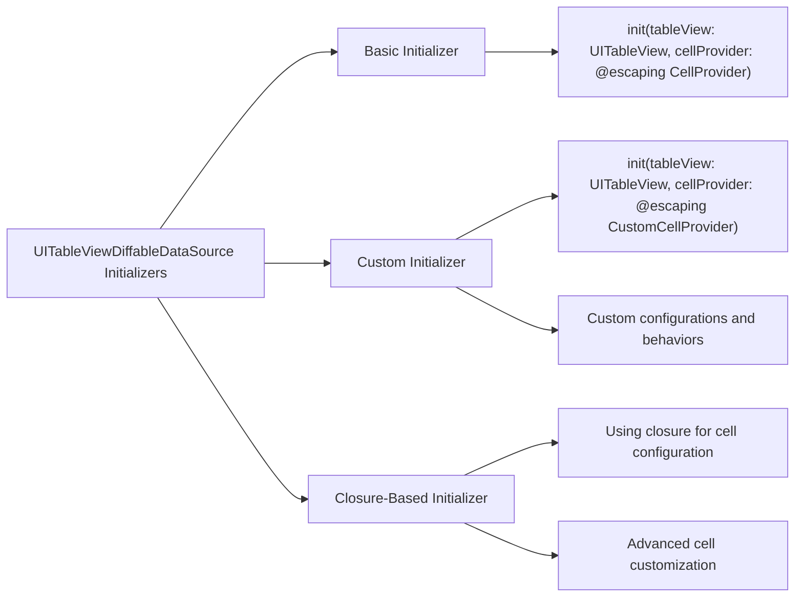

---

## **3. Properties Breakdown**

### **a. Key Properties Diagram**
- **Purpose**: Detail the main properties of `UITableViewDiffableDataSource`.
- **Diagram Type**: `graph LR`
- **Contents**:
  - **Data Source Configuration**: `tableView`, `defaultRowAnimation`.
  - **Snapshot Management**: `currentSnapshot`.
  - **Cell Configuration**: `cellProvider`.
  - **Supplementary View Configuration**: `supplementaryViewProvider`.

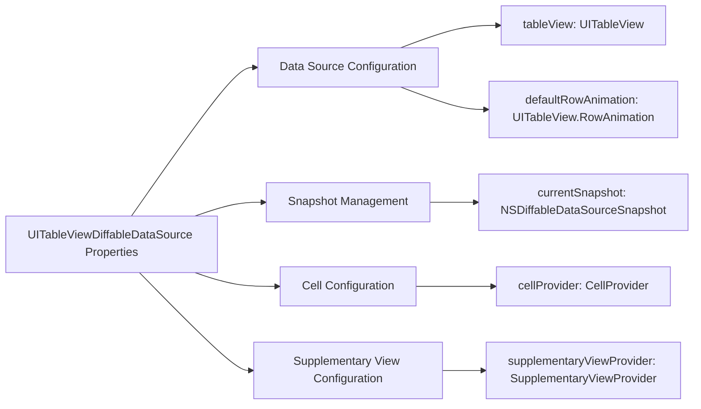

---

## **4. Methods Grouped by Functionality**

### **a. Data Manipulation Methods**
- **Purpose**: Categorize methods based on their roles in data manipulation and snapshot management.
- **Diagram Type**: `flowchart TD`
- **Contents**:
  - **Snapshot Creation**: `snapshot()`
  - **Applying Snapshots**: `apply(_:animatingDifferences:completion:)`
  - **Reusing Snapshots**: `reusingSnapshots(_:)`
  - **Supplementary Views Management**: `supplementaryViewProvider`

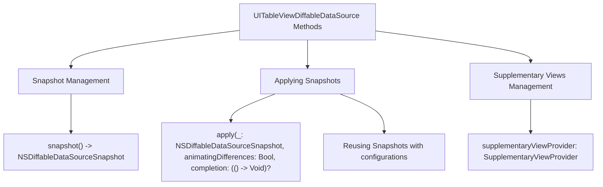

---

## **5. Enumerations and Configurations**

### **a. Enumerations Diagram**
- **Purpose**: Highlight the enums used within `UITableViewDiffableDataSource` and their possible values.
- **Diagram Type**: `classDiagram`
- **Contents**:
  - **RowAnimation**
  - **SupplementaryViewType**

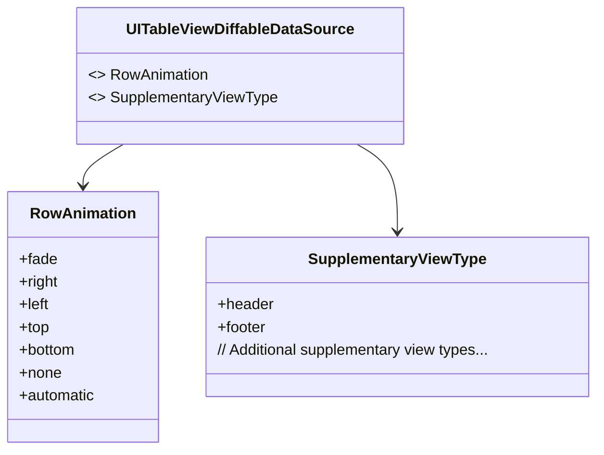

---

## **6. Protocol Conformances**

### **a. Protocols Diagram**
- **Purpose**: Display the protocols that `UITableViewDiffableDataSource` conforms to and their impact.
- **Diagram Type**: `classDiagram`
- **Contents**:
  - **UITableViewDataSource**
  - **NSObjectProtocol**
  - **UIDataSourceModelAssociation**

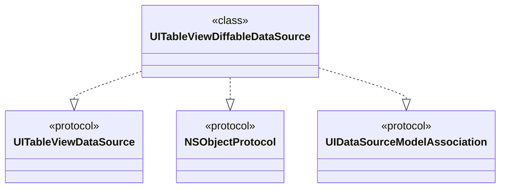

---

## **7. Relationships with Other Classes**

### **a. Related Classes Diagram**
- **Purpose**: Illustrate how `UITableViewDiffableDataSource` interacts with other UIKit classes and frameworks.
- **Diagram Type**: `flowchart TD`
- **Contents**:
  - **UITableView**: Core table view component.
  - **NSDiffableDataSourceSnapshot**: Snapshot representation.
  - **UITableViewCell**: Cells provided by the data source.
  - **Supplementary Views**: Headers, footers, etc.
  - **UICollectionView**: Similar data source pattern.

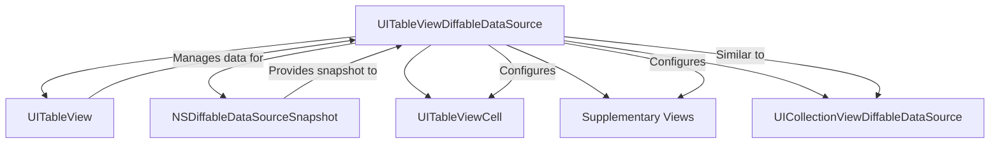

---

## **8. Extensions and Additional Functionalities**

### **a. UITableViewDiffableDataSource Extensions Diagram**
- **Purpose**: Showcase the additional functionalities provided through extensions.
- **Diagram Type**: `classDiagram`
- **Contents**:
  - **Supplementary View Extensions**
  - **Reordering Support**
  - **Snapshot Manipulation Helpers**

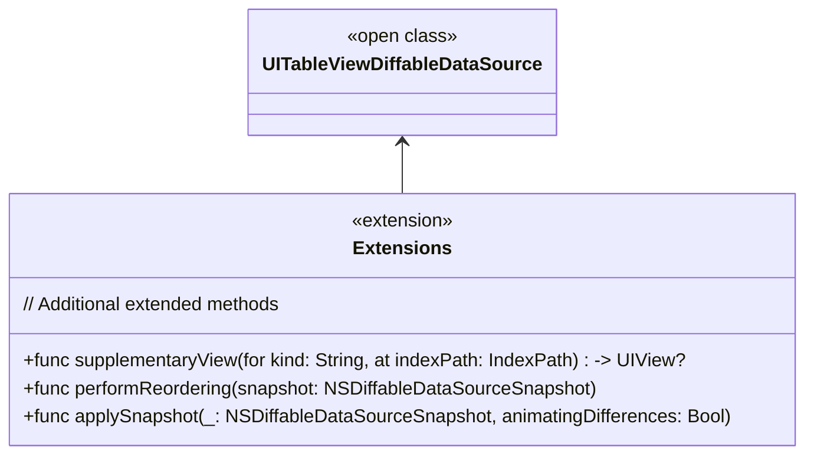

### **b. Extensions Functionalities Flowchart**
- **Purpose**: Detail specific extended methods and their purposes.
- **Diagram Type**: `flowchart LR`
- **Contents**:
  - **Supplementary Views**
  - **Reordering Support**
  - **Snapshot Helpers**

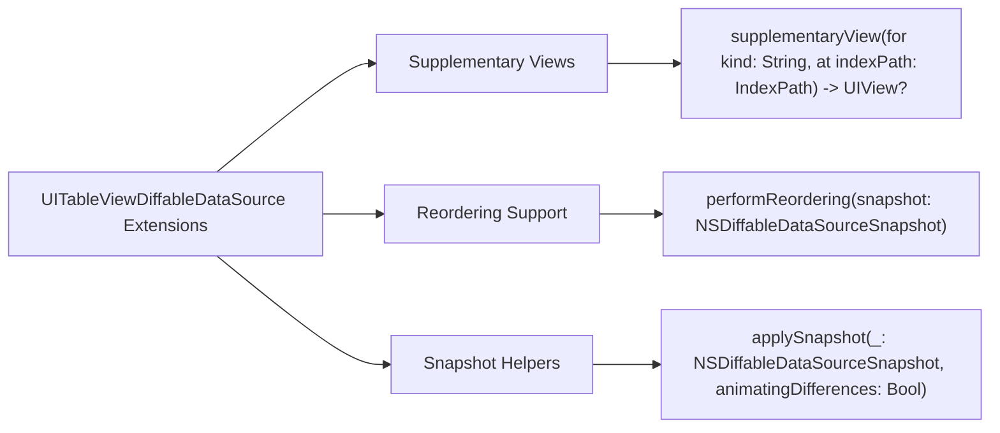

---

## **9. Lifecycle and Use Cases**

### **a. Lifecycle Flowchart**
- **Purpose**: Demonstrate the typical lifecycle of a `UITableViewDiffableDataSource` within an application.
- **Diagram Type**: `flowchart TD`
- **Contents**:
  - **Initialization**
  - **Snapshot Creation**
  - **Applying Snapshot**
  - **Updating Data**
  - **Handling User Actions**
  - **Finalizing Updates**

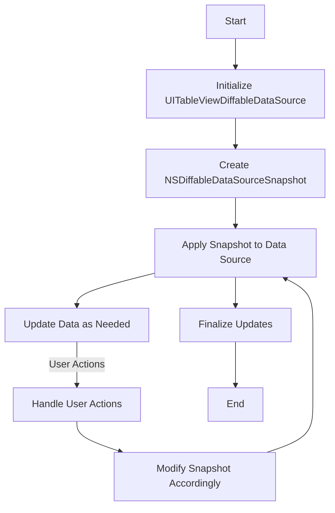

### **b. Common Use Cases Diagram**
- **Purpose**: Outline the typical scenarios where `UITableViewDiffableDataSource` is utilized.
- **Diagram Type**: `flowchart TD`
- **Contents**:
  - **Dynamic Content Updates**
  - **Batch Updates**
  - **Animated Transitions**
  - **Reordering Rows**
  - **Managing Multiple Sections**
  - **Handling Supplementary Views**

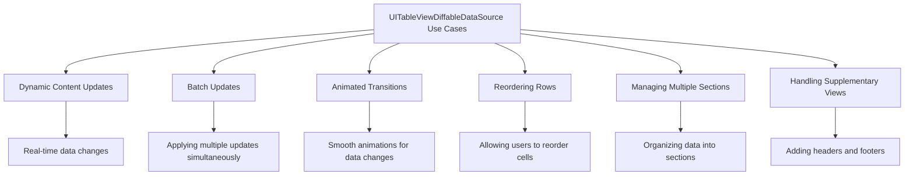

---

## **10. Feature Availability Timeline**

### **a. Feature Availability Gantt Chart**
- **Purpose**: Show when various `UITableViewDiffableDataSource` features were introduced across iOS versions.
- **Diagram Type**: `gantt`
- **Contents**:
  - **iOS Versions**: 13.0, 14.0, 15.0, 16.0, 17.0
  - **Features Introduced**: Basic diffable data source, supplementary views, reordering support, multiple sections, snapshot optimizations, advanced animations.

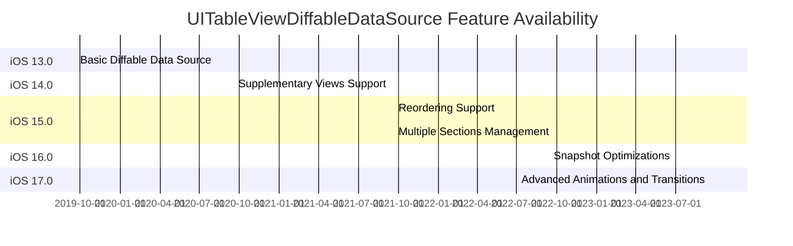

---

## **11. Data Handling and Formats**

### **a. Snapshot Data Flow Diagram**
- **Purpose**: Explain how `UITableViewDiffableDataSource` handles different data formats through snapshots.
- **Diagram Type**: `graph LR`
- **Contents**:
  - **NSDiffableDataSourceSnapshot**: Core snapshot representation.
  - **Sections and Items**: Defining the structure.
  - **Applying Snapshots**: Animating and updating the table view.

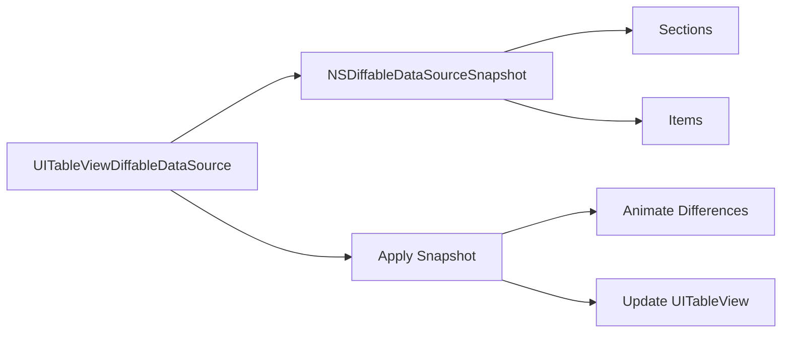

---

## **12. Integration with UITableView**

### **a. Integration Flowchart**
- **Purpose**: Show how `UITableViewDiffableDataSource` integrates with `UITableView` to manage and display data.
- **Diagram Type**: `flowchart TD`
- **Contents**:
  - **Data Source Assignment**
  - **Snapshot Management**
  - **Cell Configuration**
  - **Handling User Interactions**

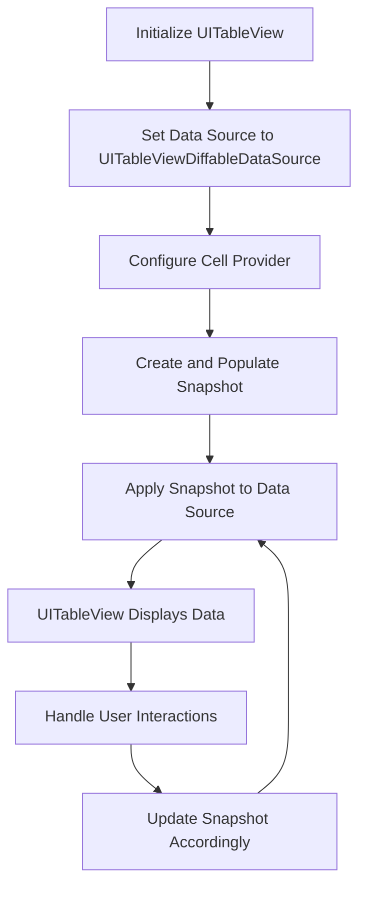

---

## **13. Summary and Best Practices**

### **a. Summary Diagram**
- **Purpose**: Provide a high-level overview of `UITableViewDiffableDataSource`'s key characteristics and functionalities.
- **Diagram Type**: `graph LR`
- **Contents**:
  - **Modern Data Management**
  - **Ease of Use**
  - **Performance Optimization**
  - **Flexibility with Sections and Items**
  - **Seamless Animations**

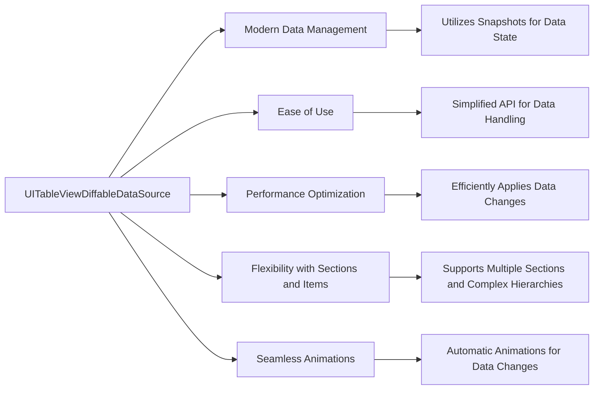

### **b. Best Practices Diagram**
- **Purpose**: Highlight recommended practices when using `UITableViewDiffableDataSource`.
- **Diagram Type**: `graph LR`
- **Contents**:
  - **Consistent Snapshot Updates**
  - **Efficient Cell Configuration**
  - **Handling Deletions and Insertions**
  - **Optimizing Performance**
  - **Testing Snapshots**

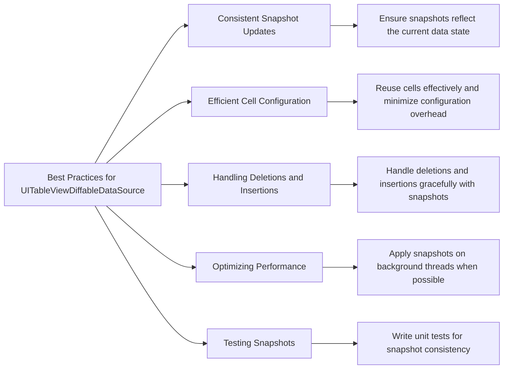

---

## **14. Additional Considerations**

### **a. Troubleshooting Common Issues Diagram**
- **Purpose**: Address common challenges and their solutions when working with `UITableViewDiffableDataSource`.
- **Diagram Type**: `flowchart TD`
- **Contents**:
  - **Snapshot Mismatch**
  - **Performance Bottlenecks**
  - **Cell Configuration Errors**
  - **Handling Large Data Sets**
  - **Animating Complex Changes**

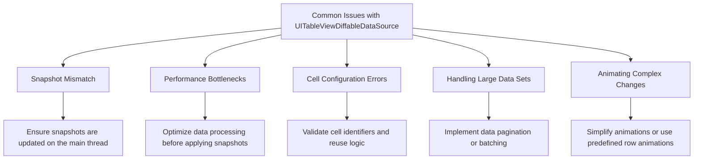

---

## **15. Security and Compliance**

### **a. Security Best Practices Diagram**
- **Purpose**: Highlight security considerations when using `UITableViewDiffableDataSource`.
- **Diagram Type**: `graph LR`
- **Contents**:
  - **Data Validation**
  - **Secure Data Handling**
  - **Preventing Unauthorized Access**
  - **Compliance with Data Privacy Regulations**

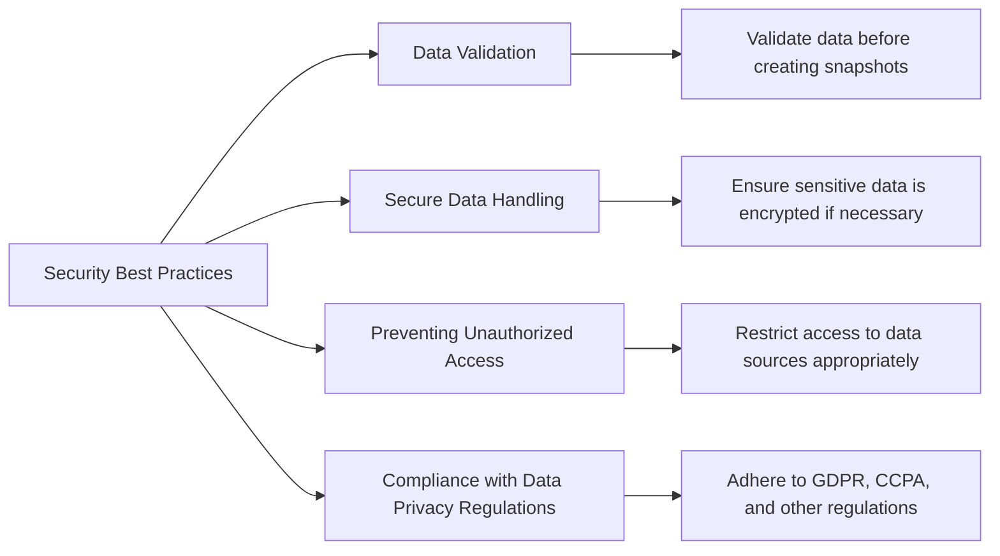

---

By following these diagrams, developers can gain a deep understanding of the `UITableViewDiffableDataSource` class, its functionalities, integrations, and best practices, thereby leveraging its full potential in building efficient and responsive iOS applications.

---