# UITableViewHeaderFooterView
> This content is dual-licensed under your choice of the following licenses:
> 1.  **MIT License:** For the code implementations in Swift and Mermaid provided in this document.
> 2.  **Creative Commons Attribution 4.0 International License (CC BY 4.0):** For all other content, including the text, explanations, and the Mermaid diagrams and illustrations.

---

Below is a comprehensive and organized set of Mermaid diagrams for the `UITableViewHeaderFooterView` class. These diagrams cover various aspects of the class, including its structure, initializers, properties, methods, and more.

---

## **1. Class Structure and Hierarchy**

### **a. Core Class Diagram**
- **Purpose**: Illustrate the primary structure of `UITableViewHeaderFooterView`, including its properties, methods, and associated enumerations.
- **Diagram Type**: `classDiagram`
- **Contents**:
  - **Properties**: Key attributes like `textLabel`, `detailTextLabel`, `contentView`, etc.
  - **Methods**: Essential functions like initializers, `prepareForReuse()`, etc.
  - **Enumerations**: Nested enums such as `ReuseIdentifier`.

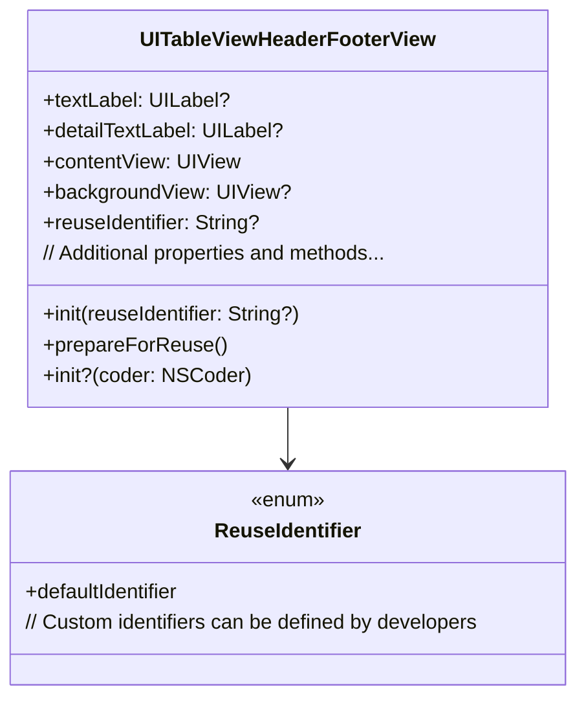

---

## **2. Initializers Overview**

### **a. Initialization Methods Diagram**
- **Purpose**: Break down the various ways to instantiate `UITableViewHeaderFooterView`.
- **Diagram Type**: `flowchart LR`
- **Contents**:
  - **Default Initializers**: `init(reuseIdentifier:)`
  - **Storyboard/XIB Initializers**: `init?(coder:)`
  - **Custom Initializers**: Developers can create custom initializers as needed.

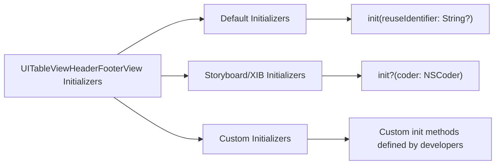

---

## **3. Properties Breakdown**

### **a. Key Properties Diagram**
- **Purpose**: Detail the main properties of `UITableViewHeaderFooterView`.
- **Diagram Type**: `classDiagram`
- **Contents**:
  - **Labels**: `textLabel`, `detailTextLabel`
  - **Views**: `contentView`, `backgroundView`
  - **Identifiers**: `reuseIdentifier`
  - **Accessibility**: `accessibilityElements`

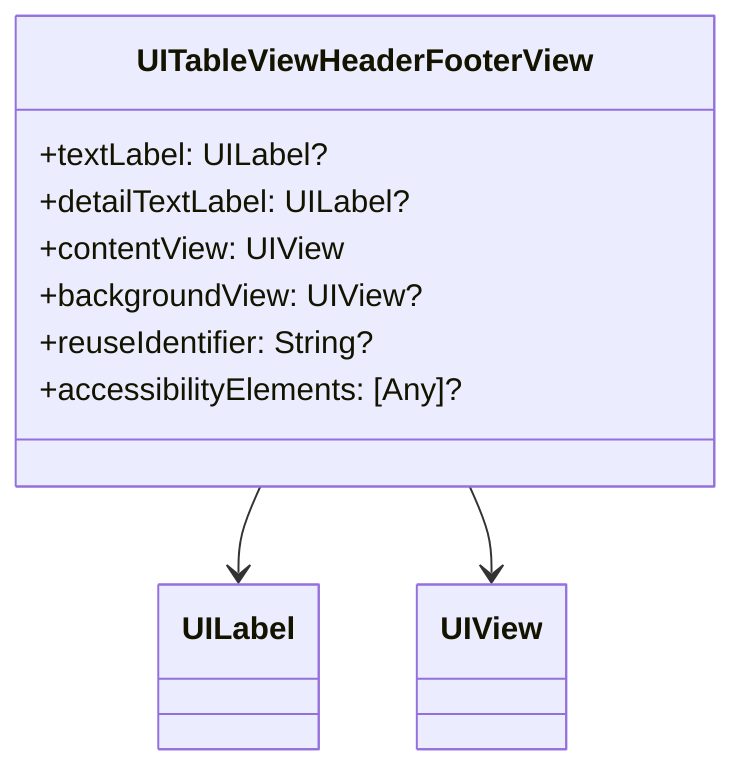

---

## **4. Methods Grouped by Functionality**

### **a. Lifecycle Methods**
- **Purpose**: Categorize methods based on their roles in the lifecycle management of the view.
- **Diagram Type**: `flowchart TD`
- **Contents**:
  - **Initialization Methods**: `init(reuseIdentifier:)`, `init?(coder:)`
  - **Reuse Methods**: `prepareForReuse()`
  - **Layout Methods**: `layoutSubviews()`

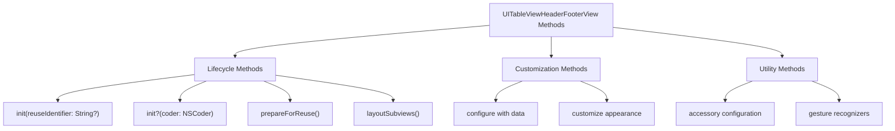

---

## **5. Enumerations and Configurations**

### **a. Enumerations Diagram**
- **Purpose**: Highlight the enums used within `UITableViewHeaderFooterView` and their possible values.
- **Diagram Type**: `classDiagram`
- **Contents**:
  - **ReuseIdentifier**: Predefined and custom identifiers.

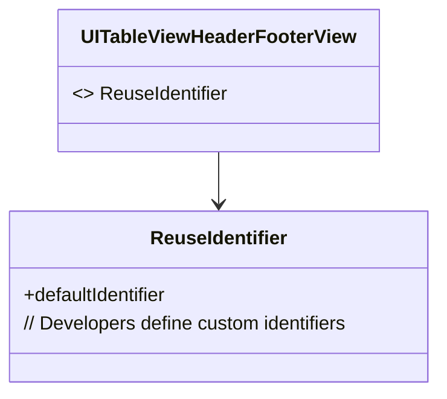

### **b. Configuration Classes Diagram**
- **Purpose**: Show the relationship between `UITableViewHeaderFooterView` and its configuration classes.
- **Diagram Type**: `classDiagram`
- **Contents**:
  - **Configuration**: Custom configurations for the header/footer view.

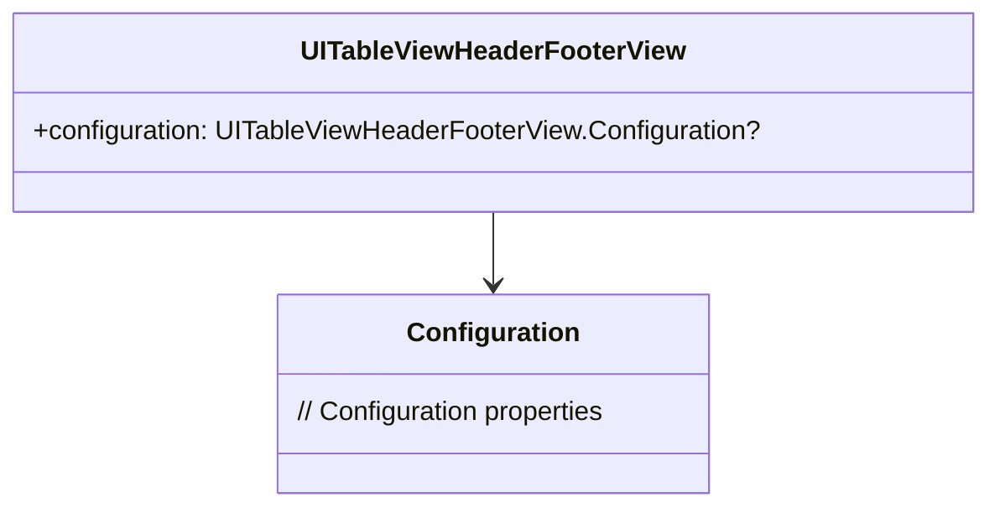

---

## **6. Protocol Conformances**

### **a. Protocols Diagram**
- **Purpose**: Display the protocols that `UITableViewHeaderFooterView` conforms to and their impact.
- **Diagram Type**: `classDiagram`
- **Contents**:
  - **UIConfigurationState**
  - **UIContentConfiguration**
  - **UIContentView**
  - **NSSecureCoding**
  - **NSCoding**

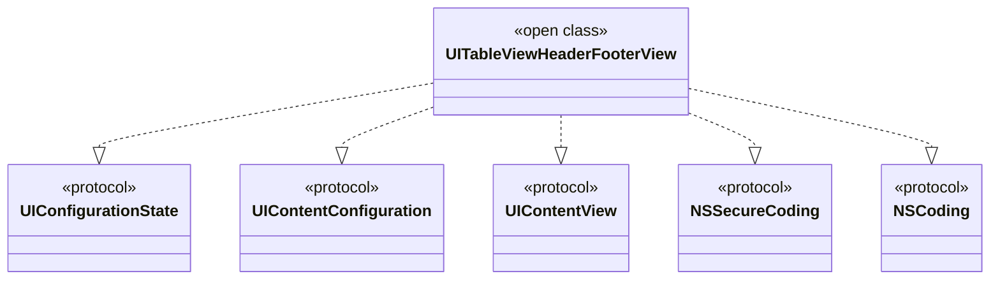

---

## **7. Relationships with Other Classes**

### **a. Related Classes Diagram**
- **Purpose**: Illustrate how `UITableViewHeaderFooterView` interacts with other UIKit classes and frameworks.
- **Diagram Type**: `flowchart TD`
- **Contents**:
  - **UITableView**: Manages header/footer views.
  - **UILabel**: Used for `textLabel` and `detailTextLabel`.
  - **UIView**: Base view for `contentView` and `backgroundView`.
  - **UIAppearance**: Customizing appearance.
  - **Auto Layout**: Managing layout constraints.
  - **Accessibility**: Enhancing accessibility features.

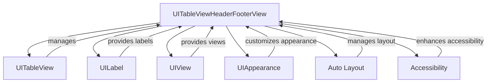

---

## **8. Extensions and Additional Functionalities**

### **a. UITableViewHeaderFooterView Extensions Diagram**
- **Purpose**: Showcase the additional functionalities provided through extensions.
- **Diagram Type**: `classDiagram`
- **Contents**:
  - **Styling Extensions**
  - **Accessory Views**
  - **Gesture Recognizers**

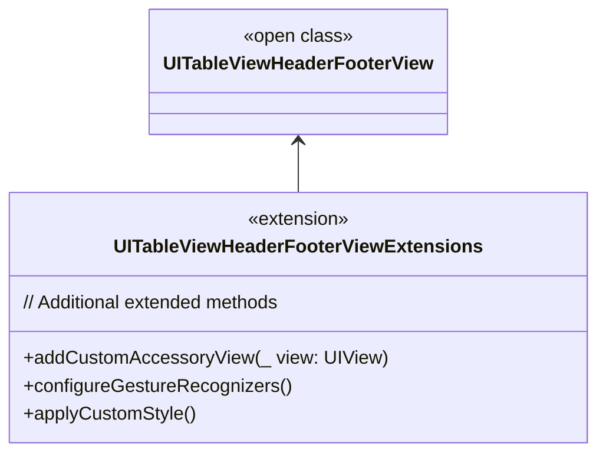

### **b. Extensions Functionalities Flowchart**
- **Purpose**: Detail specific extended methods and their purposes.
- **Diagram Type**: `flowchart LR`
- **Contents**:
  - **Custom Accessory Views**
  - **Gesture Handling**
  - **Styling Methods**

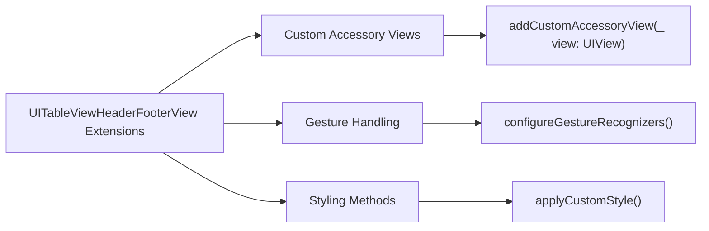

---

## **9. Lifecycle and Use Cases**

### **a. Lifecycle Flowchart**
- **Purpose**: Demonstrate the typical lifecycle of a `UITableViewHeaderFooterView` within an application.
- **Diagram Type**: `flowchart TD`
- **Contents**:
  - **Initialization**
  - **Configuration**
  - **Display**
  - **Reuse**
  - **Deallocation**

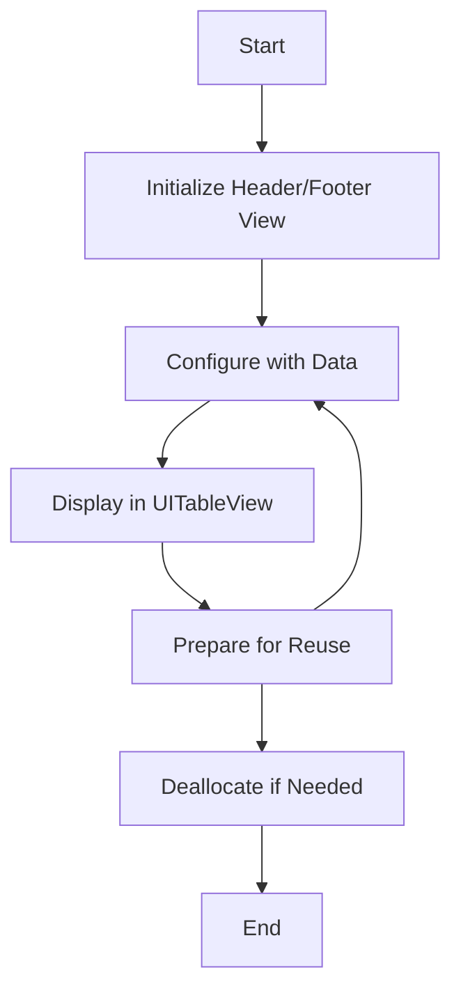

### **b. Common Use Cases Diagram**
- **Purpose**: Outline the typical scenarios where `UITableViewHeaderFooterView` is utilized.
- **Diagram Type**: `flowchart TD`
- **Contents**:
  - **Section Headers**
  - **Section Footers**
  - **Custom Views for Sections**
  - **Displaying Summary Information**
  - **Interactive Header/Footer Views**

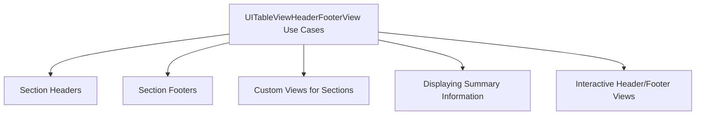

---

## **10. Feature Availability Timeline**

### **a. Feature Availability Gantt Chart**
- **Purpose**: Show when various `UITableViewHeaderFooterView` features were introduced across iOS versions.
- **Diagram Type**: `gantt`
- **Contents**:
  - **iOS Versions**: 2.0, 5.0, 6.0, 7.0, 10.0, 13.0, 15.0, 16.0, 17.0
  - **Features Introduced**: Default initialization, dynamic type support, swipe actions, content configuration, SwiftUI integration, etc.

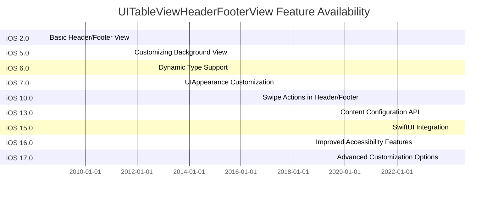

---

## **11. Data Handling and Formats**

### **a. Content Configuration and Data Binding Diagram**
- **Purpose**: Explain how `UITableViewHeaderFooterView` handles content configuration and data binding.
- **Diagram Type**: `graph LR`
- **Contents**:
  - **UIContentConfiguration**: Configures the content of the header/footer view.
  - **Data Binding**: Binding data to labels and views.
  - **Dynamic Updates**: Updating views based on data changes.

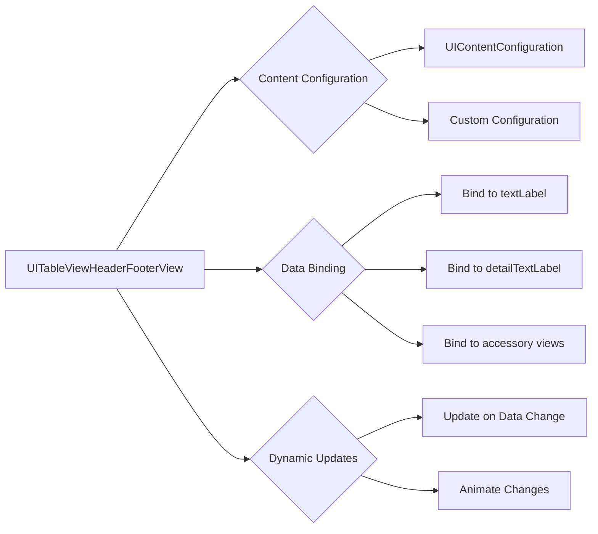

---

## **12. Integration with Layout Systems**

### **a. Auto Layout Integration Diagram**
- **Purpose**: Show how `UITableViewHeaderFooterView` integrates with Auto Layout for managing layout constraints.
- **Diagram Type**: `flowchart TD`
- **Contents**:
  - **Constraints Setup**
  - **Content View Layout**
  - **Dynamic Resizing**
  - **Intrinsic Content Size**

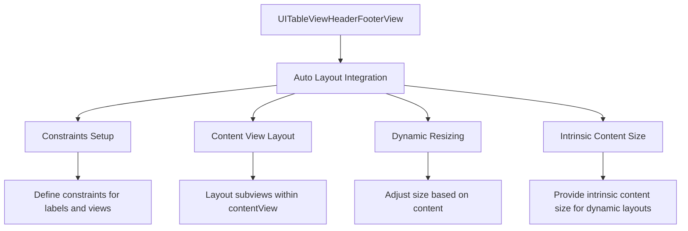

---

## **13. Summary and Best Practices**

### **a. Summary Diagram**
- **Purpose**: Provide a high-level overview of `UITableViewHeaderFooterView`'s key characteristics and functionalities.
- **Diagram Type**: `graph LR`
- **Contents**:
  - **Reusable Views**
  - **Customization Options**
  - **Content Configuration**
  - **Performance Optimizations**
  - **Accessibility Support**
  - **Integration with UIKit**

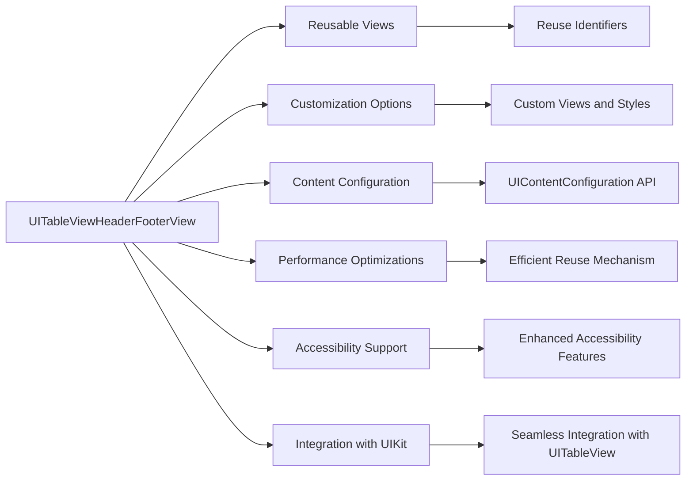

---

## **Best Practices for Using `UITableViewHeaderFooterView`**

1. **Reuse Identifiers**: Always use reuse identifiers to efficiently reuse header and footer views, minimizing memory usage and improving performance.

2. **Customization**: Customize the `contentView` and `backgroundView` to match the desired appearance. Utilize Auto Layout to manage dynamic content and varying sizes.

3. **Content Configuration**: Leverage the `UIContentConfiguration` API to separate content configuration from view presentation, enhancing code maintainability and scalability.

4. **Accessibility**: Ensure that all elements within the header/footer view are accessible. Use accessibility labels, traits, and hints to improve the user experience for all users.

5. **Performance**: Optimize the view's layout and rendering to ensure smooth scrolling and interactions within the table view. Avoid unnecessary subviews and complex layouts.

6. **Dynamic Content**: Handle dynamic content gracefully by updating constraints and layouts as needed. Utilize intrinsic content sizes and dynamic type to support different content sizes and device orientations.

7. **Styling and Theming**: Utilize `UIAppearance` to apply consistent styling across all header and footer views. This promotes a cohesive look and feel within your application.

8. **Gesture Recognizers**: If interaction is required within the header/footer view, add gesture recognizers responsibly to avoid conflicts with table view interactions.

9. **Testing**: Thoroughly test header and footer views across different devices, orientations, and accessibility settings to ensure robust functionality and appearance.

10. **Documentation**: Document any custom configurations or extensions to facilitate easier maintenance and onboarding for other developers.

---

By following these diagrams and best practices, you can effectively utilize `UITableViewHeaderFooterView` to create dynamic, reusable, and well-structured header and footer views within your iOS applications.

---