# UIView - UIKit framework
> This content is dual-licensed under your choice of the following licenses:
> 1.  **MIT License:** For the code implementations in Swift and Mermaid provided in this document.
> 2.  **Creative Commons Attribution 4.0 International License (CC BY 4.0):** For all other content, including the text, explanations, and the Mermaid diagrams and illustrations.

---

Below is a comprehensive and organized set of Mermaid diagrams of `UIView` class in the `UIKit` framework.  These diagram will cover in depth to understand the `UIView`'s structure, functionalities, and relationships within the `UIKit` framework.

---

## **1. Class Structure and Hierarchy**

### **a. Core Class Diagram**
- **Purpose**: Illustrate the primary structure of `UIView`, including its properties, methods, and related enumerations.
- **Diagram Type**: `classDiagram`
- **Contents**:
  - **Properties**: Key attributes like `frame`, `bounds`, `backgroundColor`, etc.
  - **Methods**: Essential functions like initializers, `addSubview()`, `removeFromSuperview()`, etc.
  - **Enumerations**: Nested enums such as `AutoresizingMask`, `ContentMode`, `AnimationOptions`.

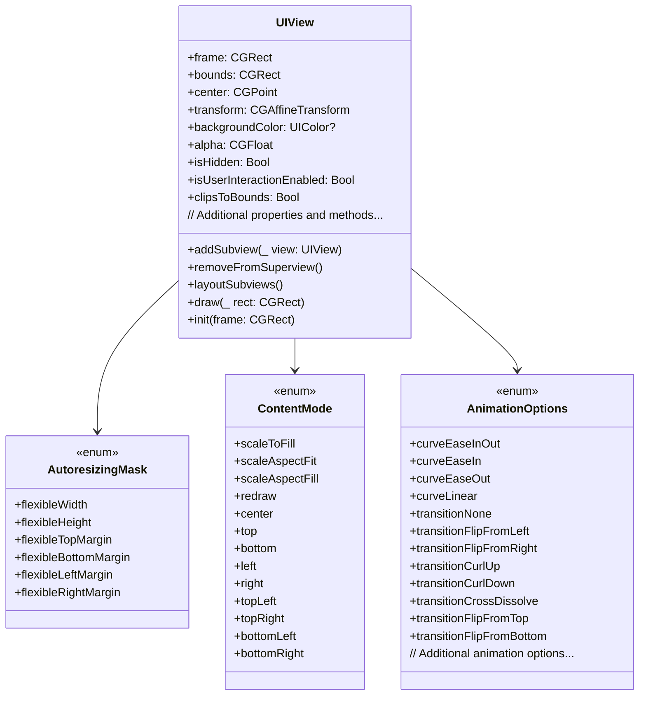

---

## **2. Initializers Overview**

### **a. Initialization Methods Diagram**
- **Purpose**: Break down the various ways to instantiate `UIView`.
- **Diagram Type**: `flowchart` (`graph LR`)
- **Contents**:
  - **Frame-Based Initializers**: `init(frame:)`
  - **Coder-Based Initializers**: `init?(coder:)`
  - **Custom Initializers**: Extensions and convenience initializers.

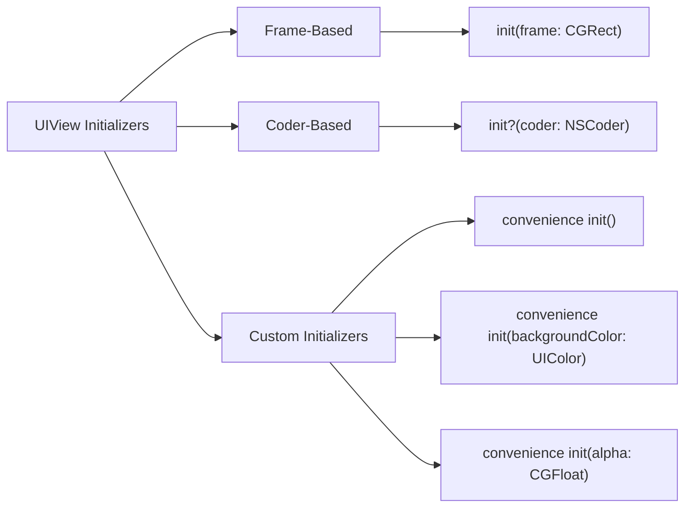

---

## **3. Properties Breakdown**

### **a. Key Properties Diagram**
- **Purpose**: Detail the main properties of `UIView`.
- **Diagram Type**: `graph LR`
- **Contents**:
  - **Geometry**: `frame`, `bounds`, `center`, `transform`
  - **Appearance**: `backgroundColor`, `alpha`, `isHidden`, `clipsToBounds`
  - **Layout**: `autoresizingMask`, `contentMode`, `semanticContentAttribute`
  - **Interaction**: `isUserInteractionEnabled`, `gestureRecognizers`
  - **Layer Management**: `layer`, `mask`

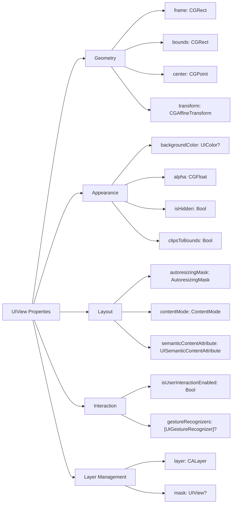

---

## **4. Methods Grouped by Functionality**

### **a. View Hierarchy Management Methods**
- **Purpose**: Categorize methods based on managing the view hierarchy.
- **Diagram Type**: `flowchart TD`
- **Contents**:
  - **Subview Management**: `addSubview()`, `insertSubview(_:at:)`, `bringSubviewToFront()`, `sendSubviewToBack()`
  - **Layout Management**: `setNeedsLayout()`, `layoutIfNeeded()`, `layoutSubviews()`
  - **Rendering**: `setNeedsDisplay()`, `draw(_:)`
  - **Clipping and Masks**: `clipsToBounds`, `mask`

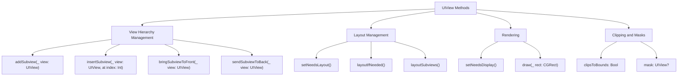

### **b. Gesture Handling Methods**
- **Purpose**: Outline methods related to gesture recognition and handling.
- **Diagram Type**: `flowchart TD`
- **Contents**:
  - **Adding Gestures**: `addGestureRecognizer()`
  - **Removing Gestures**: `removeGestureRecognizer()`
  - **Gesture Recognizer Events**: Handling callbacks and actions.

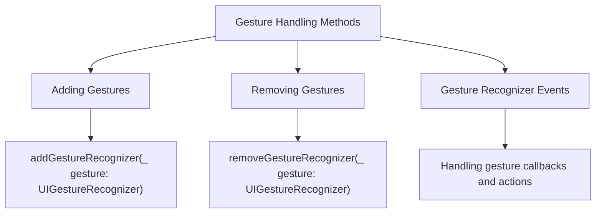

### **c. Animation Methods**
- **Purpose**: Categorize methods that facilitate view animations.
- **Diagram Type**: `flowchart TD`
- **Contents**:
  - **Basic Animations**: `animate(withDuration:animations:)`
  - **Spring Animations**: `animate(withDuration:delay:usingSpringWithDamping:initialSpringVelocity:options:animations:completion:)`
  - **Transition Animations**: `transition(with:duration:options:animations:completion:)`

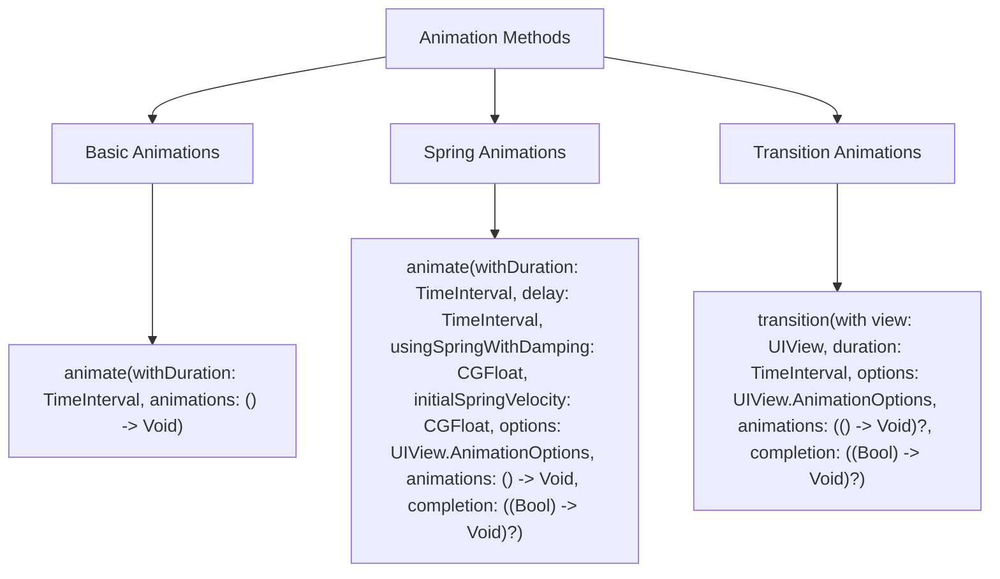

---

## **5. Enumerations and Configurations**

### **a. Enumerations Diagram**
- **Purpose**: Highlight the enums used within `UIView` and their possible values.
- **Diagram Type**: `classDiagram`
- **Contents**:
  - **AutoresizingMask**
  - **ContentMode**
  - **SemanticContentAttribute**
  - **AnimationOptions**

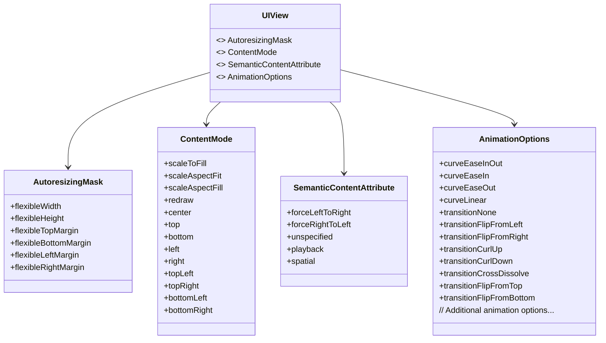

### **b. Configuration Classes Diagram**
- **Purpose**: Show the relationship between `UIView` and its configuration classes.
- **Diagram Type**: `classDiagram`
- **Contents**:
  - **UIView.Configuration**
  - **UIVisualEffect**
  - **UIGestureRecognizer**

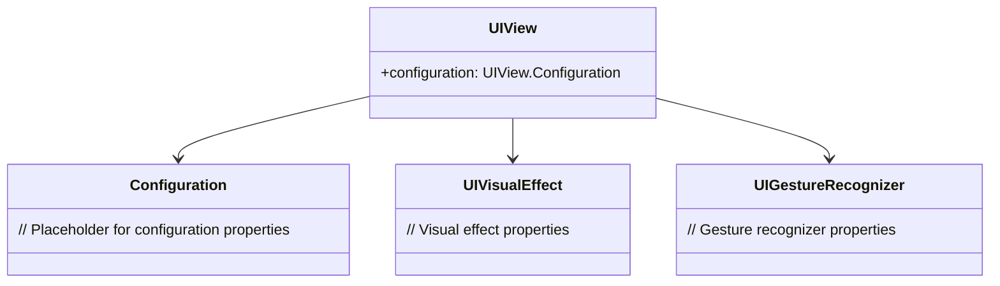

---

## **6. Protocol Conformances**

### **a. Protocols Diagram**
- **Purpose**: Display the protocols that `UIView` conforms to and their impact.
- **Diagram Type**: `classDiagram`
- **Contents**:
  - **NSCoding**
  - **UIAppearance**
  - **UITraitEnvironment**
  - **UIKeyInput**

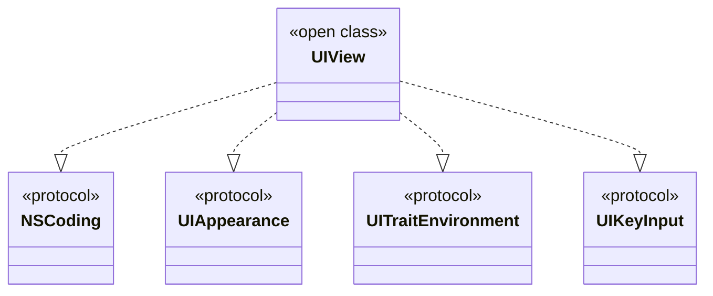

---

## **7. Relationships with Other Classes**

### **a. Related Classes Diagram**
- **Purpose**: Illustrate how `UIView` interacts with other UIKit classes and frameworks.
- **Diagram Type**: `flowchart TD`
- **Contents**:
  - **UIViewController**: Manages views.
  - **CALayer**: Handles lower-level rendering.
  - **UIGraphicsContext**: Drawing contexts.
  - **UILayoutGuide**: Layout management.
  - **UIStackView**: Arranged subviews.
  - **UIGestureRecognizer**: Gesture handling.
  - **UIScreen**: Device screen information.
  - **UIColor**: Color management.

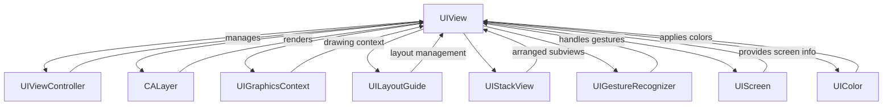

---

## **8. Extensions and Additional Functionalities**

### **a. UIView Extensions Diagram**
- **Purpose**: Showcase the additional functionalities provided through extensions.
- **Diagram Type**: `classDiagram`
- **Contents**:
  - **Frame Manipulation**
  - **Animations**
  - **Shadow and Border Customizations**
  - **Gesture Recognizers Integration**

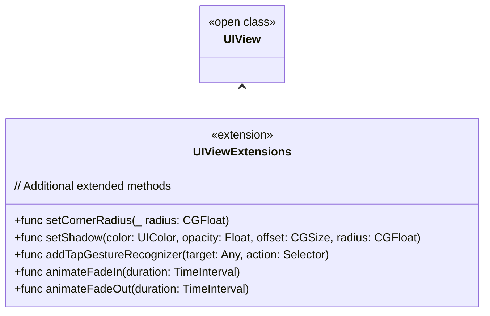

### **b. Extensions Functionalities Flowchart**
- **Purpose**: Detail specific extended methods and their purposes.
- **Diagram Type**: `flowchart LR`
- **Contents**:
  - **Frame Manipulations**
  - **Shadow and Border Customizations**
  - **Gesture Recognizers**
  - **Animations Enhancements**

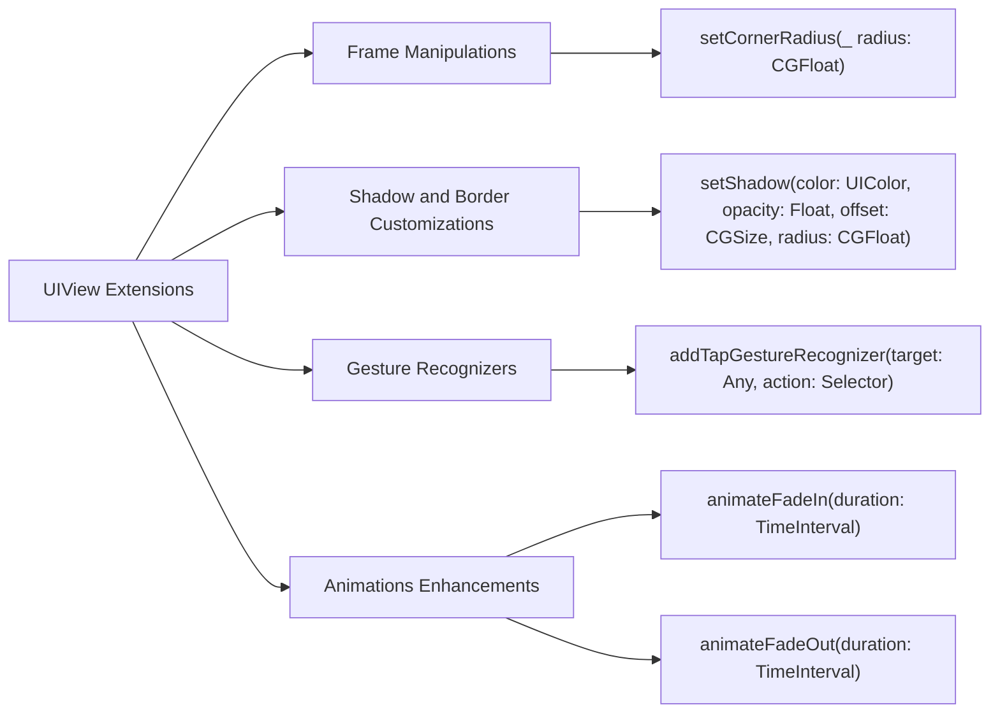

---

## **9. Lifecycle and Use Cases**

### **a. Lifecycle Flowchart**
- **Purpose**: Demonstrate the typical lifecycle of a `UIView` within an application.
- **Diagram Type**: `flowchart TD`
- **Contents**:
  - **Initialization**
  - **Adding to View Hierarchy**
  - **Layout Cycle**
  - **Rendering**
  - **Interaction**
  - **Removal from Hierarchy**

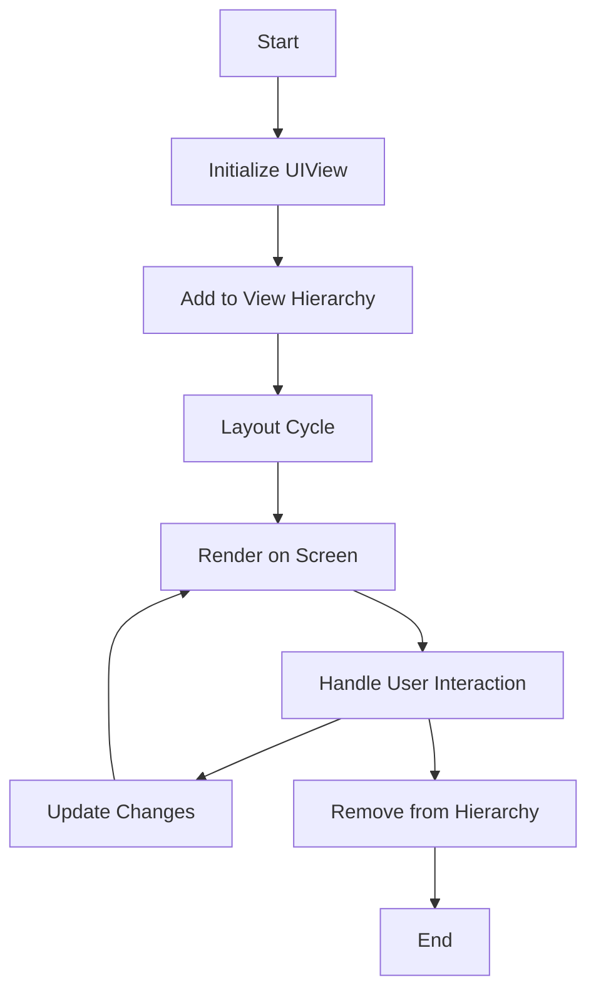

### **b. Common Use Cases Diagram**
- **Purpose**: Outline the typical scenarios where `UIView` is utilized.
- **Diagram Type**: `flowchart TD`
- **Contents**:
  - **Displaying Content**
  - **Handling User Interaction**
  - **Animating Transitions**
  - **Custom Drawing**
  - **Managing Layouts**
  - **Embedding Subviews**

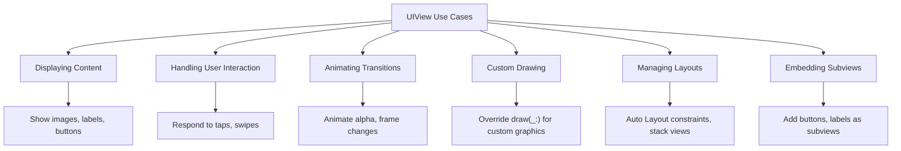

---

## **10. Feature Availability Timeline**

### **a. Feature Availability Gantt Chart**
- **Purpose**: Show when various `UIView` features were introduced across iOS versions.
- **Diagram Type**: `gantt`
- **Contents**:
  - **iOS Versions**: 2.0, 3.0, 4.0, 5.0, 6.0, 7.0, 8.0, 9.0, 10.0, 11.0, 12.0, 13.0, 14.0, 15.0, 16.0, 17.0
  - **Features Introduced**: Auto Layout, Gesture Recognizers, UIAppearance, LayoutMargins, Safe Area Layout Guides, Drag and Drop, Context Menus, etc.

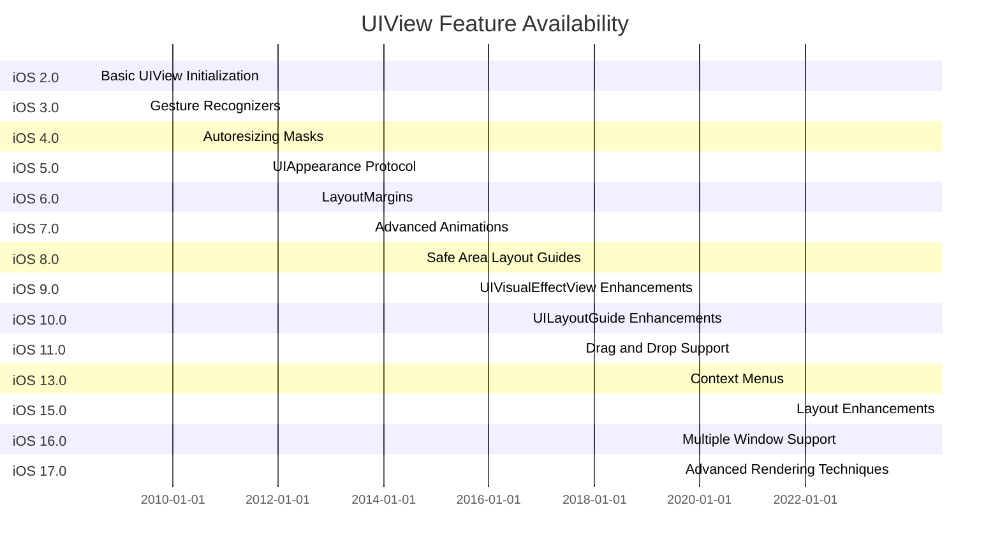

---

## **11. Data Handling and Formats**

### **a. View State Management Diagram**
- **Purpose**: Explain how `UIView` handles different states and data representations.
- **Diagram Type**: `graph LR`
- **Contents**:
  - **State Preservation**: `encodeRestorableState(with:)`, `decodeRestorableState(with:)`
  - **Snapshotting**: `snapshotView(afterScreenUpdates:)`, `resizableSnapshotView(from:afterScreenUpdates:withCapInsets:)`
  - **Accessibility Data**: `accessibilityLabel`, `accessibilityHint`, `accessibilityValue`

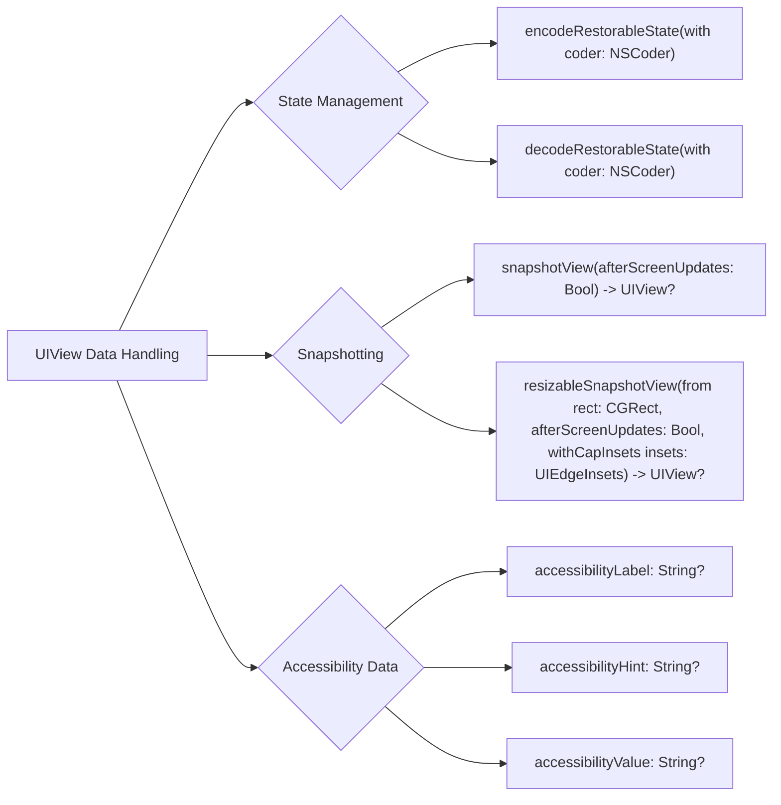

---

## **12. Integration with Drawing Contexts**

### **a. Drawing Methods Usage Diagram**
- **Purpose**: Show how `UIView` methods are used within drawing contexts.
- **Diagram Type**: `flowchart TD`
- **Contents**:
  - **Custom Drawing**: `draw(_:)`
  - **Snapshotting**: `snapshotView(afterScreenUpdates:)`
  - **Rendering Layers**: `layer.render(in:)`

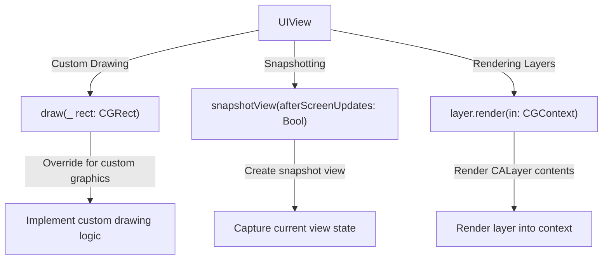

---

## **13. Summary and Best Practices**

### **a. Summary Diagram**
- **Purpose**: Provide a high-level overview of `UIView`'s key characteristics and functionalities.
- **Diagram Type**: `graph LR`
- **Contents**:
  - **Versatile Initialization**
  - **Robust Layout System**
  - **Advanced Rendering Options**
  - **Gesture and Interaction Handling**
  - **Performance Optimizations**
  - **Accessibility Support**
  - **Seamless Integration**

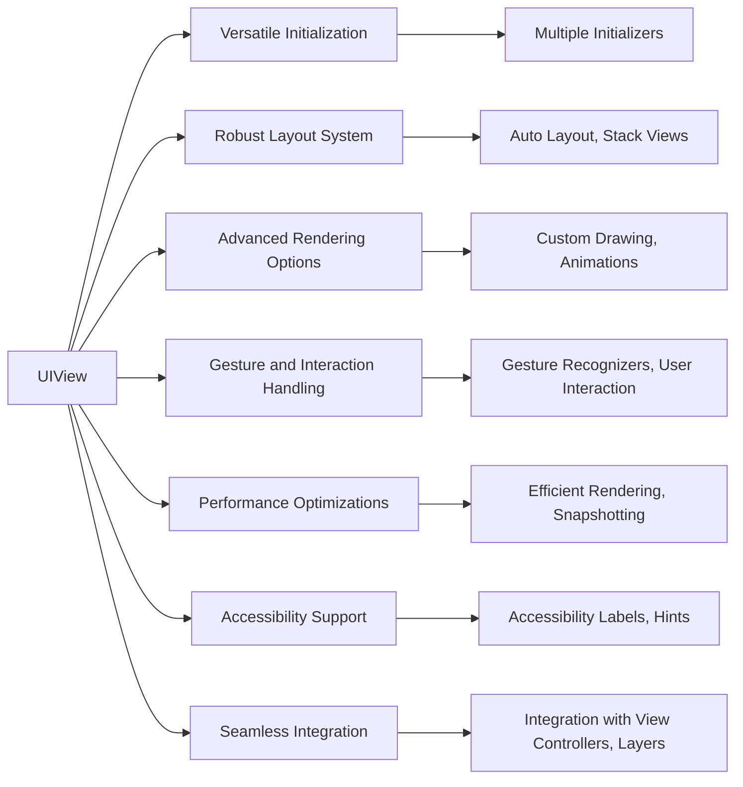

---
**Licenses:**

- **MIT License:**   - Full text in [LICENSE](LICENSE) file.
- **Creative Commons Attribution 4.0 International:**  - Legal details in [LICENSE-CC-BY](LICENSE-CC-BY) and at [Creative Commons official site](http://creativecommons.org/licenses/by/4.0/).

---