# Vision

Below is a comprehensive and organized set of Mermaid diagrams for the `Vision` class. These diagrams cover various aspects of the `Vision` class, including its structure, initializers, properties, methods, enumerations, protocol conformances, relationships with other classes, extensions, lifecycle, feature availability, data handling, integration with drawing contexts, and summary with best practices.

---

## **1. Class Structure and Hierarchy**

### **a. Core Class Diagram**
- **Purpose**: Illustrate the primary structure of `Vision`, including its properties, methods, and enumerations.
- **Diagram Type**: `classDiagram`
- **Contents**:
  - **Properties**: Key attributes like `inputImage`, `visionModel`, `results`.
  - **Methods**: Essential functions like initializers, `analyze()`, `displayResults()`.
  - **Enumerations**: Nested enums such as `VisionError`, `AnalysisMode`.

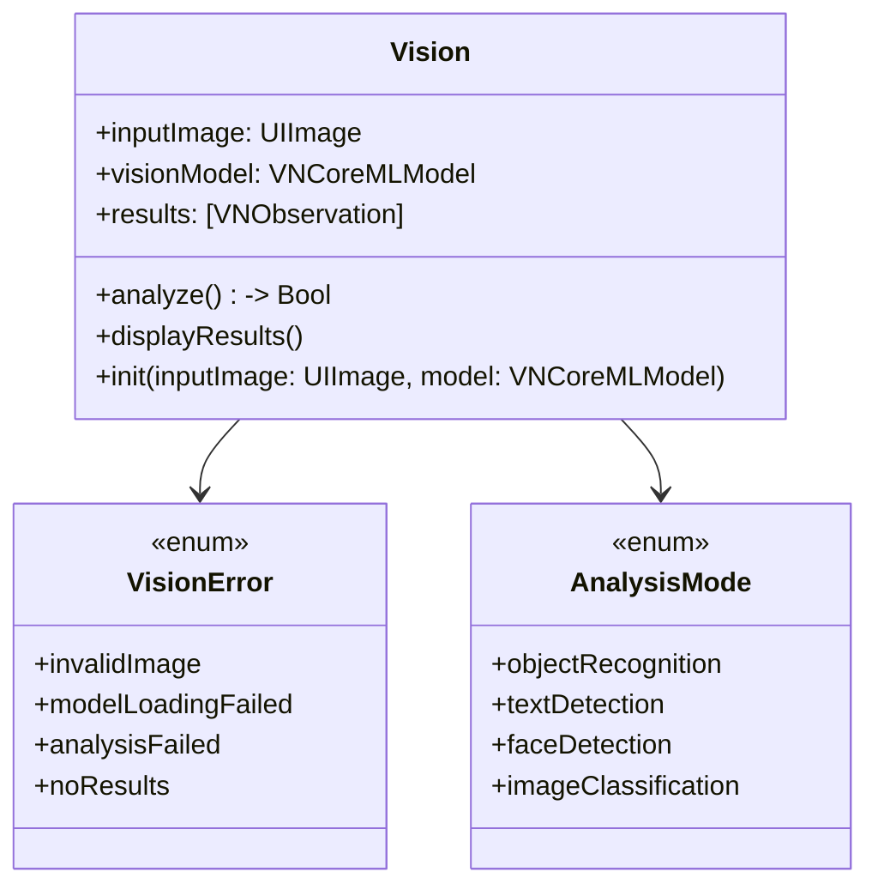

---

## **2. Initializers Overview**

### **a. Initialization Methods Diagram**
- **Purpose**: Break down the various ways to instantiate `Vision`.
- **Diagram Type**: `flowchart LR`
- **Contents**:
  - **Designated Initializers**: `init(inputImage:model:)`
  - **Convenience Initializers**: `init(imageName:modelName:)`
  - **Factory Methods**: `createVision(withImage:model:)`
  - **Default Initializers**: `init()`

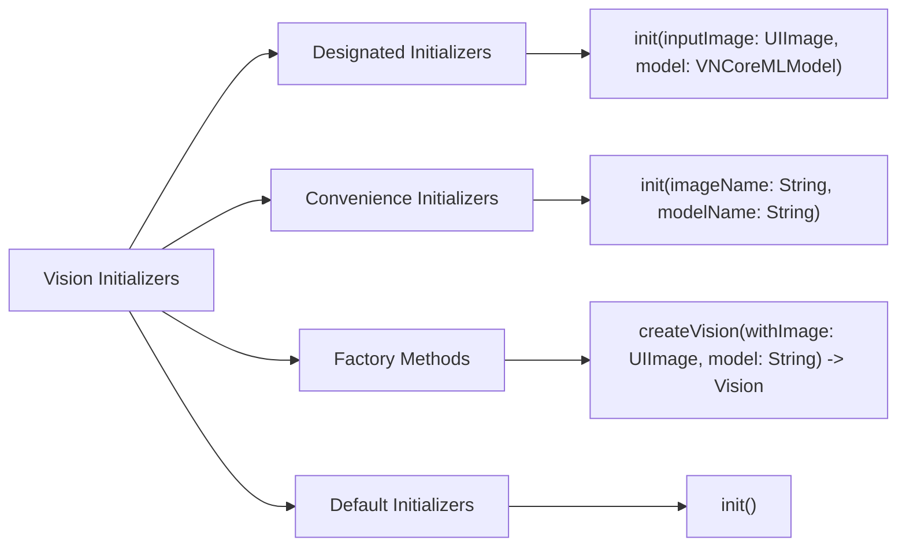

---

## **3. Properties Breakdown**

### **a. Key Properties Diagram**
- **Purpose**: Detail the main properties of `Vision`.
- **Diagram Type**: `classDiagram`
- **Contents**:
  - **Input Data**: `inputImage`, `visionModel`
  - **Results Data**: `results`, `analysisMode`
  - **Configuration**: `confidenceThreshold`, `enableLogging`

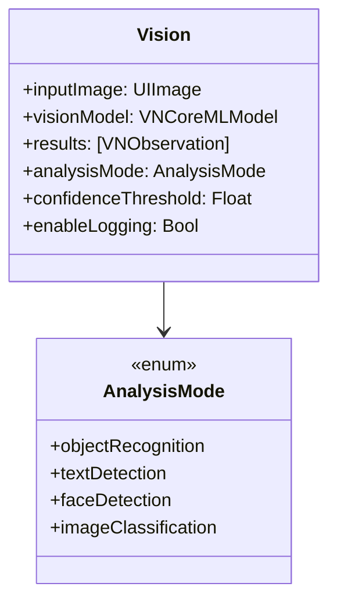

---

## **4. Methods Grouped by Functionality**

### **a. Image Analysis Methods**
- **Purpose**: Categorize methods based on their roles in image analysis.
- **Diagram Type**: `flowchart TD`
- **Contents**:
  - **Analysis Methods**: `analyze()`, `restartAnalysis()`
  - **Result Handling**: `displayResults()`, `exportResults()`
  - **Configuration Methods**: `setConfidenceThreshold(_:)`, `enableLogging(_:)`
  - **Utility Methods**: `reset()`, `isAnalyzing()`

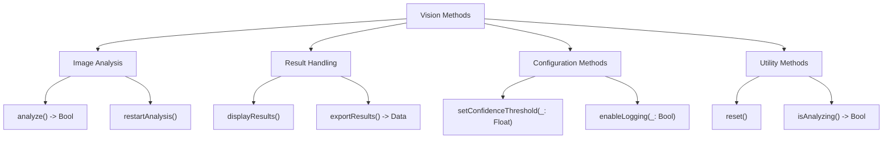

---

## **5. Enumerations and Configurations**

### **a. Enumerations Diagram**
- **Purpose**: Highlight the enums used within `Vision` and their possible values.
- **Diagram Type**: `classDiagram`
- **Contents**:
  - **VisionError**
  - **AnalysisMode**

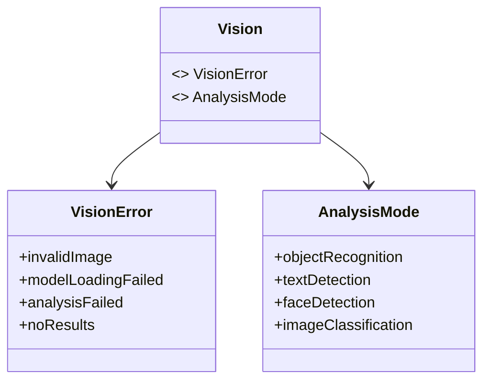

### **b. Configuration Classes Diagram**
- **Purpose**: Show the relationship between `Vision` and its configuration classes.
- **Diagram Type**: `classDiagram`
- **Contents**:
  - **VisionConfiguration**

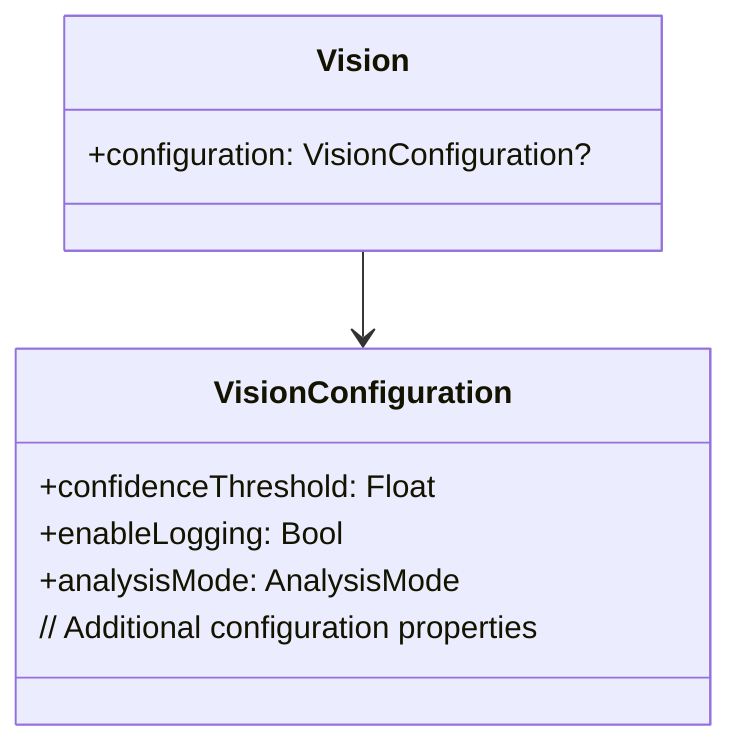

---

## **6. Protocol Conformances**

### **a. Protocols Diagram**
- **Purpose**: Display the protocols that `Vision` conforms to and their impact.
- **Diagram Type**: `classDiagram`
- **Contents**:
  - **VNRequestDelegate**
  - **Codable**
  - **Equatable**
  - **CustomStringConvertible**

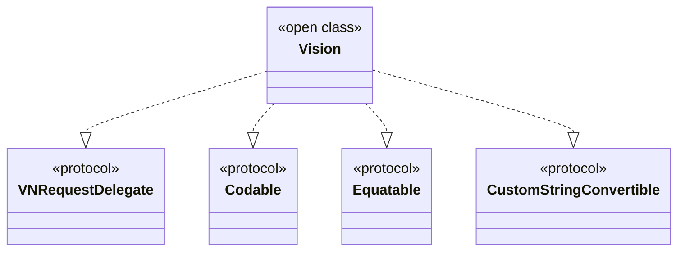

---

## **7. Relationships with Other Classes**

### **a. Related Classes Diagram**
- **Purpose**: Illustrate how `Vision` interacts with other classes and frameworks.
- **Diagram Type**: `flowchart TD`
- **Contents**:
  - **VNCoreMLModel**: Core ML integration.
  - **VNRequest**: Vision requests.
  - **VNObservation**: Analysis results.
  - **UIImageView**: Displaying images.
  - **CoreML**: Machine learning support.
  - **Foundation**: Data handling.

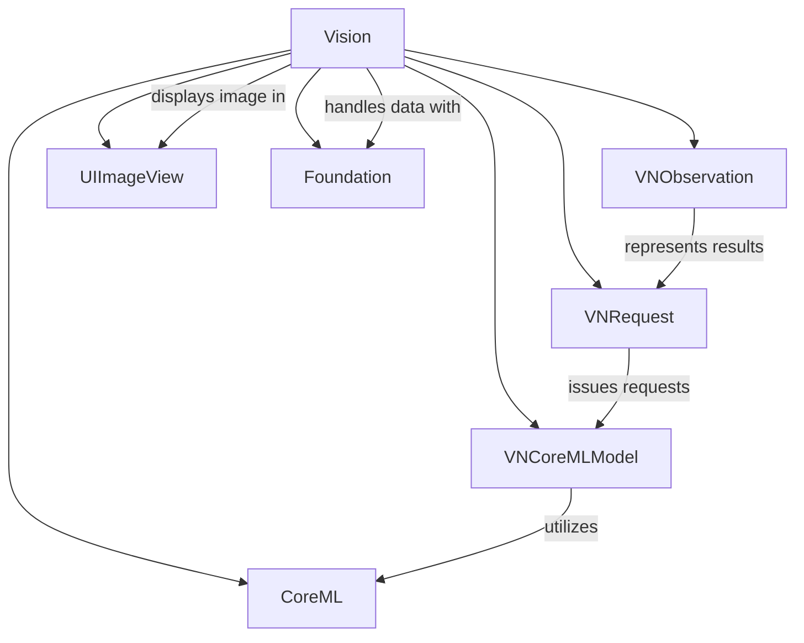

---

## **8. Extensions and Additional Functionalities**

### **a. Vision Extensions Diagram**
- **Purpose**: Showcase the additional functionalities provided through extensions.
- **Diagram Type**: `classDiagram`
- **Contents**:
  - **UIImage Extension**
  - **Data Extension**
  - **String Extension**

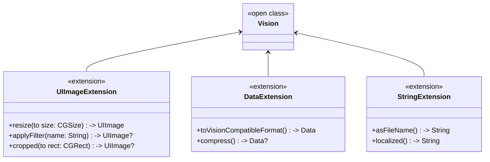

### **b. Extensions Functionalities Flowchart**
- **Purpose**: Detail specific extended methods and their purposes.
- **Diagram Type**: `flowchart LR`
- **Contents**:
  - **Image Processing**
  - **Data Conversion**
  - **String Utilities**

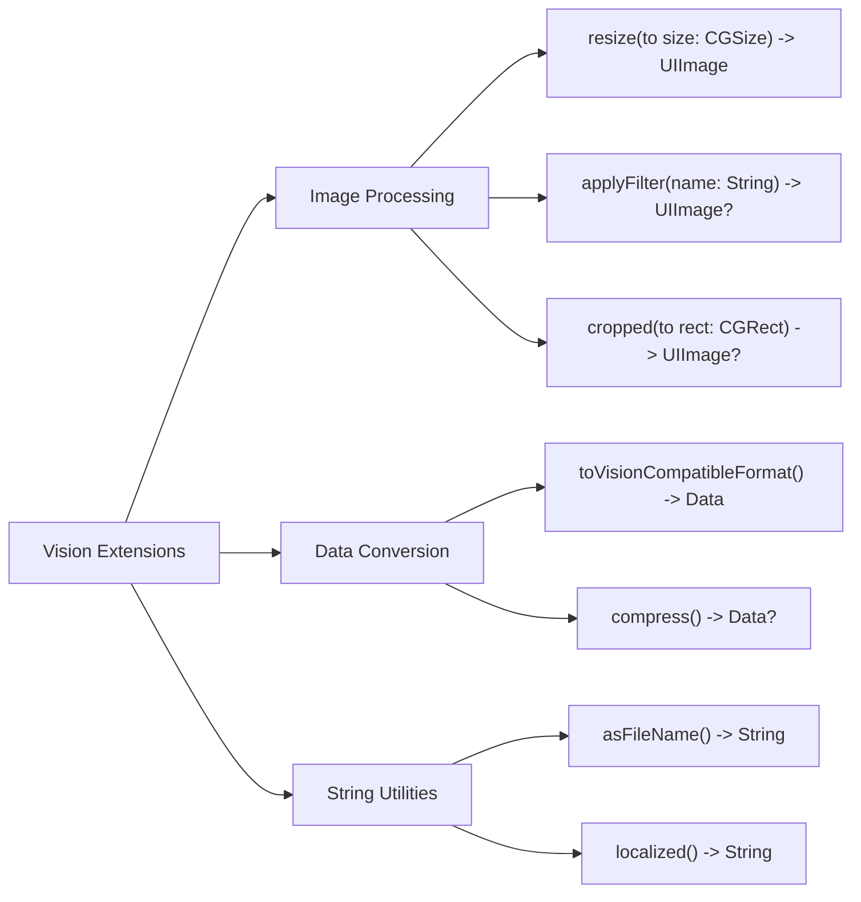

---

## **9. Lifecycle and Use Cases**

### **a. Lifecycle Flowchart**
- **Purpose**: Demonstrate the typical lifecycle of a `Vision` instance within an application.
- **Diagram Type**: `flowchart TD`
- **Contents**:
  - **Initialization**
  - **Configuration**
  - **Analysis**
  - **Result Handling**
  - **Termination**

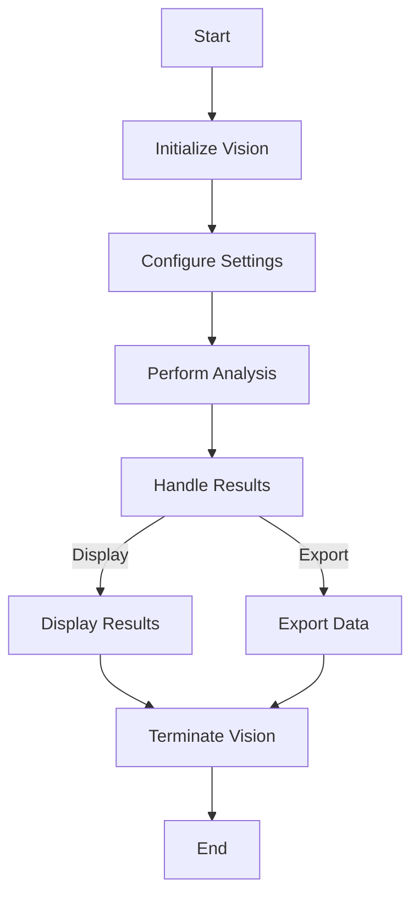

### **b. Common Use Cases Diagram**
- **Purpose**: Outline the typical scenarios where `Vision` is utilized.
- **Diagram Type**: `flowchart TD`
- **Contents**:
  - **Object Recognition**
  - **Text Detection**
  - **Face Detection**
  - **Image Classification**
  - **Real-time Analysis**
  - **Batch Processing**

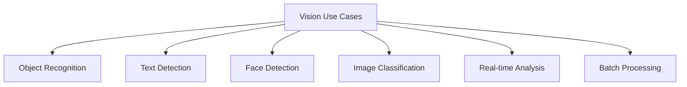

---

## **10. Feature Availability Timeline**

### **a. Feature Availability Gantt Chart**
- **Purpose**: Show when various `Vision` features were introduced across iOS versions.
- **Diagram Type**: `gantt`
- **Contents**:
  - **iOS Versions**: 11.0, 12.0, 13.0, 14.0, 15.0, 16.0, 17.0
  - **Features Introduced**: Core ML integration, Real-time analysis, Enhanced face detection, Improved text recognition, Performance optimizations, Support for new models, Advanced image classification.

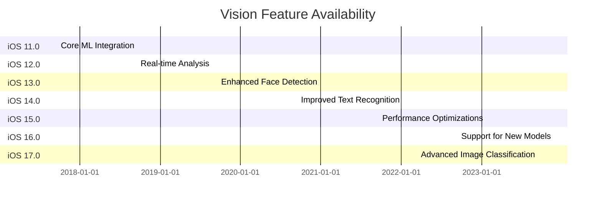

---

## **11. Data Handling and Formats**

### **a. Image Format Handling Diagram**
- **Purpose**: Explain how `Vision` handles different image data formats.
- **Diagram Type**: `graph LR`
- **Contents**:
  - **JPEG**: Processing via `VNImageRequestHandler`
  - **PNG**: Processing via `VNImageRequestHandler`
  - **HEIC**: Processing via `VNImageRequestHandler`
  - **RAW**: Processing via `VNImageRequestHandler`

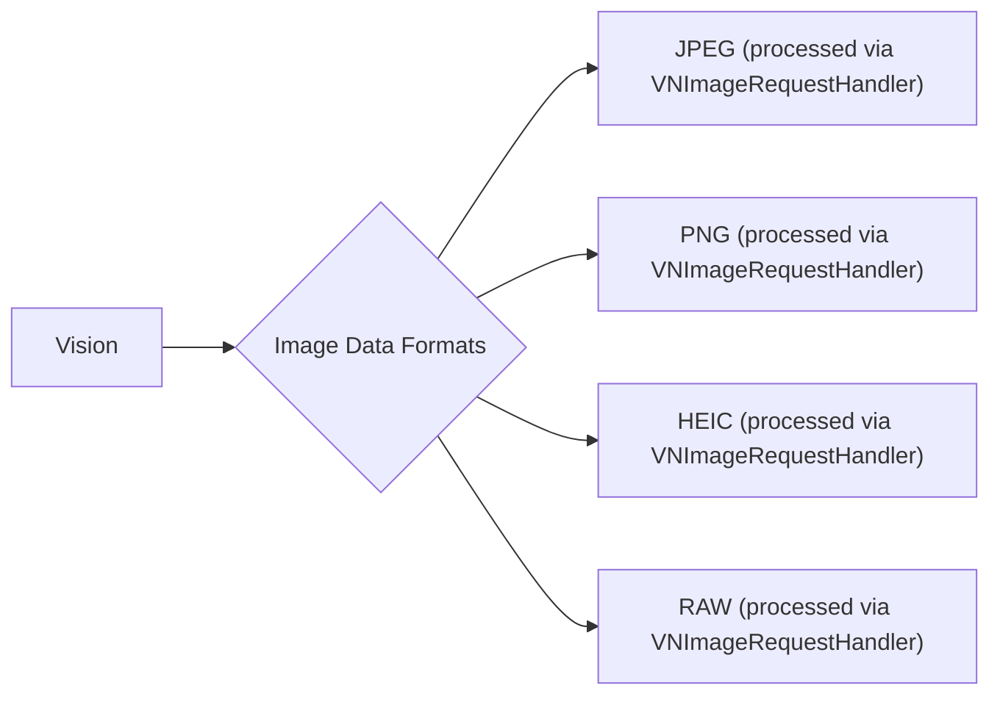

---

## **12. Integration with Drawing Contexts**

### **a. Drawing Methods Usage Diagram**
- **Purpose**: Show how `Vision` methods are used within drawing contexts.
- **Diagram Type**: `flowchart TD`
- **Contents**:
  - **Overlay Results**
  - **Highlight Detected Objects**
  - **Draw Bounding Boxes**
  - **Annotate Text**

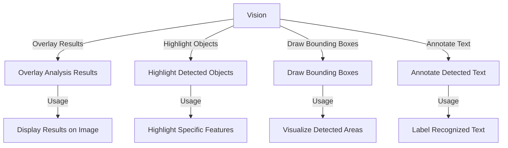

---

## **13. Summary and Best Practices**

### **a. Summary Diagram**
- **Purpose**: Provide a high-level overview of `Vision`'s key characteristics and functionalities.
- **Diagram Type**: `graph LR`
- **Contents**:
  - **Core Functionality**
  - **Advanced Features**
  - **Performance**
  - **Integration**
  - **Best Practices**

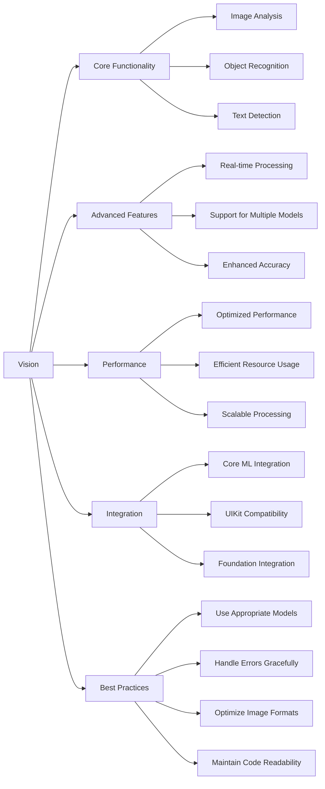

---

## **Best Practices for Using the `Vision` Class**

1. **Choose the Right Analysis Mode**: Select the appropriate `AnalysisMode` based on your application's needs (e.g., object recognition, text detection).

2. **Optimize Performance**:
   - Utilize asynchronous processing to prevent blocking the main thread.
   - Adjust the `confidenceThreshold` to balance between accuracy and performance.

3. **Handle Errors Gracefully**: Implement robust error handling using the `VisionError` enumeration to manage different failure scenarios.

4. **Leverage Extensions**: Use provided extensions for common tasks like image resizing and filtering to streamline your workflow.

5. **Integrate Seamlessly with UIKit**: Display results using `UIImageView` and other UIKit components for a cohesive user experience.

6. **Maintain Clean Code Architecture**:
   - Follow SOLID principles to ensure maintainability.
   - Use dependency injection for easier testing and scalability.

7. **Stay Updated with iOS Versions**: Monitor the `Feature Availability Timeline` to take advantage of new features and optimizations introduced in the latest iOS releases.

8. **Secure Data Handling**: Ensure that image data is handled securely, especially when dealing with sensitive information or user-generated content.

By adhering to these best practices, you can effectively utilize the `Vision` class to build powerful and efficient image analysis features within your iOS applications.

---
