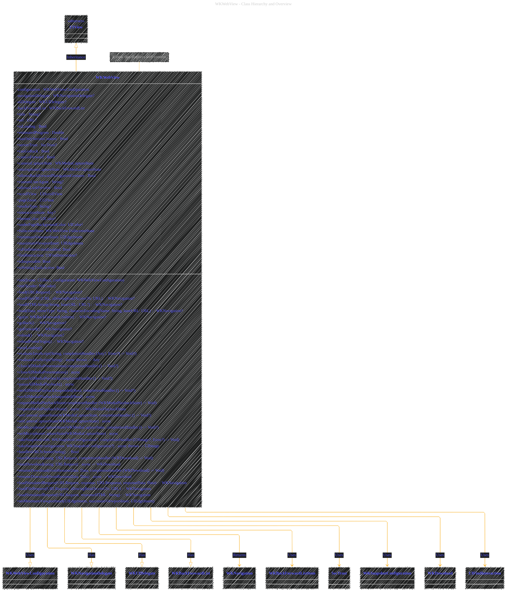
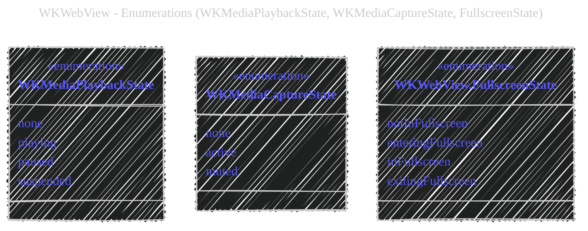
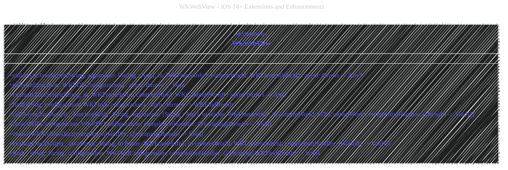
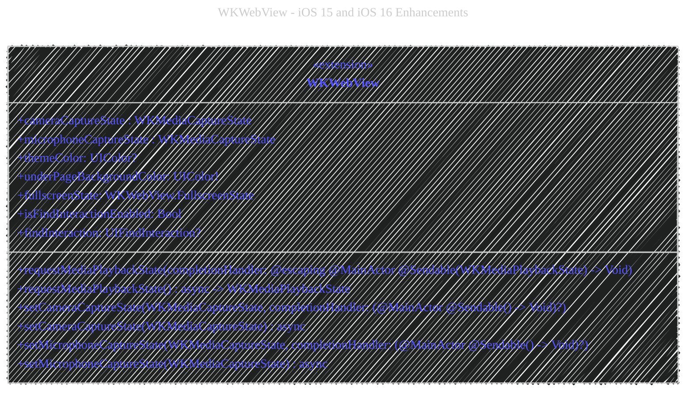
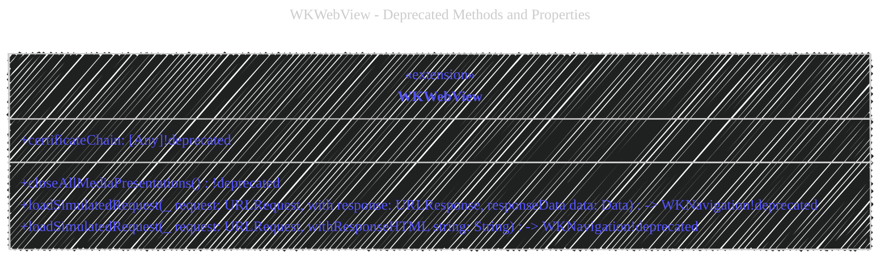

# WKWebView: A Deep Dive with Diagrams
> **Disclaimer:**
>
> This document contains my personal notes on the topic,
> compiled from publicly available documentation and various cited sources.
> The materials are intended for educational purposes, personal study, and reference.
> The content is dual-licensed:
> 1. **MIT License:** Applies to all code implementations (Swift, Mermaid, and other programming languages).
> 2. **Creative Commons Attribution 4.0 International License (CC BY 4.0):** Applies to all non-code content, including text, explanations, diagrams, and illustrations.
---


This document provides a detailed analysis of the `WKWebView` class in Swift, complete with visual aids to illustrate its structure, relationships, and functionality. `WKWebView` is a fundamental component of iOS development, providing the ability to embed web content within native applications. It's available from iOS 8.0 and later, and it's crucial for any app that interacts with web resources.

## 1. Class Hierarchy and Overview




**Explanation:**

*   **Inheritance:** `WKWebView` inherits from `UIView`, making it a fundamental building block of the user interface. This means it can be placed within a view hierarchy, resized, and positioned like any other view.
*   **Key Properties:** The diagram highlights essential properties:
    *   `configuration`:  A `WKWebViewConfiguration` object that determines how the web view behaves (e.g., handling cookies, setting user scripts).  This is a *copy* of the configuration used during initialization.
    *   `navigationDelegate`:  A delegate (conforming to `WKNavigationDelegate`) that receives callbacks for navigation events (page load start, finish, errors, etc.).  This is a `weak` reference to prevent retain cycles.
    *   `uiDelegate`:  A delegate (conforming to `WKUIDelegate`) that handles user interface-related events (JavaScript alerts, prompts, etc.). Also a `weak` reference.
    *   `backForwardList`:  A `WKBackForwardList` object that manages the history of visited pages, allowing back and forward navigation.
*   **Key Methods:**  The diagram lists several crucial methods for loading and managing web content:
    *   `load(_:)`:  Loads content from a `URLRequest`.
    *   `loadFileURL(_:allowingReadAccessTo:)`: Loads a local file.
    *   `loadHTMLString(_:baseURL:)`: Loads content from an HTML string.
    *   `go(to:)`: Navigates to a specific item in the back-forward list.
    *   `goBack()`, `goForward()`:  Navigate backward and forward.
    *   `reload()`, `reloadFromOrigin()`:  Reload the current page.
    *   `evaluateJavaScript(_:completionHandler:)`:  Executes JavaScript code within the web view's context. There's also an `async/await` version.
    *    `takeSnapshot(...)`: Captures a snapshot of the rendered web content.
*   **KVO Compliance:**  Many properties (e.g., `title`, `url`, `isLoading`, `estimatedProgress`) are Key-Value Observing (KVO) compliant.  This allows you to observe changes to these properties and update your UI accordingly.

## 2. Loading Content: A Sequence Diagram


**Explanation:**

This sequence diagram illustrates the typical flow when loading a web page:

1.  **Initiation:** The application (App) calls `load(request:)` on the `WKWebView`, providing a `URLRequest`.
2.  **Request:** The `WKWebView` initiates a network request to the `WebServer`.
3.  **Response:** The `WebServer` responds with the web page's content (HTML, CSS, JavaScript).
4.  **Rendering:** The `WKWebView` renders the received content.
5.  **Delegate Callbacks:**
    *   `navigationDelegate?.webView(_:didStartProvisionalNavigation:)`:  The navigation delegate is notified that loading has started.
    *   **Loading Loop:** During loading, KVO notifications are sent for `estimatedProgress`, allowing the app to display a progress bar.
    *   `navigationDelegate?.webView(_:didFinish:)`: The navigation delegate is notified when loading is complete.

---

## 3.  `WKWebViewConfiguration`: A Mind Map

```mermaid
---
title: "WKWebView - A Mind Map of WKWebViewConfiguration"
author: "Cong Le"
version: "1.0"
license(s): "MIT, CC BY 4.0"
copyright: "Copyright (c) 2025 Cong Le. All Rights Reserved."
config:
  layout: elk
  look: handDrawn
  theme: dark
---
%%%%%%%% Mermaid version v11.4.1-b.14
%%%%%%%% Toggle theme value to `base` to activate the initilization below for the customized theme version.
%%%%%%%% Available curve styles include the following keywords:
%% basis, bumpX, bumpY, cardinal, catmullRom, linear, monotoneX, monotoneY, natural, step, stepAfter, stepBefore.
%%{
  init: {
    "mindmap": { "htmlLabels": false, 'curve': 'linear' },
    'fontFamily': 'Fantasy',
    'themeVariables': {
      'primaryColor': '#ffff',
      'primaryTextColor': '#55ff',
      'primaryBorderColor': '#7c2',
      'lineColor': '#F8B229',
      'secondaryColor': '#006100',
      'tertiaryColor': '#fff'
    }
  }
}%%
mindmap
    root((WKWebViewConfiguration))
        Website_Data_Store
            WKWebsiteDataStore
                nonPersistent["nonPersistent()"]
                default["default()"]
        Process_Pool
            WKProcessPool
                shared
        User_Content_Controller
            WKUserContentController
                addUserScript["addUserScript()"]
                removeAllUserScripts["removeAllUserScripts()"]
        Preferences
            WKPreferences
                javaScriptEnabled
                javaScriptCanOpenWindowsAutomatically
        Media_Types
            mediaTypesRequiringUserActionForPlayback
        Allows_Inline_Media_Playback
            allowsInlineMediaPlayback
        Suppresses_Incremental_Rendering
            suppressesIncrementalRendering
        Selection_Granularity
            selectionGranularity
        Data_Detector_Types
             dataDetectorTypes
        Application_Name_For_User_Agent
            applicationNameForUserAgent
            
```


**Explanation:**

This mind map shows the key components and settings within a `WKWebViewConfiguration` object:

*   **`WKWebsiteDataStore`**:  Manages website data (cookies, caches, etc.).  You can use a persistent or non-persistent data store.
*   **`WKProcessPool`**:  Allows sharing web content processes between multiple `WKWebView` instances, improving efficiency.
*   **`WKUserContentController`**:  Enables injecting JavaScript code (user scripts) into web pages.
*   **`WKPreferences`**:  Controls preferences like whether JavaScript is enabled.
*   **Other Settings**:  Options for media playback, rendering, selection behavior, and more.  These settings allow fine-grained control over the web view's behavior.

---

## 4. Navigation Delegate: A State Diagram


**Explanation:**

This state diagram represents the states a `WKWebView` can be in from the perspective of navigation, as managed by the `WKNavigationDelegate`:

*   **`WaitingForRequest`**:  The initial state, waiting for a loading request.
*   **`Loading`**:  The web view is actively loading content.
*   **`Completed`**:  Navigation has successfully finished.
*   **`Failed`**:  An error occurred during navigation.
*   **Transitions:** The arrows show how events (method calls or errors) trigger state transitions.

----

## 5. Asynchronous Operations (async/await)

Several methods in `WKWebView` have both completion handler and `async/await` versions.  This is a key feature of modern Swift concurrency.

**Example (evaluateJavaScript):**

```swift
// Completion Handler Version
webView.evaluateJavaScript("2 + 2") { (result, error) in
    if let error = error {
        print("JavaScript Error: \(error)")
    } else if let result = result as? Int {
        print("Result: \(result)") // Output: Result: 4
    }
}

// Async/Await Version
Task {
    do {
        let result = try await webView.evaluateJavaScript("2 + 2")
        if let intResult = result as? Int {
            print("Result: \(intResult)") // Output: Result: 4
        }
    } catch {
        print("JavaScript Error: \(error)")
    }
}
```

**Explanation:**

*   **Completion Handler:** The traditional approach uses a closure (`completionHandler`) that's called when the operation finishes (either successfully or with an error).  This can lead to nested closures and "callback hell."
*   **Async/Await:**  The `async/await` version provides a cleaner, more linear way to handle asynchronous operations.  You use `try await` to call the asynchronous method, and the code execution suspends until the result is available.  Error handling is done using `do-catch` blocks.  This makes asynchronous code much easier to read and reason about.

---

## 6.  Enumerations (WKMediaPlaybackState, WKMediaCaptureState, FullscreenState)




**Explanation:**
These are enumerations that define the possible states of the Webview.
*   **`WKMediaPlaybackState`**:  Indicates the current state of media playback (none, playing, paused, suspended).
*   **`WKMediaCaptureState`**:  Reflects the state of camera/microphone capture (none, active, muted).
*  **`WKWebView.FullscreenState`**: Shows the current state of fullscreen.

---

## 7. Key-Value Observing (KVO)

Many `WKWebView` properties are KVO-compliant. This means you can observe changes to these properties and react accordingly.

**Example (Observing `estimatedProgress`):**

```swift
class MyViewController: UIViewController {
    var webView: WKWebView!
    var progressObserver: NSKeyValueObservation?

    override func viewDidLoad() {
        super.viewDidLoad()

        let configuration = WKWebViewConfiguration()
        webView = WKWebView(frame: view.bounds, configuration: configuration)
        view.addSubview(webView)

        // Observe the estimatedProgress property
        progressObserver = webView.observe(\.estimatedProgress, options: [.new]) { [weak self] (webView, change) in
            if let newValue = change.newValue {
                print("Loading progress: \(newValue)")
                // Update a progress bar, for example
                self?.updateProgressBar(progress: Float(newValue))
            }
        }

        // Load a URL
        if let url = URL(string: "https://www.apple.com") {
            let request = URLRequest(url: url)
            webView.load(request)
        }
    }

    func updateProgressBar(progress: Float) {
        // ... implementation to update a UIProgressView ...
    }

    deinit {
        progressObserver?.invalidate() // Important: Invalidate the observer
    }
}
```

**Explanation:**

1.  **`observe(_:options:changeHandler:)`**:  This method is used to start observing a KVO-compliant property.
    *   `\.estimatedProgress`:  A key path referring to the `estimatedProgress` property of `WKWebView`.
    *   `options: [.new]`:  Specifies that we want to receive the new value of the property in the change handler.
    *   `changeHandler`:  A closure that's executed whenever the observed property changes.
2.  **`change.newValue`**:  Inside the `changeHandler`, we access the new value of the property.
3.  **`invalidate()`**:  It's *crucial* to invalidate the observer in `deinit` to prevent retain cycles and crashes.  If you don't invalidate the observer, it will continue to observe the property even after the `MyViewController` instance is deallocated.

---

## 8. iOS 14+ Extensions and Enhancements

The code includes extensions for iOS 14 and later, adding new functionalities:




**Explanation:**

* **`callAsyncJavaScript(...)`**: Provides a way to call JavaScript functions asynchronously, supporting both completion handlers and the `async/await` syntax.  This is a significant improvement for managing asynchronous interactions with JavaScript code.
* **`createPDF(...)` and `pdf(...)`**: Allows generating PDF data from the web view's content, again with both completion handler and `async/await` options.
* **`createWebArchiveData(...)`**:  Creates a web archive of the current page.
* **`evaluateJavaScript(...)` (extended)**: An extended version that allows specifying a frame and content world for more precise JavaScript execution.
* **`find(...)`**:  Provides built-in find functionality within the web view.

----

## 9. iOS 15 and iOS 16 Enhancements

iOS 15 and iOS 16 introduced further refinements and features for media handling and fullscreen management:



**Explanation:**

*   **Media Playback Control:** Methods like `requestMediaPlaybackState`, `setCameraCaptureState`, and `setMicrophoneCaptureState` give developers fine-grained control over media playback and capture within the web view.
*   **Theming:**  `themeColor` and `underPageBackgroundColor` allow customization of the web view's appearance.
*  **Fullscreen**: `fullscreenState`, isFindInteractionEnabled, findInteraction provide improved control.

----

## 10. Deprecated Methods and Properties



*   **`closeAllMediaPresentations()`:**  The parameterless version is deprecated in iOS 15.0.  The version with a `completionHandler` should be used instead.
*   **`loadSimulatedRequest(...)`:**  Two overloaded versions with `with response:` and `withResponseHTML:` are deprecated in iOS 15.0.  The versions without `with` should be used.
*   **`certificateChain`:** Deprecated in iOS 10.0; use `serverTrust` instead for more robust trust evaluation.

---

## 11. Simulated Requests

`WKWebView` provides methods for "simulated" requests:

*   `loadSimulatedRequest(_:response:responseData:)`:  Loads content *as if* it came from a network request, but without actually making the request. This is useful for testing or displaying locally generated content.  You provide a `URLRequest`, a `URLResponse`, and the `Data`.
*   `loadFileRequest(_:allowingReadAccessTo:)`: Similar to `loadFileURL`, but uses a `URLRequest` instead of just a `URL`.
*    `loadSimulatedRequest(_:responseHTML:)`: Loads HTML content using URLRequest.

---

## Conclusion

`WKWebView` is a powerful and versatile class, offering a wide range of features for integrating web content into iOS applications.  Understanding its core concepts, delegate methods, configuration options, and asynchronous capabilities is essential for building robust and feature-rich apps that interact with the web. The diagrams and explanations provided here offer a comprehensive overview of `WKWebView` and its capabilities, covering its structure, behavior, and best practices for its use. The use of KVO, `async/await`, and the delegate patterns are key to leveraging the full potential of `WKWebView`.  Always remember to handle potential errors and retain cycles (especially with delegates and KVO observers) to ensure the stability and performance of your application.


---
**Licenses:**

- **MIT License:**  [](LICENSE) - Full text in [LICENSE](LICENSE) file.
- **Creative Commons Attribution 4.0 International:** [](LICENSE-CC-BY) - Legal details in [LICENSE-CC-BY](LICENSE-CC-BY) and at [Creative Commons official site](http://creativecommons.org/licenses/by/4.0/).

---