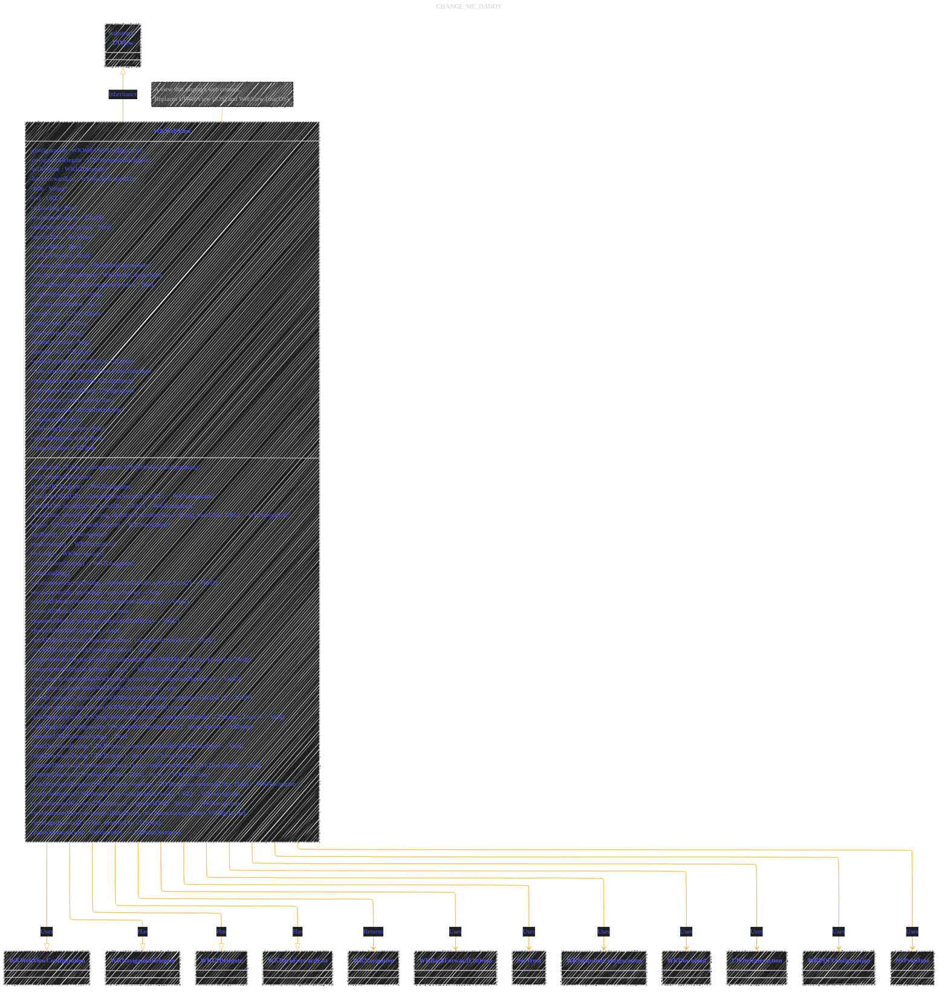
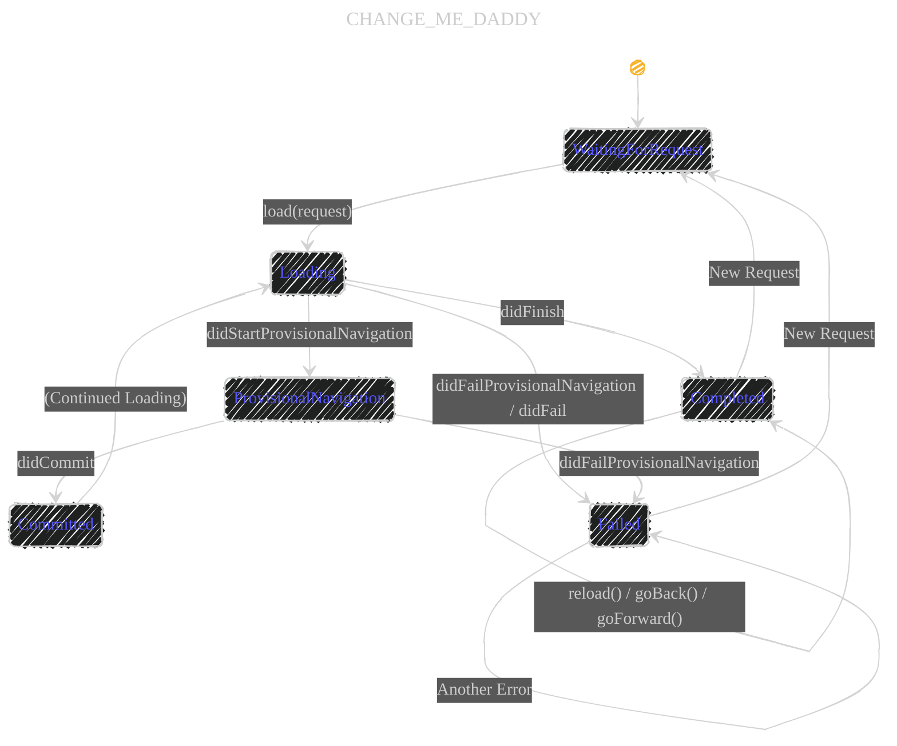

# WKWebView: A Comprehensive Guide with Diagrams (Updated)

> **Disclaimer:**
>
> This document contains my personal notes on the topic,
> compiled from publicly available documentation and various cited sources.
> The materials are intended for educational purposes, personal study, and reference.
> The content is dual-licensed:
> 1. **MIT License:** Applies to all code implementations (Swift, Mermaid, and other programming languages).
> 2. **Creative Commons Attribution 4.0 International License (CC BY 4.0):** Applies to all non-code content, including text, explanations, diagrams, and illustrations.
---


This document provides a detailed analysis of the `WKWebView` class in Swift, incorporating information from both the WebKit.WKWebview abstract code and the Apple Developer Documentation. Visual aids are used to illustrate its structure, relationships, and functionality.  `WKWebView` is a crucial component for embedding web content within native iOS (and macOS, iPadOS, visionOS, Mac Catalyst) applications. It's available from iOS 8.0 and later.

## 1. Class Hierarchy and Overview (Updated)




**Key Changes and Additions:**

*   **Platform Availability:**  Explicitly mentions iOS, iPadOS, Mac Catalyst, macOS, and visionOS support, along with minimum version requirements.  This is crucial for developers targeting multiple platforms.
*   **`@MainActor`:**  The class is marked with `@MainActor`, indicating that all its methods and properties should be accessed from the main thread. This is vital for thread safety and UI updates.
*   **Replacement for `UIWebView` and `WebView`:**  Clearly states that `WKWebView` is the modern replacement for older web view classes.
*   **Interface Builder Support:** Highlights that `WKWebView` can be configured both programmatically and via Interface Builder, providing flexibility in UI design.
*   **Data Detectors:** Mentions the automatic conversion of phone numbers to links and the ability to customize this behavior.
*  **Magnification** Added `allowsMagnification`, `magnification` and `setMagnification` methods to control scaling.
*  **Print Support** Added `printOperation` to provide print operation object.
*   **Sharing:**  Briefly introduces the use of `UIActivityViewController` for sharing web content, including the "Add to Home Screen" functionality (with the `com.apple.developer.web-browser` entitlement).

---

## 2. Loading Content: A Sequence Diagram (Updated)


**Changes:**

*   **Data Detector Step (Optional):**  Adds an optional step to show the automatic data detection (e.g., phone numbers) that `WKWebView` performs.

---

## 3.  `WKWebViewConfiguration`: A Mind Map (No Changes Needed)

The mind map from the previous response is still accurate and comprehensive.  It covers the essential components of `WKWebViewConfiguration`.

---

## 4. Navigation Delegate: A State Diagram (Updated - More Detail)




**Changes and Explanation:**

*   **`ProvisionalNavigation` and `Committed` States:** Introduces intermediate states to reflect the navigation lifecycle more accurately:
    *   **`ProvisionalNavigation`**:  The web view has started loading, but the navigation hasn't been committed yet (e.g., the server might redirect).  This corresponds to the `didStartProvisionalNavigation` delegate method.
    *   **`Committed`**:  The navigation has been committed, and the web view is definitely loading the requested content.  This corresponds to the `didCommit` delegate method (not shown in the original code but part of `WKNavigationDelegate`).
*   **More Precise Transitions:** The transitions now reflect the delegate method calls more accurately.  This provides a better understanding of the navigation flow.

----

## 5. Asynchronous Operations (async/await) - No Changes Needed

The example and explanation from the previous response are still valid.  The `async/await` pattern is a core part of modern Swift concurrency.

----

## 6.  Enumerations (WKMediaPlaybackState, WKMediaCaptureState, FullscreenState) - No Changes Needed

The class diagram from the previous response is still correct.

---

## 7. Key-Value Observing (KVO) - No Changes Needed

The example and explanation from the previous response are still valid and demonstrate how to use KVO with `WKWebView`.

---

## 8. iOS 14+ Extensions and Enhancements - No Changes Needed

The class diagram and explanation are still accurate.

---

## 9. iOS 15 and iOS 16 Enhancements - No Changes Needed
The class diagram and explanation are still accurate.

---

## 10. Deprecated Methods and Properties - No Changes Needed

The class diagram showing deprecated items is still accurate.

---

## 11. Simulated Requests - No Changes Needed

The explanation of simulated requests is still correct.

---

## 12. Example ViewController (Updated)
```swift
import UIKit
import WebKit

class ViewController: UIViewController, WKUIDelegate, WKNavigationDelegate { // Added WKNavigationDelegate

    var webView: WKWebView!

    override func loadView() {
        let webConfiguration = WKWebViewConfiguration()
        // Example configuration: Disable JavaScript (for demonstration)
        webConfiguration.preferences.javaScriptEnabled = false

        webView = WKWebView(frame: .zero, configuration: webConfiguration)
        webView.uiDelegate = self
        webView.navigationDelegate = self // Set the navigation delegate
        view = webView
    }

    override func viewDidLoad() {
        super.viewDidLoad()

        let myURL = URL(string:"https://www.apple.com")
        let myRequest = URLRequest(url: myURL!)
        webView.load(myRequest)

        // Example: Observe canGoBack and canGoForward
        webView.addObserver(self, forKeyPath: #keyPath(WKWebView.canGoBack), options: .new, context: nil)
        webView.addObserver(self, forKeyPath: #keyPath(WKWebView.canGoForward), options: .new, context: nil)
    }
    // KVO observation method.
    override func observeValue(forKeyPath keyPath: String?, of object: Any?, change: [NSKeyValueChangeKey : Any]?, context: UnsafeMutableRawPointer?) {
          if keyPath == #keyPath(WKWebView.canGoBack) {
              //Update back button enable/disable
              print("Can go back: \(webView.canGoBack)")
          }
          if keyPath == #keyPath(WKWebView.canGoForward) {
            //Update forward button enable/disable
            print("Can go forward: \(webView.canGoForward)")
          }
      }

    // Example WKNavigationDelegate methods
    func webView(_ webView: WKWebView, didStartProvisionalNavigation navigation: WKNavigation!) {
        print("Started provisional navigation")
    }

    func webView(_ webView: WKWebView, didFinish navigation: WKNavigation!) {
        print("Finished navigation")
    }

    func webView(_ webView: WKWebView, didFail navigation: WKNavigation!, withError error: Error) {
        print("Navigation failed: \(error)")
    }
	deinit {
        webView.removeObserver(self, forKeyPath: #keyPath(WKWebView.canGoBack))
        webView.removeObserver(self, forKeyPath: #keyPath(WKWebView.canGoForward))
    }
}
```

**Changes and Explanation:**

*   **`WKNavigationDelegate` Conformance:** The `ViewController` now conforms to `WKNavigationDelegate`.  This is essential for handling navigation events.
*   **Setting `navigationDelegate`:**  The `webView.navigationDelegate = self` line is added in `loadView()`.  This connects the `WKWebView` to the delegate methods.
*   **Example Delegate Methods:**  Implementations of `didStartProvisionalNavigation`, `didFinish`, and `didFail` are provided as examples. These methods print messages to the console, demonstrating how to track navigation events.
*   **KVO for `canGoBack` and `canGoForward`:**  The example now observes these properties to show how to enable/disable back and forward buttons in a UI.  This directly addresses the documentation's suggestion.  *Crucially*, it includes the `deinit` method to remove the observers, preventing retain cycles.
* **Example Configuration** Added example to disable Javascript.
*   **`observeValue(forKeyPath:of:change:context:)`:**  This method is required for KVO observation.  It's called whenever an observed property changes.

---

## 13. Managing Navigation (Conceptual Diagram)

```mermaid
---
title: "CHANGE_ME_DADDY"
author: "Cong Le"
version: "1.0"
license(s): "MIT, CC BY 4.0"
copyright: "Copyright (c) 2025 Cong Le. All Rights Reserved."
config:
  layout: elk
  look: handDrawn
  theme: dark
---
%%%%%%%% Mermaid version v11.4.1-b.14
%%%%%%%% Toggle theme value to `base` to activate the initilization below for the customized theme version.
%%%%%%%% Available curve styles include the following keywords:
%% basis, bumpX, bumpY, cardinal, catmullRom, linear, monotoneX, monotoneY, natural, step, stepAfter, stepBefore.
%%{
  init: {
    "graph": { "htmlLabels": false, 'curve': 'natural' },
    'fontFamily': 'Fantasy',
    'themeVariables': {
      'primaryColor': '#ffff',
      'primaryTextColor': '#55ff',
      'primaryBorderColor': '#7c2',
      'lineColor': '#F8B229',
      'secondaryColor': '#006100',
      'tertiaryColor': '#fff'
    }
  }
}%%
graph LR
    A[User Action] --> B{WKWebView};
    B --> C[Navigation Delegate];
    C --> D{shouldStart?};
    D -- Yes --> E[Load Request];
    D -- No --> F[Handle Custom Action];
    E --> G[Network Request];
    G --> H[Web Server];
    H --> I[Response];
    I --> J[Render Content];
    J --> K[Navigation Delegate];
    K --> L[didStartProvisionalNavigation];
    K --> M[didCommit];
    K --> N[didFinish];
    K --> O[didFail];
    style A fill:#ccf3,stroke:#333,stroke-width:2px
    style B fill:#fcc3,stroke:#333,stroke-width:2px
    style C fill:#cfc3,stroke:#333,stroke-width:2px
    style D fill:#ffc3,stroke:#333,stroke-width:2px
    style E fill:#ccf3,stroke:#333,stroke-width:2px
    style F fill:#fcf3,stroke:#333,stroke-width:2px
    style G fill:#ccf3,stroke:#333,stroke-width:2px
    style H fill:#fcc3,stroke:#333,stroke-width:2px
    style I fill:#ccf3,stroke:#333,stroke-width:2px
    style J fill:#fcc3,stroke:#333,stroke-width:2px
    style K fill:#cfc3,stroke:#333,stroke-width:2px
	style L fill:#ccf3,stroke:#333,stroke-width:1px
    style M fill:#ccf3,stroke:#333,stroke-width:1px
    style N fill:#ccf3,stroke:#333,stroke-width:1px
    style O fill:#fcc3,stroke:#333,stroke-width:1px
```



**Explanation:**

This flowchart illustrates the decision-making process when a navigation event occurs:

1.  **User Action:** The user interacts with the web view (e.g., taps a link).
2.  **`WKWebView`:** The web view receives the event.
3.  **Navigation Delegate:** The `navigationDelegate` is consulted.
4.  **`shouldStart?`:** The delegate's `webView(_:decidePolicyFor:decisionHandler:)` method (not shown in the original code, but part of `WKNavigationDelegate`) determines whether the navigation should proceed.
5.  **Load Request/Handle Custom Action:** Based on the delegate's decision, either the request is loaded, or a custom action is performed.
6.  **Network Request (if allowed):**  The web view makes a network request.
7.  **Web Server/Response:** The server responds with the content.
8.  **Render Content:** The web view renders the content.
9.  **Navigation Delegate (again):** The delegate receives further callbacks: `didStartProvisionalNavigation`, `didCommit`, `didFinish`, or `didFail`.

----

## Conclusion (Updated)

`WKWebView` is a powerful and flexible class for integrating web content into iOS, macOS, iPadOS, visionOS, and Mac Catalyst applications. This updated documentation provides a comprehensive overview, incorporating insights from the Apple Developer Documentation, and emphasizing best practices for:

*   **Thread Safety:** Using `@MainActor` to ensure UI updates happen on the main thread.
*   **Navigation Management:** Utilizing the `WKNavigationDelegate` to control and track navigation events.
*   **Configuration:** Leveraging `WKWebViewConfiguration` for fine-grained control over web view behavior.
*   **Asynchronous Operations:** Employing `async/await` for cleaner asynchronous code.
*   **KVO:** Observing key properties to react to changes in the web view's state.
*   **Memory Management:**  Properly invalidating KVO observers and using `weak` references for delegates to prevent retain cycles.
*   **Modern Features:** Taking advantage of features introduced in iOS 14, 15 and 16, such as enhanced media controls and PDF generation.

By understanding these concepts and following these guidelines, developers can create robust and feature-rich applications that seamlessly integrate web content.


---
**Licenses:**

- **MIT License:**  [](LICENSE) - Full text in [LICENSE](LICENSE) file.
- **Creative Commons Attribution 4.0 International:** [](LICENSE-CC-BY) - Legal details in [LICENSE-CC-BY](LICENSE-CC-BY) and at [Creative Commons official site](http://creativecommons.org/licenses/by/4.0/).

---