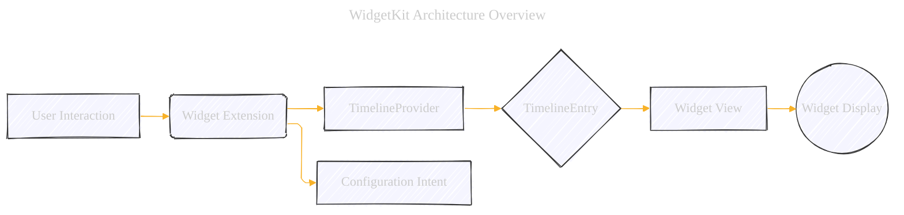
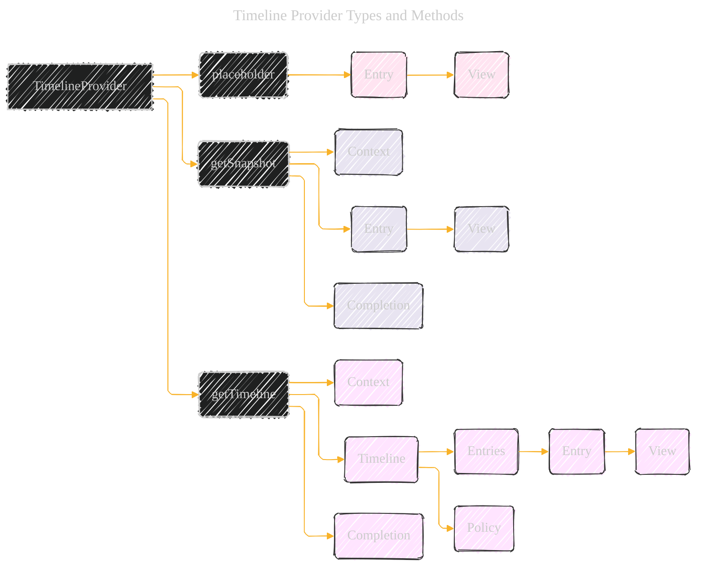
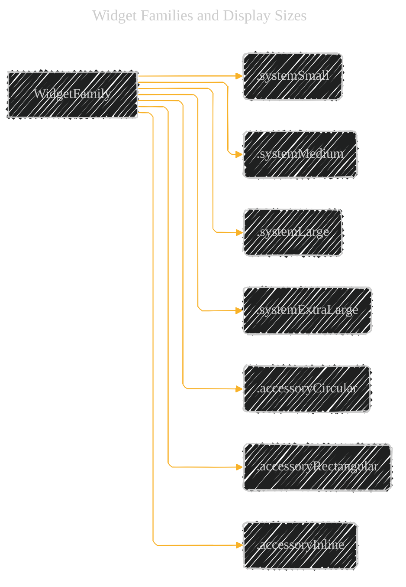
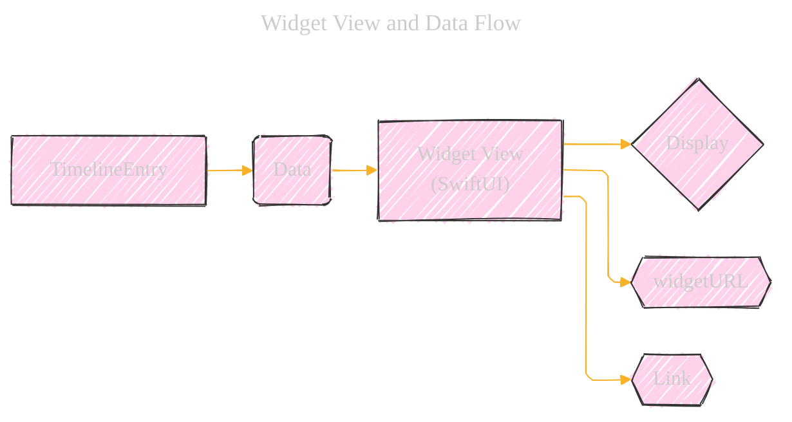
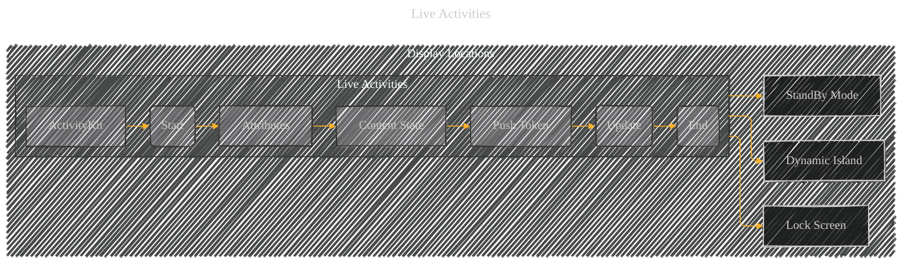
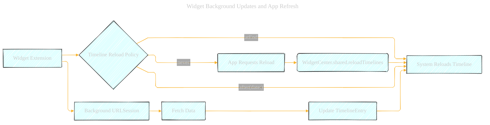

# WidgetKit Framework
> **Disclaimer:**
>
> This document contains my personal notes on the topic,
> compiled from publicly available documentation and various cited sources.
> The materials are intended for educational purposes, personal study, and reference.
> The content is dual-licensed:
> 1. **MIT License:** Applies to all code implementations (Swift, Mermaid, and other programming languages).
> 2. **Creative Commons Attribution 4.0 International License (CC BY 4.0):** Applies to all non-code content, including text, explanations, diagrams, and illustrations.
---

## WidgetKit Framework: Core Concepts and Features (Mermaid Diagrams)

The comprehensive set of Mermaid diagrams below, along with the explanations, provides a solid foundation for understanding the WidgetKit framework and its unique features. The focus on timelines, SwiftUI, limited interactivity, and system-managed rendering are key differentiators from traditional app development. The inclusion of Live Activities and background update strategies further enhances the understanding of how to create dynamic and engaging widgets.

### 1. WidgetKit Architecture Overview

**Key Components and Their Roles:**

*   **Widget Extension:**  A separate binary bundled within your app.  It *doesn't* run continuously.  It's woken up by the system to provide *timelines*.
*   **TimelineProvider:**  The heart of WidgetKit.  It's responsible for generating a *timeline* of `TimelineEntry` objects.
*   **TimelineEntry:**  A snapshot in time, specifying the *date* and the *data* to display in the widget.  This is where you define *what* your widget shows and *when*.
*   **Widget View:**  A SwiftUI view that renders the content of your widget.  It receives data from the `TimelineEntry`.
*   **Configuration Intent:**  Defines the user-configurable properties of your widget (if any).  Created using SiriKit intents definition file.
* **Widget Display:** The visual representation of your widget of the user's devices.

**Unique Features:**

*   **Timeline-Based Updates:**  Widgets are *not* constantly running and updating like a mini-app.  Instead, you provide a *timeline* of future states. This is *crucial* for battery life and performance.
*   **SwiftUI Only:** Widgets are built *exclusively* with SwiftUI.  You cannot use UIKit within a widget.
*   **Declarative UI:**  The UI is defined declaratively, making it easier to manage different widget sizes and states.
*   **Limited Interactivity:** Widgets are primarily for *displaying* information.  Interactions are limited to taps that deep-link into your app.  No scrolling, text input, or other complex UI interactions are allowed *within* the widget itself.
*   **System-Managed Rendering:** The system handles the actual rendering of your widget's view.  This ensures consistency and optimal performance.
*   **Configuration via Intents:** User configuration is handled through custom intents (defined in a `.intentdefinition` file), integrating with the system's configuration UI.

---

### 2. Timeline Providers: The Engine of Widget Updates

**`TimelineProvider` Protocol Methods:**

*   **`placeholder(in:)`:**  Provides a *single* `TimelineEntry` representing a *placeholder* view of your widget.  This is shown when the system doesn't have data yet (e.g., during initial loading).  It should be *generic* and *quick* to generate.
*   **`getSnapshot(in:completion:)`:**  Provides a *single* `TimelineEntry` representing the *current* state of your widget.  Used in transient situations, like the widget gallery.  Should be *fast* and *accurate*.
*   **`getTimeline(in:completion:)`:**  The core method.  Provides an *array* of `TimelineEntry` objects, representing the widget's state over time.  Also includes a *reload policy* indicating when the system should ask for a new timeline.

**Reload Policies (`TimelineReloadPolicy`):**

*   **`atEnd`:**  Reload when the last entry in the timeline is reached.
*   **`after(date:)`:** Reload after a specific date and time.
*   **`never`:**  Never reload automatically.  Your app needs to explicitly request a reload (e.g., in response to a significant event).

**Context (`TimelineProviderContext`):**

*   **`family`:**  The widget family (small, medium, large, extraLarge, accessory).
*   **`isLuminanceReduced`:** whether the display's brightness is reduced.
*   **`isPreview`:**  Indicates whether the widget is being previewed (e.g., in the widget gallery).
*  **`displaySize`:** The size of the widget for rendering purposes.

---

### 3. Widget Families and Display Sizes

**Widget Families:**

*   **`.systemSmall`:**  A small, square widget.  Typically shows a concise piece of information.
*   **`.systemMedium`:**  A wider widget, providing more space for content.
*   **`.systemLarge`:**  A tall widget, suitable for displaying lists or more detailed information.
*   **`.systemExtraLarge`:** (iPadOS only)  An even larger widget, offering the most space.
* **`.accessoryCircular`**: (watchOS, Lock Screen) A small circular widget
* **`.accessoryRectangular`**: (watchOS, Lock Screen) A rectangular widget, can display more information than `.accessoryCircular`
* **`.accessoryInline`**: (watchOS, Lock Screen) Displayed as a line of texts and an SF symbol.

**Key Considerations:**

*   You *must* support `.systemSmall`.  Supporting other families is optional but recommended.
*   Your widget's UI should adapt gracefully to different family sizes.
*   Use `@Environment(\.widgetFamily)` in your SwiftUI view to determine the current family and adjust the layout accordingly.

---

### 4. Configuration: Static vs. Intent-Based

**Configuration Types:**

*   **`StaticConfiguration`:**  For widgets with *no* user-configurable properties.  Simpler to implement.
    *   `kind`: A unique string identifying your widget.
    *   `provider`:  Your `TimelineProvider`.
    *   `content`:  A closure that returns your widget's SwiftUI view.
*   **`IntentConfiguration`:**  For widgets *with* user-configurable properties.  Uses a SiriKit intent definition.
    *   `kind`: A unique string identifying your widget.
    *   `intent`:  The custom intent class (generated from your `.intentdefinition` file).
    *   `provider`:  Your `TimelineProvider`.
    *   `content`:  A closure that returns your widget's SwiftUI view, receiving the configuration as a parameter.

**`.intentdefinition` File:**

*   Defines the custom intent and its parameters.
*   Used to generate the necessary code for configuration.
*   Integrates with the system's configuration UI.

---

### 5. Widget View and Data Handling

**Key Points:**

*   **SwiftUI:**  Widgets are built *entirely* with SwiftUI.
*   **Data Flow:**  The `TimelineEntry` provides the data to your SwiftUI view.
*   **`@Environment`:**  Use environment variables to access context, such as:
    *   `\.widgetFamily`
    *   `\.colorScheme`
    *   `\.isLuminanceReduced`
    *  `\.sizeCategory`
*   **`widgetURL`:**  Use this modifier to specify a URL to open when the widget is tapped.  This is the *only* way to handle taps on the entire widget.
*   **`Link`:** For more granular control, use `Link` views *within* your widget's view hierarchy to create tappable areas that open specific URLs.  This allows you to have different deep links for different parts of your widget.
* **No Interactive Elements**: Widgets do not support interactive UI controls (e.g., text fields, pickers).

---

### 6.  Live Activities (iOS 16.1+)

**Key Concepts:**

* **ActivityKit:** Framework for managing Live Activities.
* **Attributes:** Define the *static* data for the Live Activity.
* **Content State:** Defines the *dynamic* data that changes over time.
* **Push Token:** Used to update the Live Activity remotely (via APNs).
* **Start, Update, End:** The lifecycle of a Live Activity.
* **Display Locations**: Dynamic Island, Lock Screen, and StandBy Mode.

**Unique Features:**

* **Real-time Updates:** Live Activities can be updated more frequently than regular widgets.
* **Dynamic Island Integration:**  Live Activities can integrate with the Dynamic Island on supported devices.
* **Lock Screen Presence:** Live Activities appear on the Lock Screen, providing glanceable information.
* **Remote Updates:**  Use APNs to update Live Activities, even when your app isn't running.
* **Up to 8-12 Hours Lifespan:** Live Activities can be displayed for an extended period.

---

### 7. WidgetBundle and Supporting Multiple Widgets

**`@main` and `WidgetBundle`:**

*   Use `@main` to mark your widget extension's entry point.
*   Use `WidgetBundle` to group multiple widgets together. This allows your app to offer more than one type of widget.
* The example above defines Widget1, Widget2 and WidgetN, and it's grouped by the `WidgetBundle`.

---

### 8. Handling Background Updates and App Refresh

**Key Considerations:**

* **Timeline Reload Policy:**  Controls when the system requests a new timeline.
* **`WidgetCenter.shared.reloadTimelines(ofKind:)`:**  Use this method to *explicitly* request a timeline reload from your app (e.g., after a significant event, like a data update).
* **Background URLSession:**  Use a *background* `URLSession` to fetch data for your widget.  This ensures that network requests can complete even if your app is in the background.  *Crucially*, the widget extension itself cannot initiate network requests directly. The requests must originate from the main app.
* **App Refresh:** Coordinate background updates with your app's background refresh tasks to ensure data consistency and efficiency.

---

### 9. Preview Context and Debugging

**Debugging Tips:**

*   **Attach to Process:**  In Xcode, use "Debug" -> "Attach to Process" to attach the debugger to your widget extension.
*   **Breakpoints, Variable Inspection, Console Output:**  Debug your widget code like any other Swift code.
*   **Preview Context:**  Use the preview canvas in Xcode to simulate different widget families, color schemes, and dynamic type sizes.  This is *essential* for testing how your widget looks in various scenarios.
* **Timeline Visualization**: Use the `timeline` debugger command to visualize how the system renders the timelines.

---
**Licenses:**

- **MIT License:**   - Full text in [LICENSE](LICENSE) file.
- **Creative Commons Attribution 4.0 International:**  - Legal details in [LICENSE-CC-BY](LICENSE-CC-BY) and at [Creative Commons official site](http://creativecommons.org/licenses/by/4.0/).

---