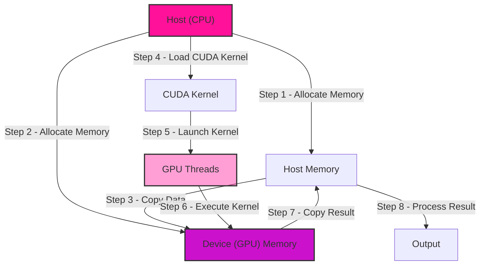
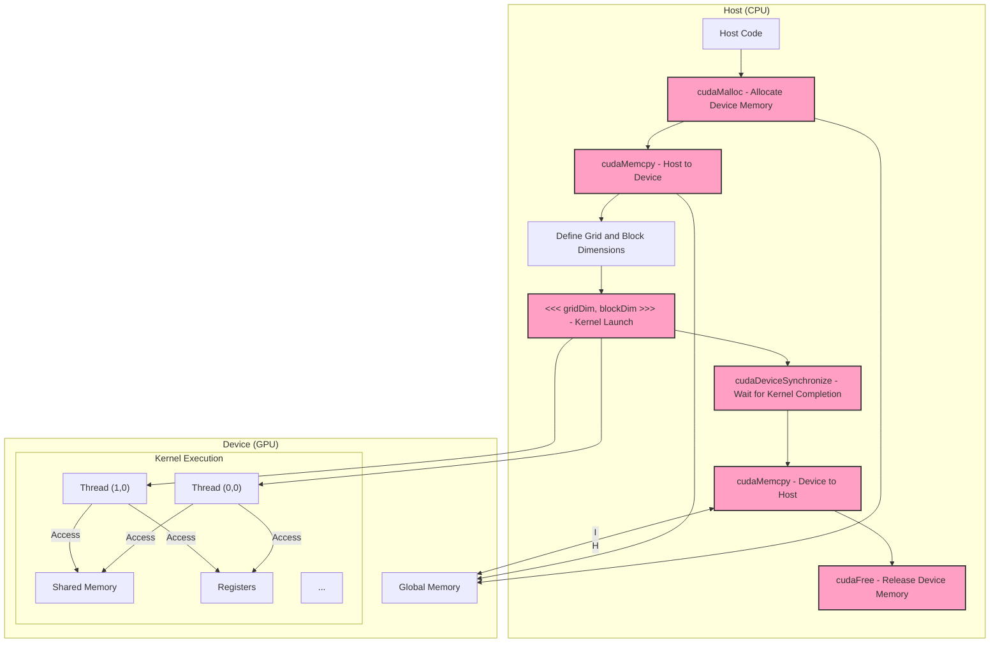
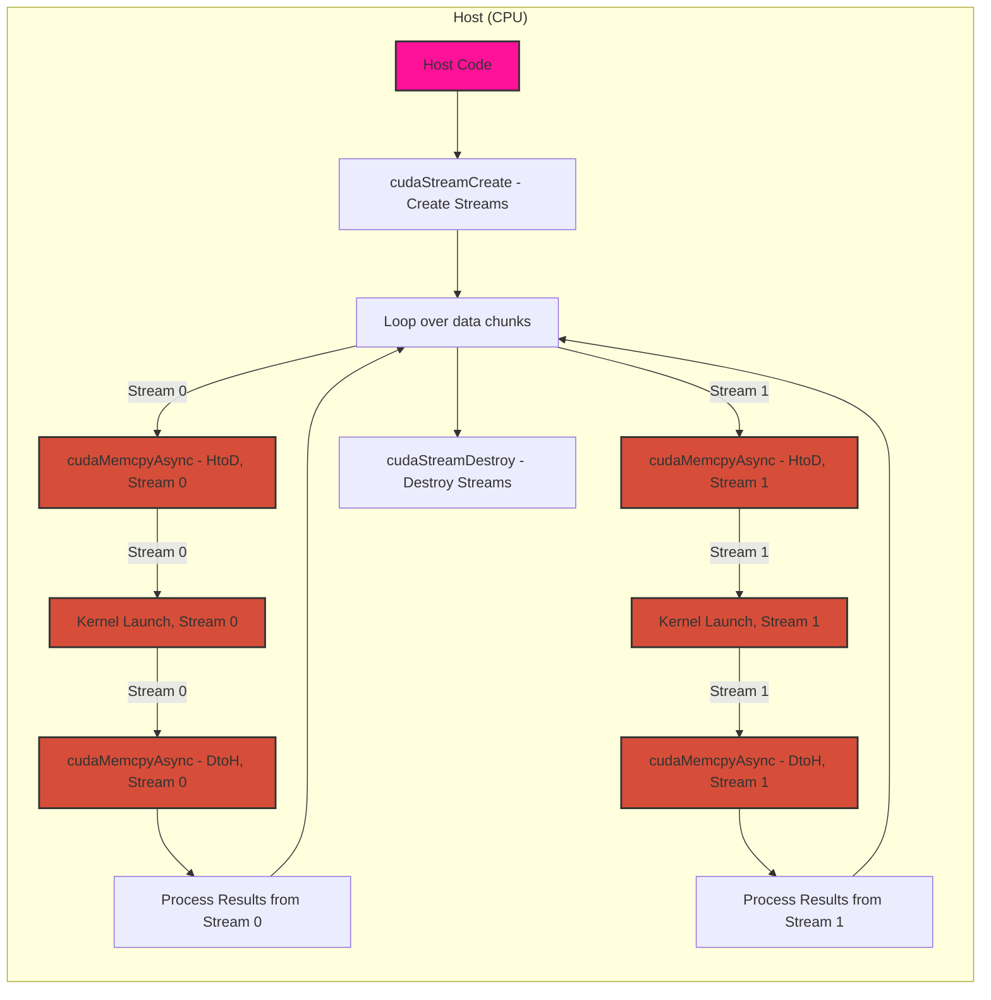

# GPU Compute Pipelines using CUDA - GPU Compute Pipelines

Here's a set of diagrams that illustrate different aspects of CUDA compute pipelines, from a high-level overview to more detailed resource management and execution flow.

### 1. High-Level Overview of a CUDA Compute Pipeline

This diagram provides a simplified view of the key stages in a typical CUDA compute pipeline.

**Explanation:**

1. **Allocate Memory (Host & Device):** Memory is allocated on both the host (CPU) and the device (GPU).
2. **Copy Data:** Input data is transferred from host memory to device memory.
3. **Load CUDA Kernel:** The compute kernel (a function written in CUDA C/C++) is loaded onto the device.
4. **Launch Kernel:** The kernel is launched for execution, specifying the grid and block dimensions, creating a hierarchy of threads on the GPU.
5. **Execute Kernel:** GPU threads concurrently execute the kernel code, operating on the data in device memory.
6. **Copy Result:** The results are copied back from device memory to host memory.
7. **Process Result:** The host further processes the results, potentially displaying them or using them in subsequent computations.

### 2. CUDA Memory Model and Kernel Execution

This diagram illustrates the CUDA memory model and shows how threads are organized within a grid and blocks.

```mermaid
graph TD
    subgraph "Host (CPU)"
        A[Host Code]
    end
    
    subgraph "Device (GPU)"
        B[Global Memory]
        C[Shared Memory]
        D[Registers]
        E[Local Memory]
        F[Constant Memory]
        G[Texture Memory]
        
        subgraph "Grid"
            H["Block (0,0)"]
            I["Block (1,0)"]
            J[...]
            
            subgraph "Block (0,0)"
                K["Thread (0,0)"]
                L["Thread (1,0)"]
                M[...]
            end
            
            subgraph "Block (1,0)"
                N["Thread (0,0)"]
                O["Thread (1,0)"]
                P[...]
            end
        end
    end
    
    A -- "Launches Kernel" --> H
    A -- "Launches Kernel" --> I
    K -- Accesses --> C
    K -- Accesses --> D
    K -- Accesses --> E
    L -- Accesses --> C
    L -- Accesses --> D
    L -- Accesses --> E
    N -- Accesses --> C
    O -- Accesses --> C
    B -- Read/Write --> H
    B -- Read/Write --> I
    F -- Read Only --> H
    F -- Read Only --> I
    G -- Read Only --> H
    G -- Read Only --> I

    classDef mem fill:#c1ce,stroke:#333,stroke-width:2px
    classDef block fill:#f196,stroke:#333,stroke-width:2px
    classDef grid fill:#c1c9,stroke:#333,stroke-width:2px
    
    class B,C,D,E,F,G mem
    class H,I,J block
    class Grid grid

```

Note: 
My updated diagram version with clearer color codes: 

```mermaid
graph TD
    subgraph "Host (CPU)"
        A[Host Code]
    end
    
    subgraph "Device (GPU)"
        B[Global Memory]
        C[Shared Memory]
        D[Registers]
        E[Local Memory]
        F[Constant Memory]
        G[Texture Memory]
        
        subgraph "Grid"
            H["Block (0,0)"]
            I["Block (1,0)"]
            J[...]
            
            subgraph "Block (0,0)"
                K["Thread (0,0)"]
                L["Thread (1,0)"]
                M[...]
            end
            
            subgraph "Block (1,0)"
                N["Thread (0,0)"]
                O["Thread (1,0)"]
                P[...]
            end
        end
    end
    
    A -- "Launches Kernel" --> H
    A -- "Launches Kernel" --> I
    K -- Accesses --> C
    K -- Accesses --> D
    K -- Accesses --> E
    L -- Accesses --> C
    L -- Accesses --> D
    L -- Accesses --> E
    N -- Accesses --> C
    O -- Accesses --> C
    B -- Read/Write --> H
    B -- Read/Write --> I
    F -- Read Only --> H
    F -- Read Only --> I
    G -- Read Only --> H
    G -- Read Only --> I

    classDef mem fill:#11f,stroke:#333,stroke-width:2px
    classDef block fill:#f11f,stroke:#333,stroke-width:2px
    classDef grid fill:#c1f,stroke:#333,stroke-width:2px
    
    class B,C,D,E,F,G mem
    class H,I,J block
    class Grid grid

```

---

**Explanation:**

*   **Host:** The CPU initiates the kernel launch and manages data transfers.
*   **Device:** The GPU houses various memory spaces:
    *   **Global Memory:** Accessible by all threads and the host (slowest).
    *   **Shared Memory:** Fast, on-chip memory shared by threads within a block.
    *   **Registers:** Fastest, private to each thread.
    *   **Local Memory:** Private to a thread, but slower than registers, used when registers are full.
    *   **Constant Memory:** Read-only, cached memory for constants.
    *   **Texture Memory:** Read-only, optimized for spatial locality, cached and accessed through texture units. making it efficient for specific access patterns often found in image and signal processing.

*   **Grid and Blocks:**
    *   **Grid:** A collection of thread blocks.
    *   **Block:** A group of threads that can cooperate using shared memory and synchronization.
    *   **Thread:** The basic unit of execution; each thread executes the same kernel code.

### 3. Detailed CUDA Compute Pipeline with Resource Management

This diagram provides a more comprehensive view, including API calls for memory management and kernel launch configuration.

**Explanation:**

*   **Host:**
    *   `cudaMalloc`: Allocates memory on the GPU.
    *   `cudaMemcpy`: Transfers data between host and device.
    *   `<<< >>>`: Specifies grid and block dimensions when launching a kernel.
    *   `cudaDeviceSynchronize`: Ensures the kernel finishes before proceeding on the host.
    *   `cudaFree`: Releases allocated device memory.

*   **Device:**
    *   Threads within a block access shared memory and registers.
    *   Threads access global memory for input and output.

### 4. CUDA Streams for Overlapping Operations

This diagram introduces CUDA streams, which enable concurrent kernel execution and data transfers for improved performance.

**Explanation:**

1. **Create Streams:** `cudaStreamCreate` generates multiple streams for independent command sequences.
2. **Loop over Data Chunks:** The input data is divided into chunks for processing in different streams.
3. **Asynchronous Operations:** `cudaMemcpyAsync` and kernel launches are associated with specific streams, enabling overlap:
    *   While the GPU executes a kernel in one stream, data transfer can occur in another.
    *   Different kernels can execute concurrently in different streams.
4. **Process Results:** Results from each stream are processed independently.
5. **Destroy Streams:** `cudaStreamDestroy` releases stream resources.

These diagrams provide a solid foundation for understanding CUDA compute pipelines, covering memory management, kernel execution, thread organization, and asynchronous operations using streams. The parallels with the Metal rendering pipeline discussion should be clear, as both involve managing resources on a GPU, encoding commands (compute kernels vs. rendering commands), and executing them in a structured manner on the device.

---
