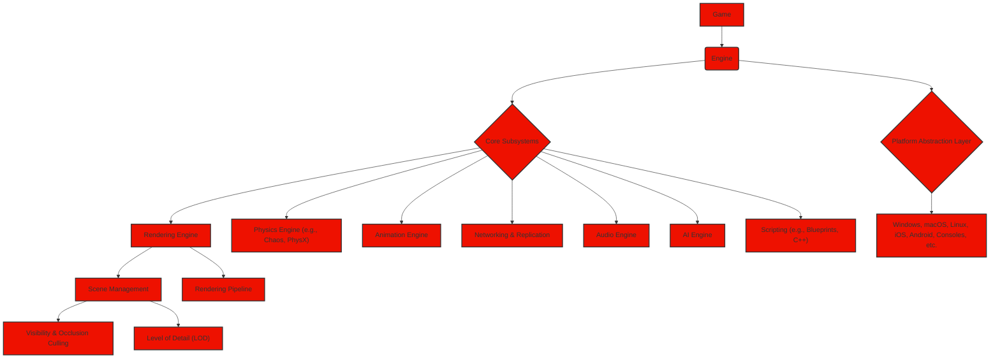
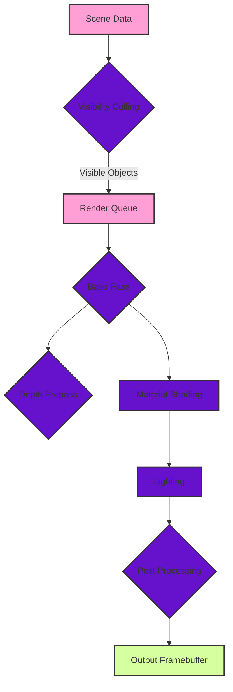
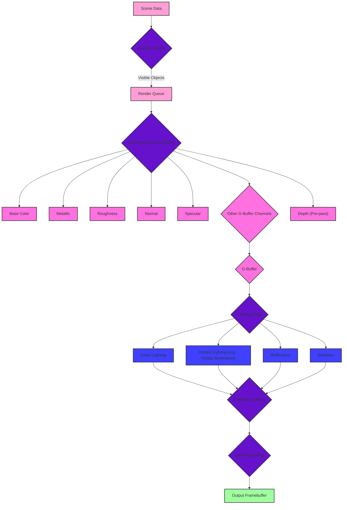
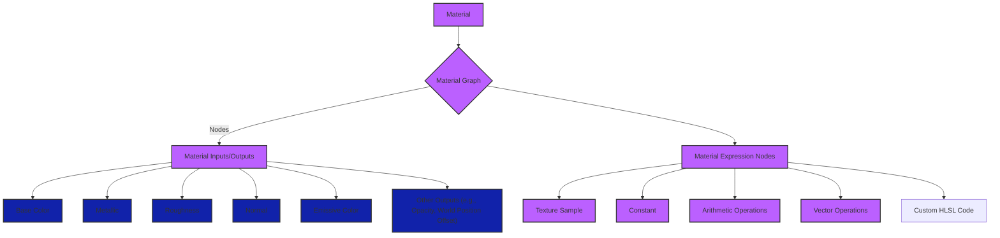
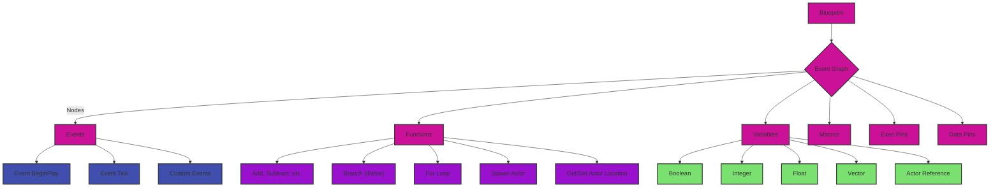

# Game Engines using Unreal Engine - Graphics and Game Engine Pipelines

Here are the Mermaid diagrams representing Unreal Engine, categorized for clarity.

## 1. High-Level Overview of Unreal Engine Architecture

**Explanation:**

*   **Game:** The top-level object representing a specific game.
*   **Engine:** The core Unreal Engine, providing essential services.
*   **Core Subsystems:** Key modules within the engine:
    *   **Rendering Engine:**  Responsible for drawing visuals.
    *   **Physics Engine:** Handles physical simulations.
    *   **Animation Engine:** Controls character and object animations.
    *   **Networking & Replication:** Manages multiplayer functionality.
    *   **Audio Engine:** Processes sounds and music.
    *   **AI Engine:** Provides tools for non-player character behavior.
    *   **Scripting:** Allows game logic to be written in Blueprints or C++.
*   **Platform Abstraction Layer:** Enables cross-platform support.
*   **Scene Management:** Handles objects, levels, culling, and LODs.
*   **Rendering Pipeline:** (Detailed in the next diagram).

## 2. Unreal Engine's Rendering Pipeline (Simplified)

**Explanation:**

1. **Scene Data:** Information about objects in the scene, including meshes, materials, and lights.
2. **Visibility Culling:** Determines which objects are visible to the camera, optimizing performance.
3. **Render Queue:** A list of visible objects to be rendered.
4. **Base Pass:** Main rendering pass:

    *   **Depth Prepass:** Renders depth information for optimization.
    *   **Material Shading:** Calculates the color of objects based on their materials and lighting.
5. **Lighting:** Computes light contributions.
6. **Post Processing:** Applies effects like bloom, motion blur, and color grading.
7. **Output Framebuffer:** The final rendered image.

## 3. Unreal Engine's Deferred Rendering Pipeline (Detailed)

**Explanation:**

1. **Scene Data:** Information about the scene.
2. **Visibility Culling:** Determines visible objects.
3. **Render Queue:** A list of visible objects.
4. **Geometry Pass (G-Buffer):** Objects are rendered to multiple render targets (G-buffer), storing properties like:

    *   **Base Color:** The albedo or diffuse color.
    *   **Metallic:** How metallic the surface is.
    *   **Roughness:** How rough or smooth the surface is.
    *   **Normal:** Surface orientation.
    *   **Specular:** Specular highlight intensity.
    *   **Other G-Buffer Channels:**  Ambient occlusion, emissive, etc.
    *   **Depth (Pre-pass)**: Depth information can be rendered in a separate pre-pass or as part of the G-buffer pass.
5. **G-Buffer:** A collection of textures storing deferred shading data.
6. **Lighting Pass:** Lighting calculations are performed using the G-buffer:

    *   **Direct Lighting:** Light from light sources.
    *   **Indirect Lighting:** Bounced light (global illumination).
    *   **Reflections:** Reflection of the environment.
    *   **Shadows:** Shadow calculations.
7. **Combine Lighting:** Different lighting components are combined.
8. **Post Processing:** Effects are applied to the combined image.
9. **Output Framebuffer:** The final rendered frame.

## 4. Unreal Engine Material System

**Explanation:**

1. **Material:** Defines the visual properties of a surface.
2. **Material Graph:** A visual scripting graph where materials are created.
3. **Material Inputs/Outputs:** Pins that connect nodes in the graph.
4. **Material Expression Nodes:** Building blocks of materials:

    *   **Texture Sample:** Samples a texture.
    *   **Constant:** Provides a constant value.
    *   **Arithmetic Operations:** Add, subtract, multiply, etc.
    *   **Vector Operations:** Dot product, cross product, normalize, etc.
    *   **Custom HLSL Code:** Allows writing custom shaders.

5. Material Outputs determine how the material interacts with light and the rendering pipeline, common outputs include but aren't limited to:

    *   **Base Color:** The base color of the surface.
    *   **Metallic:** How metallic the surface is.
    *   **Roughness:** How rough or smooth the surface is.
    *   **Normal:** Specifies the surface normal for detailed shading.
    *   **Emissive Color:** Light emitted by the surface.
    *   **Other Outputs:** Opacity, world position offset, etc.

## 5. Blueprints Visual Scripting

**Explanation:**

1. **Blueprint:** A visual script asset in Unreal Engine.
2. **Event Graph:** A graph containing nodes that define the Blueprint's behavior.
3. **Nodes:** Building blocks of Blueprints:

    *   **Events:** Trigger execution based on game events (e.g., `BeginPlay`, `Tick`, custom events).
    *   **Functions:** Perform actions or calculations (e.g., arithmetic operations, control flow, spawning actors).
    *   **Variables:** Store data (e.g., Boolean, Integer, Float, Vector, Actor references).
    *   **Macros:** Reusable groups of nodes.
    *   **Exec Pins:** Control the flow of execution between nodes.
    *   **Data Pins:** Pass data between nodes.

These diagrams provide a comprehensive, yet concise, overview of key aspects of Unreal Engine, its architecture, rendering pipeline, and visual scripting system.

---