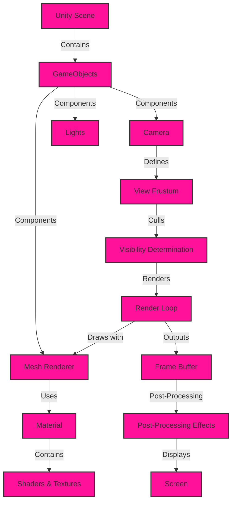
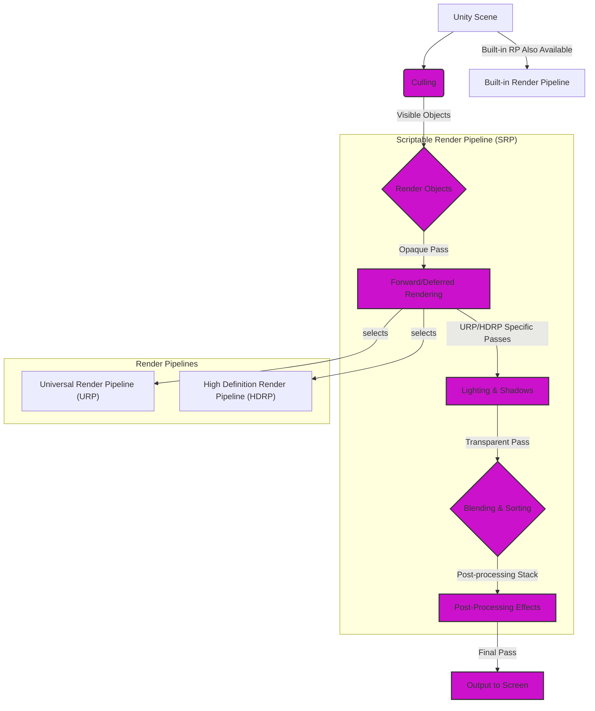
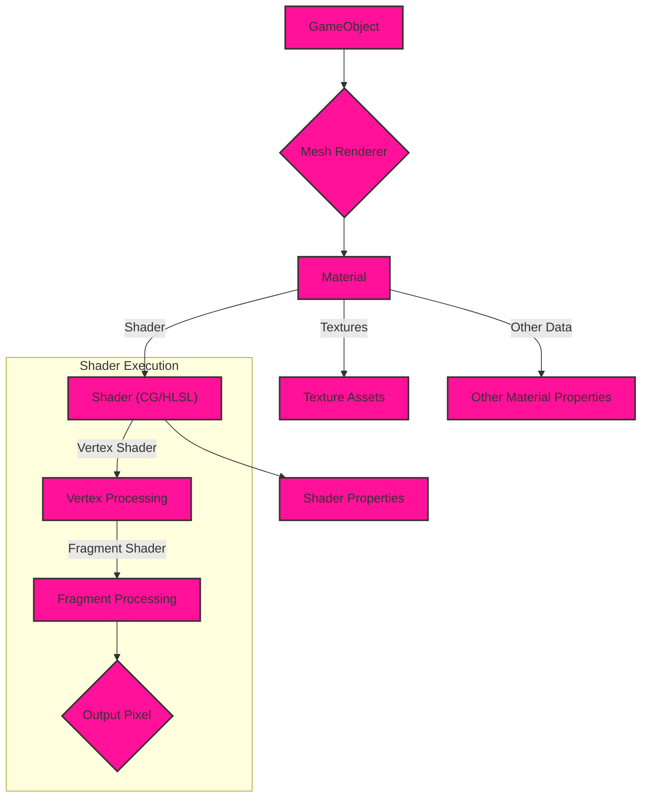
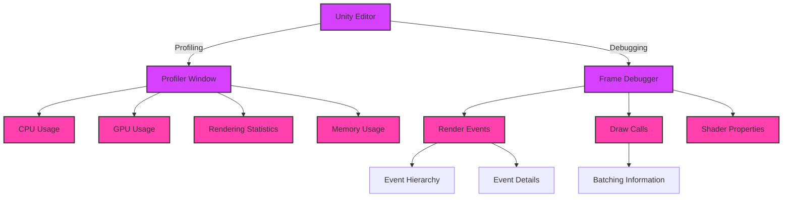

# Game Engines using Unity - Graphics and Game Engine Pipelines

Here are the Mermaid diagrams, logically organized and focusing on Unity's specific implementation.

## 1. High-Level Overview of Unity's Scene Rendering

This diagram presents a simplified, high-level view of Unity's scene rendering process.

**Explanation:**

1. **Unity Scene**: The root of Unity's scene hierarchy.
2. **GameObjects**: Fundamental objects in Unity, holding components.
3. **Components**: Add functionality to GameObjects (e.g., rendering, physics).
    *   **Mesh Renderer**: Renders a mesh using a material.
    *   **Camera**: Defines the viewpoint for rendering.
    *   **Lights**: Illuminate the scene.
4. **Material**: Specifies the visual appearance of a mesh (shaders, textures).
5. **View Frustum**: The portion of the scene visible to the camera.
6. **Visibility Determination**: Culling objects outside the view frustum.
7. **Render Loop**: Unity's core rendering process.
8. **Frame Buffer**: The rendered image before post-processing.
9. **Post-Processing**: Applying effects to the rendered image.
10. **Screen**: Final output displayed to the user.

## 2. Unity's Rendering Pipeline: SRP (URP/HDRP) Focus

This diagram illustrates Unity's Scriptable Render Pipeline (SRP), focusing on the Universal Render Pipeline (URP) and High Definition Render Pipeline (HDRP).

**Explanation:**

1. **Culling**: Determines visible objects based on the camera's view frustum.
2. **Render Objects**: Processes visible objects for rendering.
3. **Scriptable Render Pipeline (SRP)**: The base for customizable render pipelines.
    *   **Universal Render Pipeline (URP)**: Optimized for performance and wide platform support.
    *   **High Definition Render Pipeline (HDRP)**: Designed for high-fidelity visuals on high-end hardware.
4. **Opaque Pass**: Renders opaque objects, selecting between forward or deferred rendering based on the chosen pipeline.
5. **Lighting & Shadows**: Pipeline-specific passes for lighting calculations.
6. **Transparent Pass**: Renders transparent objects with blending and sorting.
7. **Post-processing Stack**: Applies post-processing effects to the rendered image.
8. **Final Pass**: Outputs the final image to the screen.
9. **Built-in Render Pipeline** : Also available as an option in Unity for backward compatibility.

## 3. Unity's Material and Shader System

This diagram details how materials and shaders work within Unity's rendering pipeline.

**Explanation:**

1. **GameObject**: Holds the `Mesh Renderer` component.
2. **Mesh Renderer**: References a `Material`.
3. **Material**: Defines the visual properties of a surface. It references a :
    *   **Shader**: Written in CG/HLSL, it determines how the object is rendered and what properties an object may present, including.
    *   **Texture Assets**: Images used to add detail to surfaces.
    *   **Other Data**: Other Material Properties can be defined and are set by `Shader Properties`.
4. **Shader Execution**: The shader program is executed on the GPU.
    *   **Vertex Shader**: Processes vertices of the mesh.
    *   **Fragment Shader**: Calculates the color of each pixel.

## 4. Unity's Frame Debugger and Profiler

This diagram showcases how Unity's Frame Debugger and Profiler help analyze and optimize the rendering process.

**Explanation:**

1. **Unity Editor**: Provides tools for profiling and debugging.
2. **Profiler Window**: Visualizes performance data over time.
    *   **CPU Usage**: Shows CPU time spent on different tasks including draw calls and rendering information.
    *   **GPU Usage**: Displays GPU activity and performance.
    *   **Rendering Statistics**: Provides detailed rendering metrics.
    *   **Memory Usage**: Tracks memory allocation and usage.
3. **Frame Debugger**: Allows stepping through render events for a single frame.
    *   **Render Events**: Lists all rendering events in a frame. You are able to select each event to get specific details on it.
    *   **Draw Calls**: Shows individual draw calls and their details.
    *   **Shader Properties**: Displays the properties of shaders used in each draw call.

These diagrams provide a comprehensive yet concise overview of Unity's game engine pipeline, highlighting its unique features like the Scriptable Render Pipeline, the material/shader system, and the built-in profiling and debugging tools compared to the more generic graphics pipeline diagrams discussed earlier. I've carefully considered the relationships between different components and processes to create a clear and informative representation.

---