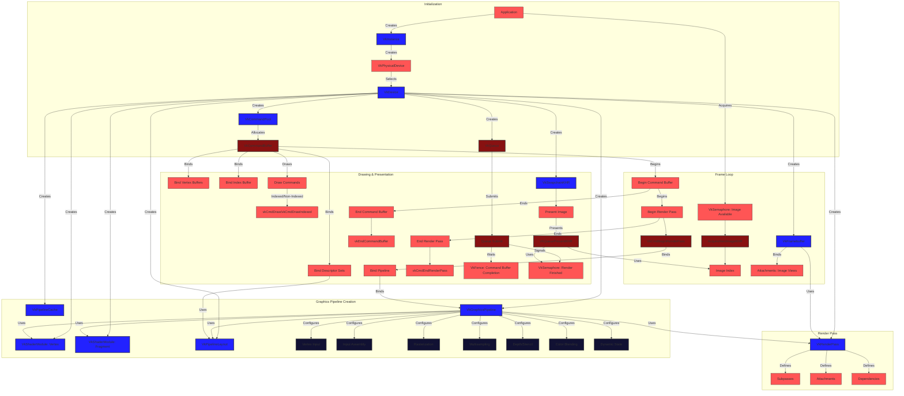
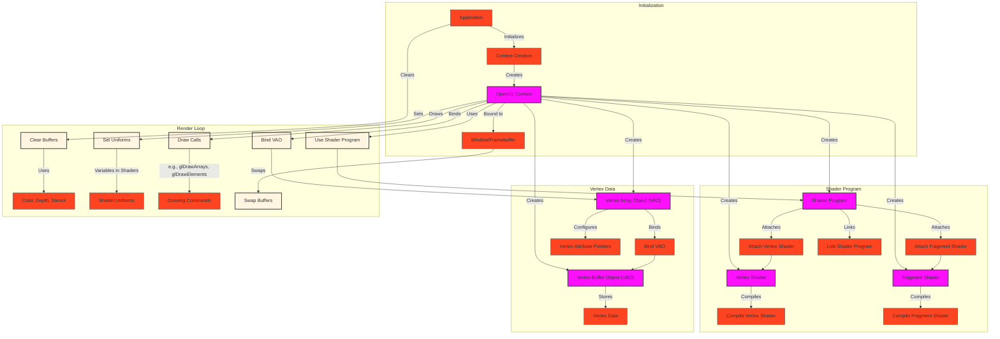

# Vulkan Graphics Pipeline
Below is a set of Mermaid diagrams for Vulkan, DirectX, and OpenGL, focusing on their graphics pipelines.

## 1. Vulkan Graphics Pipeline

**Unique to Vulkan:**

*   **Explicit everything:** Vulkan is known for its verbosity and explicit control over resources and operations.
*   **VkInstance, VkPhysicalDevice, VkDevice, VkQueue:** Hierarchy of objects representing the API instance, physical GPU, logical device, and command queues.
*   **VkCommandPool, VkCommandBuffer:** Command buffers are allocated from pools.
*   **VkRenderPass:**  Defines a collection of subpasses, attachments, and dependencies, providing optimization opportunities for the driver.
*   **VkFramebuffer:** Represents a set of attachments (e.g., color, depth) used in a render pass.
*   **VkSemaphore, VkFence:** Synchronization primitives for coordinating command buffer execution and presentation.
*   **VkGraphicsPipeline:** Represents the entire graphics pipeline, including shaders, vertex input, rasterization, etc.
*   **VkShaderModule:** Represents compiled shader code (SPIR-V).
*   **VkPipelineLayout:** Describes the layout of descriptor sets (how resources are bound to shaders).
*   **VkDescriptorSet:**  Binds resources (buffers, images) to specific shader stages.
*   **VkSwapchainKHR:**  Manages a chain of presentation images.

## 2. DirectX 12 Graphics Pipeline

```mermaid
graph TD
    subgraph "Initialization"
        A[Application] -->|Creates| B[IDXGIFactory]
        B -->|Enumerates| C[IDXGIAdapter]
        C -->|Represents| D[GPU Adapter]
        D -->|Creates| E[ID3D12Device]
        E -->|Creates| F[ID3D12CommandQueue]
        E -->|Creates| H[ID3D12DescriptorHeap]
    end

    subgraph "Render Loop"
        F -->|Creates| I[ID3D12CommandAllocator]
        I -->|Resets| J[Reset Command Allocator]
        E -->|Creates| K[ID3D12GraphicsCommandList]
        K -->|Resets| L[Reset Command List]
        L --> M[Associate with Command Allocator]
    end

    subgraph "Resource Binding"
        E -->|Creates| N[ID3D12RootSignature]
        N -->|Defines| O[Resource Bindings]
        K -->|Sets| P[Set Graphics Root Signature]
        P -->|Uses| N
        K -->|Binds| Q[Bind Resources]
        Q -->|Via| R[Root Parameters]
        Q -->|Uses| S[Descriptor Tables]
        Q -->|Uses| T[Root Constants]
        Q -->|Uses| U[Root Descriptors]
    end

    subgraph "Pipeline State Object (PSO)"
        E -->|Creates| V[ID3D12PipelineState]
        V -->|Contains| W[Vertex Shader]
        V -->|Contains| X[Pixel Shader]
        V -->|Contains| Y[Blend State]
        V -->|Contains| Z[Rasterizer State]
        V -->|Contains| AA[Depth Stencil State]
        V -->|Contains| AB[Input Layout]
        V -->|Contains| AC[Primitive Topology Type]
        K -->|Sets| AD[SetPipelineState]
        AD -->|Uses| V
    end
        
    subgraph "Drawing"
        K -->|Sets| AE[Set Viewports]
        K -->|Sets| AF[Set Scissor Rects]
        K -->|Sets| AG[Set Render Targets]
        AG -->|Binds| AH["Render Target Views (RTV)"]
        AG -->|Binds| AI["Depth Stencil View (DSV)"]
    end

    subgraph "Drawing & Presentation"
        K -->|Clears| AJ[ClearRenderTargetView]
        K -->|Clears| AK[ClearDepthStencilView]
        K -->|Draws| AL[DrawInstanced/DrawIndexedInstanced]
        K -->|Closes| AM[Close Command List]
        F -->|Executes| AN[ExecuteCommandLists]
        E -->|Creates| AO[ID3D12Fence]
        AN -->|Signals| AP[Signal Fence]
        AP -->|Uses| AO
        F -->|Waits| AQ[CPU Waits for Fence]
        AQ -->|Uses| AO
        E -->|Creates| AR[IDXGISwapChain]
        AR -->|Presents| AS[Present]
        AS -->|Signals| AT[Signal Swap Chain Fence]
    end

       
    subgraph "Synchronization"
        F --> AU[Wait for GPU]
        AU -->|Synchronization| AV[ID3D12Fence]
        K --> AW[Transitions Resource Barriers]
        AW --> AX[Transition Resources]
    end

    classDef general fill:#12ff,stroke:#333,stroke-width:1px;
    classDef create fill:#f2f9,stroke:#333,stroke-width:2px;
    classDef dx12 fill:#1ff1,stroke:#333,stroke-width:2px;
    classDef stage fill:#f51,stroke:#333,stroke-width:2px;

    class A,B,C,D,E,F,G,H,I,J,K,L,M,N,O,P,Q,R,S,T,U,V,W,X,Y,Z,AA,AB,AC,AD,AE,AF,AG,AH,AI,AJ,AK,AL,AM,AN,AO,AP,AQ,AR,AS,AT,AU,AV,AW,AX general;
    class B,E,H,I,K,N,V,AO,AR create;
    class F,J,L,P,Q,AD,AE,AF,AG,AM,AN,AP,AS,AU,AW dx12;
    class W,X,Y,Z,AA,AB,AC stage;

```

**Unique to DirectX 12:**

*   **IDXGIFactory, IDXGIAdapter, ID3D12Device, ID3D12CommandQueue:**  Similar hierarchy to Vulkan for representing the API, adapter, device, and queues.
*   **ID3D12CommandAllocator, ID3D12GraphicsCommandList:** Command lists are created and reset using allocators.
*   **ID3D12RootSignature:** Describes the layout of resources (similar to `VkPipelineLayout`).
*   **Descriptor Heaps:** Memory blocks where resource views are stored (CBV, SRV, UAV, RTV, DSV).
*   **ID3D12PipelineState:**  Similar to `VkGraphicsPipeline`, containing shaders and pipeline states.
*   **Root Parameters:** Define how resources are bound (descriptor tables, root constants, root descriptors).
*   **ID3D12Fence:** Used for synchronization between the CPU and GPU.
*   **IDXGISwapChain:** Manages the presentation of rendered images.
*   **Resource Barriers:** Used to transition resource states (e.g., render target to shader read).

## 3. OpenGL Graphics Pipeline

**Unique to OpenGL:**

*   **Context:** Represents the current state of OpenGL.
*   **Shader Program:** Contains linked vertex and fragment shaders.
*   **Vertex Buffer Object (VBO):** Stores vertex data on the GPU.
*   **Vertex Array Object (VAO):** Encapsulates vertex attribute state, making it efficient to switch between different vertex data configurations.
*   **Uniforms:** Variables passed to shaders from the application.
*   **State Machine:** OpenGL is a state machine. You set states (e.g., active shader program, bound VAO), and they remain active until changed.
*   **Immediate Mode (Legacy):** Older versions of OpenGL had an immediate mode where draw calls were issued directly. Modern OpenGL uses retained mode with VBOs and VAOs.
*   **glDrawArrays, glDrawElements:** Functions for issuing draw calls.
*   **Swap Buffers:** Used to present the rendered image by swapping the front and back buffers.
*   **No explicit synchronization objects:** that need heavy management like in Vulkan or DX12. OpenGL relies more on implicit synchronization, and the GPU driver handles most of it.
*   **Extensions:** OpenGL has a vast extension mechanism, allowing vendors to add new features.

**Key Differences from Metal:**

*   **Level of Abstraction:** Metal, Vulkan, and DX12 provide lower-level control compared to OpenGL, which is more abstracted and easier to use initially.
*   **State Management:**  Metal and DirectX have more explicit pipeline state objects, while OpenGL relies more on a global state machine. Vulkan is the most explicit, requiring manual management of many aspects that are more automated in other APIs.
*   **Synchronization:** Metal, Vulkan, and DX12 offer finer-grained control over synchronization, while OpenGL is more implicit.
*   **Error Handling:** OpenGL's error handling can be less informative compared to the more verbose error reporting in Vulkan and other modern APIs.
*   **Resource Binding:**  Metal, Vulkan and DX12 use descriptor sets or root signatures, while OpenGL uses uniforms and texture units.
*   **Portability:** OpenGL is highly portable, while Metal is specific to Apple platforms. Vulkan and DX12 offer better portability but can have some platform-specific aspects.

These diagrams provide a comprehensive overview of the Vulkan, DirectX 12, and OpenGL graphics pipelines, highlighting their unique features and terminology while implicitly drawing comparisons to the Metal pipeline discussed earlier. I've avoided redundancy by focusing on the distinct aspects of each API. Remember that these are simplified representations, but they capture the essential concepts and workflows.

---