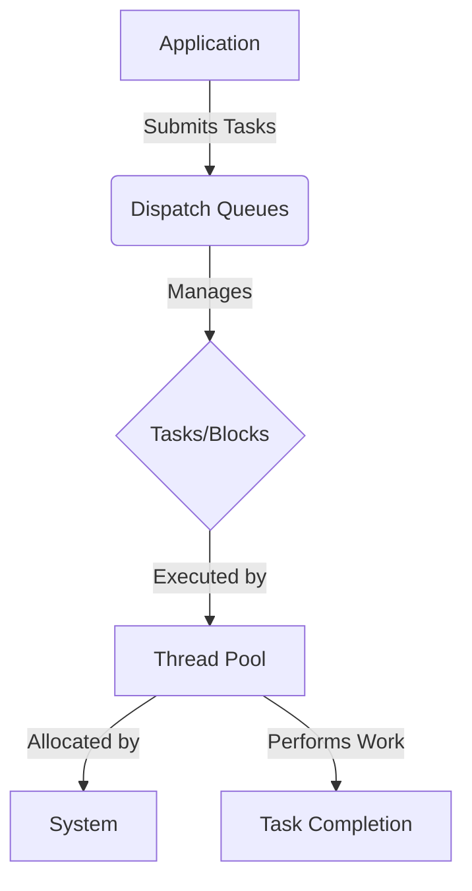
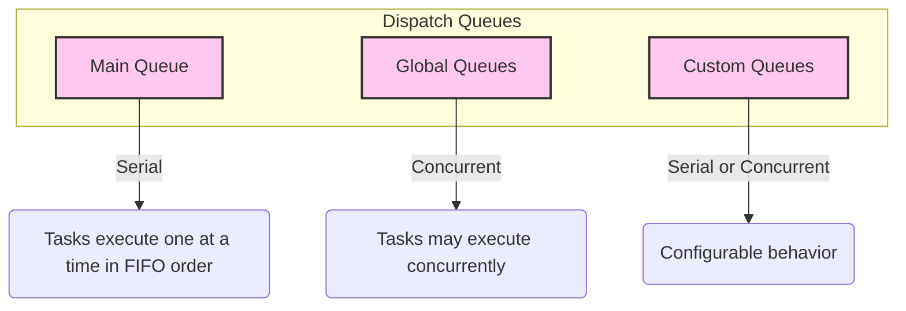
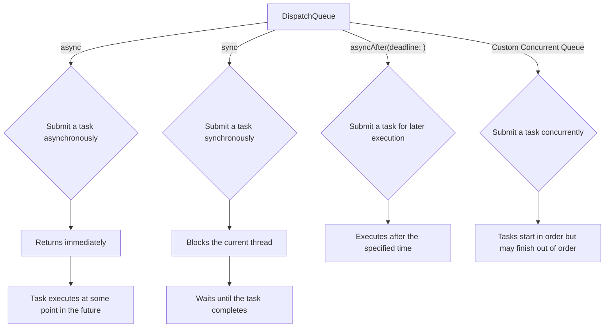
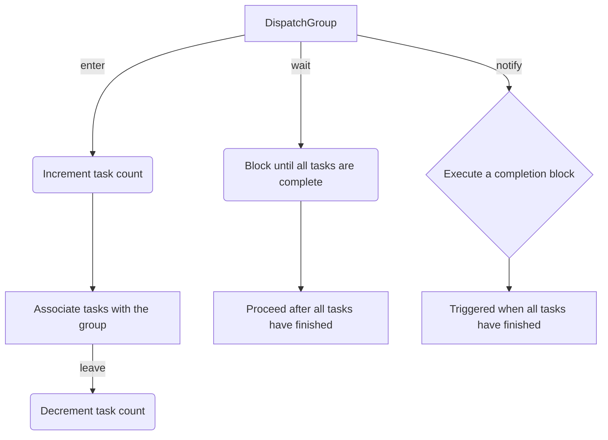
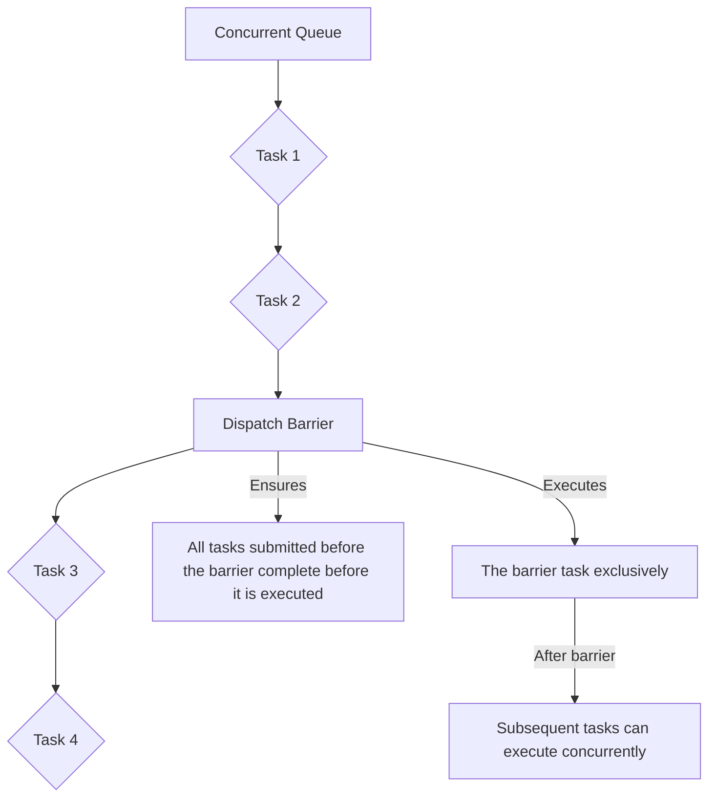
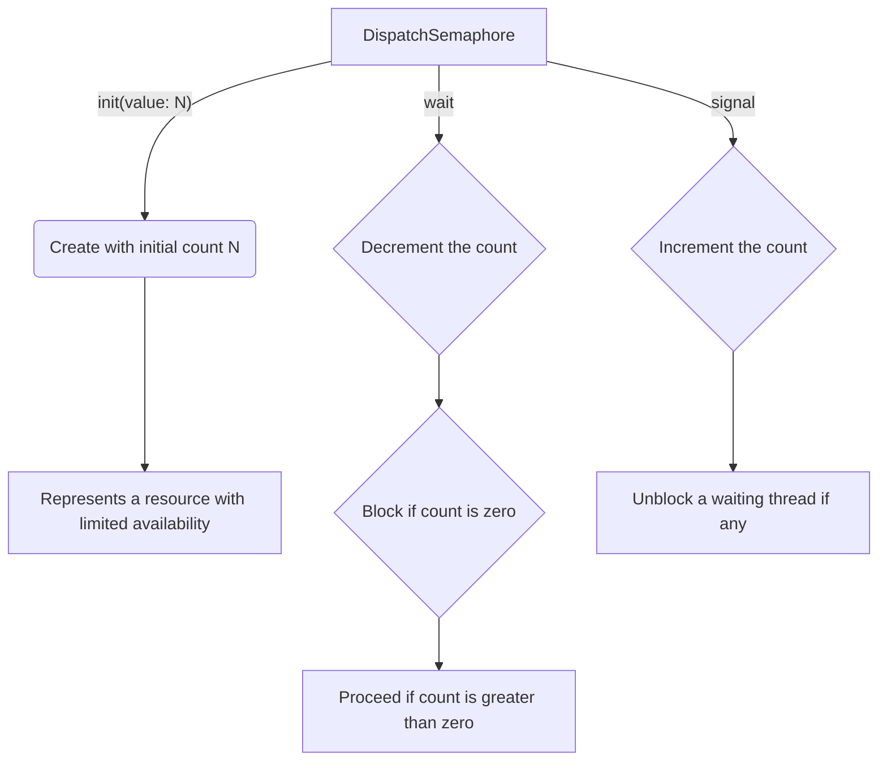
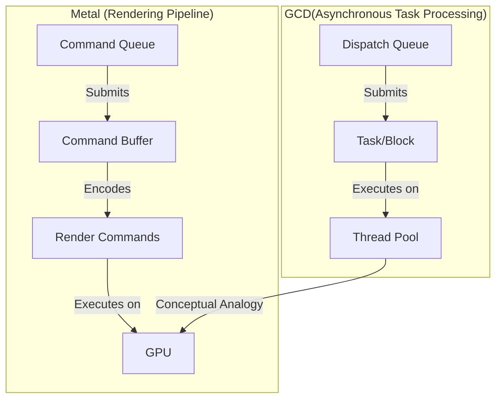

# Grand Central Dispatch (GCD) Diagrams

Here are the Mermaid diagrams illustrating GCD's concepts and mechanisms, organized into categories:

### 1. High-Level Overview of GCD

This diagram provides a simplified view of GCD's core components and how they interact.

**Explanation:**

1. **Application**: The main program that submits tasks to GCD.
2. **Dispatch Queues**: Queues that hold tasks to be executed.
3. **Tasks/Blocks**: Units of work represented as closures or blocks.
4. **Thread Pool**: A collection of threads managed by the system.
5. **System**: The operating system responsible for thread allocation.
6. **Task Completion**: The result of a task's execution.

### 2. Types of Dispatch Queues

This diagram illustrates the different types of dispatch queues available in GCD.

**Explanation:**

1. **Main Queue**: A globally available serial queue associated with the main thread. Used for UI updates.
2. **Global Queues**: System-provided concurrent queues with different Quality of Service (QoS) levels.
3. **Custom Queues**: Queues created by the developer, which can be either serial or concurrent.
4. **Serial**: Tasks are executed one after another in the order they are added (FIFO).
5. **Concurrent**: Tasks may be executed concurrently, depending on system resources.

### 3. Quality of Service (QoS) Classes

This diagram details the different QoS classes that can be assigned to dispatch queues.

```mermaid
graph TD
    A[User Interactive] --> B(Highest priority, for UI responsiveness);
    B --> C[Execution on the main thread is preferred]
    C --> D[Use the main queue or global queue with .userInteractive Qos]
    A --> E[For tasks initiated by the user that require immediate results];
    A --> F[Examples: Handling user input, animations];
    
    G[User Initiated] --> H(High priority, for tasks the user is actively waiting for);
    H --> I[Execution on a high-priority thread from a global queue]
    I --> J[Use the global queue with .userInitiated Qos]
    G --> K[For tasks initiated by the user that prevent further use of the app until completion];
    G --> L[Examples: Loading a saved document, fetching data from a server];
     
    M[Utility] --> N(Medium priority, for tasks that may take some time);
    N --> O[Execution on a medium-priority thread]
    O --> P[Use the global queue with .utility Qos]
    M --> Q[For tasks the user is aware of but don't require immediate results];
    M --> R[Examples: Downloading files, importing data];
    
    S[Background] --> T(Lowest priority, for maintenance or cleanup tasks);
    T --> U[Execution on a low-priority thread]
    U --> V[Use the global queue with .background Qos]
    S --> W[For tasks the user is not directly aware of];
    S --> X[Examples: Indexing, syncing data in the background];
    
    Y[Default] --> Z(Execution on a medium-priority thread that falls between user-initiated and utility);
    Z --> ZA[Use global queue with .default Qos]
    Y --> ZB[The inherent priority of a dispatch queue is that of default unless specified otherwise];
    
    style A fill:#1961,stroke:#333,stroke-width:2px
    style G fill:#56ff,stroke:#333,stroke-width:2px
    style M fill:#c339,stroke:#333,stroke-width:2px
    style S fill:#c24f,stroke:#333,stroke-width:2px
    style Y fill:#165,stroke:#333,stroke-width:2px
    

```

**Explanation:**

1. **User Interactive**: Highest priority, for tasks directly tied to user interaction and UI updates. Use this sparingly.
2. **User Initiated**: High priority, for tasks initiated by the user that require immediate feedback but might not be UI-related.
3. **Default**: The default QoS. A system-provided queue is available at this QoS level.
4. **Utility**: Medium priority, for long-running tasks like network requests or file I/O.
5. **Background**: Lowest priority, for tasks that the user is not actively aware of, such as prefetching, data synchronization, or maintenance.

### 4. Submitting Tasks to Queues

This diagram demonstrates the different ways tasks can be submitted to dispatch queues.

**Explanation:**

1. **async**: Submits a task for asynchronous execution. The caller continues without waiting for the task to complete.
2. **sync**: Submits a task for synchronous execution. The caller blocks and waits for the task to finish.
3. **asyncAfter**: Schedules a task for execution after a specified delay.
4. **Custom Concurrent Queue**: In this case it is shown how using a concurrent queue will affect how the submitted tasks are processed, which is that they may not be executed sequentially.

### 5. Dispatch Groups

This diagram illustrates how dispatch groups can be used to manage and synchronize multiple tasks.

**Explanation:**

1. **DispatchGroup**: An object that allows you to track the completion of multiple tasks.
2. **enter**: Manually indicates that a task has entered the group.
3. **leave**: Manually indicates that a task has left the group.
4. **wait**: Blocks the current thread until all tasks in the group have completed (or a timeout occurs).
5. **notify**: Enqueues a block to be executed when all tasks in the group have completed.

### 6. Dispatch Barriers

This diagram shows how dispatch barriers are used to create synchronization points in concurrent queues.

**Explanation:**

1. **Concurrent Queue**: A queue where tasks can execute concurrently.
2. **Dispatch Barrier**: A special task that acts as a synchronization point.
3. **Barrier Execution**: When a barrier task is encountered, it waits for all previously submitted tasks to complete before executing.
4. **Exclusive Execution**: The barrier task itself executes exclusively; no other tasks run concurrently with it.
5. **Resumption of Concurrency**: After the barrier task finishes, the queue resumes normal concurrent execution.

### 7. Dispatch Semaphores

This diagram demonstrates the use of dispatch semaphores for controlling access to a shared resource.

**Explanation:**

1. **DispatchSemaphore**: A synchronization primitive used to control access to a resource.
2. **Initialization**: Created with an initial counter value representing the number of available resources.
3. **wait**: Decrements the counter. If the counter is zero, the calling thread blocks until it becomes greater than zero.
4. **signal**: Increments the counter. If there are waiting threads, one of them is unblocked.

### 8. Comparison with Metal's Rendering Pipeline

This diagram draws a conceptual parallel between GCD's asynchronous task management and Metal's rendering pipeline.

**Explanation:**

1. **GCD**: Dispatch queues manage tasks that are executed on a thread pool.
2. **Metal**: Command queues manage command buffers that are executed on the GPU.
3. **Conceptual Analogy**: Both systems involve submitting units of work to a queue for asynchronous execution on a specialized resource (thread pool or GPU).

These diagrams provide a comprehensive overview of Grand Central Dispatch, covering its key components, mechanisms, and usage patterns. By relating these concepts back to the Metal rendering pipeline, we can see how GCD, despite operating at a higher level of abstraction, shares fundamental principles of asynchronous processing with lower-level graphics APIs. This understanding helps solidify your grasp of concurrency and task management in iOS development.

---
