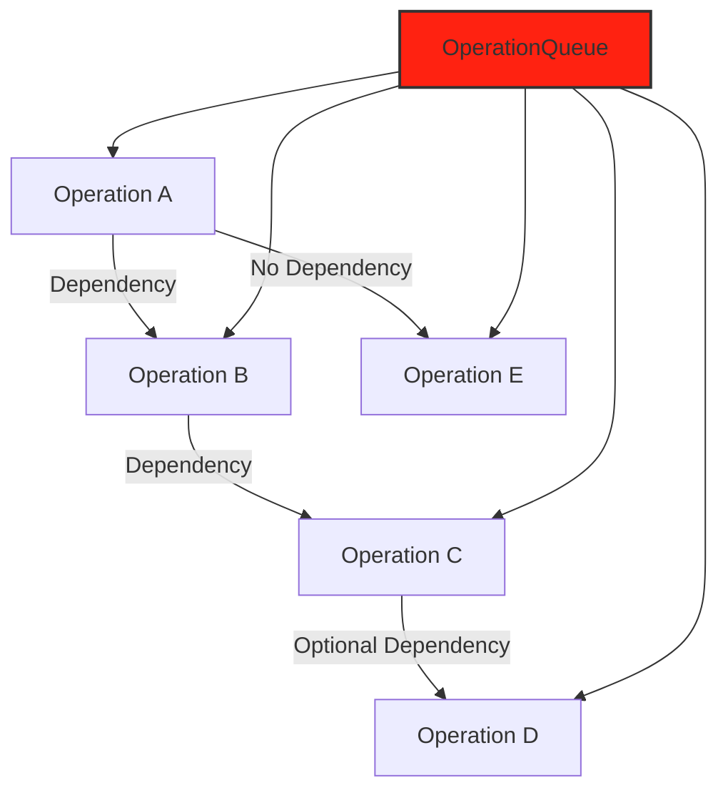
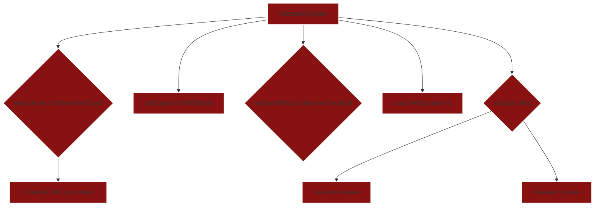
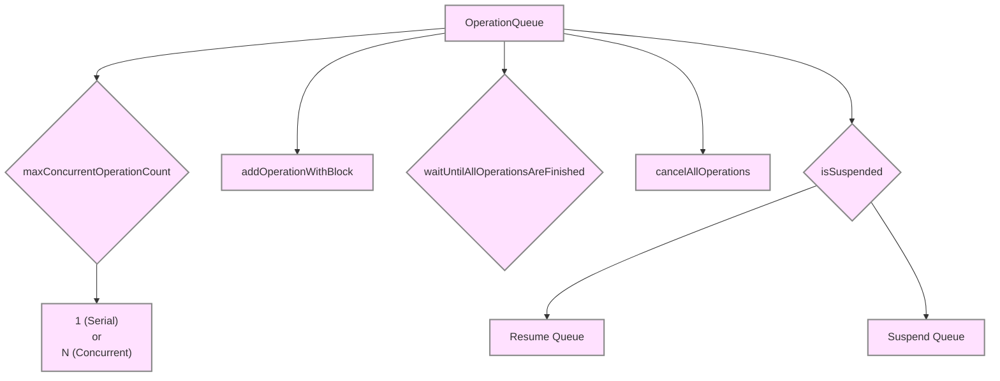
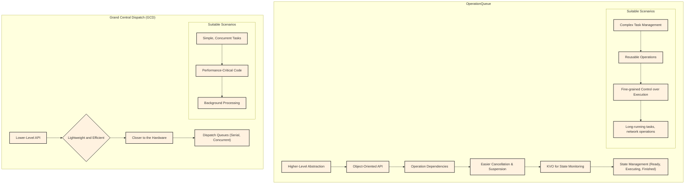

# Operation Queue - Asynchronous Task Processing

Here's a set of diagrams that explain Operation Queues, categorized for clarity.

### 1. Basic Operation and OperationQueue

This diagram illustrates the fundamental relationship between `Operation` and `OperationQueue`, highlighting their basic usage.

```mermaid
graph TD
    subgraph "Creating Operations"
        A[Define Operation Subclass] --> B(BlockOperation or Custom Subclass);
    end
    subgraph "Queue Management"
        B --> C{Create OperationQueue};
        C --> D[Add Operation to Queue];
    end
    subgraph "Execution"
        D --> E[Queue Manages Execution];
        E --> F{Operations Run Concurrently};
    end
    
    classDef SubgraphStyle fill:#211,stroke:#333,stroke-width:2px;
    class A,B,C,D,E,F SubgraphStyle;

```

**Explanation:**

1. **Creating Operations**: Define custom operations by subclassing `Operation` or using the convenient `BlockOperation`.
2. **Queue Management**: Create an `OperationQueue` and add operations to it.
3. **Execution**: The queue manages the execution of operations, concurrently where possible, based on their dependencies and readiness.

### 2. Operation Dependencies and Execution Order

This diagram demonstrates how dependencies between operations control their execution order within the queue.

**Explanation:**

1. **Dependencies**: `Operation B` depends on `Operation A`, meaning A must complete before B starts. Similarly, C depends on B. D optionally depends on C.
    -   `addDependency()` API is used to set such dependency, cyclic dependencies are not allowed.
2. **Independent Operations**: `Operation E` has no dependencies and can run concurrently with others.
3. **Queue Execution**: The `OperationQueue` respects these dependencies, ensuring the correct order of execution and `Operation` readiness status updates accordingly.

### 3. Operation Lifecycle and States

This diagram depicts the various states an `Operation` can transition through during its lifecycle.

```mermaid
graph TD
    A[Pending] -->|Added to Queue| B{Ready};
    B -->|Start| C{Executing};
    C -->|Finish| D{Finished};
    C -->|Cancel| E{Cancelled};
    B -.->|Dependency Not Met| B;

    style A fill:#116,stroke:#333,stroke-width:2px;
    style B fill:#11f5,stroke:#333,stroke-width:2px;
    style C fill:#1325,stroke:#333,stroke-width:2px;
    style D fill:#611,stroke:#333,stroke-width:2px;
    style E fill:#661,stroke:#333,stroke-width:2px;

```

**Explanation:**

1. **Pending**: Initial state before being added to the queue.
2. **Ready**: Added to the queue, dependencies are met, and it's eligible to run. It can remain in this state until resources are available.
3. **Executing**: The operation's `main()` or `start()` method is actively running.
4. **Finished**: The operation completed successfully.
5. **Cancelled**: The operation was cancelled before or during execution.

To support `Operation` states the `Operation` object should update its state (using KVO - Key-Value Observing) accordingly when any of the state changes are appropriate for the operation.

### 4. Advanced OperationQueue Features

This diagram highlights some of the advanced features of `OperationQueue`, such as controlling concurrency, suspension, and cancellation.

**Explanation:**

1. **maxConcurrentOperationCount**: Limits the number of concurrent operations (1 for a serial queue, N for concurrent).
2. **addOperationWithBlock**: A convenience method to add a `BlockOperation` directly.
3. **waitUntilAllOperationsAreFinished**: Blocks the current thread until all operations in the queue are finished.
4. **cancelAllOperations**: Attempts to cancel all operations in the queue.
5. **isSuspended**: Allows pausing and resuming the queue's execution using `setSuspended()` API.
 Note: 
My updated diagram with annotations

---

### 5. OperationQueue vs. GCD

This diagram compares `OperationQueue` and Grand Central Dispatch (GCD), showing their strengths and when to use each.

**Explanation:**

**OperationQueue:**

*   Higher-level, object-oriented API.
*   Easier dependency management, cancellation, and suspension.
*   KVO for state monitoring.
*   Suitable for complex, long-running, or reusable tasks.

**GCD:**

*   Lower-level, lightweight, and efficient.
*   Closer to the hardware.
*   Suitable for simple, concurrent, and performance-critical tasks.

---
