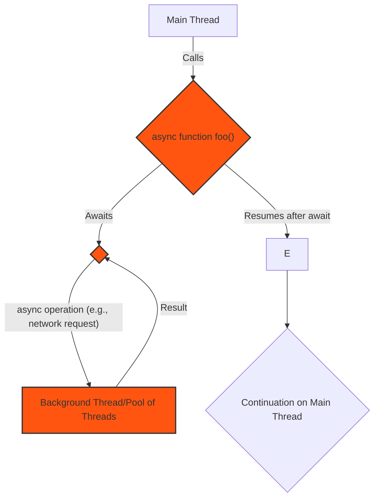
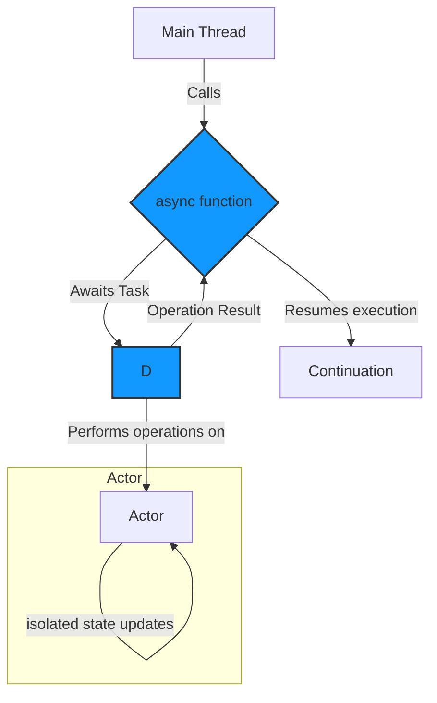
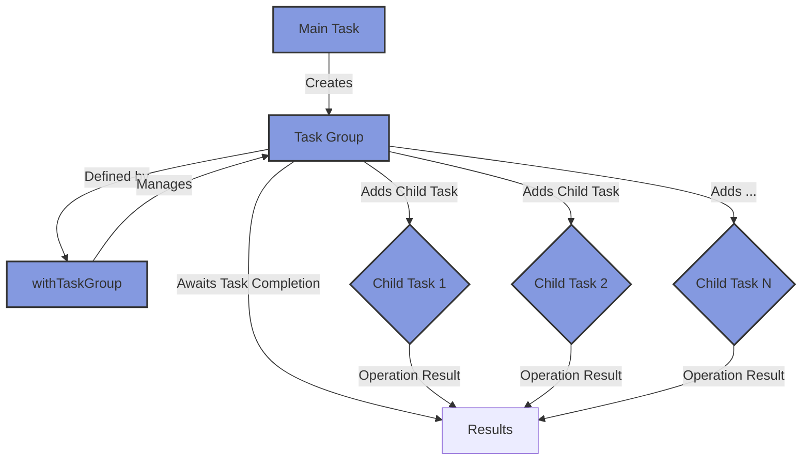
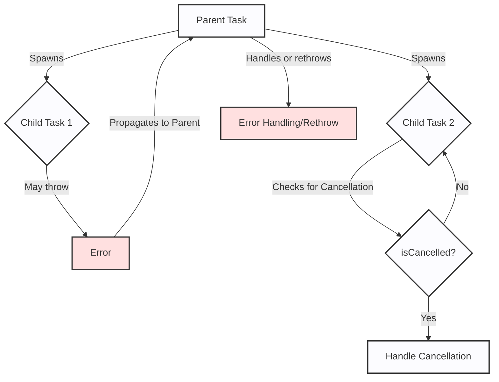

# Swift Concurrency (async/await) - Asynchronous Task Processing

Here's the set of Mermaid diagrams for Swift Concurrency.

### 1. High-Level Overview of Swift Concurrency

This diagram provides a simplified view of how `async/await` integrates into a program's flow.

**Explanation:**

1. **Main Thread**: The primary execution thread, typically responsible for UI updates.
2. **async function foo()**: A function marked as `async`, capable of suspending and resuming execution; this represents your asynchronous functions and methods.
3. **Awaits**: The `await` keyword marks a potential suspension point.
4. **Background Thread**: The asynchronous operation is executed on a background thread or a pool of threads managed by the Swift runtime, allowing to not block other tasks and maintain app responsiveness, like `MTLCommandQueue` does with tasks to be executed on the GPU.
5. **Resumes after await**: Once the awaited operation completes, the function resumes execution; the runtime will handle execution on the main thread if it's a `@MainActor.`
6. **Continuation on Main Thread**: Execution returns to the main thread, ensuring UI updates are performed safely.

### 2. `async`/`await` and Actors

This diagram shows how `async/await` interacts with actors, a core component of Swift's concurrency for data isolation.

**Explanation:**

1. **async function**: An asynchronous function initiates a task.
2. **Awaits Task**: The function awaits the task's completion.
3. **Performs operations on**: The task interacts with an actor.
4. **Actor**: An actor protects its internal state, ensuring data consistency in concurrent operations.
5. **isolated state updates**: The actor's state is updated in a thread-safe manner.
6. **Operation Result**: The outcome of the operation is sent back to the actor boundary for processing.
7. **Continuation**: The `async` function resumes after the `await`, similar to how a `MTLRenderCommandEncoder` encodes data to be committed to a `MTLCommandBuffer` which will eventually signal a `MTLFence` object to indicate completion, similar to how `await` will signal the runtime when the awaited operation has completed.

### 3. Task Hierarchy and Structured Concurrency

This diagram illustrates how tasks are organized hierarchically, demonstrating structured concurrency, one of the main pillars that are important to understand the inner workings of Swift Concurrency.

```mermaid
graph TD
    A[Main Task] -->|Spawns| B(Child Task 1);
    A -->|Spawns| C(Child Task 2);
    A -->|Spawns| D(async let Child Task 3);
    B -->|May spawn| E(Sub-Child Task);
    C -->|Awaits| F(Result/throws);
    A -->|Implicitly awaits all children| G[End of Main Task];
     
    
    
classDef task fill:#211,stroke:#333,stroke-width:2px;
class A,B,C,D,E task

classDef error fill:#511f,stroke:#333,stroke-width:2px;
class F error

```

**Explanation:**

1. **Main Task**: The parent task, which can be implicit (e.g., the body of an `async` function).
2. **Child Task 1 & 2**: Tasks spawned by the main task, inheriting its priority and cancellation state. The parent task will await for the completion of these tasks before completing its own work.
3. **async let Child Task 3**:  Using `async let` to create a concurrent child task that can run in parallel and whose result will be awaited later. The parent task will await for the completion of these tasks before completing its own work just like other child tasks.
4. **Sub-Child Task**: Tasks can create further child tasks, forming a hierarchy.
5. **Awaits**: Child tasks can `await` results or handle errors from other tasks just like the parent task can do with child tasks.
6. **Implicitly awaits all children**: Before a parent task completes, it implicitly awaits the completion of all its child tasks. This ensures resources are cleaned up properly and prevents "dangling" tasks. This is important to understand to identify potential issues when troubleshooting Swift Concurrency.

### 4. Task Groups

This diagram illustrates how `withTaskGroup` can manage a dynamic number of child tasks.

**Explanation:**

1. **Main Task**: Initiates the task group.
2. **Task Group**: A container for dynamically created child tasks.
3. **withTaskGroup**: The function that defines and manages a task group's scope and lifetime to ensure proper hierarchy and propagation of changes across the group.
4. **Adds Child Task**: Child tasks are added to the group using `group.addTask`.
5. **Child Task 1, 2, N**: These represent concurrent operations within the group.
6. **Awaits Task Completion**: The task group implicitly awaits the completion of all child tasks before proceeding.
7. **Results**: Child tasks might produce results, which are often collected and processed by the parent task.

### 5. Error Handling and Cancellation

This diagram demonstrates how errors and cancellation propagate through the task hierarchy.

**Explanation:**

1. **Parent Task**: The main task.
2. **Child Task 1**: May throw an error during its execution.
3. **Child Task 2**: Periodically checks for cancellation using `Task.isCancelled` or `Task.checkCancellation()`.
4. **Error**: An error thrown by a child task.
5. **isCancelled?**: Determines if the task has been cancelled, allowing tasks to avoid unnecessary work and have predictable behavior.
6. **Handle Cancellation**: A child task may perform cleanup or specific actions upon cancellation.
7. **Propagates to Parent**: Errors propagate up the task hierarchy unless handled by an intermediate task.
8. **Error Handling/Rethrow**: The parent task can catch and handle the error or rethrow it further up the hierarchy.

These diagrams provide a comprehensive overview of Swift Concurrency's key features, drawing parallels with the previously discussed rendering pipeline where appropriate:

*   **Asynchronous Execution:** Like submitting a command buffer to a queue in Metal, `async/await` offloads work to be performed concurrently.
*   **Synchronization:** `await` acts as a synchronization point, similar to how a fence ensures GPU operations are completed before proceeding. Actors provide a data isolation mechanism comparable to using separate command buffers or different render passes for independent rendering operations.
*   **Task Hierarchy:** Structured concurrency with its parent-child task relationships is analogous to how a complex rendering scene might be broken down into smaller, manageable sub-tasks or render passes.
*   **Error Handling and Cancellation:** Just as a rendering pipeline needs to handle errors (e.g., invalid shader code) and potentially be aborted, Swift Concurrency provides mechanisms for error propagation and graceful cancellation of tasks.

---

