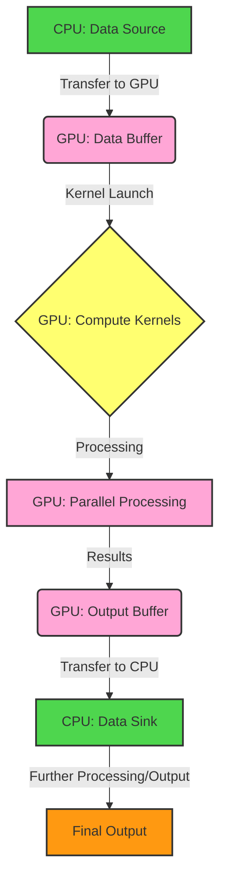
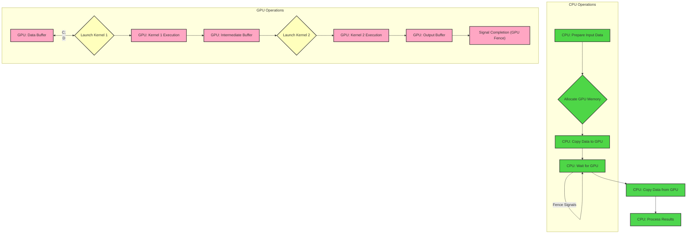
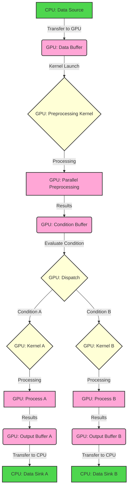
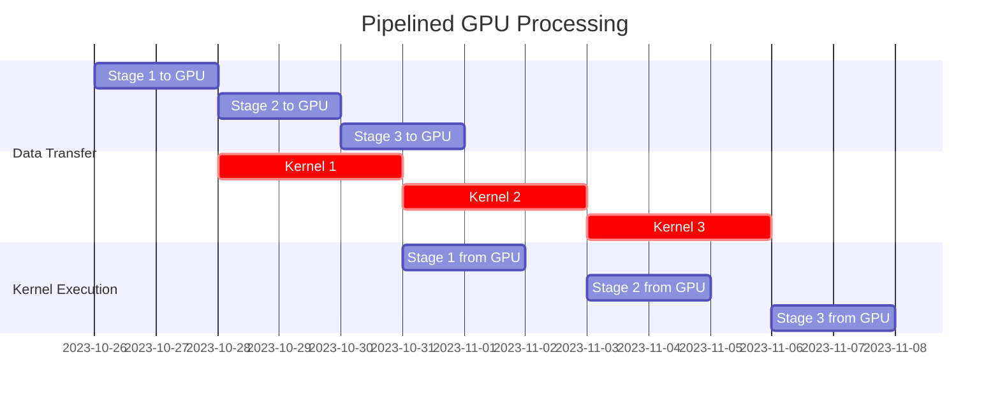
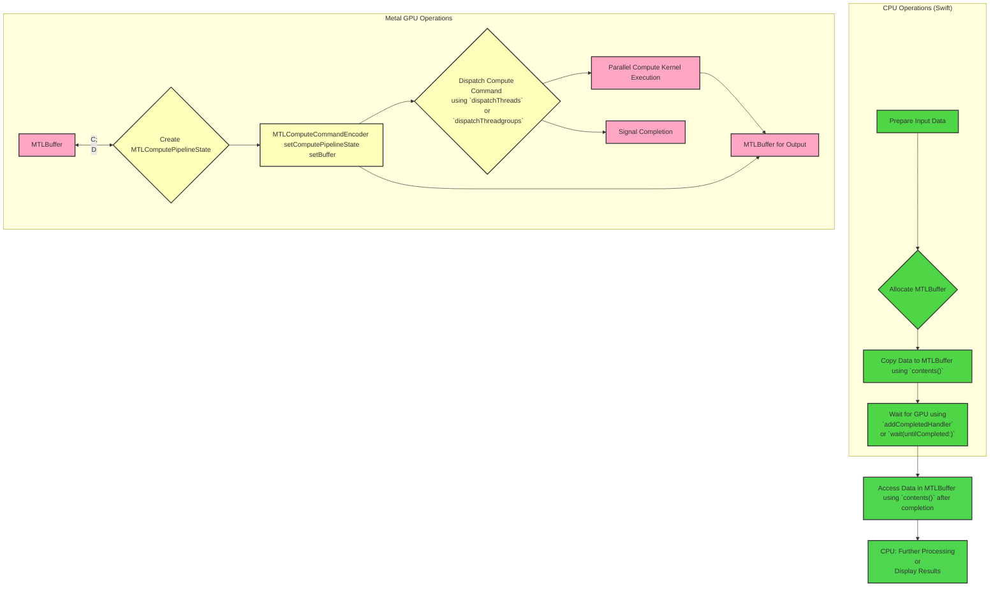

# Data Processing Pipelines using GPUs - Data Processing Pipelines

**Goal:** To illustrate how data processing pipelines leverage GPUs, drawing parallels with the Metal rendering pipeline but emphasizing the distinct characteristics of data-intensive computations.

**Key Concepts to Illustrate:**

1. **Data Transfer:** Movement of data between CPU and GPU memory.
2. **Kernel Execution:** Parallel processing on the GPU using compute kernels.
3. **Data Dependencies:** Handling dependencies between processing stages.
4. **Synchronization:** Coordinating CPU and GPU operations.
5. **Types of Pipelines:** Different pipeline structures based on use cases.

## Mermaid Diagrams for GPU-Accelerated Data Processing Pipelines

### 1. High-Level Overview of a Generic GPU Data Processing Pipeline

This diagram provides a simplified view of a typical data processing pipeline that utilizes a GPU for acceleration.

**Explanation:**

1. **CPU: Data Source:** The initial data resides in CPU memory.
2. **Transfer to GPU:** Data is copied to GPU memory for processing.
3. **GPU: Compute Kernels:**  Kernels define the parallel computations.
4. **GPU: Parallel Processing:** The GPU executes kernels on the data.
5. **GPU: Output Buffer:** Results are stored in GPU memory.
6. **Transfer to CPU:** Results are copied back to CPU memory.
7. **CPU: Data Sink:** Further processing or output on the CPU.
8. **Final Output:** The final result of the pipeline.

### 2. Detailed GPU Data Processing Pipeline with Synchronization

This diagram elaborates on data transfer, kernel execution, and synchronization using fences (similar to Metal's `MTLFence`).

**Explanation:**

1. **CPU Operations:**
    *   Prepare input data.
    *   Allocate GPU memory.
    *   Copy data to the GPU.
    *   Wait for GPU processing to complete (using a fence).

2. **GPU Operations:**
    *   `GPU: Data Buffer` receives data from the CPU.
    *   `Launch Kernel 1`: Executes the first compute kernel.
    *   `GPU: Kernel 1 Execution`: Parallel processing on the GPU.
    *   `GPU: Intermediate Buffer`: Stores intermediate results on the GPU.
    *   `Launch Kernel 2`: Executes the second compute kernel.
    *   `GPU: Kernel 2 Execution`: Parallel processing on the GPU
    *   `GPU: Output Buffer`: Stores the final results of GPU processing.
    *   Signal Completion (GPU Fence).

3. **Synchronization:**
    *   `CPU: Wait for GPU` is blocked until the GPU fence signals completion.

4. **Post-Processing:**
    *   `CPU: Copy Data from GPU`: Results are transferred back to the CPU.
    *   `CPU: Process Results`: Further processing or output on the CPU.

### 3. Branching Pipeline for Conditional GPU Processing

This diagram illustrates a pipeline where data processing can branch based on conditions, similar to control flow in a rendering pipeline.

**Explanation:**

1. **Preprocessing:** Data is preprocessed on the GPU.
2. **Condition Evaluation:** A condition is evaluated on the GPU, potentially based on the preprocessed data.
3. **Dispatch:** Based on the condition, different kernels are launched.
4. **Conditional Processing:** Either `Kernel A` or `Kernel B` is executed.
5. **Output:** Results are stored in separate output buffers.
6. **Transfer to CPU:** Results are transferred back to the CPU for further handling.

### 4. Pipelined GPU Processing with Overlapping Stages

This diagram illustrates an advanced pipeline where different stages of processing overlap in time, maximizing GPU utilization. It represents that concept using a variation of Gantt chart.

**Explanation:**

*   **Data Transfer (Stages 1-3):** Data for different stages is transferred to the GPU in an overlapping manner. While one stage's data is being processed, the next stage's data can be transferred.
*   **Kernel Execution (Kernels 1-3):** Kernels for different stages are executed sequentially, but with overlap. For example, `Kernel 2` can start before `Kernel 1` finishes, as long as data dependencies are met.
*   **Data Transfer (Stages 1-3 from GPU):** Results are transferred back to the CPU, again with potential overlap.

**Benefits of Pipelining:**

*   **Increased Throughput:** By overlapping stages, the overall processing time is reduced.
*   **Improved Resource Utilization:** The GPU is kept busy more consistently.
*   **Reduced Latency:** Results for individual stages become available sooner.

### 5. Data Processing Pipeline using Metal on iOS Devices

This diagram illustrates a data processing pipeline that utilizes Metal on an iOS device for GPU acceleration.

---

**Explanation:**

1. **CPU Operations (Swift):**
    *   Input data is prepared on the CPU.
    *   An `MTLBuffer` is allocated for GPU data.
    *   Data is copied to the `MTLBuffer` using the `.contents()` method to get a raw pointer.

2. **Metal GPU Operations:**
    *   `MTLBuffer` holds the data on the GPU.
    *   `MTLComputePipelineState` is created, which represents the compiled compute kernel.
    *   `MTLComputeCommandEncoder` sets the pipeline state and the buffer for the kernel.
    *   The compute command is dispatched using `dispatchThreads` or `dispatchThreadgroups`.
    *   Parallel kernel execution occurs on the GPU.
    *   Output is written to another `MTLBuffer`.
    *   Completion is signaled.

3. **Synchronization:**
    *   The CPU waits for GPU completion using `addCompletedHandler` or `waitUntilCompleted`.
    *   `MTLCommandBuffer` automatically handles the execution order of commands and synchronization.

4. **Post-Processing:**
    *   Data from the output `MTLBuffer` is accessed using `.contents()` after ensuring the GPU has finished.
    *   Further processing or display of results happens on the CPU.

**Key Features on iOS with Metal:**

*   Leverages Metal's unified memory architecture on iOS devices (shared memory between CPU and GPU - in most cases).
*   Uses `MTLBuffer` for efficient data transfer.
*   Employs `MTLComputePipelineState` for optimized kernel execution.
*   Uses `MTLComputeCommandEncoder` to encode and dispatch compute commands.
*   Automatic synchronization with `MTLCommandBuffer` which simplifies CPU-GPU coordination.

These diagrams provide a comprehensive overview of GPU-accelerated data processing pipelines, covering various aspects from basic data flow to advanced synchronization and pipelining techniques. They also highlight the specific implementation considerations when using Metal on iOS devices.

---
