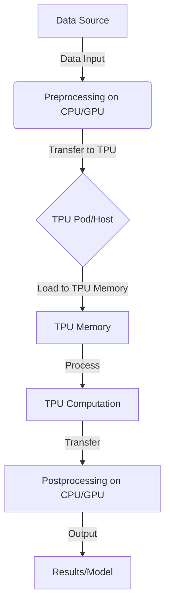
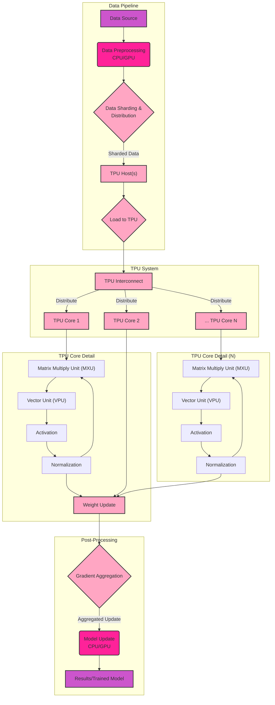
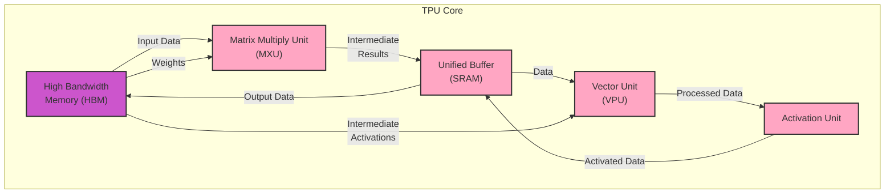
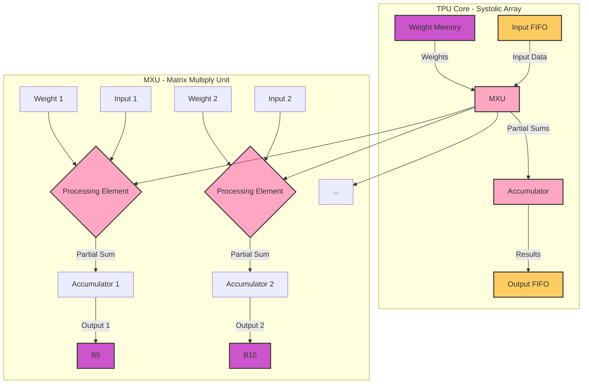

# Data Processing Pipelines using TPUs - Data Processing Pipelines

Here are the Mermaid diagrams for **Data Processing Pipelines using TPUs**, categorized for clarity.

## Mermaid Diagrams for TPU Data Processing Pipelines

### 1. High-Level Overview of TPU Data Processing

This diagram provides a simplified, high-level view of a typical data processing pipeline on TPUs.

**Explanation:**

1. **Data Source**: The origin of the data (e.g., database, cloud storage, local files).
2. **Preprocessing on CPU/GPU**: Initial data cleaning, transformation, and preparation, often performed on CPUs or GPUs due to their flexibility in handling various data types.
3. **Transfer to TPU**: Prepared data is transferred to the TPU host or pod.
4. **Load to TPU Memory**: Data is loaded into the TPU's high-bandwidth memory (HBM).
5. **TPU Computation**: The core processing, typically model training or inference, leveraging the TPU's matrix multiplication capabilities, which can be broken down further using nodes to specify each of the internal computations that take place during TPU Computation..
6. **Transfer**: Results are transferred back to the CPU/GPU.
7. **Postprocessing on CPU/GPU**: Further processing, aggregation, or analysis of results.
8. **Results/Model**: The final output, which could be trained model weights, predictions, or other insights.

### 2. Detailed TPU Data Processing Pipeline

This diagram expands on the high-level overview, adding more details about the TPU architecture and data flow.

**Explanation:**

1. **Data Pipeline**:
    *   **Data Source**: The origin of the data.
    *   **Data Preprocessing**: Initial data handling on CPU/GPU.
    *   **Data Sharding & Distribution**: Data is divided into shards for parallel processing across multiple TPU cores.
    *   **TPU Host(s)**: Server(s) connected to the TPUs, responsible for data transfer and orchestration.
    *   **Load to TPU**: Transferring the sharded data to individual TPU chips or cores.

2. **TPU System**:
    *   **TPU Interconnect**: High-speed network connecting multiple TPU cores/chips for efficient communication and data exchange.
    *   **TPU Core 1, 2, ... N**: Individual processing units within the TPU system, each capable of parallel computation.

3. **TPU Core Detail**:
    *   **Matrix Multiply Unit (MXU)**: Specialized hardware for accelerating matrix multiplications, the core operation in many machine learning models.
    *   **Vector Unit (VPU)**: Performs other vector operations.
    *   **Activation**: Applies activation functions (e.g., ReLU).
    *   **Normalization**: Normalizes data (e.g., Batch Normalization).
    *   **Weight Update**: Updates model weights based on computed gradients. This node also works has a feedback mechanism to the MXU and VPU to allow for backpropagation and model optimization.

4. **Post-Processing**:
    *   **Gradient Aggregation**: Combines gradients computed across different TPU cores.
    *   **Model Update**: Updates the model weights on the CPU/GPU using the aggregated gradients.
    *   **Results/Trained Model**: The final output stored or utilized further.

### 3. TPU Pipeline Stages and Memory

This diagram focuses on the internal stages of a TPU core during processing and the interaction with different memory types.

**Explanation:**

1. **High Bandwidth Memory (HBM)**: Fast memory attached directly to the TPU core, holding input data, weights, and intermediate activations.
2. **Matrix Multiply Unit (MXU)**: Performs matrix multiplications, taking input data and weights from HBM.
3. **Unified Buffer (SRAM)**: On-chip memory used to store intermediate results from the MXU before passing them to the VPU or back to HBM.
4. **Vector Unit (VPU)**: Executes element-wise operations, taking data from the Unified Buffer.
5. **Activation Unit**: Applies activation functions, taking data from the VPU and can also provide feedback to the vector unit, as the computations in the Vector Unit are not restricted to element-wise operations.
6. **Synchronization and Memory Transfers**: Arrows indicate data flow between memory and processing units. Note that the `Unified Buffer` acts as a bridge between the `MXU` and the `VPU` and also facilitates data movement back to `HBM`. The use of `HBM` in both the input and output stages demonstrates its high bandwidth advantage and its role in managing large volumes of data I/O during TPU computations.

### 4. TPU Pipeline with Systolic Array Detail

&#x20;

**Explanation:**

1. **TPU Core - Systolic Array**: This subgraph provides a high-level overview of a systolic array, a key architectural feature of TPUs.

    *   **Weight Memory**: Stores the weights used for matrix multiplications.
    *   **MXU (Matrix Multiply Unit)**: A grid of processing elements that performs matrix multiplications in a systolic manner (data flows rhythmically across the array). It receives both weights (from Weight Memory) and input data (from Input FIFO).
    *   **Input FIFO**: A queue that buffers input data before it enters the MXU.
    *   **Accumulator**: Accumulates the partial sums generated by the MXU.
    *   **Output FIFO**: A queue that buffers the results from the Accumulator before they are written back to memory.

2. **MXU - Matrix Multiply Unit**: This subgraph provides a simplified view of a few processing elements within the MXU to illustrate the systolic data flow. This is where the weights and inputs are utilized in an arithmetic operation to further improve the model during training.

    *   **Weight 1, Weight 2, ...**: Individual weights stored in memory.
    *   **Input 1, Input 2, ...**: Individual input data values.
    *   **Processing Element**: Performs a multiply-accumulate operation (MAC) on its input and weight, and passes the partial sum to the next processing element.
    *   **Accumulator 1, Accumulator 2, ...**: Accumulates the partial sums from the processing elements.
    *   **Output 1, Output 2, ...**: The final results after accumulation.

**Data Flow**:

*   Weights flow from the Weight Memory to each Processing Element in the MXU.
*   Input data flows from the Input FIFO to the Processing Elements, moving rhythmically across the array.
*   Each Processing Element performs a MAC operation and passes the result to its neighbor.
*   The Accumulators collect the partial sums to produce the final outputs.

These diagrams illustrate the key features of TPU data processing pipelines: massive parallelism through sharding and multiple cores, specialized hardware for matrix operations, efficient data movement, and a staged processing approach. The structure and flow have similarities to the Metal rendering pipeline (command queue, encoders, resource binding, execution stages) but are optimized for the specific needs of machine learning workloads.

---
