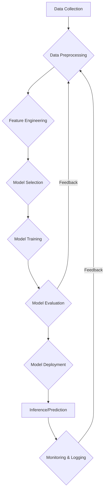
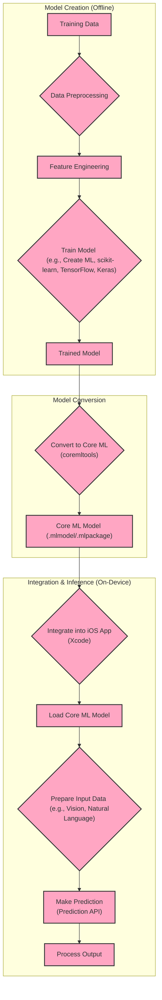
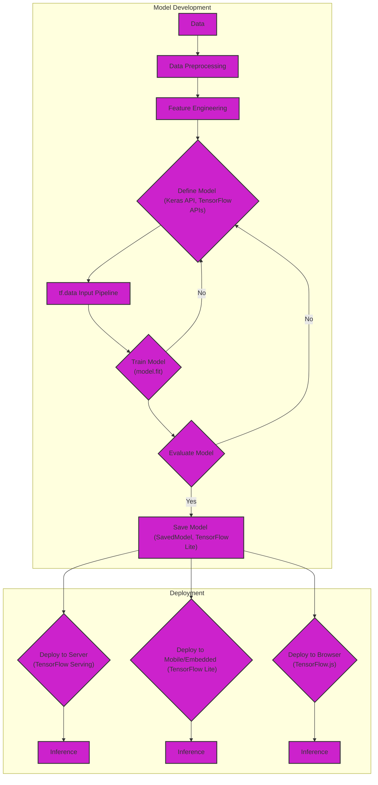
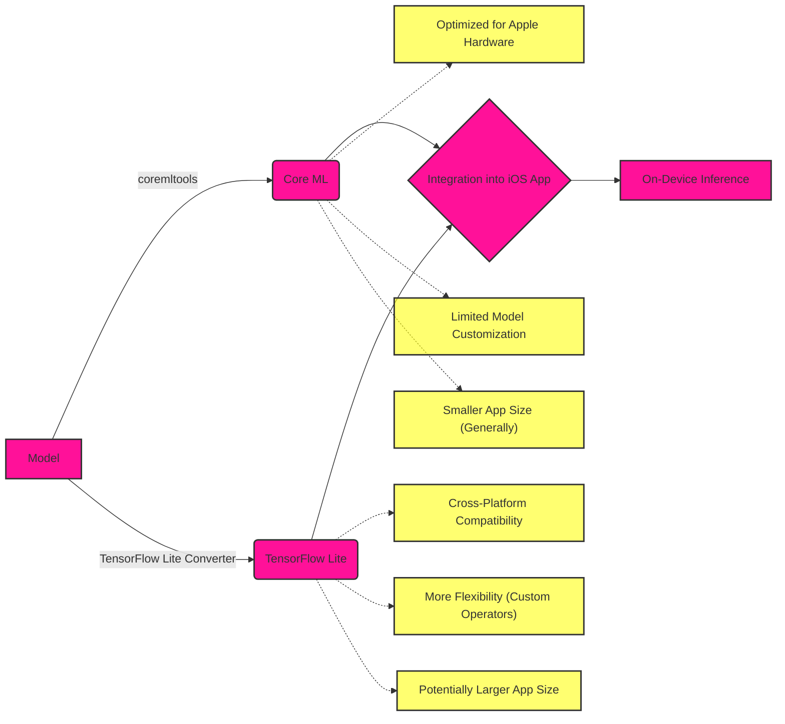
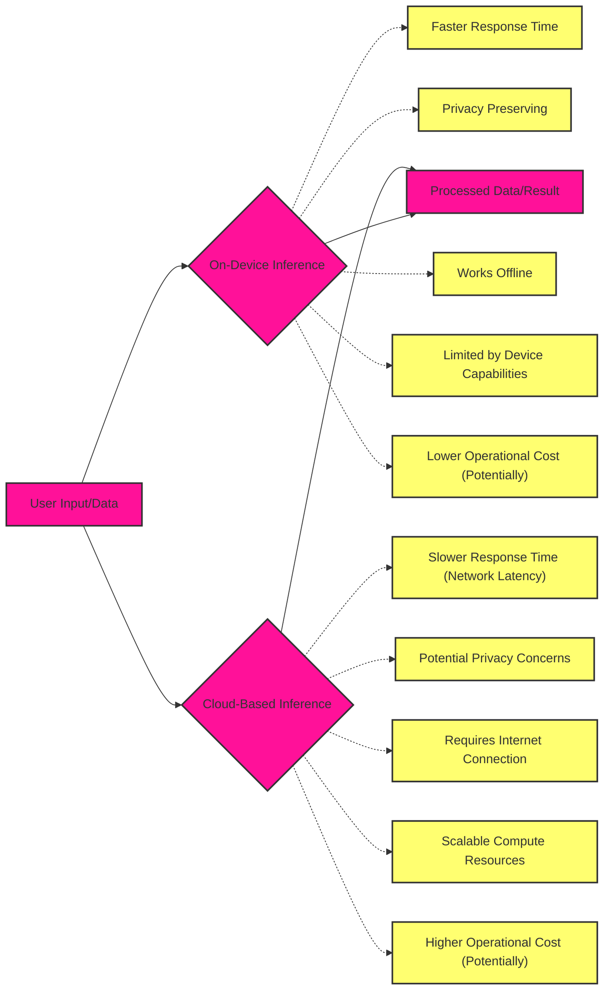

# Machine Learning Pipelines (Core ML, TensorFlow) - Data Processing Pipelines

Here's a breakdown of the diagrams, categorized for clarity

## 1. High-Level Overview of a Generic ML Pipeline

This diagram presents a simplified, abstract view of a typical machine learning pipeline, analogous to the high-level overview of the Metal rendering pipeline.

**Explanation:**

1. **Data Collection:** Gathering raw data from various sources.
2. **Data Preprocessing:** Cleaning, transforming, and preparing the data for the model.
3. **Feature Engineering:** Selecting, extracting, and transforming features to improve model performance.
4. **Model Selection:** Choosing the appropriate ML algorithm for the task.
5. **Model Training:** Training the selected model using the prepared data.
6. **Model Evaluation:** Assessing the model's performance using validation and test datasets.
7. **Model Deployment:** Integrating the trained model into an application or system.
8. **Inference/Prediction:** Using the deployed model to make predictions on new data.
9. **Monitoring & Logging**: Track model performance and gather data for retraining and improvements.

## 2. Core ML Pipeline

This diagram details the specific steps involved in using Core ML for on-device machine learning.

**Explanation:**

1. **Model Creation (Offline):**
    *   Training data is preprocessed and used for feature engineering.
    *   A model is trained using tools like Create ML, scikit-learn, TensorFlow, or Keras.
2. **Model Conversion:**
    *   The trained model is converted to the Core ML format using `coremltools`.
3. **Integration & Inference (On-Device):**
    *   The Core ML model is integrated into an iOS app using Xcode.
    *   The app loads the model, prepares input data, makes predictions using the Core ML Prediction API, and processes the output.

## 3. TensorFlow Pipeline

This diagram illustrates the steps in a TensorFlow-based machine learning pipeline, highlighting both training and deployment aspects.

**Explanation:**

1. **Model Development:**
    *   Data preprocessing and feature engineering are performed.
    *   The model is defined using the Keras or TensorFlow APIs.
    *   A `tf.data` input pipeline efficiently feeds data for training.
    *   `model.fit` trains the model. The model is evaluated and the training process is repeated if needed.
    *   The trained model is saved using `SavedModel` format or converted to TensorFlow Lite format.

2. **Deployment:**
    *   The saved model can be deployed to a server using TensorFlow Serving, to mobile/embedded devices using TensorFlow Lite, or to a web browser using TensorFlow.js.
    *   In each deployment scenario, the model performs inference on new data.

## 4. Core ML vs. TensorFlow

This diagram provides a comparison focused on the integration aspect, highlighting the trade-offs between using Core ML and TensorFlow Lite for on-device inference.

**Explanation:**

*   A model (trained in any framework) can be converted to either Core ML or TensorFlow Lite.
*   Both can be integrated into an iOS app for on-device inference.

**Trade-offs:**

*   **Core ML:** Optimized for Apple hardware, resulting in better performance on iOS devices. However, it offers limited model customization and can only be deployed on Apple platforms.
*   **TensorFlow Lite:** Offers cross-platform compatibility and more flexibility (e.g., custom operators) but might not be as performant as Core ML on Apple devices. It can also lead to larger app sizes.

## 5. On-Device vs. Cloud-Based Inference in ML Pipelines

The following diagram in this context is similar to the one described in section `4. Core ML vs. TensorFlow` illustrating the trade-offs of both approaches, extending beyond specific frameworks like Core ML and TensorFlow to encapsulate the broader decision-making process in ML system design and optimization for this use-case.

*   User input or data can be processed either on-device or in the cloud.
*   Both approaches deliver processed data or a result, but they differ significantly in their trade-offs.

**Trade-offs:**

*   **On-Device Inference:** Offers faster response times, preserves user privacy, and works offline, but the inference speed depends on the device hardware. It is constrained by the device's processing capabilities and may involve lower operational costs, as it doesn't necessarily rely on server usage.
*   **Cloud-Based Inference:** Incurs network latency, potentially leading to slower response times, and may raise privacy concerns since data is transmitted off-device. It requires an internet connection to function. However, it offers virtually unlimited processing power, benefits from scalable compute resources, and can handle more complex models. Operational costs can be higher due to the need for server infrastructure and bandwidth.

These diagrams provide a clear and organized view of machine learning pipelines, particularly Core ML and TensorFlow, highlighting their unique characteristics and relating them to the broader concepts of data processing and analogous pipelines we discussed earlier.

---
