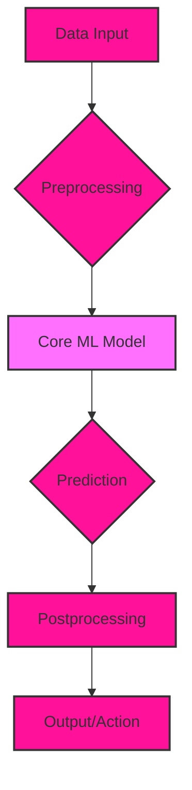
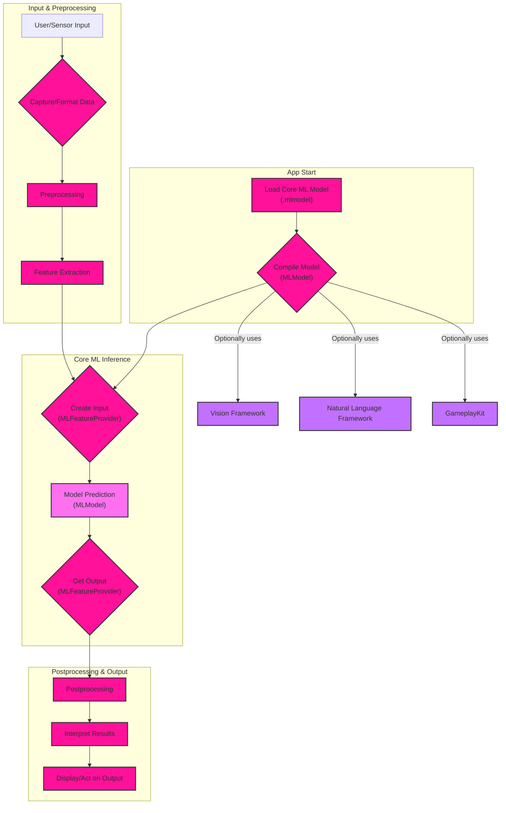
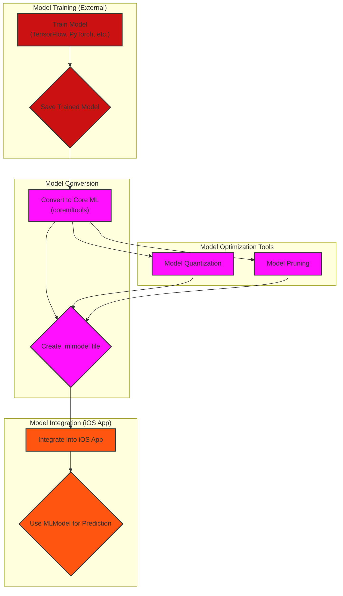
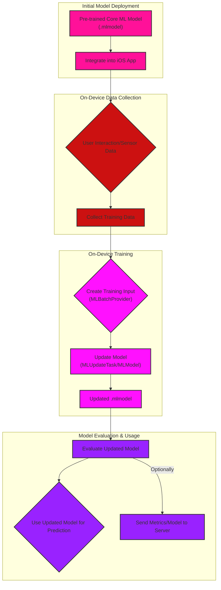

# Core ML Machine Learning Pipelines - Data Processing Focus

## 1. High-Level Overview of a Core ML Pipeline

This diagram provides a simplified, high-level view of the typical stages involved in using a Core ML model for inference.

**Explanation:**

1. **Data Input:** Raw data is fed into the pipeline (e.g., image, text, sensor data).
2. **Preprocessing:** Data is transformed into a format suitable for the Core ML model (e.g., resizing, normalization, feature extraction).
3. **Core ML Model:** The pre-trained model performs inference on the processed data.
4. **Prediction:** The model generates a prediction (e.g., classification, regression, object detection).
5. **Postprocessing:** The prediction is interpreted or transformed into a usable format (e.g., converting probabilities to class labels, applying non-maximum suppression).
6. **Output/Action:** The final result is used to display information, trigger an action, or feed into another system.

## 2. Detailed Core ML Pipeline with Model Integration

This diagram expands on the integration of a Core ML model into an iOS app, including model loading and interaction with other frameworks.

**Explanation:**

1. **App Start:**
    *   The `.mlmodel` file is loaded.
    *   The model is compiled into an `MLModel` instance, ready for use.
2. **Input & Preprocessing:**
    *   User input or sensor data is captured.
    *   Data undergoes preprocessing and feature extraction to match the model's input requirements.
3. **Core ML Inference:**
    *   An `MLFeatureProvider` is created to encapsulate the input features.
    *   `MLModel` performs the prediction.
    *   The output is also an `MLFeatureProvider`.
4. **Postprocessing & Output:**
    *   The output is postprocessed and interpreted.
    *   Results are displayed or used to trigger actions.
5. **Framework Integration:**
    *   Core ML can work with Vision (image analysis), Natural Language (text processing), and GameplayKit (decision-making) frameworks for specific tasks.

## 3. Core ML Pipeline with Model Conversion and Core Tools

This diagram illustrates the process of converting a model from another framework (e.g., TensorFlow, PyTorch) to Core ML format.

**Explanation:**

1. **Model Training (External):**
    *   A model is trained using a framework like TensorFlow or PyTorch.
    *   The trained model is saved.
2. **Model Conversion:**
    *   `coremltools` is used to convert the model to Core ML format.
    *   An `.mlmodel` file is generated.
3. **Model Integration (iOS App):**
    *   The `.mlmodel` file is added to the iOS project.
    *   The `MLModel` class is used to make predictions within the app.
4. **Model Optimization Tools:**

    *   **Quantization:** Reduces the precision of model weights to decrease size and potentially improve speed.
    *   **Pruning:** Removes less important connections in the model to reduce size and computation.

## 4. Core ML Pipeline with On-Device Training

This diagram showcases the advanced capability of on-device model updates or personalization using Core ML 3 and later.

**Explanation:**

1. **Initial Model Deployment:** A pre-trained Core ML model is integrated into the app.
2. **On-Device Data Collection:** The app collects data from user interactions or sensors.
3. **On-Device Training:**
    *   An `MLBatchProvider` is used to efficiently provide training data.
    *   `MLUpdateTask` (or directly `MLModel` for more control) updates the model's weights using the new data.
    *   An updated `.mlmodel` is generated.
4. **Model Evaluation & Usage:**
    *   The updated model is evaluated for performance.
    *   The updated model is used for subsequent predictions.
    *   Optionally, model metrics or the updated model can be sent to a server for analysis or aggregation.

These diagrams provide a comprehensive overview of Core ML pipelines, from basic inference to model conversion and on-device training. They highlight the unique aspects of Core ML while demonstrating its connection to broader machine learning concepts.

---
