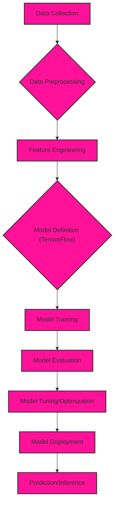
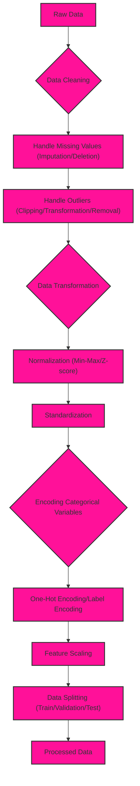
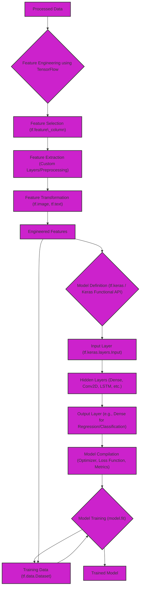
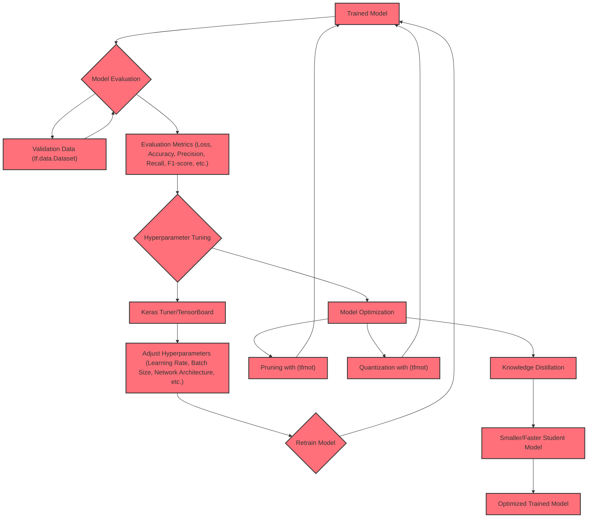
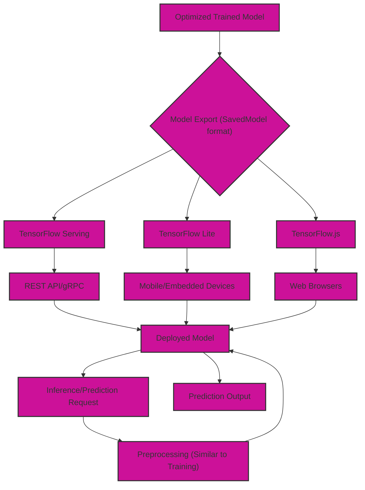

# Machine Learning Pipelines using TensorFlow - Data Processing Focus

## 1. High-Level Overview of a TensorFlow ML Pipeline

This diagram presents a simplified view of the major stages in a typical TensorFlow ML pipeline.

**Explanation:**

1. **Data Collection:** Gathering raw data from various sources.
2. **Data Preprocessing:** Cleaning, transforming, and preparing the data for model training.
3. **Feature Engineering:** Selecting, extracting, and transforming relevant features from the data.
4. **Model Definition (TensorFlow):** Creating the ML model architecture using TensorFlow APIs.
5. **Model Training:** Training the model using the prepared data and optimizing its parameters.
6. **Model Evaluation:** Assessing the model's performance using evaluation metrics.
7. **Model Tuning/Optimization:** Adjusting hyperparameters and model architecture to improve performance.
8. **Model Deployment:** Making the trained model available for use in an application.
9. **Prediction/Inference:** Using the deployed model to make predictions on new data.

## 2. Detailed Data Preprocessing Pipeline

This diagram dives deeper into the data preprocessing stage, outlining common steps and techniques.

**Explanation:**

1. **Raw Data:** The initial dataset before any processing.
2. **Data Cleaning:** Addressing data quality issues.
3. **Handle Missing Values:** Dealing with missing data points (e.g., imputation, deletion).
4. **Handle Outliers:** Addressing extreme values (e.g., clipping, transformation).
5. **Data Transformation:** Applying transformations to improve data distribution (e.g., logarithmic, Box-Cox).
6. **Normalization:** Scaling features to a specific range (e.g., min-max, z-score).
7. **Standardization:** Centering and scaling features to have zero mean and unit variance.
8. **Encoding Categorical Variables:** Converting categorical features into numerical representations.
9. **One-Hot Encoding/Label Encoding:** Techniques for encoding categorical variables.
10. **Feature Scaling:**  Ensuring that features have similar ranges of values.
11. **Data Splitting:** Dividing the data into training, validation, and test sets.
12. **Processed Data:** The final output of the data preprocessing pipeline, ready for model training.

## 3. TensorFlow Feature Engineering and Model Training Pipeline

This diagram illustrates the feature engineering process and its integration with TensorFlow model training.

**Explanation:**

1. **Processed Data:** The output from the data preprocessing stage.
2. **Feature Engineering using TensorFlow:** Utilizing TensorFlow APIs for feature manipulation.
3. **Feature Selection:** Selecting relevant features using `tf.feature_column` or other techniques.
4. **Feature Extraction:** Creating new features using custom layers or preprocessing logic.
5. **Feature Transformation:** Applying transformations using `tf.image`, `tf.text`, or other TensorFlow modules.
6. **Engineered Features:** The combined set of original and newly created features.
7. **Model Definition (tf.keras / Keras Functional API):** Defining the neural network architecture.
8. **Input Layer:** Specifying the input shape and data type.
9. **Hidden Layers:** Adding intermediate layers (e.g., Dense, Conv2D, LSTM).
10. **Output Layer:** Defining the final layer based on the task (e.g., regression, classification).
11. **Model Compilation:** Configuring the optimizer, loss function, and evaluation metrics.
12. **Model Training (model.fit):** Training the model using the prepared data.
13. **Training Data (tf.data.Dataset):** Efficiently loading and feeding data to the model using `tf.data`.
14. **Trained Model:** The model with learned parameters after training.

## 4. TensorFlow Model Evaluation and Tuning

This diagram elaborates on how a TensorFlow model is evaluated, tuned, and optimized.

**Explanation:**

1. **Trained Model:** The model obtained after the initial training phase.
2. **Model Evaluation:** Assessing the model's performance on unseen data.
3. **Validation Data (tf.data.Dataset):** A separate dataset used for evaluation and tuning.
4. **Evaluation Metrics:** Quantifying the model's performance (e.g., loss, accuracy, precision, recall).
5. **Hyperparameter Tuning:** Systematically searching for optimal hyperparameter values.
6. **Keras Tuner/TensorBoard:** Tools for automated hyperparameter search and visualization.
7. **Adjust Hyperparameters:** Modifying learning rate, batch size, network architecture, etc.
8. **Retrain Model:** Training the model again with the adjusted hyperparameters.
9. **Model Optimization:**  Applying techniques to make the model smaller, faster, or more efficient.
10. **Pruning (tfmot):** Removing unnecessary connections in the network using TensorFlow Model Optimization Toolkit.
11. **Quantization (tfmot):** Reducing the precision of model weights and activations using TensorFlow Model Optimization Toolkit.
12. **Knowledge Distillation:** Transferring knowledge from a larger model to a smaller one.
13. **Smaller/Faster Student Model:** The result of knowledge distillation.
14. **Optimized Trained Model:** The final model after tuning and optimization.

## 5. TensorFlow Model Deployment and Inference

This diagram focuses on deploying a TensorFlow model and using it for inference.

**Explanation:**

1. **Optimized Trained Model:** The final model ready for deployment.
2. **Model Export (SavedModel format):** Saving the model in a standardized format.
3. **TensorFlow Serving:** A system for serving TensorFlow models over a network.
4. **REST API/gRPC:** Interfaces for accessing the deployed model.
5. **Deployed Model:** The model running in a production environment.
6. **TensorFlow Lite:** A framework for deploying models on mobile and embedded devices.
7. **Mobile/Embedded Devices:** Deploying models on devices with limited resources.
8. **TensorFlow.js:** A library for deploying and running models in web browsers.
9. **Web Browsers:** Running models directly in a client-side web application.
10. **Inference/Prediction Request:** New data sent to the model for prediction.
11. **Preprocessing (Similar to Training):** Applying the same preprocessing steps used during training.
12. **Prediction Output:** The model's prediction on the new data.

These diagrams provide a comprehensive overview of data processing pipelines in TensorFlow, covering high-level concepts to more detailed steps in each stage.

---