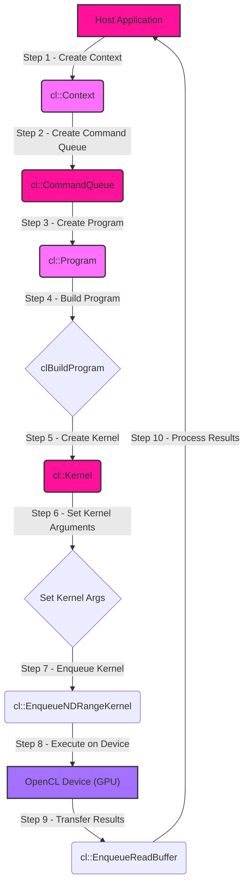
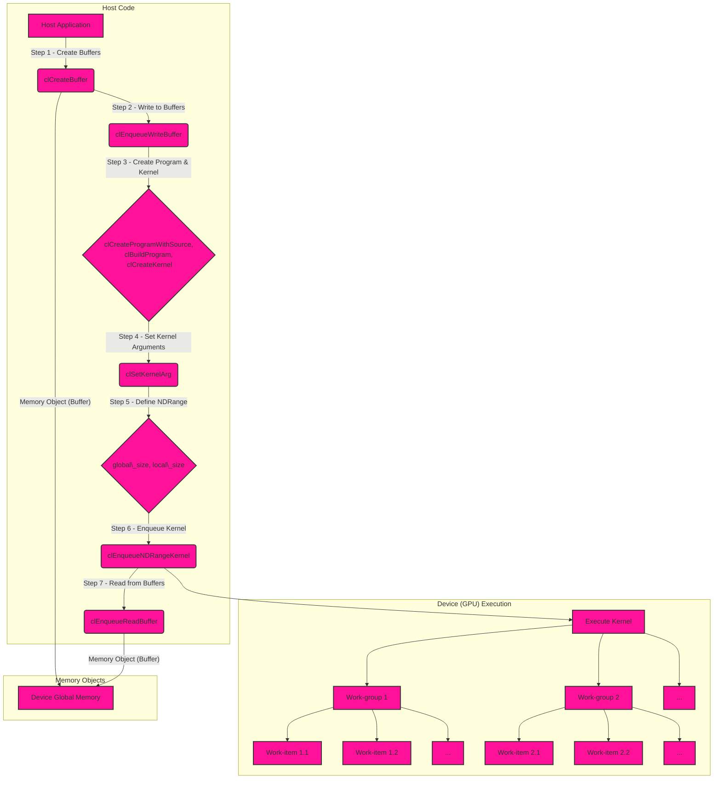
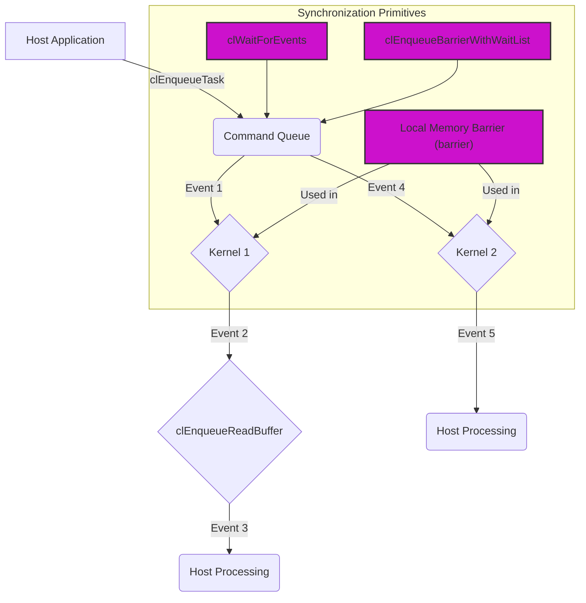

# GPU Compute Pipelines using OpenCL - GPU Compute Pipelines
> This content is dual-licensed under your choice of the following licenses:
> 1.  **MIT License:** For the code implementations in Swift and Mermaid provided in this document.
> 2.  **Creative Commons Attribution 4.0 International License (CC BY 4.0):** For all other content, including the text, explanations, and the Mermaid diagrams and illustrations.

---

## 1. High-Level Overview of OpenCL Compute Pipeline

This diagram provides a simplified, high-level view of the OpenCL compute pipeline, analogous to the Metal overview.

**Explanation:**

1. **Host Application (CPU):** Controls the OpenCL pipeline.
2. **cl::Context:** Manages OpenCL objects and execution context.
3. **cl::CommandQueue:** Queues commands for execution on the device.
4. **cl::Program:** Represents the OpenCL program (source code or binary).
5. **clBuildProgram:** Compiles and builds the program for the target device.
6. **cl::Kernel:** Represents a single, executable kernel function within the program.
7. **Set Kernel Arguments:** Sets input/output buffers and other parameters for the kernel.
8. **cl::EnqueueNDRangeKernel:** Enqueues the kernel for execution with a specified work-item configuration.
9. **OpenCL Device (GPU):** The compute device (e.g., GPU) executes the kernel.
10. **cl::EnqueueReadBuffer:** Transfers results from device memory back to the host.
11. **Process Results:** The host application processes the results.

## 2. OpenCL Platform Model and Context Setup

This diagram illustrates the OpenCL platform model and the steps involved in creating and initializing a context.

```mermaid
graph TD
    subgraph "OpenCL Platform Model"
        A[Host] -->|Connected to| B(Platform)
        B -->|Has one or more| C(Devices)
        C -->|Has one or more| D(Compute Units)
        D -->|Has one or more| E(Processing Elements)
    end

    subgraph "Context Creation and Initialization"
        F[Host Application] -->|Step 1 - Query Platforms| G(clGetPlatformIDs)
        G -->|Step 2 - Select Platform| H{Choose Platform}
        H -->|Step 3 - Query Devices| I(clGetDeviceIDs)
        I -->|Step 4 - Select Device| J{Choose Device}
        J -->|Step 5 - Create Context| K(clCreateContext)
        K -->|Step 6 - Create Command Queue| L(clCreateCommandQueue)
    end

    classDef model fill:#c1cf,stroke:#333,stroke-width:2px
    class A,B,C,D,E model
    class F,G,H,I,J,K,L model

```

**Explanation:**

*   **OpenCL Platform Model:**
    *   **Host:** The CPU that controls execution.
    *   **Platform:** A collection of devices managed by an OpenCL implementation (e.g., a vendor's driver).
    *   **Devices:** Compute devices like GPUs, CPUs, or accelerators.
    *   **Compute Units:** Parallel processing units within a device.
    *   **Processing Elements:** The smallest execution units within a compute unit.

*   **Context Creation and Initialization:**
    *   The host application queries for available platforms.
    *   A platform is selected.
    *   The application queries for devices associated with the platform.
    *   A device is selected.
    *   An OpenCL context is created, which encompasses the selected device(s).
    *   A command queue is created, associated with the context and a specific device.

## 3. OpenCL Kernel Execution and Memory Management

This diagram details the kernel execution process, including memory objects, work-item configuration, and data transfer.

**Explanation:**

*   **Host Code:**
    *   **clCreateBuffer:** Creates memory objects (buffers) in device memory.
    *   **clEnqueueWriteBuffer:** Transfers data from host memory to device buffers.
    *   **clCreateProgramWithSource, clBuildProgram, clCreateKernel:** Creates, builds, and defines a kernel object.
    *   **clSetKernelArg:** Associates kernel arguments with memory objects.
    *   **Define NDRange:** Specifies the global work size (total work-items) and local work size (work-items per work-group).
    *   **clEnqueueNDRangeKernel:** Enqueues the kernel for execution on the device.
    *   **clEnqueueReadBuffer:** Transfers data from device buffers back to host memory.

*   **Device (GPU) Execution:**
    *   The OpenCL runtime maps the NDRange to the device's compute units and processing elements.
    *   Work-groups are executed concurrently.
    *   Work-items within a work-group can execute cooperatively, sharing local memory.

*   **Memory Objects:**
    *   Buffers are allocated in device global memory and can be accessed by all work-items.

## 4. OpenCL Synchronization Mechanisms

This diagram focuses on the synchronization mechanisms available in OpenCL, including events and barriers.

**Explanation:**

*   **Events:**
    *   OpenCL commands, when enqueued, can return event objects.
    *   `clWaitForEvents` on the host can block execution until specified events are complete.
    *   Events can be used to chain commands and ensure proper ordering.

*   **Barriers:**
    *   `clEnqueueBarrierWithWaitList` enqueues a barrier that waits for a list of events before proceeding.
    *   `barrier` (within a kernel) synchronizes work-items within a work-group, ensuring all work-items reach the barrier before any proceed. There are `local` and `global` memory variantions for this instruction.

*   **Synchronization Use Cases:**
    *   Ensuring that a kernel has finished writing to a buffer before the host reads from it.
    *   Coordinating execution between different kernels.
    *   Synchronizing work-items within a work-group for operations involving shared local memory.

These diagrams provide a comprehensive overview of OpenCL compute pipelines, focusing on the distinctive features compared to Metal. Please let me know if you have any other questions.

---