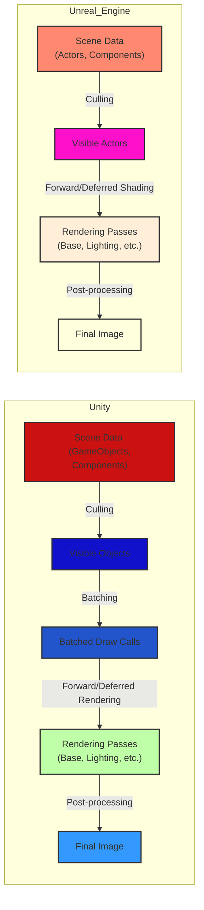
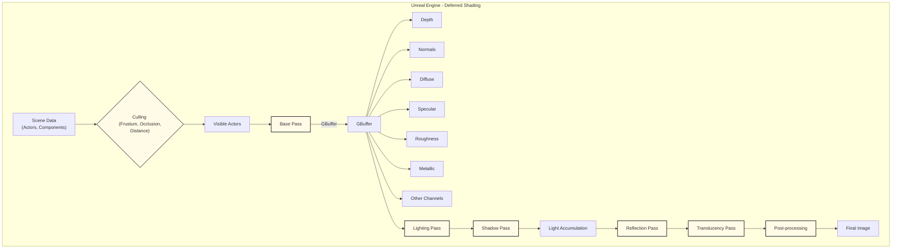

# Game Engines (Unity, Unreal Engine) - Graphics and Game Engine Pipelines
> This content is dual-licensed under your choice of the following licenses:
> 1.  **MIT License:** For the code implementations in Swift and Mermaid provided in this document.
> 2.  **Creative Commons Attribution 4.0 International License (CC BY 4.0):** For all other content, including the text, explanations, and the Mermaid diagrams and illustrations.

---

Here's a breakdown of the Mermaid diagrams for Unity and Unreal Engine, highlighting their distinct approaches to the rendering pipeline.

## High-Level Overview of Unity and Unreal Engine's Rendering Pipelines

This diagram provides a simplified, high-level comparison of the rendering pipelines in Unity and Unreal Engine.

**Explanation:**

*   **Scene Data:** Both engines start with scene data, represented as GameObjects in Unity and Actors in Unreal.
*   **Culling:** Both perform culling to determine which objects are visible to the camera.
*   **Rendering Passes:** Both execute multiple rendering passes (base pass, lighting, shadows, etc.), which can be configured for forward or deferred rendering.
*   **Post-processing:** Both apply post-processing effects (bloom, tone mapping, etc.) to create the final image.
*   **Batching (Unity):** Unity performs batching to combine draw calls for similar objects, reducing CPU overhead.

## Unity's Rendering Pipeline

This diagram provides a more detailed view of Unity's rendering process, focusing on its scriptable render pipelines (URP and HDRP).

```mermaid
graph TD
    subgraph "Unity - Universal Render Pipeline (URP)"
        A[Scene Data] --> B{Culling};
        B -- Frustum, Occlusion --> C[Visible Objects];
        C --> D{"Sorting & Batching \n (Static, Dynamic)"};
        D --> E[Forward Renderer];
        E -->| | F[Opaque Pass];
        F -->| | G[Transparent Pass];
        E -->| | H[Skybox Pass];
        G --> I[Post-processing Stack v2];
        H --> I;
        I --> J[Final Blit to Screen];

    end
    
    subgraph "Unity - High Definition Render Pipeline (HDRP)"
         AA[Scene Data] --> AB{Culling};
         AB -- Frustum, Occlusion, HD Culling --> AC[Visible Objects];
        AC --> AD[Pre-Refraction Pass];
        AD --> AE["Opaque Pass (Forward/Deferred)"]
        AE --> AF[Volumetric Pass]
        AF --> AG[Transparent Pass]
        AG --> AH[Post-processing Stack v3];

        AH --> AI[Final Blit to Screen];
    end

    classDef process fill:#f523,stroke:#333,stroke-width:2px
     class B,D,E,AB,AC,AD,AE,AF,AG,AH process
     
```

**Explanation:**

1. **Scene Data:** Represents the scene hierarchy with GameObjects and their components.
2. **Culling:**
    *   **Frustum Culling:**  Determines if objects are within the camera's view frustum.
    *   **Occlusion Culling:** Determines if objects are hidden behind other objects.
    *   **HD Culling (HDRP):** More advanced culling techniques for high-fidelity rendering.
3. **Visible Objects:** The set of objects that pass the culling stage.
4. **Sorting & Batching:**
    *   **Sorting:** Orders objects based on material, distance, or other criteria.
    *   **Static Batching:** Combines static objects into a single draw call.
    *   **Dynamic Batching:** Combines dynamic objects that share the same material.
5. **Forward Renderer (URP):**
    *   **Opaque Pass:** Renders opaque objects.
    *   **Transparent Pass:** Renders transparent objects, typically sorted back-to-front.
    *   **Skybox Pass:** Renders the skybox.
    *   **Post-processing Stack v2:** Applies post-processing effects using a volume-based system.
6. **HDRP Passes:**
    *   **Pre-Refraction Pass:**  Renders objects that will be seen through refractive materials.
    *   **Opaque Pass:** Renders opaque objects; can be configured for forward or deferred rendering.
    *   **Volumetric Pass:** Renders volumetric effects like fog and clouds
    *   **Transparent Pass:** Renders transparent objects.
    *   **Post-processing Stack v3:** More advanced post-processing features compared to URP.

## Unreal Engine's Rendering Pipeline

This diagram illustrates Unreal Engine's rendering pipeline, highlighting its deferred shading approach and various passes.

**Explanation:**

1. **Scene Data:** Represents the scene with Actors and their components.
2. **Culling:**
    *   **Frustum Culling:** Checks if objects are within the camera's view frustum.
    *   **Occlusion Culling:** Determines if objects are occluded by others.
    *   **Distance Culling:** Culls objects based on their distance from the camera.
3. **Visible Actors:** Actors that pass the culling checks.
4. **Base Pass:**
    *   Renders geometric and material properties to the GBuffer.
5. **GBuffer:**
    *   A set of textures storing intermediate rendering data:
        *   **Depth:** Distance from the camera.
        *   **Normals:** Surface orientation.
        *   **Diffuse:** Base color.
        *   **Specular:** Specular color.
        *   **Roughness:** Surface roughness.
        *   **Metallic:** Metallic properties.
        *   **Other Channels:** Ambient occlusion, subsurface scattering, etc.
6. **Lighting Pass:**
    *   Calculates lighting using the information stored in the GBuffer.
7. **Shadow Pass:**
    *   Generates shadow maps for light sources.
8. **Light Accumulation:**
      *   Accumulates the contributions of all light sources in the scene.
9. **Reflection Pass:**
    *   Calculates reflections using techniques like screen-space reflections or ray tracing.
10. **Translucency Pass:**
    *   Renders translucent objects, which are typically sorted and blended separately.
11. **Post-processing:**
    *   Applies various post-processing effects (tone mapping, bloom, depth of field, motion blur, etc.).
12. **Final Image:**
    *   The result of all rendering passes and post-processing.

These diagrams provide a comprehensive overview of the rendering pipelines in Unity (URP and HDRP) and Unreal Engine, emphasizing their unique features such as batching and deferred shading. The diagrams are designed to be informative while avoiding unnecessary duplication, offering a clear understanding of these game engines' rendering processes.

---