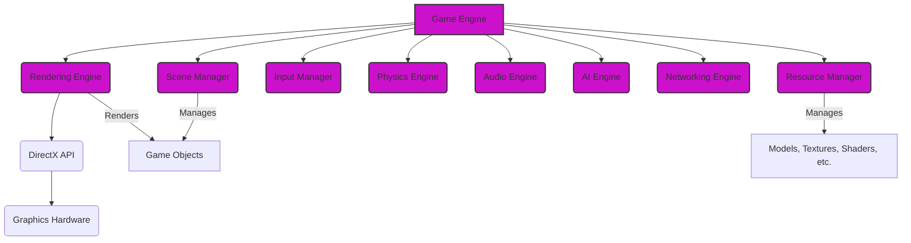
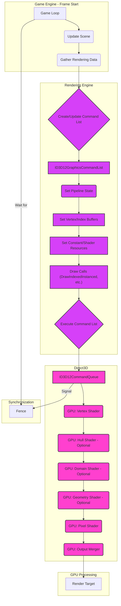
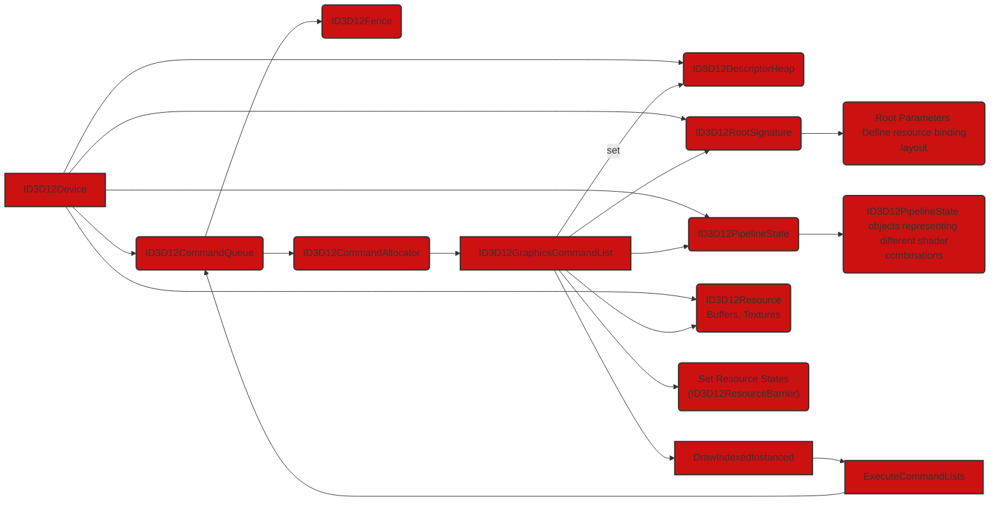
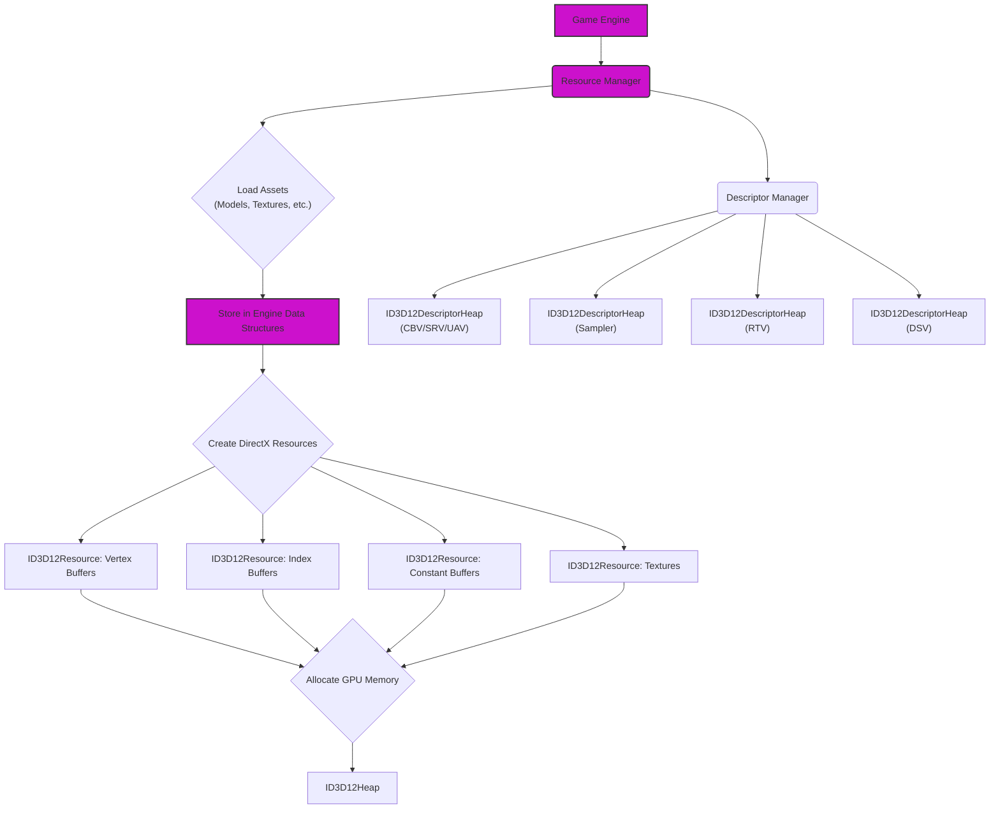

# Game Engines using DirectX - Graphics and Game Engine Pipelines

Here are the Mermaid diagrams illustrating the architecture and workflows of game engines built upon DirectX.

## 1. High-Level Architecture of a DirectX-Based Game Engine

This diagram shows the major components of a typical game engine and their relationship to DirectX.

**Explanation:**

*   **Game Engine:** The top-level system managing all aspects of the game.
*   **Scene Manager:** Organizes game objects and their spatial relationships.
*   **Resource Manager:** Loads, manages, and unloads game assets.
*   **Input Manager:** Handles user input from keyboard, mouse, controllers, etc. and passes the information upstream to the other systems for processing.
*   **Physics Engine:** Simulates physical interactions between objects including collision detections, collision responses, and physical constraints.
*   **Audio Engine:** Manages sound effects, music, and spatial audio.
*   **AI Engine:** Controls the behavior of non-player characters (NPCs).
*   **Networking Engine:** Handles multiplayer functionality and online interactions.
*   **Rendering Engine:** Responsible for drawing the game world, interfacing with DirectX.
*   **DirectX API:** The set of APIs (Direct3D, DirectInput, etc.) provided by Microsoft for interacting with the graphics hardware.
*   **Graphics Hardware:** The physical GPU that executes rendering commands.

## 2. DirectX Rendering Pipeline within a Game Engine

This diagram illustrates how the Rendering Engine interacts with the core components of Direct3D to render a frame.

**Explanation:**

1. **Game Loop**: Initiates the frame rendering process.
2. **Update Scene**: The game logic updates the state of the game world and the engine states.
3. **Gather Rendering Data**: The Rendering Engine collects data needed for rendering (object positions, materials, lighting).
4. **Create/Update Command List**: A `ID3D12GraphicsCommandList` is used to record rendering commands.
5. **Set Pipeline State**: Shaders, blend states, rasterizer states, etc., are configured on the command list.
6. **Set Vertex/Index Buffers**: Vertex and index data for objects are bound.
7. **Set Constant Buffers/Shader Resources**: Data for shaders (like matrices, material properties, textures) is provided here.
8. **Draw Calls**: `DrawIndexedInstanced` or other draw commands are issued.
9. **Execute Command List**: The command list is submitted to the `ID3D12CommandQueue`.
10. **Direct3D Pipeline**:

    *   **Vertex Shader**: Processes vertices.
    *   **Hull Shader (Optional)**: Operates on patches for tessellation.
    *   **Domain Shader (Optional)**: Calculates the tessellated vertex positions.
    *   **Geometry Shader (Optional)**: Can generate new primitives.
    *   **Pixel Shader**: Calculates the color of each pixel.
    *   **Output Merger**: Blends pixel shader outputs and performs depth/stencil testing.

11. **Render Target**: The final image is written to a render target (e.g., back buffer).
12. **Synchronization**: A fence object (`ID3D12Fence`) is used to synchronize the CPU and GPU, ensuring the GPU has finished rendering before the next frame begins.

## 3. Core DirectX Objects and Their Relationships

This diagram focuses on the key objects within Direct3D and how they interact to create and submit rendering commands.

**Explanation:**

*   **ID3D12Device:** Represents the graphics adapter; used to create other objects.
*   **ID3D12CommandQueue:** A queue to which command lists are submitted for execution.
*   **ID3D12DescriptorHeap:**  A collection of descriptors that describe resources (like views of buffers and textures).
*   **ID3D12RootSignature:** Defines the layout of resources that will be bound to the pipeline (how shaders access data through set descriptors).
*   **ID3D12PipelineState:**  Holds the compiled shaders and fixed-function state (blending, rasterization, etc.).
*   **ID3D12Resource:** Represents buffers and textures.
*   **ID3D12Fence:** Used for CPU-GPU synchronization.
*   **ID3D12CommandAllocator:** Allocates memory for command lists.
*   **ID3D12GraphicsCommandList:** Records rendering commands.
*   **ID3D12ResourceBarrier:** Used to transition resource states (e.g., from render target to shader resource).

## 4. Resource Management in a DirectX Game Engine

This diagram focuses on how a game engine might manage resources used by DirectX, including descriptor heaps and memory allocation.

**Explanation:**

1. **Game Engine**: Initiates asset loading.
2. **Resource Manager**: Handles the loading and management of game assets.
3. **Load Assets**: Assets (models, textures, etc.) are loaded from disk.
4. **Store in Engine Data Structures**: Assets are stored in the engine's memory.
5. **Create DirectX Resources**: `ID3D12Resource` objects are created for vertex buffers, index buffers, constant buffers, and textures.

*   Descriptor views (CBV, SRV, UAV) are created within the appropriate heaps.

6. **Descriptor Manager**: Manages `ID3D12DescriptorHeap` objects.

*   Separate heaps are used for different types of descriptors (CBV/SRV/UAV, Sampler, RTV, DSV).

7. **Allocate GPU Memory**: Memory is allocated for resources, often using `ID3D12Heap`.

These diagrams provide a comprehensive overview of how game engines are structured when using DirectX, highlighting the key components, the rendering pipeline, the core DirectX objects involved, and resource management strategies. They are designed to provide unique insights into DirectX-based game development.

---