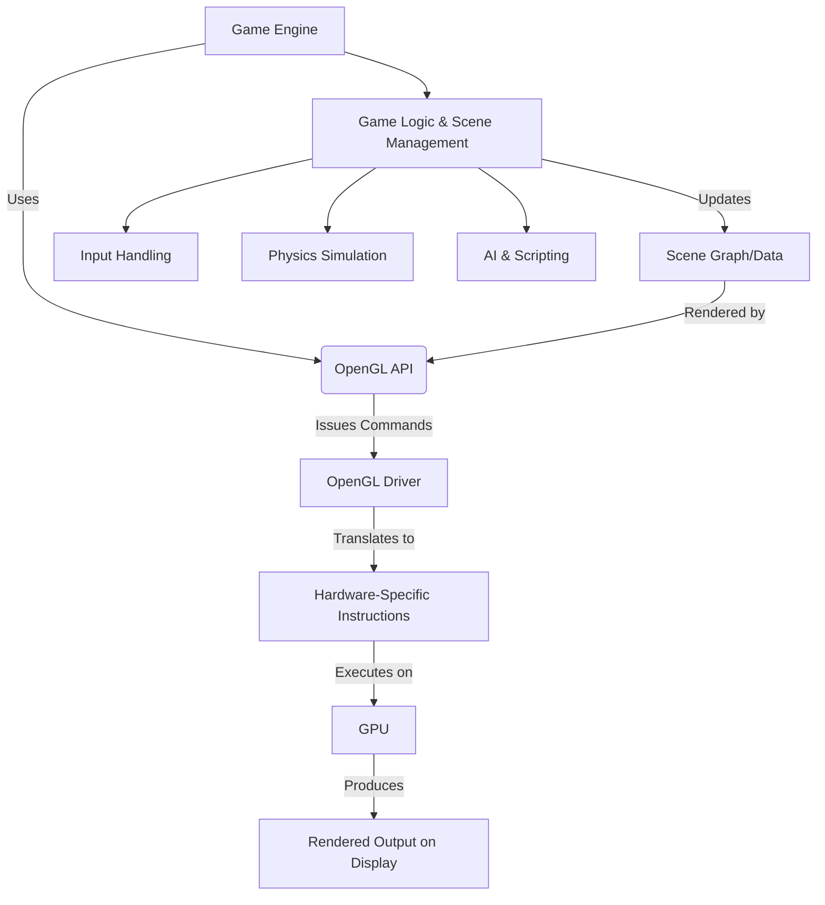
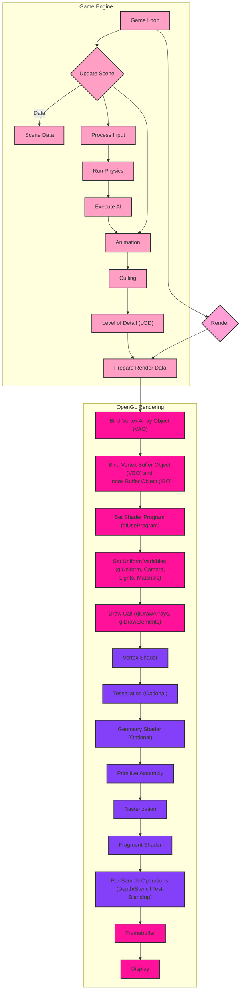
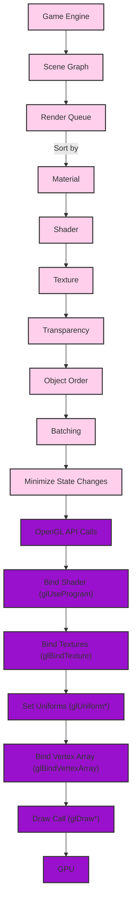
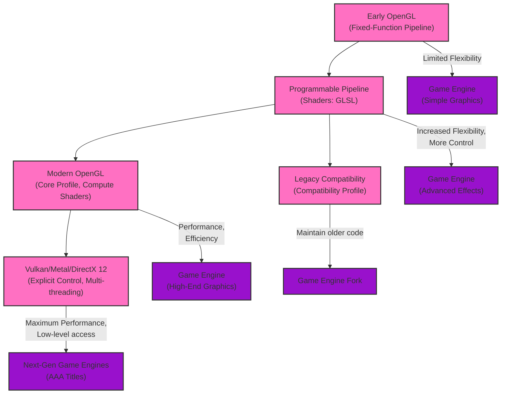

# Game Engines using OpenGL - Graphics and Game Engine Pipelines
> This content is dual-licensed under your choice of the following licenses:
> 1.  **MIT License:** For the code implementations in Swift and Mermaid provided in this document.
> 2.  **Creative Commons Attribution 4.0 International License (CC BY 4.0):** For all other content, including the text, explanations, and the Mermaid diagrams and illustrations.

---

## 1. High-Level Overview of OpenGL in Game Engines

This diagram provides a simplified overview of how game engines typically utilize OpenGL for rendering.

**Explanation:**

1. **Game Engine**: The core of the game, managing game logic, scene, and rendering.
2. **OpenGL API**: The interface used by the engine to interact with the graphics hardware.
3. **OpenGL Driver**: Translates OpenGL commands into instructions understood by the specific GPU.
4. **Hardware-Specific Instructions**: Low-level commands tailored for the GPU.
5. **GPU**: Executes the rendering commands.
6. **Rendered Output**: The final image displayed on the screen.
7. **Game Logic & Scene Management**: Handles game rules, object interactions, and scene updates.
8. **Input Handling**: Processes player input.
9. **Physics Simulation**: Simulates realistic physics.
10. **AI & Scripting**: Controls non-player characters and game events.
11. **Scene Graph/Data**: The data structure representing the game world.

## 2. Detailed OpenGL Rendering Pipeline within a Game Engine

This diagram elaborates on the stages of the OpenGL rendering pipeline as it's commonly integrated into a game engine.

**Explanation:**

1. **Game Loop**: The main loop driving the game.
2. **Update Scene**: Processes game logic, physics, AI, and animation.
3. **Culling**: Determines which objects are visible to the camera.
4. **Level of Detail (LOD)**: Selects appropriate model detail based on distance.
5. **Prepare Render Data**: Organizes data for rendering.
6. **Bind Vertex Array Object (VAO)**: Activates the VAO, which encapsulates vertex attribute state.
7. **Bind Vertex Buffer Object (VBO) and Index Buffer Object (IBO)**: Binds the buffers containing vertex and index data.
8. **Set Shader Program (glUseProgram)**: Activates the shader program.
9. **Set Uniform Variables (glUniform)**: Sets uniform variables for shaders (e.g., camera, lights, materials).
10. **Draw Call (glDrawArrays, glDrawElements)**: Issues the command to draw primitives.

**GPU Stages:**

1. **Vertex Shader**: Processes vertices, transforming them into screen space.
2. **Tessellation (Optional)**: Subdivides primitives for finer detail.
3. **Geometry Shader (Optional)**: Can add or remove primitives.
4. **Primitive Assembly**: Assembles vertices into primitives (triangles, lines, etc.).
5. **Rasterization**: Converts primitives into fragments.
6. **Fragment Shader**: Processes fragments, determining their color.
7. **Per-Sample Operations**: Depth/stencil testing, blending, etc.
8. **Framebuffer**: The target where the final image is rendered.
9. **Display**: The rendered image is shown on the screen.

## 3. OpenGL State Management and Game Engine Integration

This diagram focuses on how game engines manage the OpenGL state to optimize rendering.

**Explanation:**

1. **Game Engine**: Manages the scene and rendering process.
2. **Scene Graph**: Represents the hierarchical structure of objects in the scene.
3. **Render Queue**: A list of objects to be rendered, often sorted for efficiency.
4. **Sorting Criteria**: Objects are sorted by material, shader, texture, transparency, and object order to minimize state changes.
5. **Batching**: Groups objects with similar state into a single draw call.
6. **Minimize State Changes**: Reduces the number of OpenGL API calls, improving performance.
7. **OpenGL API Calls**:
    *   `glUseProgram`: Binds the shader program.
    *   `glBindTexture`: Binds textures.
    *   `glUniform*`: Sets uniform variables.
    *   `glBindVertexArray`: Binds the vertex array object.
    *   `glDraw*`: Issues the draw call.
8. **GPU**: Executes the rendering commands.

## 4. Evolution of OpenGL Usage in Game Engines

This diagram illustrates how OpenGL usage has evolved in game engines over time.

**Explanation:**

1. **Early OpenGL (Fixed-Function Pipeline)**: Limited flexibility, simple graphics.
2. **Programmable Pipeline (Shaders: GLSL)**: Increased flexibility, more control over rendering, enabling advanced effects.
3. **Modern OpenGL (Core Profile, Compute Shaders)**: Focus on performance, efficiency, high-end graphics.
4. **Legacy Compatibility (Compatibility Profile):** allows maintaining and running older OpenGL code.
5. **Vulkan/Metal/DirectX 12**: Offer even more explicit control, multi-threading capabilities, maximum performance and are becoming increasingly popular for cutting-edge game engines.
6. **Game Engine Evolution**: Shows how game engine capabilities have evolved alongside OpenGL advancements. This also shows the influence other APIs have provided in the direction of OpenGL evolution and roadmap.

These diagrams provide a comprehensive overview of how game engines utilize OpenGL, highlighting the rendering pipeline's details, state management strategies, and the evolution of OpenGL's role in game development.

---
**Licenses:**

- **MIT License:**   - Full text in [LICENSE](LICENSE) file.
- **Creative Commons Attribution 4.0 International:**  - Legal details in [LICENSE-CC-BY](LICENSE-CC-BY) and at [Creative Commons official site](http://creativecommons.org/licenses/by/4.0/).

---