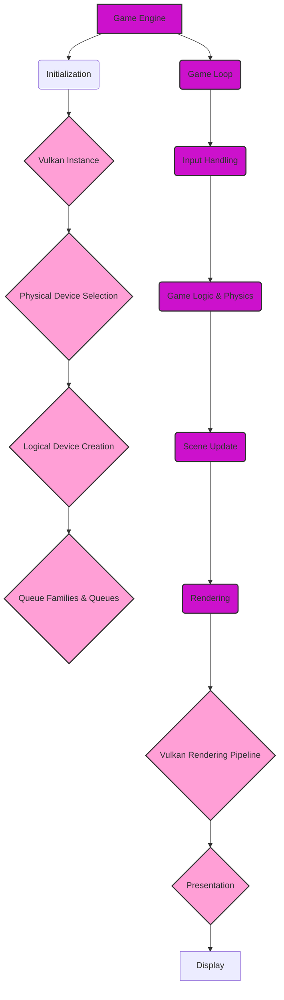
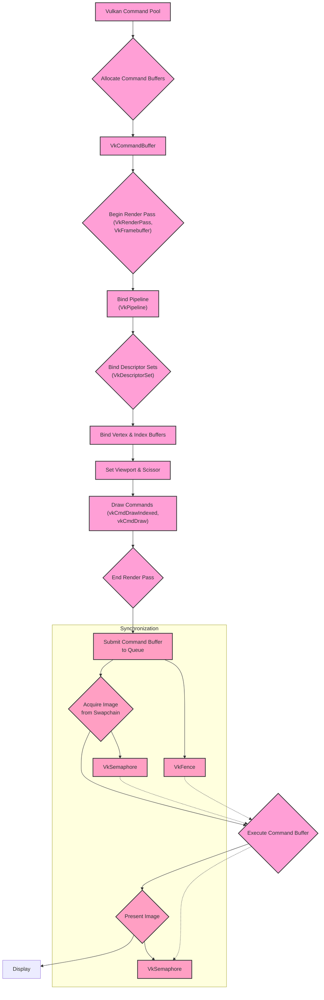
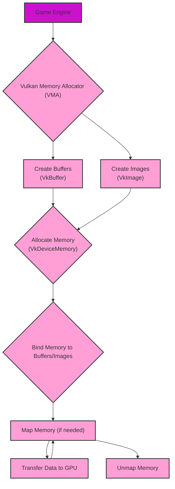
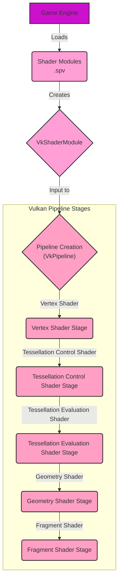
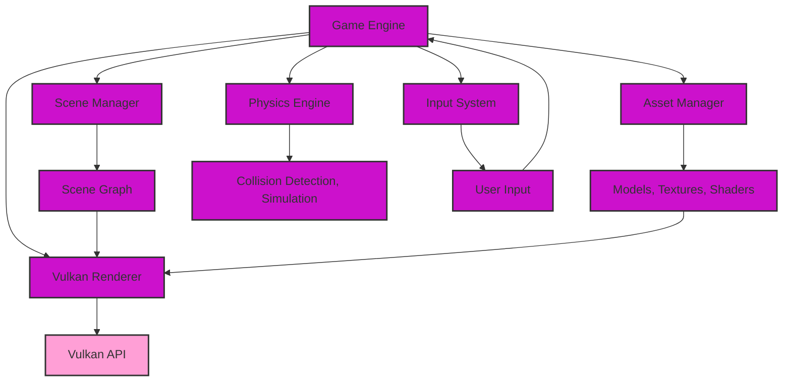

# Game Engines using Vulkan - Graphics and Game Engine Pipelines

Here are the diagrams, categorized for clarity.

## 1. High-Level Overview of a Vulkan-Based Game Engine

This diagram illustrates the typical structure of a game engine that leverages the Vulkan API for rendering.

**Explanation:**

1. **Game Engine:**  The top-level component managing game logic, input, and rendering.
2. **Initialization:** Sets up the Vulkan instance, device, and queues.
3. **Game Loop:**  The core loop that handles input, updates game state, and renders frames.
4. **Vulkan-Specific:**
    *   **Vulkan Instance:**  Represents the Vulkan API context.
    *   **Physical Device Selection:**  Choosing a GPU that supports Vulkan.
    *   **Logical Device Creation:** Creating a logical device for interacting with the chosen physical device.
    *   **Queue Families & Queues:**  Queues for submitting commands (graphics, compute, transfer).
    *   **Vulkan Rendering Pipeline:** Detailed in the next diagram.
    *   **Presentation:**  Displaying rendered images on the screen.

## 2. Detailed Vulkan Rendering Pipeline

This diagram dives into the specific stages of the Vulkan rendering pipeline within the game engine.

**Explanation:**

1. **Vulkan Objects:**
    *   **Command Pool:**  Manages memory for command buffers.
    *   **Command Buffers (VkCommandBuffer):** Record rendering commands.
    *   **Render Pass (VkRenderPass):** Defines attachments and subpasses.
    *   **Framebuffer (VkFramebuffer):**  Collection of image views as render targets.
    *   **Pipeline (VkPipeline):** Represents the graphics pipeline state.
    *   **Descriptor Sets (VkDescriptorSet):** Bind resources (buffers, images) to shaders.
2. **Rendering Process:**
    *   Begin render pass.
    *   Bind pipeline, descriptor sets, vertex/index buffers.
    *   Set viewport and scissor rectangles.
    *   Issue draw commands.
    *   End render pass.
3. **Submission and Presentation:**
    *   Submit the command buffer to a queue.
    *   Acquire an image from the swapchain.
    *   Execute the command buffer.
    *   Present the image.
4. **Synchronization:**
    *   **Fences (VkFence):** CPU-GPU synchronization.
    *   **Semaphores (VkSemaphore):** GPU-GPU synchronization (e.g., between acquiring and presenting).

## 3. Vulkan Memory Management in Game Engines

This diagram highlights the explicit memory management required in Vulkan.

**Explanation:**

1. **Vulkan Memory Allocator (VMA):** A library commonly used to simplify memory management (allocation, deallocation, defragmentation).
2. **Resource Creation:**  Creating Vulkan buffers and images.
3. **Memory Allocation:**  Allocating `VkDeviceMemory` to back those resources.
4. **Binding:**  Associating the allocated memory with the buffers/images.
5. **Data Transfer:**
    *   Mapping memory (making it accessible to the CPU).
    *   Copying data to/from the mapped region.
    *   Unmapping memory.

## 4. Shader Stages in Vulkan Pipeline and How Game Engine Interacts with the Shaders

This diagram shows how a game engine interacts with shader modules in the different programmable stages of the Vulkan pipeline.

**Explanation:**

1. **Loading Shaders:** Game engine loads shader code (typically in SPIR-V format, `.spv`).
2. **Shader Modules:** Creates `VkShaderModule` objects from the shader code.
3. **Pipeline Creation:** These shader modules are used as input when creating the graphics `VkPipeline`.
4. **Pipeline Stages:** This shows a simplified representation of the programmable stages of the Vulkan pipeline. The game engine configures each stage by providing the corresponding shader module.

## 5. Integration with Game Engine Components

This diagram shows how a Vulkan-based renderer might integrate with other typical game engine components.

**Explanation:**

1. **Core Components:** Shows common game engine components like the scene manager, asset manager, physics engine, and input system.
2. **Vulkan Renderer:** The component responsible for rendering using the Vulkan API.
3. **Interactions:**
    *   The renderer gets scene information from the scene manager.
    *   It uses assets (models, textures, shaders) managed by the asset manager.
    *   The input system provides user input to the main game loop.

**Key Differences from Metal and other API Pipelines (referencing our prior discussion):**

*   **Explicitness:** Vulkan is more explicit than Metal. Developers have more fine-grained control but also more responsibility (memory management, synchronization).
*   **Command Buffers:** Vulkan uses command buffers more heavily. Recording rendering commands is a distinct step.
*   **Render Passes:** Vulkan's render passes provide a structured way to define rendering operations and their dependencies.
*   **Synchronization:** Vulkan's synchronization primitives (fences, semaphores) are essential for managing the order of operations.
*   **SPIR-V:** Vulkan typically uses SPIR-V as an intermediate shader language, while Metal uses Metal Shading Language.
*   **Memory Management:**  Vulkan requires explicit memory allocation and binding, whereas Metal handles some aspects automatically.

These diagrams provide a comprehensive view of how game engines utilize the Vulkan API, emphasizing Vulkan's unique characteristics and its place within the broader landscape of graphics and game development.
---