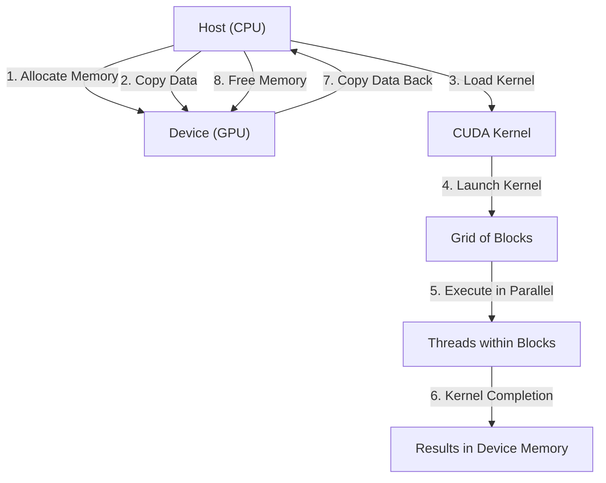
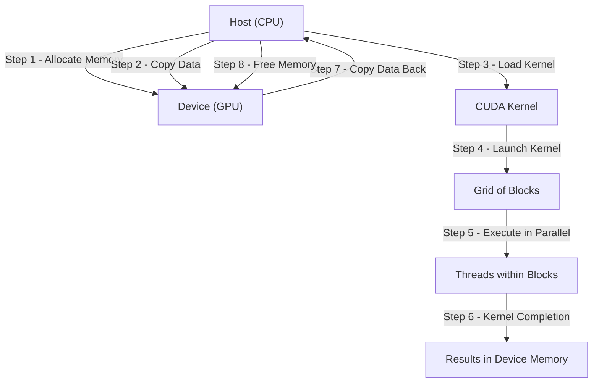
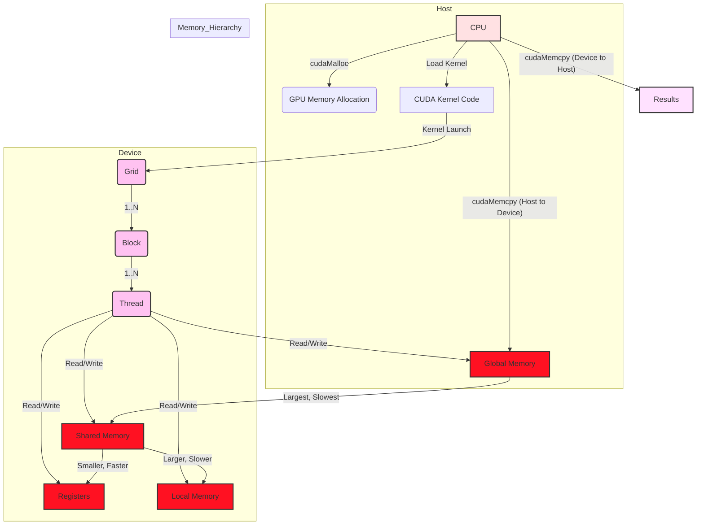
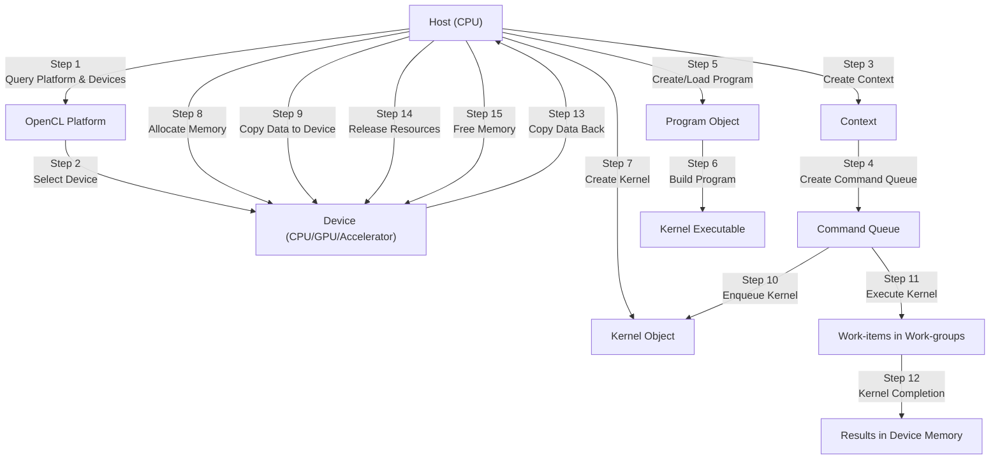
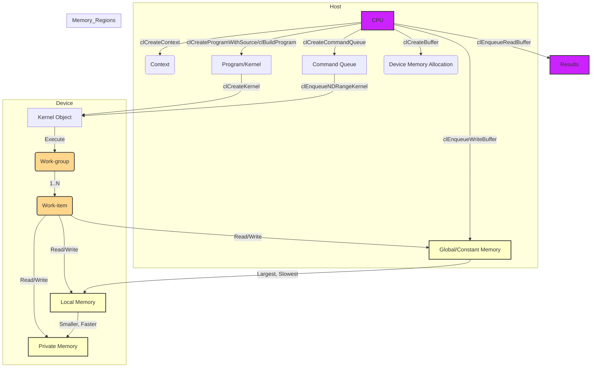

# CUDA and OpenCL - GPU Compute Pipelines

Here are the Mermaid diagrams for CUDA and OpenCL, structured for clarity and comparison.

---

# CUDA Diagrams

## 1. High-Level Overview of CUDA Compute Pipeline

Note: 
My updated diagram version: 

---

**Explanation:**

1. **Host (CPU):** Initiates and controls the process.
2. **Device (GPU):** Performs parallel computations.
3. **Allocate Memory:** Allocate memory on the GPU.
4. **Copy Data:** Transfer data from host to device.
5. **Load Kernel:** Load the compute kernel code.
6. **Launch Kernel:** Execute the kernel on a grid of thread blocks.
7. **Execute in Parallel:** Threads within blocks execute concurrently.
8. **Kernel Completion:** Results are stored in device memory.
9. **Copy Data Back:** Transfer results back to the host.
10. **Free Memory:** Release allocated memory.

## 2. Detailed CUDA Kernel Execution and Memory Hierarchy

Note: This diagram still have missing information for subgraph `Memory_Hierarchy` . 

**Explanation:**

*   **Host:**
    *   Allocates GPU memory using `cudaMalloc`.
    *   Copies data to the GPU using `cudaMemcpy`.
    *   Loads the CUDA kernel.
*   **Device:**
    *   The kernel is launched on a grid of blocks.
    *   Each block contains multiple threads.
    *   Threads access different levels of memory:
        *   **Global Memory:** Large, slow, accessible by all threads and the host.
        *   **Shared Memory:** Smaller, faster, shared among threads within a block.
        *   **Registers:** Fastest, private to each thread.
        *   **Local Memory:** Used when registers are insufficient, slower than registers.
*   **Memory Hierarchy:** Illustrates the size and speed relationship between memory types.
*   **Results:** Data is copied back to the host using `cudaMemcpy`.

---

# OpenCL Diagrams

## 1. High-Level Overview of OpenCL Compute Pipeline

**Explanation:**

1. **Host (CPU):** Manages the OpenCL environment.
2. **Query Platform & Devices:** Discover available OpenCL platforms and devices.
3. **Select Device:** Choose a device (CPU, GPU, or accelerator).
4. **Create Context:** Create a context for managing objects and operations.
5. **Create Command Queue:** Create a queue to submit commands to the device.
6. **Create/Load Program:** Create or load the OpenCL program (source code).
7. **Build Program:** Compile the program into a kernel executable.
8. **Create Kernel:** Create a kernel object from the program.
9. **Allocate Memory:** Allocate memory on the device.
10. **Copy Data to Device:** Transfer data to device memory.
11. **Enqueue Kernel:** Add the kernel to the command queue for execution.
12. **Execute Kernel:** Work-items within work-groups execute in parallel.
13. **Kernel Completion:** Results are stored in device memory.
14. **Copy Data Back:** Transfer results back to the host.
15. **Release Resources:** Release OpenCL objects (context, queue, program, kernel).
16. **Free Memory**: Release allocated memory.

**2. Detailed OpenCL Kernel Execution and Memory Regions**

**Explanation:**

*   **Host:**
    *   Creates a context (`clCreateContext`).
    *   Creates a command queue (`clCreateCommandQueue`).
    *   Creates and builds the program/kernel (`clCreateProgramWithSource`, `clBuildProgram`).
    *   Allocates device memory (`clCreateBuffer`).
    *   Writes data to device memory (`clEnqueueWriteBuffer`).
*   **Device:**
    *   Creates a kernel object (`clCreateKernel`).
    *   Enqueues the kernel for execution (`clEnqueueNDRangeKernel`).
    *   The kernel executes in work-groups, each containing multiple work-items.
    *   Work-items access different memory regions:
        *   **Global/Constant Memory:** Large, slow, accessible by all work-items and the host.
        *   **Local Memory:** Smaller, faster, shared among work-items in a work-group.
        *   **Private Memory:** Fastest, private to each work-item.
*   **Memory Regions:** Illustrates the size and speed relationship between memory types.
*   **Results:** Data is read back to the host using `clEnqueueReadBuffer`.

**Key Differences and Unique Details Highlighted:**

*   **CUDA vs. OpenCL Terminology:** The diagrams highlight the different terms used (e.g., Grid/Block/Thread vs. Work-group/Work-item).
*   **OpenCL's Platform Model:** OpenCL has a more explicit platform and device model, allowing it to target a wider range of devices.
*   **OpenCL's Program Build Process:** OpenCL emphasizes the separate steps of creating, building, and loading programs.
*   **Memory Spaces:**  Both models have similar memory hierarchies, but OpenCL makes a clearer distinction between global and constant memory.
*   **Synchronization:** While not explicitly shown in these basic diagrams, both CUDA and OpenCL provide synchronization mechanisms (e.g., `__syncthreads` in CUDA, `barrier` in OpenCL) to coordinate threads/work-items within a block/work-group. These mechanisms are crucial for many parallel algorithms.

These diagrams provide a clear, concise, and informative comparison of CUDA and OpenCL compute pipelines, drawing parallels to the Metal rendering pipeline concepts we discussed earlier.

---