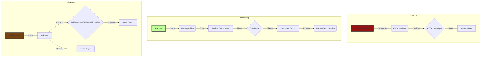
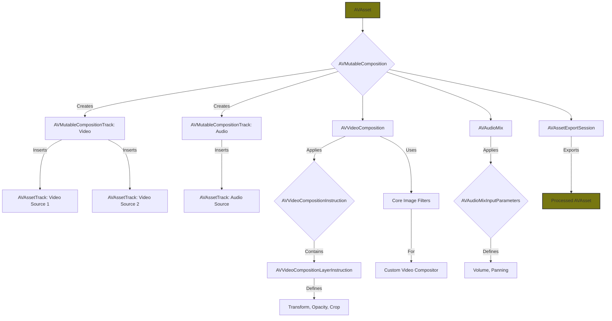
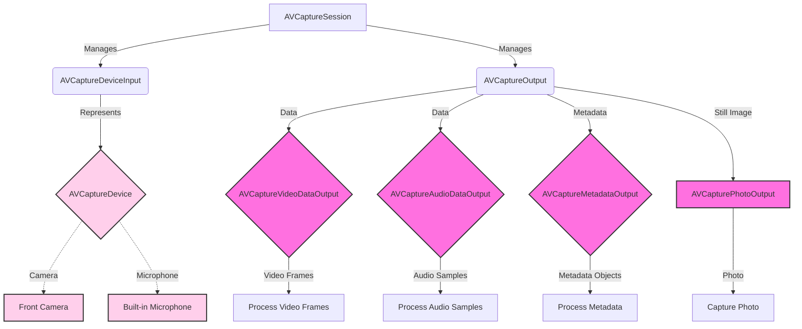
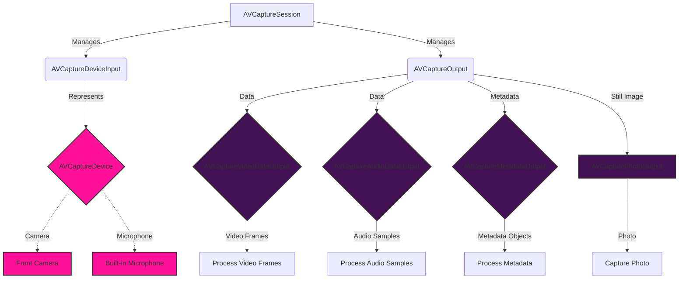
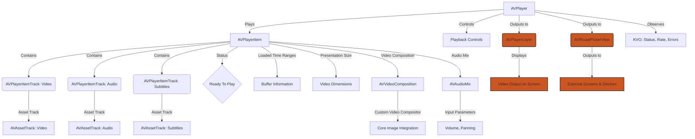

# AVFoundation - Image and Video Processing Pipelines
> This content is dual-licensed under your choice of the following licenses:
> 1.  **MIT License:** For the code implementations in Swift and Mermaid provided in this document.
> 2.  **Creative Commons Attribution 4.0 International License (CC BY 4.0):** For all other content, including the text, explanations, and the Mermaid diagrams and illustrations.

---

Here are the `AVFoundation` diagrams, categorized for clarity, and drawing parallels to the Metal rendering pipeline where appropriate.

## 1. High-Level Overview of AVFoundation Pipelines

This diagram illustrates the three primary pipelines within `AVFoundation`: Capture, Processing, and Playback. It uses similar concepts from the Metal Command pipeline.

**Explanation:**

*   **Capture:**  Similar to how `MTLCommandQueue` initiates rendering, `AVCaptureSession` starts the capture process, managing inputs (camera, microphone) and outputs (data streams).
*   **Processing:** `AVAsset` (like a source texture in Metal) is manipulated using `AVComposition` and `AVVideoComposition` (analogous to `MTLRenderCommandEncoder` operations). Core Image filters are applied, and the result is exported using `AVAssetExportSession`.
*   **Playback:** `AVPlayerItem` (like a processed texture or render target) is loaded into `AVPlayer`, which controls playback through `AVPlayerLayer` (similar to presenting a drawable) or `AVRoutePickerView`.

## 2. Detailed AVAsset Editing and Composition Pipeline

This diagram focuses on the video editing and composition process, highlighting the track-based model and time manipulation.

**Explanation:**

*   **AVMutableComposition**: Like a `MTLCommandBuffer` that aggregates commands, it combines multiple assets' tracks.
*   **AVMutableCompositionTrack**: Represents a track within the composition (video or audio).
*   **AVAssetTrack**: Represents a track from a source asset.
*   **AVVideoComposition**:  Similar to a `MTLRenderPipelineState`, it defines how video frames are processed with instructions and layer instructions.
*   **AVVideoCompositionInstruction**: Specifies operations for a time range.
*   **AVVideoCompositionLayerInstruction**: Specifies operations for a layer within an instruction (transform, opacity, etc.). This is where you would set up transitions or other visual effects just as we do in shaders in Metal.
*   **Core Image Filters**: Can be used for custom video compositing.
*   **AVAudioMix**: Controls audio mixing.
*   **AVAudioMixInputParameters**: Sets parameters for audio tracks.
*   **AVAssetExportSession**: Similar to submitting a command buffer for execution, it exports the composed asset.

## 3. AVFoundation Capture Pipeline with Data Output

This diagram expands the capture pipeline, showing how data is captured from various inputs and directed to different outputs.

Note: 
My updated diagram with some order arrangement:

---

**Explanation:**

*   **AVCaptureSession**: The central coordinator, like `MTLCommandQueue`.
*   **AVCaptureDeviceInput**: Represents an input source, connected to an `AVCaptureDevice` (e.g., camera, microphone). This is similar to setting up your render pipeline configurations that are tied to a specific `MTLDevice` in Metal.
*   **AVCaptureOutput**: A base class for capture outputs, directing data to different destinations.
*   **AVCaptureVideoDataOutput**: Provides access to video frames.
*   **AVCaptureAudioDataOutput**: Provides access to audio samples.
*   **AVCaptureMetadataOutput**: Provides access to metadata (e.g., QR codes, faces).
*   **AVCapturePhotoOutput**: Captures still photos.

## 4. Detailed AVPlayerItem and AVPlayer Playback Pipeline
This diagram showcases use of player layers and item tracks in the playback pipeline sequence.

**Explanation:**

*   **AVPlayerItem**: Represents the media to be played, containing multiple tracks (video, audio, subtitles). It's analogous to a fully composed `MTLCommandBuffer` ready for execution.
*   **AVPlayerItemTrack**: Represents a track within the `AVPlayerItem`, linked to the corresponding `AVAssetTrack`.
*   **AVPlayer**: Controls playback of the `AVPlayerItem`, similar to how `MTLCommandQueue` manages the execution of a command buffer.
*   **AVPlayerLayer**: A `CALayer` subclass that displays the video output, comparable to a `CAMetalDrawable` in Metal rendering. The difference here is that it is specifically made to display AV playback content.
*   **AVRoutePickerView**: Allows the user to choose the output route for audio and video (e.g., AirPlay, headphones).
*   **Key-Value Observing (KVO):** Used to observe changes in `AVPlayer`'s status, rate, and errors, which is vital for managing playback state and responding to events.

---