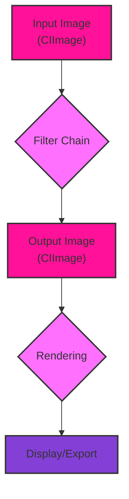
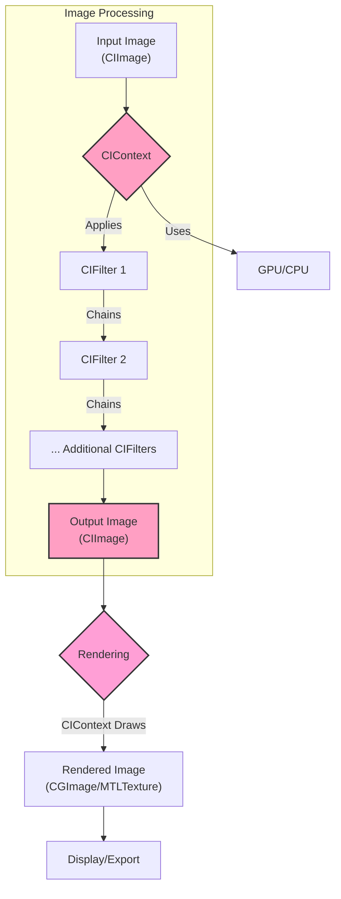
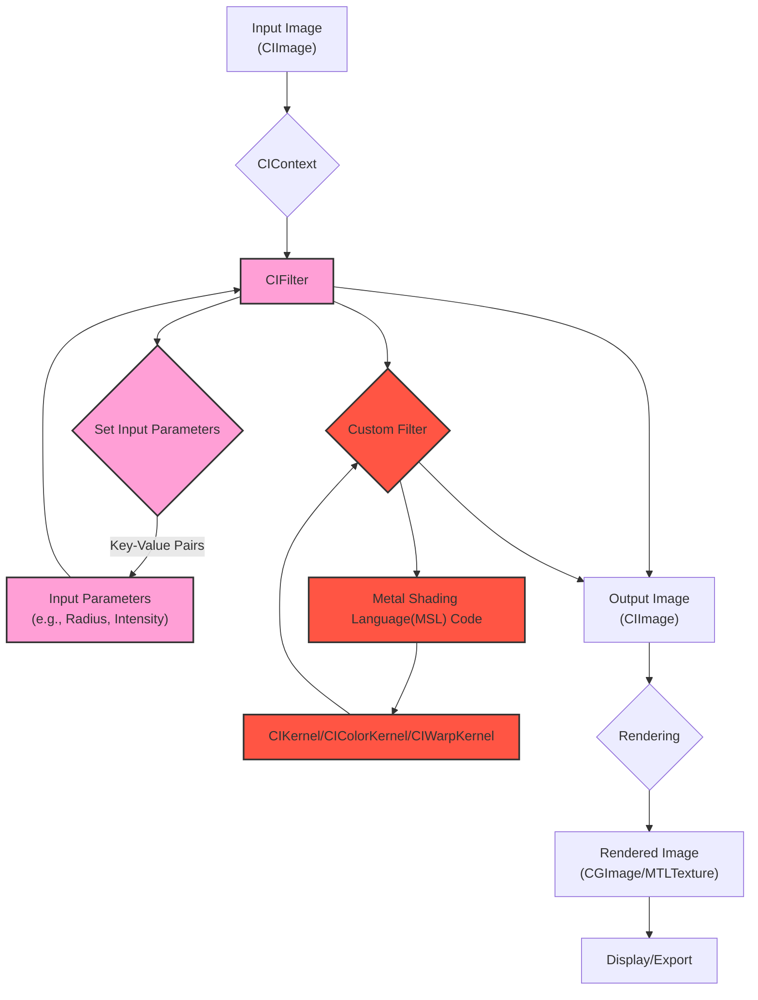

# Core Image Processing Pipelines - Image and Video Processing Pipelines
> This content is dual-licensed under your choice of the following licenses:
> 1.  **MIT License:** For the code implementations in Swift and Mermaid provided in this document.
> 2.  **Creative Commons Attribution 4.0 International License (CC BY 4.0):** For all other content, including the text, explanations, and the Mermaid diagrams and illustrations.

---

Here's the set of Mermaid diagrams for Core Image, categorized for clarity, and removing any redundant information while highlighting unique details

## 1. High-Level Overview of Core Image Pipeline

This diagram provides a simplified, high-level view of the Core Image processing flow.

**Explanation:**

1. **Input Image (CIImage):** The starting point, a `CIImage` object representing the image to be processed.
2. **Filter Chain:** A sequence of one or more `CIFilter` objects that apply effects to the input image.
3. **Output Image (CIImage):** The result of applying the filter chain, another `CIImage`.
4. **Rendering:** The process of converting the `CIImage` into a displayable or exportable format.
5. **Display/Export:** The final rendered image is shown on screen or saved to a file.

## 2. Detailed Core Image Filter Chain and Context

This diagram elaborates on the filter chain, including the role of `CIContext` and different types of filters.

**Explanation:**

1. **Input Image (CIImage):** The initial `CIImage` object.
2. **CIContext:** Manages the execution of the filter chain, deciding whether to use the GPU or CPU.
3. **CIFilter Chain:** Filters are connected sequentially. The output of one becomes the input of the next.
4. **GPU/CPU:** `CIContext` determines the optimal processing unit.
5. **Output Image (CIImage):** The final `CIImage` after all filters have been applied.
6. **Rendering:** `CIContext` draws the `CIImage` into a concrete image representation like `CGImage` or `MTLTexture`, preparing it for display.
7. **Rendered Image:**  The image data in a displayable/exportable format.
8. **Display/Export:** Showing on screen or saving.

## 3. Core Image Pipeline with Input Parameters and Custom Filters

This diagram dives deeper into how filter parameters are configured and how custom filters can be integrated for more specific use cases such as creating custom kernels using Metal.

**Explanation:**

1. **Input Image (CIImage):** The starting `CIImage`.
2. **CIContext:** Manages the filter chain execution.
3. **CIFilter:** A standard or custom filter.
4. **Set Input Parameters:** Input parameters for standard filters are set using key-value coding.
5. **Input Parameters:** Specific values that control the filter's effect.
6. **Custom Filter:** A user-defined filter implemented using Metal Shading Language.
7. **Metal Shading Language Code:** The code that defines the custom filter's logic.
8. **CIKernel/CIColorKernel/CIWarpKernel:**  Specialized objects for creating custom kernels that operate on image pixels.
9. **Output Image (CIImage):** The `CIImage` produced by either a standard or custom filter.
10. **Rendering:**  The output `CIImage` is rendered into a `CGImage` or `MTLTexture`.
11. **Rendered Image:** The final image data ready for display or export.
12. **Display/Export:** The rendered image is displayed or saved.

## 4. Core Image Filter Categories and Common Filters

This diagram illustrates common filter categories and provides examples of filters within those categories, providing a practical overview of the variety of effects that can be achieved with Core Image.

```mermaid
graph TD
    A[Filter Categories] --> B(Blur);
    A --> C(Color Adjustment);
    A --> D(Distortion);
    A --> E(Generator);
    A --> F(Stylize);
    A --> G(Transition);
    A --> H(Composite);
    A --> I(...);

    B --> BA[Gaussian Blur];
    B --> BB[Motion Blur];
    B --> BC[Zoom Blur];

    C --> CA[Color Invert];
    C --> CB[Exposure Adjust];
    C --> CC[Gamma Adjust];

    D --> DA[Bump Distortion];
    D --> DB[Twirl Distortion];
    D --> DC[Vortex Distortion];

    E --> EA[Checkerboard];
    E --> EB[Stripes];
    E --> EC[Constant Color];

    F --> FA[Crystallize];
    F --> FB[Edges];
    F --> FC[Pixellate];

    G --> GA[Swipe Transition];
    G --> GB[Dissolve Transition];
    G --> GC[Flash Transition];
    
    H --> HA[Multiply Compositing]
    H --> HB[Screen Compositing]
    H --> HC[Source Over Compositing]

    classDef cat fill:#f54f,stroke:#333,stroke-width:2px;
    class A,B,C,D,E,F,G,H,I cat

```

**Explanation:**

1. **Filter Categories:**  Broad classifications of Core Image filters.
2. **Blur:** Filters that create blurring effects. Examples: `CIGaussianBlur`, `CIMotionBlur`, `CIZoomBlur`.
3. **Color Adjustment:** Filters that modify image colors. Examples: `CIColorInvert`, `CIExposureAdjust`, `CIGammaAdjust`.
4. **Distortion:** Filters that distort the image geometry. Examples: `CIBumpDistortion`, `CITwirlDistortion`, `CIVortexDistortion`.
5. **Generator:** Filters that generate new images. Examples: `CICheckerboardGenerator`, `CIStripesGenerator`, `CIConstantColorGenerator`.
6. **Stylize:** Filters that apply artistic effects. Examples: `CICrystallize`, `CIEdges`, `CIPixellate`.
7. **Transition:** Filters used to create transitions between two images. Examples: `CISwipeTransition`, `CIDissolveTransition`, `CIFlashTransition`.
8. **Composite:** Filters used to combine two or more images. Examples: `CIMultiplyCompositing`, `CIScreenBlendMode`, `CISourceOverCompositing`.
9. **...:**  Indicates there are many other filter categories.

These Mermaid diagrams effectively illustrate the Core Image pipeline by:

*   **Building upon the established pattern:** The diagrams follow the structure used for the Metal pipeline, making it easier to understand the analogy.
*   **Focusing on unique aspects:** They highlight the filter chain, the role of `CIContext`, the use of parameters, and custom filters.
*   **Providing comprehensive detail:** Each diagram adds a layer of complexity, starting from a high-level overview and progressing to more intricate aspects.
*   **Removing redundancy:** The diagrams avoid repetition and show only the essential information at each level.

---