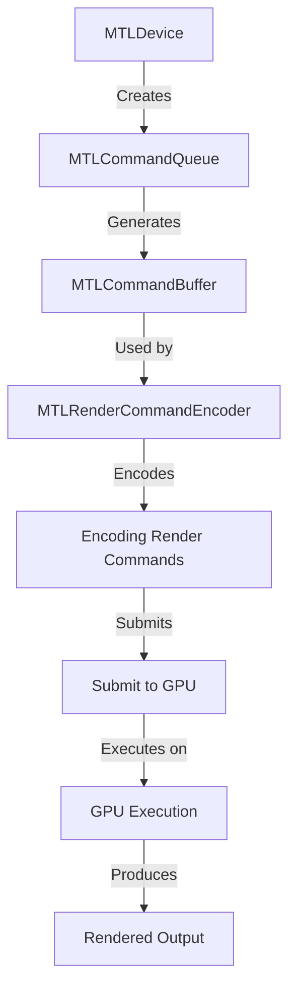
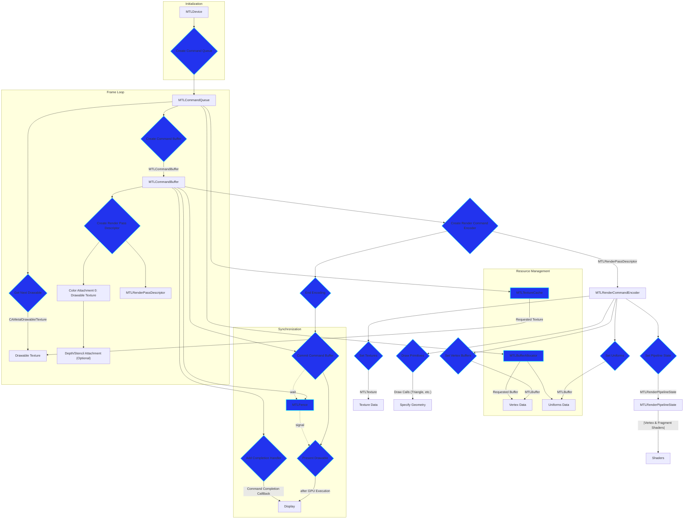
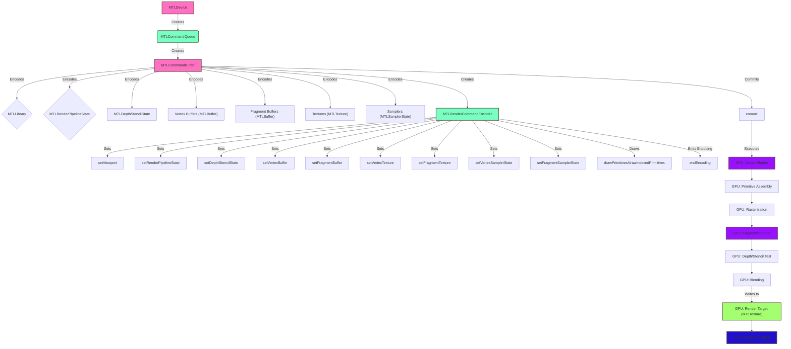

# MTLCommandQueue - Integration With Metal Rendering Pipeline
> This content is dual-licensed under your choice of the following licenses:
> 1.  **MIT License:** For the code implementations in Swift and Mermaid provided in this document.
> 2.  **Creative Commons Attribution 4.0 International License (CC BY 4.0):** For all other content, including the text, explanations, and the Mermaid diagrams and illustrations.

---

The mermaid diagrams below provide a clear and comprehensive understanding of how `MTLCommandQueue` integrates into the Metal rendering pipeline, covering various levels of detail and focusing on unique aspects of the process.

## 1. High-Level Overview of MTLCommandQueue Integration

This diagram provides a simplified, high-level view of the `MTLCommandQueue`'s role within the Metal rendering pipeline.

**Explanation:**

1. **MTLDevice**: Represents the physical or virtual GPU.
2. **MTLCommandQueue**: Manages command buffers and their execution.
3. **MTLCommandBuffer**: Holds a collection of GPU commands.
4. **MTLRenderCommandEncoder**: Used to encode rendering instructions.
5. **Encoding Render Commands**: Generating drawing commands.
6. **Submit to GPU**: Committing the command buffer to the queue.
7. **GPU Execution**: Processing the commands on the GPU.
8. **Rendered Output**: The result of the rendering process.

### 2. Detailed MTLCommandQueue and Resource Management

This diagram elaborates on the resource management and synchronization aspects, including key components like `MTLFence` and completion handlers.

```mermaid
graph TD
    subgraph "Initialization"
        A[MTLDevice] --> B{Get or Create MTLCommandQueue};
    end
    
    B --"Creates"--> C[MTLCommandBuffer];
    C --> D{Create MTLRenderPassDescriptor};
    
    subgraph "Frame Encoding"
        D --> E["Acquire Drawable (CAMetalDrawable)"];
        E --> F{Create MTLRenderCommandEncoder <br> with Descriptor and Drawable};
        F --"Encodes"--> G["Set Render Pipeline State <br> (MTLRenderPipelineState)"];
        G --> H[Set Vertex and Fragment Buffers];
        H --> I[Set Textures];
        H --> J[Set Viewport];
        I --> J
        J --> K[Draw Primitives];
        K --> L{"End Encoding <br> (MTLRenderCommandEncoder)"};
    end
    
    L --"Commits"--> M[Commit Command Buffer];
    M --> N{Present Drawable};
    N --"Displays"--> O[Screen];
    B -- "Manages" --> P[MTLFence];
    M --"Signals"--> P
    
    %% Styling 
    classDef plain fill:#ff22,stroke:#323,stroke-width:2px;
    class A,B,C,D,E,F,G,H,I,J,K,L,M,N,O,P plain
    class B,D,F,L,N internal-obj
     
    %% Open corresponding official Apple documentations when a node receives a click from user
    click A href "https://developer.apple.com/documentation/metal/mtldevice" "MTLDevice Documentation" _blank
    
    click B href "https://developer.apple.com/documentation/metal/mtlcommandqueue" "MTLCommandQueue Documentation" _blank
    
    click C href "https://developer.apple.com/documentation/metal/mtlcommandbuffer" "MTLCommandBuffer Documentation" _blank
    
    click D href "https://developer.apple.com/documentation/metal/mtlrenderpassdescriptor" "MTLRenderPassDescriptor Documentation" _blank
    
    click E href "https://developer.apple.com/documentation/metal/cametaldrawable" "CAMetalDrawable Documentation" _blank
    
    click F href "https://developer.apple.com/documentation/metal/mtlrendercommandencoder" "MTLRenderCommandEncoder Documentation" _blank
    
    click G href "https://developer.apple.com/documentation/metal/mtlrenderpipelinestate" "MTLRenderPipelineState Documentation" _blank
    
    click P href "https://developer.apple.com/documentation/metal/mtlfence" "MTLFence Documentation" _blank

```

**Explanation:**

1. **Initialization**: `MTLDevice` creates or retrieves `MTLCommandQueue`.
2. **Frame Encoding**:
    *   `MTLCommandBuffer` is created.
    *   `MTLRenderPassDescriptor` configures render targets.
    *   `MTLRenderCommandEncoder` records rendering commands.
    *   Pipeline state, buffers, textures, and viewport are set.
    *   Draw primitives are encoded.
3. **Submission and Presentation**:
    *   Encoding ends, and the command buffer is committed.
    *   `Present Drawable` displays the rendered content.
4. **Synchronization**: `MTLFence` ensures proper synchronization between CPU and GPU.

### 3. Comprehensive Rendering Pipeline with MTLCommandQueue

This diagram provides the most detailed view, including resource management, synchronization with `MTLFence` and completion handlers, and a more granular breakdown of the rendering process.

**Explanation:**

1. **Initialization**: `MTLDevice` creates `MTLCommandQueue`.
2. **Frame Loop**:
    *   Get the next drawable texture.
    *   Create `MTLCommandBuffer`.
    *   Create `MTLRenderPassDescriptor` with color and optional depth/stencil attachments.
3. **Render Command Encoding**:
    *   Create `MTLRenderCommandEncoder`.
    *   Set pipeline state (`MTLRenderPipelineState`), vertex buffers, textures, and uniforms.
    *   Issue draw commands.
    *   End encoding.
4. **Command Buffer Submission & Presentation**:
    *   Commit the command buffer.
    *   Present the drawable after GPU execution.
5. **Resource Management**:
    *   `MTLTextureCache` manages texture reuse.
    *   `MTLBufferAllocator` manages buffer allocation.
6. **Synchronization**:
    *   Completion handler for post-execution tasks.
    *   `MTLFence` for synchronizing GPU operations and preventing race conditions.

### 4. Comprehensive Rendering Pipeline Integration of MTLCommandQueue including GPU Execution Stages

This diagram provides a comprehensive overview, breaking down the GPU execution into its fundamental stages.

**Explanation:**

1. **MTLDevice**: Represents the GPU and creates other Metal objects.
2. **MTLCommandQueue**: Manages `MTLCommandBuffers`.
3. **MTLCommandBuffer**: Stores encoded commands and resources.

    *   **Encoding Resources**: `MTLLibrary`, `MTLRenderPipelineState`, `MTLDepthStencilState`, `Vertex/Fragment Buffers`, `Textures`, and `Samplers` are prepared.

4. **MTLRenderCommandEncoder**: Encodes rendering commands.

    *   **Encoding Render Commands**: `setViewport`, pipeline state, depth/stencil state, buffers, textures, sampler states, and draw calls are encoded.

5. **Commit**: The command buffer is added to the command queue.
6. **GPU Execution**:

    *   **Vertex Shader**: Processes vertices.
    *   **Primitive Assembly**: Assembles vertices into primitives.
    *   **Rasterization**: Converts primitives into fragments.
    *   **Fragment Shader**: Processes fragments.
    *   **Depth/Stencil Test**: Determines visibility.
    *   **Blending**: Combines fragment color with the render target.

7. **Render Target (MTLTexture)**: The output is written to a `MTLTexture`.
8. **Final Rendered Output**: The `MTLTexture` contains the rendered image.

---
