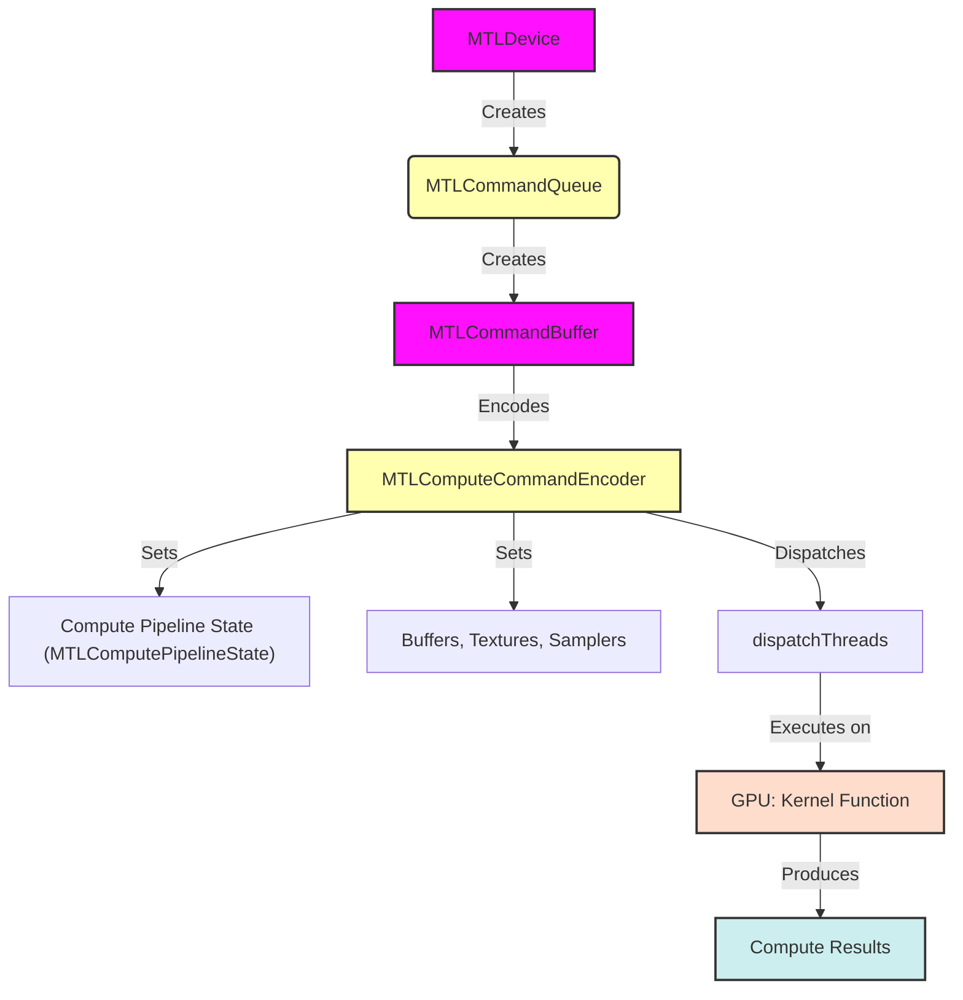
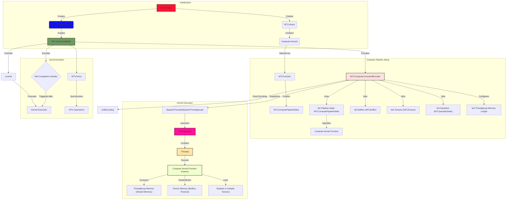

# The Metal Compute Pipeline
> This content is dual-licensed under your choice of the following licenses:
> 1.  **MIT License:** For the code implementations in Swift and Mermaid provided in this document.
> 2.  **Creative Commons Attribution 4.0 International License (CC BY 4.0):** For all other content, including the text, explanations, and the Mermaid diagrams and illustrations.

---
## 1. High-Level Overview of the Metal Compute Pipeline

This diagram presents a simplified, high-level view of the Metal Compute Pipeline's core components and workflow.



**Explanation:**

1. **MTLDevice:** Represents the GPU.
2. **MTLCommandQueue:** Manages command buffers.
3. **MTLCommandBuffer:** Holds encoded commands.
4. **MTLComputeCommandEncoder:** Encodes compute commands.
5. **Compute Pipeline State (MTLComputePipelineState):** Specifies the compute kernel function and its configuration.
6. **Buffers, Textures, Samplers:** Input/output data and sampling parameters.
7. **dispatchThreads:** Launches the kernel execution on the GPU.
8. **GPU: Kernel Function:** The compute kernel function is executed on the GPU.
9. **Compute Results:** The output data generated by the kernel.

## 2. Detailed Metal Compute Pipeline: Resource Management and Synchronization

This diagram elaborates on resource setup, kernel configuration, thread management, and synchronization.

```mermaid
graph TD
    subgraph "Initialization"
        A[MTLDevice] --> B{Create Command Queue};
    end
    
    B --> C[MTLCommandQueue];
    
    subgraph "Frame Loop or Compute Task"
        C --> D{Create Command Buffer};
        D -- MTLCommandBuffer --> E[MTLCommandBuffer];
        E --> F{Create Compute Command Encoder};
        F --> G[MTLComputeCommandEncoder];
        G --> H{Set Compute Pipeline State};
            H -- MTLComputePipelineState --> I[MTLComputePipelineState];
            I -- |Compute Shader| --> J[Shader];
        G --> K{Set Buffers};
            K -- MTLBuffer --> L[Input/Output Data];
        G --> M{Set Textures};
            M -- MTLTexture --> N[Input/Output Texture Data];
         G --> O{Set Samplers};
           O-- MTLSamplerState-->P[Sampler Configuration];
        G --> Q{Set Threadgroup Memory Length};
        G --> R{Dispatch Threadgroups/Threads};
            R -- Dispatch Configuration --> S[Threadgroups & Threads Per Threadgroup];
        F --> T{End Encoding};
        E --> U{Commit Command Buffer};
         T --> U;
        U --> V{GPU: Execute Compute Kernel};
         
        
   subgraph "Resource Management"
        C --> AA[MTLTextureCache];
        C --> AB[MTLBufferAllocator];
          AA -- Requested Texture --> N;
          AB -- Requested Buffer --> L;
    end
    
     subgraph "Synchronization"
        E --> AC{Add Completion Handler}
        AC -- Command Completion CallBack-->V
        E --> AD[MTLFence];
           AD -. signal .-> U;
           U -. wait .-> AD["Wait for previous command buffer to complete before proceeding"];
    end

    classDef plain fill:#f9f,stroke:#333,stroke-width:2px;
     class B,D,F,H,K,M,O,Q,R,T,U,AA,AB,AC,AD plain
      classDef internal fill:#f9f,stroke:#333,stroke-width:2px;
     class C,E,G,I internal

```

**Explanation:**

1. **Initialization:** `MTLDevice` creates `MTLCommandQueue`.
2. **Frame Loop or Compute Task:**
    *   Create `MTLCommandBuffer`.
    *   Create `MTLComputeCommandEncoder`.
    *   Set compute pipeline state (`MTLComputePipelineState`), which includes the compute kernel function.
    *   Set buffers, textures, and samplers for input/output data.
    *   Configure threadgroup memory length if needed.
    *   Dispatch threadgroups/threads to execute the kernel.
    *   End encoding.
3. **Command Buffer Submission:** Commit the command buffer to the queue.
4. **GPU Execution:** The compute kernel is executed on the GPU.
5. **Resource Management:**
    *   `MTLTextureCache` manages texture reuse.
    *   `MTLBufferAllocator` manages buffer allocation.
6. **Synchronization:**
    *   Completion handler for post-execution tasks.
    *   `MTLFence` for synchronizing GPU operations (e.g., waiting for completion before reading results). Can be used to synchronize operations on the same command queue or across multiple command queues.

## 3. Comprehensive Metal Compute Pipeline including Kernel Execution Details

This diagram provides an expanded view, showing the relationship between thread groups, threads, and memory, along with a more granular look at the execution process.



**Explanation:**

1. **Initialization:**
    *   `MTLDevice` creates the `MTLCommandQueue` and `MTLLibrary`.
    *   `MTLLibrary` contains compute kernels.
    *   `MTLCommandQueue` creates `MTLCommandBuffer`.

2. **Compute Pipeline Setup:**
    *   `MTLCommandBuffer` encodes commands using `MTLComputeCommandEncoder`.
    *   `MTLFunction` selects a compute kernel from `MTLLibrary`.
    *   `MTLComputePipelineState` is created from `MTLFunction`.
    *   `MTLComputeCommandEncoder` sets the pipeline state, buffers, textures, samplers, and configures threadgroup memory.
    *   Synchronization objects like `MTLFence` are used for ordering and controlling the execution of commands.
3. **Kernel Execution:**

    *   `dispatchThreads`/`dispatchThreadgroups` launches threadgroups on the GPU.
    *   Each threadgroup contains multiple threads.
    *   Each thread executes an instance of the compute kernel.
    *   Threads can access threadgroup memory (fast shared memory) and device memory (global memory, including buffers and textures).
    *   Threads can use samplers to sample textures.
4. **Synchronization:**
    *   `MTLFence` synchronizes operations across different command encoders, command buffers, or even command queues.
    *   Completion handlers can be added to `MTLCommandBuffer` to execute code after the command buffer has completed on the GPU.
5. **Command Buffer Submission:**
    *   The `endEncoding` method of the command encoder is called to signify the end of encoding commands.
    *   The `commit` method of `MTLCommandBuffer` submits the buffer to the `MTLCommandQueue` for execution.

These diagrams provide a comprehensive and structured overview of the Metal Compute Pipeline, highlighting resource management, kernel execution, and synchronization.

---