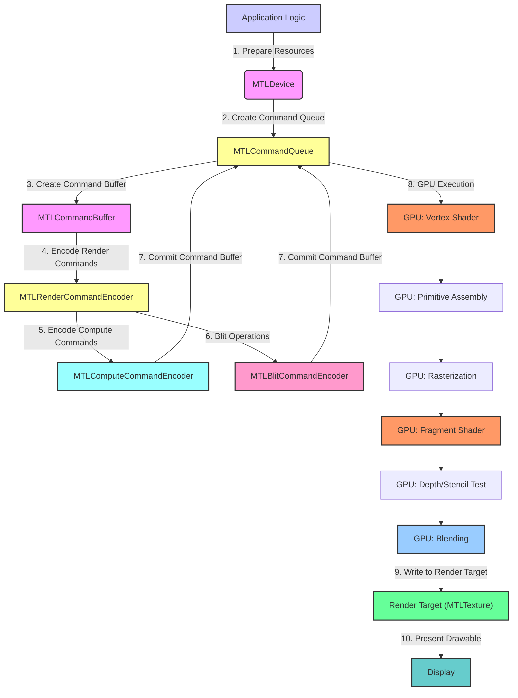
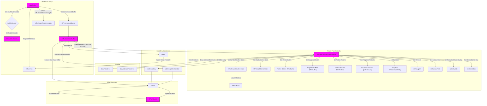
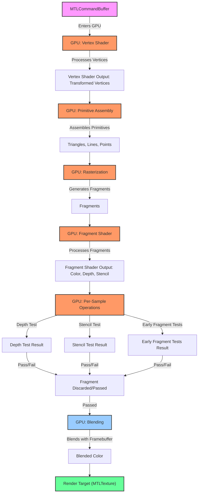
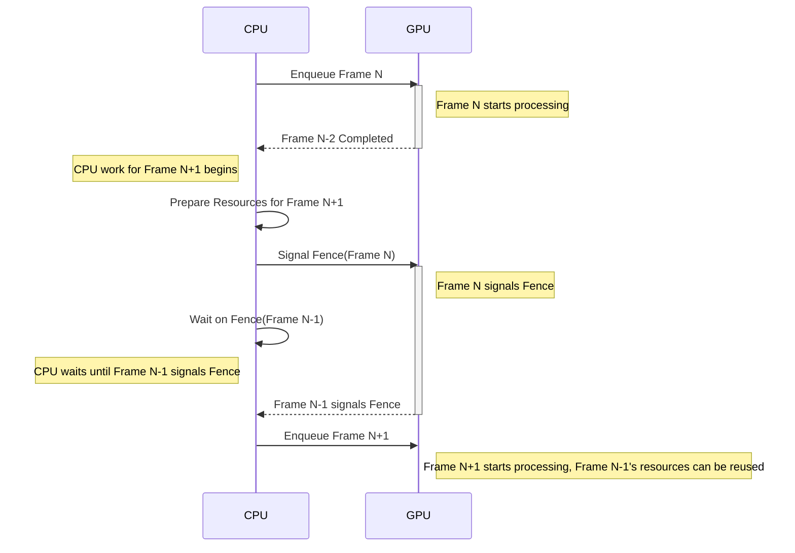

# Metal's Rendering Pipeline
 
## 1. Metal Rendering Pipeline: High-Level Overview
> This content is dual-licensed under your choice of the following licenses:
> 1.  **MIT License:** For the code implementations in Swift and Mermaid provided in this document.
> 2.  **Creative Commons Attribution 4.0 International License (CC BY 4.0):** For all other content, including the text, explanations, and the Mermaid diagrams and illustrations.

---
This diagram provides a simplified, top-level view of the key stages in Metal's rendering pipeline.



**Explanation:**

1. **Application Logic**: The CPU-side code that drives the rendering process.
2. **MTLDevice**: Represents the GPU; used to create other Metal objects.
3. **MTLCommandQueue**: Manages the execution of command buffers.
4. **MTLCommandBuffer**: Stores encoded commands for the GPU.
5. **MTLRenderCommandEncoder**: Encodes rendering commands (draw calls, state settings).
6. **MTLComputeCommandEncoder**: Encodes compute commands (general-purpose GPU computations).
7. **MTLBlitCommandEncoder**: Encodes blitting operations (copying data between textures and buffers).
8. **GPU Execution**: The command buffer is submitted to the GPU, which executes the encoded commands.
9. **Write to Render Target**: The output of the fragment shader is written to a render target (`MTLTexture`).
10. **Present Drawable**: The rendered image in the `MTLTexture` (which is associated with a `CAMetalDrawable`) is presented on the display.

## 2. Metal Rendering Pipeline: Detailed Resource Setup and Encoding

This diagram dives deeper into the resource setup and encoding process within a single render pass. All of the elements to be rendered in a single frame are considered to be included in the same singular render pass.


## TODO: Fix diagram syntax error

```mermaid
graph TD
    subgraph "Per-Frame Setup"
        A[Application] -->|Get CAMetalDrawable| B{CAMetalLayer};
        B -->|CAMetalDrawable| C[Drawable Texture];
        A -->|Create Command Buffer| D[MTLCommandQueue];
        D --> E[MTLCommandBuffer];
        A -->|Acquire MTLFence| F[MTLFence];
        A -->|Create MTLRenderPassDescriptor| G[MTLRenderPassDescriptor];
    end
    
    subgraph "Render Pass Encoding"
        E -->|Create Render Command Encoder| H[MTLRenderCommandEncoder];
        H -->|Set Render Pipeline State| I[MTLRenderPipelineState];
        I -->|Loads Shaders| J[MTLLibrary];
        H -->|Set Depth Stencil State| K[MTLDepthStencilState];
        H -->|Set Vertex Buffers| L["Vertex Buffers (MTLBuffer)"];
        H -->|Set Fragment Buffers| M["Fragment Buffers (MTLBuffer)"];
        H -->|Set Vertex Textures| N["Vertex Textures (MTLTexture)"];
        H -->|Set Fragment Textures| O["Fragment Textures (MTLTexture)"];
        H -->|Set Samplers| P["Samplers (MTLSamplerState)"];
        H -->|Set Viewport| Q[setViewport];
        H -->|Set Scissor Rect| R[setScissorRect];
        H -->|Set Front/Back Face Culling| S[setCullMode];
        H -->|Set Depth/Stencil Bias| T[setDepthBias];
       
    end
        
        subgraph "Drawing"
        H -->|Draw Primitives| U[drawPrimitives];
        H -->|Draw Indexed Primitives| V[drawIndexedPrimitives];
    end

    subgraph "Encoding Completion"
        H -->|End Encoding| W[endEncoding];
        E -->|Add Completion Handler| X[addCompletedHandler];
    E -->|Signal Fence| Y[signal];
        Y -- Signal Value: Frame N --> F;
    E -->|Commit Command Buffer| Z[commit];
        W --> Z;
        X --> Z;
         Z -- wait scheduled .-> BA;
    end

    subgraph "GPU Execution"
       Z -->|Execute on GPU| BA[GPU Stages];
    end

    classDef highlight fill:#f96,stroke:#333,stroke-width:2px;
    class A,C,E,H,BA highlight

```


Note: 
My workaround diagram for now: 





---


**Explanation:**

**Per-Frame Setup:**

1. **Get Drawable**: Obtain a `CAMetalDrawable` (and its associated `MTLTexture`) to render into from the `CAMetalLayer`.
2. **Create Command Buffer**:  A new `MTLCommandBuffer` is created for each frame.
3. **Acquire `MTLFence`**: Used for CPU-GPU synchronization.
4. **Create `MTLRenderPassDescriptor`**: Configures the render pass, including attachments (color, depth, stencil).

**Render Pass Encoding:**

1. **Create `MTLRenderCommandEncoder`**: Encodes commands for a single render pass.
2. **Set Pipeline State**:
    *   `MTLRenderPipelineState`: Contains compiled vertex and fragment shaders (`MTLLibrary`).
    *   `MTLDepthStencilState`: Configures depth and stencil testing.
3. **Set Resources**: Bind buffers (`MTLBuffer`), textures (`MTLTexture`), and samplers (`MTLSamplerState`) for vertex and fragment stages.
4. **Set State**: Configure viewport, scissor rectangle, face culling, and depth/stencil bias.

**Drawing:**

1. **Draw Calls**: `drawPrimitives` or `drawIndexedPrimitives` encode the actual drawing commands.

**Encoding Completion:**

1. **End Encoding**: Signals the end of the render pass.
2. **Completion Handler**: A callback function that's executed on the CPU after the GPU finishes executing the command buffer.
3. **Signal `MTLFence`**: Increments the fence's value, indicating that the GPU has reached this point in the command buffer's execution.
4. **Commit Command Buffer**: Submits the command buffer to the `MTLCommandQueue` for execution.

**GPU Execution:**

1. **GPU Stages**: The committed command buffer is executed by the GPU, going through the stages outlined in the high-level diagram (vertex shading, rasterization, etc.). The command buffer has to wait to be scheduled for execution until signaled by the CPU.&#x20;

### 3. Metal Rendering Pipeline: GPU Execution Stages

This diagram details the internal stages that occur on the GPU during the execution of a command buffer.



**Explanation:**

1. **Vertex Shader**: Processes each vertex, applying transformations (e.g., model-view-projection).
2. **Primitive Assembly**: Groups vertices into primitives (triangles, lines, points).
3. **Rasterization**: Converts primitives into fragments (pixels).
4. **Fragment Shader**: Processes each fragment, calculating its color, depth, and stencil values.
5. **Per-Sample Operations**:
    *   **Early Fragment Tests**: Depth and stencil tests that may discard fragments early, before the fragment shader.
    *   **Depth Test**: Compares the fragment's depth value with the depth buffer to determine visibility.
    *   **Stencil Test**: Compares the fragment's stencil value with the stencil buffer for masking.
6. **Blending**: If the fragment passes depth/stencil tests, its color is blended with the existing color in the render target based on the blending parameters.
7. **Render Target**: The final color is written to the render target (`MTLTexture`).

### 4. Synchronization with `MTLFence`

This diagram illustrates how `MTLFence` is used to synchronize operations between the CPU and GPU, ensuring that resources are ready before they are used.



**Explanation:**

1. **Enqueue Frame N:** The CPU enqueues commands for frame N to the GPU.
2. **Frame N-2 Completed:** The GPU notifies the CPU that a prior frame (N-2) has finished.
3. **CPU work for Frame N+1:** The CPU starts preparing resources for the next frame in the sequence (N+1), such as updating buffers or textures while the GPU is working on Frame N
4. **Prepare Resources:** The CPU prepares resources for frame N+1. It can safely update resources used by frame N-1 because the GPU has finished using them.
5. **Signal `MTLFence`(Frame N)**: After encoding commands for frame N, the CPU signals the fence.
6. **Wait on `MTLFence`(Frame N-1)**: Before the CPU can reuse resources used by frame N-1(for example, updating a vertex buffer for a new frame, say frame N+2), it must wait for the `MTLFence` that was signaled at the end of frame N-1.
7. **Fence Signaled:** The GPU signals the fence for frame N-1 after all its commands for that frame have been completed.
8. **Enqueue Frame N+1:** Resources are ready, so the CPU can safely enqueue frame N+1 using the updated resources that were used by frame N-1.

These optimized diagrams provide a clear and comprehensive understanding of Metal's rendering pipeline, covering high-level flow, detailed resource setup, GPU stages, and synchronization mechanisms. They are designed to be informative and easy to understand, focusing on the unique aspects of each stage without unnecessary repetition.

---
