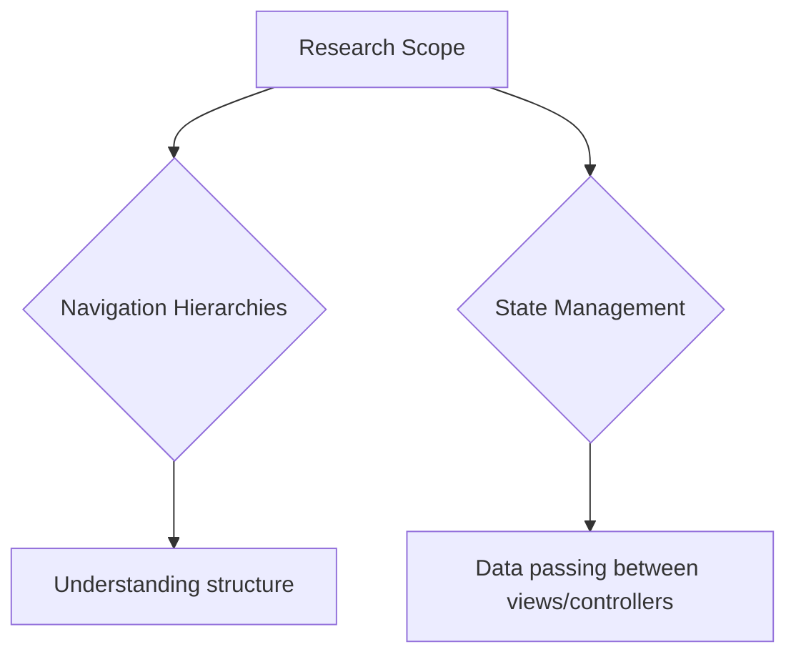
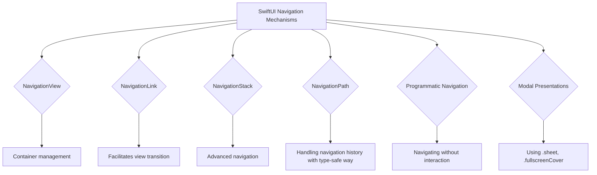
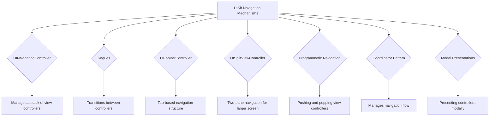
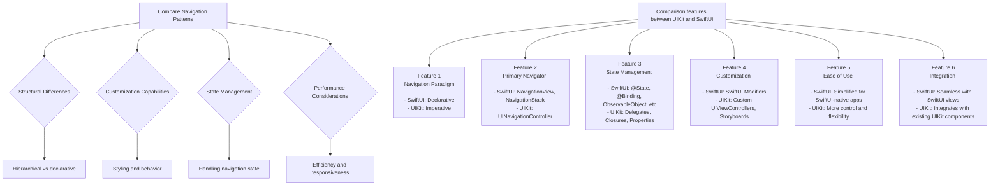
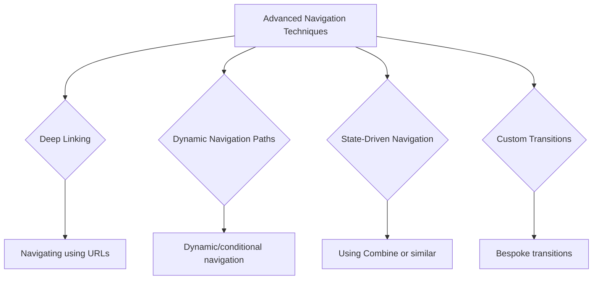
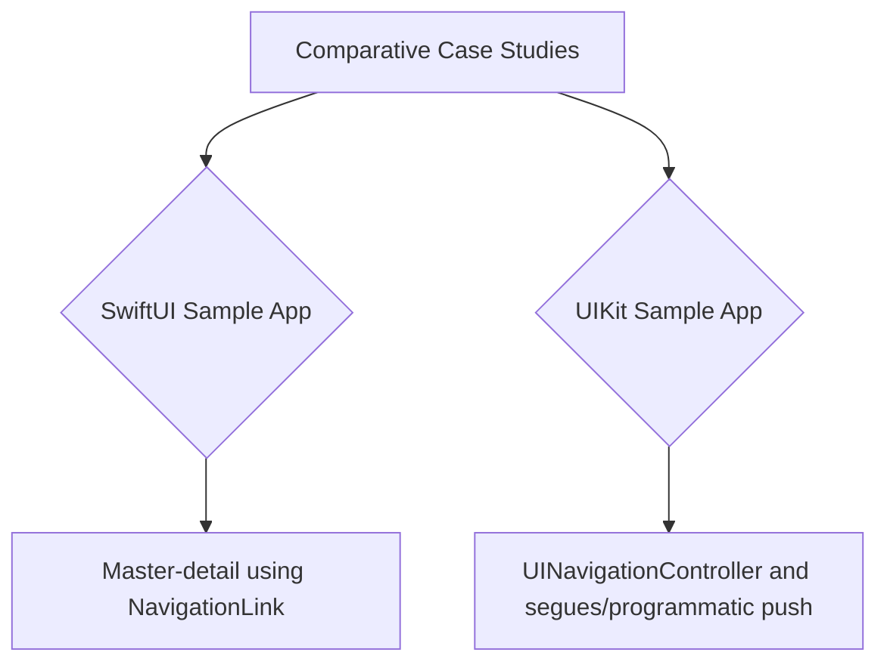
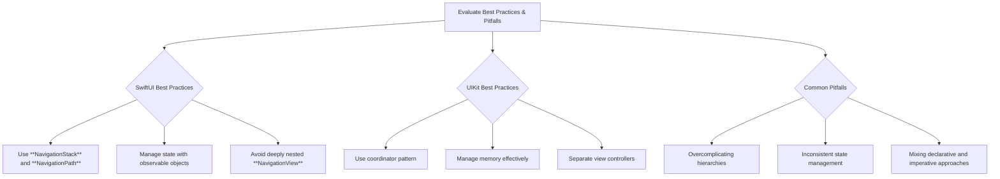
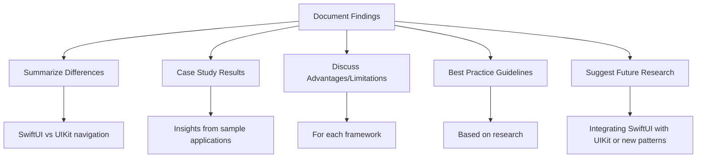
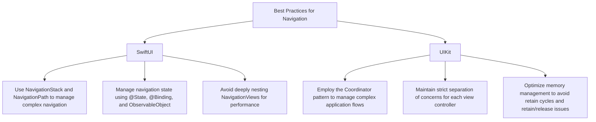
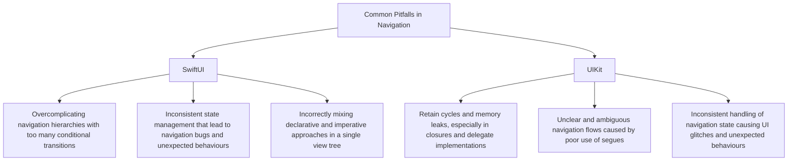

# Navigation Mechanisms in SwiftUI and UIKit

These diagrams below will cover the various aspects of navigation in SwiftUI and UIKit.

## Research Scope

## SwiftUI Navigation Mechanisms

## UIKit Navigation Mechanisms

## Compare Navigation Patterns

## Advanced Navigation Techniques

## Comparative Case Studies

## Evaluate Best Practices & Pitfalls

## Document Findings

## Best Practices for Navigation

## Common Pitfalls in Navigation

---
