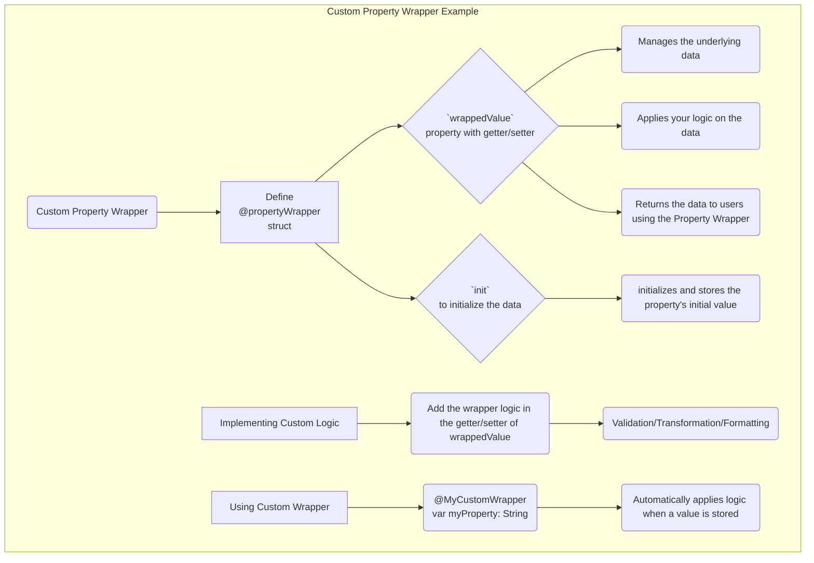
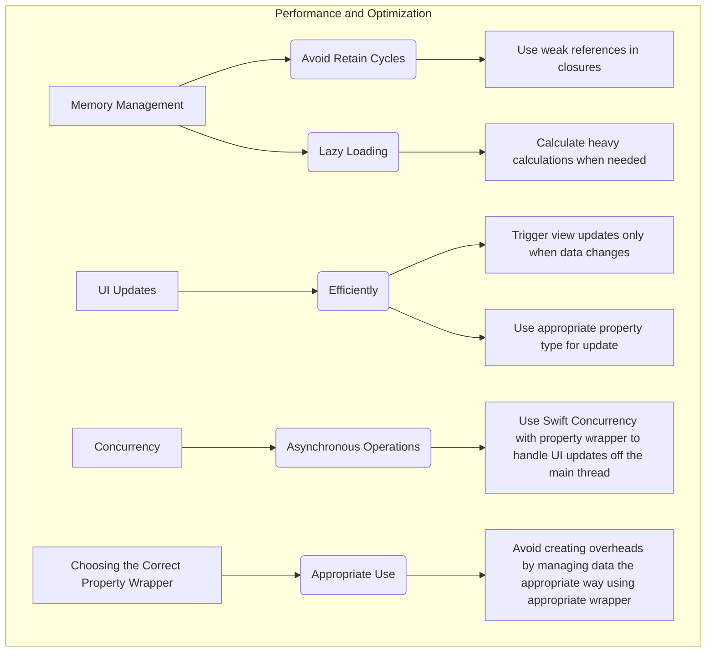

# Property Wrappers in SwiftUI

Let's break down the concept of Property Wrappers in SwiftUI and represent them in a set of Mermaid diagrams.


```mermaid
graph TD
    subgraph Property Wrappers in SwiftUI
        A[Definition & Purpose] --> B(Encapsulate Property Behavior);
        B --> C(Manage underlying storage);
        B --> D(Add extra functionality like validation, formatting);
        B --> E(Simplify code through reusability);
        
        F[Built-in Wrappers] --> G{State Management};
        G --> H[@State];
        H --> I("Manages local view state\n(Private to view)");
        G --> J[@Binding];
        J --> K("Creates two-way data connection\n(View updates reflect in source)");
        G --> L[@ObservedObject];
        L --> M("Observes externally sourced changes\n(Reflects in a view)");
        G --> N[@Environment];
        N --> O("Accesses data from parent view\n(Shared resources)");
        G --> P[@EnvironmentObject];
        P --> Q("Similar to observedObject but for app-wide scope");
        G --> R[@Published]
        R --> S("Marks a property to publish changes when modified");    
        F --> T{Data Flow}
        T --> U("Control data flow in views hierarchy");
        T --> V("Define how data is passed between views, objects and environment");
       
        W[Custom Wrappers] --> X(Encapsulate Reusable Logic);
        X --> Y("Follows @propertyWrapper structure");
        Y --> Z("wrappedValue for access");
        Y --> AA("init to initialize");
        W --> AB(Enhance Code organization)
        AB --> AC(Implement input validations);
        AB --> AD(Handle data transformation);
        AB --> AE(Automate UI Update);
        
        AF[Data Flow & State Management] --> AG{Data Binding};
        AG --> AH("Bidirectional data communication between views and data sources")
        AG --> AI("Uses @Binding combined with @State");
        
        AF --> AJ{Observable Objects}
        AJ --> AK("Enables views to respond to data changes");
        AJ --> AL("Relies on @ObservedObject and @Published in an object");
        
        AF --> AM{Environment Values}
        AM --> AN("Make global data available to all views in the hierarchy");
        AM --> AO("Uses @Environment or @EnvironmentObject")
        
        AP[Performance] --> AQ(Memory Mangement);
        AQ --> AR("Avoid retain cycle with weak ref");
        AQ --> AS("Lazy loading for heavy computations");
        
        AP --> AT(Effective UI Updates);
        AT --> AU("Minimize unnecessary updates by leveraging the update mechanism of those Property Wrapper");
        
        AP --> AV(Concurrency);
        AV --> AW("Use Swift concurrency to process data asynchronously that are managed by a Property Wrapper if needed");
        
        AP --> AX(Optimization);
        AX --> AY("Use different Property Wrapper to manage different kind of data");
        
        AZ[Examples Usage] --> BA("Use @State inside a view to save a local status of a view");
        AZ --> BB("Use @Binding when a child view needs to updates a value that was passed from its parent (two ways communication)");
        AZ --> BC("Use @ObservedObject when you have to track changes in a class that is used in different views");
        AZ --> BD("Use @Environment or @EnvironmentObject to access themes or user settings that are accessible by the entire application");
        AZ --> BE("Create a custom property wrapper to automatically format a String property of a class used in your app's views");
        AZ --> BF("Create a custom property wrapper to validate an user input in different view model");
           
    end
    
```


Note: This is my re-work diagram for the above diagram - WIP

```mermaid

graph TD
    classDef Built_in_Wrappers_State_Management  fill:#AD2186,stroke:#333,stroke-width:2px,roundedCorners
    classDef Built_in_Wrappers_State_Management_Usecase fill:#9E1119,stroke:#333,stroke-width:2px,roundedCorners
    %% classDef security fill:#008080,stroke:#333,stroke-width:2px,roundedCorners
    
    
    A[Property Wrappers in SwiftUI] --> F[Built-in Wrappers];
    A --> W[Custom Wrappers];

    W --> X(Encapsulate Reusable Logic);
    X --> Y("Follows @propertyWrapper structure");
    Y --> Z("wrappedValue for access");
    Y --> AA("init to initialize");


    F--> State_Management;
    F --> Data_Flow;

    subgraph Data_Flow
    style Data_Flow fill:#2186,stroke:#333,stroke-width:2px,roundedCorners
        U("Control data flow in views hierarchy");
        V("Define how data is passed between views, objects and environment");
    end


    subgraph State_Management
        %% Background styling for the subgraph State_Management
        style State_Management fill:#2186,stroke:#333,stroke-width:2px,roundedCorners
        
        G1["@State"]:::Built_in_Wrappers_State_Management
        G2["@Binding"]:::Built_in_Wrappers_State_Management
        G3[@ObservedObject]:::Built_in_Wrappers_State_Management
        G4[@Environment]:::Built_in_Wrappers_State_Management
        G5[@EnvironmentObject]:::Built_in_Wrappers_State_Management
        G6[@Published]:::Built_in_Wrappers_State_Management


        G11:::Built_in_Wrappers_State_Management_Usecase
        G21:::Built_in_Wrappers_State_Management_Usecase
        G31:::Built_in_Wrappers_State_Management_Usecase
        G41:::Built_in_Wrappers_State_Management_Usecase
        G51:::Built_in_Wrappers_State_Management_Usecase
        G61:::Built_in_Wrappers_State_Management_Usecase

        G1 --> G11("Manages local view state <br> (Private to view)");
        G2 --> G21("Creates two-way data connection <br> (View updates reflect in source)");
        G3--> G31("Observes externally sourced changes\n(Reflects in a view)");
        G4 --> G41("Accesses data from parent view\n(Shared resources)");
        G5 --> G51("Similar to observedObject but for app-wide scope");
        G6 --> G61("Marks a property to publish changes when modified");

    end
    
```

## Built-in Property Wrapper Examples

```mermaid
graph TD
    subgraph Built-in Property Wrapper Examples
        A[@State] --> B("Use to manage local data within a View, changes trigger UI updates. <br> Example: @State var isToggleOn = false");
        
        C[@Binding] --> D("Used to create two-way bindings, changes in child View will change parent View's property. <br> Example: @Binding var name: String");
        D --> E("Passed as parameter when creating child View with the same property");
        
        F[@ObservedObject] --> G("Used to observe changes in an ObservableObject. <br> Example: @ObservedObject var viewModel = MyViewModel() ");
        G --> H("View updates when viewModel's @Published properties change");
        
        I[@Environment] --> J("Used to access environment data in a View. <br> Example: @Environment(\\.locale) var locale: Locale");
        J --> K("Can be passed by parent view");

        L[@EnvironmentObject] --> M("Used to inject global data in app, to access any view <br> Example: @EnvironmentObject var appSettings: AppSettings");
        M --> N("Can be set in the application struct");
           
        O[@Published] --> P("Publishes changes to properties for observers <br> Example: @Published var time: Date");
        P --> Q("It will trigger the update on the view observing with @ObservedObject")
    end
    
```


## TODO: Fix diagram syntax error


## Custom Property Wrapper Example




## Data Flow with Property Wrappers

```mermaid
graph TD
    subgraph Data Flow with Property Wrappers
        A[@State] --> B{Local State};
        B --> C["Data is contained within the scope of the view"];
        C --> D("Used for single view properties");
    
        A --> E{View Update};
        E --> F("Change in value will trigger an UI Update within same view");
        
        G[@Binding] --> H{Two-Way Binding};
        H --> I("Propagates data modification to and from Binding source");
        I --> J("Used to manage properties that are shared between parent and child views");
        
        G --> K{View Update};
        K --> L("Change in value will trigger UI Update in both parent and child views");

        M[@ObservedObject] --> N{Observable State};
        N --> O("Property published its changes to the view");
        O --> P("Class can be used in multiple views");
        
        M --> Q{View Update};
        Q --> R("Changes in @Publised properties triggered UI Updates with @ObservedObject");
        
        S[@Environment] --> T{Environment Data};
        T --> U("Access system or application settings");
        U --> V("Can be modified at the top level of View Hierarchy");   
        
        S --> W{View Update};
        W --> X("Change in value will trigger UI Update to all views listening to it");
        
        Y[@EnvironmentObject] --> Z{Global Data};
        Z --> AA("App-wide data shared between all views available in the application");
        AA --> AB("Data is set at the application level");
        
        Y --> AC{View Update};
        AC --> AD("Change in value will trigger UI Update to all views listening to it");
    end
    
```

## Performance and Optimization



---
