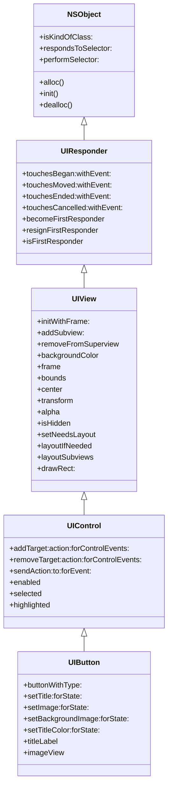
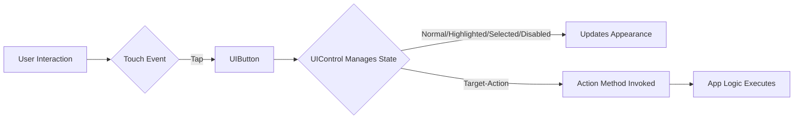
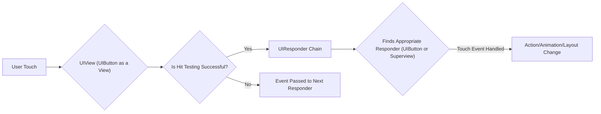
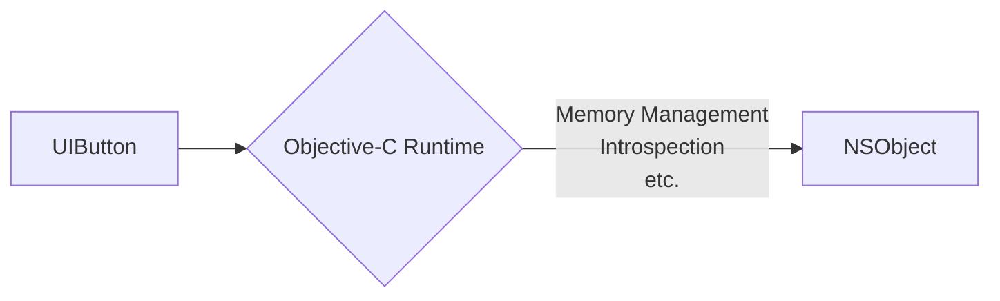

# The Class Hierarchy of UIButton in UIKit

> This content is dual-licensed under your choice of the following licenses:
> 1.  **MIT License:** For the code implementations in Swift and Mermaid provided in this document.
> 2.  **Creative Commons Attribution 4.0 International License (CC BY 4.0):** For all other content, including the text, explanations, and the Mermaid diagrams and illustrations.

---

Below diagrams are designed to be clear, informative, and serve as useful reference documentation for developers.

### Diagram 1: UIButton Class Hierarchy

This diagram provides a clear overview of the inheritance chain for `UIButton`.

**Explanation:**

*   The diagram visually represents the inheritance chain, starting from the base class `NSObject` and extending to `UIButton`.
*   Each class is linked to its superclass, showing the flow of inheritance.
*   Methods are included as a representation of the functionality provided at each level of the hierarchy. (Methods listed are representative and not an exhaustive list).

### Diagram 2: UIButton Interaction and State Management

This diagram focuses on how `UIButton` inherits and utilizes features from `UIControl` to manage interactions and states.

**Explanation:**

*   The diagram starts with a user interaction (a tap).
*   The `UIButton` receives the touch event.
*   `UIControl` (superclass of `UIButton`) manages the button's state (normal, highlighted, selected, disabled).
*   Based on the state, the button's appearance updates.
*   `UIControl` also handles the target-action mechanism, invoking the specified action method.
*   Finally, the app logic associated with the button's action is executed.

### Diagram 3: UIView and Responder Chain

This diagram shows how `UIButton` participates in the responder chain and utilizes `UIView` properties.

**Explanation:**

*   The diagram starts with a user touch on the screen.
*   Since `UIButton` inherits from `UIView`, the touch event first interacts with the button as a view.
*   A hit test determines if the touch is within the bounds of the button.
*   If yes, the event is passed to the responder chain.
*   The responder chain finds the appropriate responder (e.g., the `UIButton` itself or one of its superviews).
*   The responder handles the touch event, potentially triggering an action, animation, or layout change.
*   If the hit test fails, the event is passed to the next responder in the chain.

### Diagram 4:  NSObject's Role

This simple diagram highlights the fundamental contribution of `NSObject`.

**Explanation:**

*   Illustrates that `UIButton`, through its inheritance chain, relies on `NSObject` for fundamental Objective-C runtime features like memory management and introspection.

---
**Licenses:**

- **MIT License:**   - Full text in [LICENSE](LICENSE) file.
- **Creative Commons Attribution 4.0 International:**  - Legal details in [LICENSE-CC-BY](LICENSE-CC-BY) and at [Creative Commons official site](http://creativecommons.org/licenses/by/4.0/).

---