# MTLCommandQueue - Integration With Metal Rendering Pipeline

Below is a comprehensive and detailed Mermaid flowchart that illustrates how `MTLCommandQueue` integrates within the Metal rendering pipeline, along with explanations for each step.

---

## **Rendering Pipeline Integration Diagram**

- **Purpose**: Demonstrate the comprehensive flow of data and command execution from the initialization of the Metal device to the final rendered output, highlighting the role of `MTLCommandQueue` within the rendering pipeline.

- **Diagram Type**: `flowchart TD`

- **Contents**:
  - **MTLDevice**: Represents the Metal device interface.
  - **MTLCommandQueue**: Manages the scheduling and execution of command buffers.
  - **MTLCommandBuffer**: Encapsulates encoded commands for the GPU.
  - **MTLRenderCommandEncoder**: Encodes rendering commands into the command buffer.
  - **MTLRenderPipelineState**: Configures the graphics rendering pipeline.
  - **MTLDrawable**: Represents the renderable surface (e.g., a screen or offscreen buffer).
  - **MTLViewport**: Defines the drawable area.
  - **GPU Execution**: The stage where the GPU processes the encoded commands.
  - **Rendered Output**: The final visual output displayed to the user.

```mermaid
flowchart TD
    %% Initialization Phase
    A[Application Start] --> B[Initialize Metal]
    B --> C["MTLCreateSystemDefaultDevice()"]

    %% Device Setup
    C --> D[MTLDevice Initialized]
    D --> E[Create MTLCommandQueue]
    E --> F[MTLCommandQueue Initialized]

    %% Render Pipeline Configuration
    F --> G[Create MTLRenderPipelineDescriptor]
    G --> H[Configure Vertex & Fragment Shaders]
    H --> I[Set Render Pipeline States]
    I --> J[MTLRenderPipelineState Created]

    %% Frame Rendering Cycle
    J --> K[Create MTLCommandBuffer]
    K --> L[Create MTLDrawable]
    L --> M[Create MTLRenderPassDescriptor]
    M --> N[Create MTLRenderCommandEncoder]
    N --> O[Set Render Pipeline State]
    O --> P[Set Vertex Buffers]
    P --> Q[Encode Draw Calls]
    Q --> R[End Encoding]
    R --> S[Commit CommandBuffer to MTLCommandQueue]
    S --> T[CommandBuffer Enqueued]
    T --> U[GPU Executes Commands]
    U --> V[Present Drawable]
    V --> W[Rendered Output Displayed]

    %% Loop Back for Continuous Rendering
    W --> K

    %% Additional Components
    subgraph Pipeline Configuration
        G
        H
        I
        J
    end

    subgraph Frame Rendering
        K
        L
        M
        N
        O
        P
        Q
        R
        S
        T
        U
        V
        W
    end

    
    classDef initialization fill:#f51,stroke:#333,stroke-width:2px;
    class A,B,C,D,E,F initialization;

    %% Comment out for now
    %% classDef configuration fill:#bbf,stroke:#333,stroke-width:2px; %%
    %% class Pipeline Configuration configuration; %%

    %% classDef rendering fill:#bfb,stroke:#333,stroke-width:2px; %%
    %% class Frame Rendering rendering; %%
    
```

### **Diagram Breakdown**

1. **Initialization Phase**
   - **Application Start**: The entry point of the application.
   - **Initialize Metal**: Setting up the Metal framework within the application.
   - **MTLCreateSystemDefaultDevice()**: Creates the default Metal device, representing the GPU.

2. **Device Setup**
   - **MTLDevice Initialized**: The Metal device is successfully created and ready for use.
   - **Create MTLCommandQueue**: Establishes a command queue associated with the Metal device.
   - **MTLCommandQueue Initialized**: The command queue is ready to manage command buffers.

3. **Render Pipeline Configuration**
   - **Create MTLRenderPipelineDescriptor**: Defines the configuration for the render pipeline, including shaders and pixel formats.
   - **Configure Vertex & Fragment Shaders**: Assigns shaders to the pipeline descriptor.
   - **Set Render Pipeline States**: Specifies various states like blend modes, culling, and depth testing.
   - **MTLRenderPipelineState Created**: Compiles and finalizes the render pipeline state object.

4. **Frame Rendering Cycle**
   - **Create MTLCommandBuffer**: Allocates a new command buffer from the command queue.
   - **Create MTLDrawable**: Obtains a drawable object to render content.
   - **Create MTLRenderPassDescriptor**: Describes the rendering parameters for the pass, including attachments.
   - **Create MTLRenderCommandEncoder**: Begins encoding rendering commands into the command buffer.
   - **Set Render Pipeline State**: Associates the previously created pipeline state with the encoder.
   - **Set Vertex Buffers**: Binds vertex data to the encoder.
   - **Encode Draw Calls**: Issues draw commands (e.g., `drawPrimitives`) to the encoder.
   - **End Encoding**: Finalizes the encoding process.
   - **Commit CommandBuffer to MTLCommandQueue**: Submits the filled command buffer to the command queue for execution.
   - **CommandBuffer Enqueued**: The command buffer is now queued for GPU processing.
   - **GPU Executes Commands**: The GPU processes the commands, rendering the frame.
   - **Present Drawable**: Displays the rendered content on the screen.
   - **Rendered Output Displayed**: The final image is visible to the user.

5. **Loop Back for Continuous Rendering**
   - **Rendered Output Displayed** → **Create MTLCommandBuffer**: The cycle repeats for the next frame, enabling continuous rendering.

### **Key Components and Their Roles**

- **MTLDevice**: Acts as the central interface to the GPU, allowing creation of resources and command queues.
  
- **MTLCommandQueue**: Manages the order and execution of command buffers, ensuring efficient utilization of the GPU.

- **MTLCommandBuffer**: Stores encoded commands that the GPU will execute, such as rendering commands or compute operations.

- **MTLRenderCommandEncoder**: Encodes rendering-specific commands into the command buffer, including setting pipeline states, binding resources, and issuing draw calls.

- **MTLRenderPipelineState**: Encapsulates the compilation of shaders and configuration of the rendering pipeline, critical for defining how vertices and fragments are processed.

- **MTLDrawable**: Represents the target surface for rendering, typically a texture that will be presented on the screen.

- **GPU Execution**: The stage where the GPU processes the commands, performing rendering tasks to produce graphical output.

- **Rendered Output**: The final image or frame that is displayed to the user, representing the culmination of the rendering pipeline.

### **Best Practices Integration**

- **Efficient Command Buffer Management**: Reuse command buffers where possible and minimize their creation overhead to enhance performance.

- **Synchronization**: Ensure proper synchronization between CPU and GPU tasks to prevent stalls and maintain smooth rendering.

- **Resource Optimization**: Optimize the use of textures, buffers, and pipeline states to reduce memory footprint and increase rendering efficiency.

- **Error Handling**: Implement robust error handling during pipeline configuration and command encoding to catch and resolve issues promptly.

- **Profiling and Optimization**: Utilize Metal's profiling tools to monitor GPU performance, identify bottlenecks, and optimize rendering paths accordingly.

**Key Takeaways**:
- **Initialization**: Setting up the Metal device and command queue is the foundation for rendering.
- **Pipeline Configuration**: Proper configuration of the render pipeline state ensures that rendering commands are processed correctly.
- **Rendering Cycle**: Efficient encoding and submission of command buffers to the command queue facilitate smooth GPU execution and rendering.
- **Continuous Rendering**: The looping mechanism enables real-time rendering essential for applications like games and interactive visualizations.

---

## **Rendering Pipeline Integration Diagram**

**Purpose**: Show how `MTLCommandQueue` integrates within the Metal rendering pipeline.

**Diagram Type**: `flowchart TD`

**Diagram Contents**:

- **MTLDevice**
- **MTLCommandQueue**
- **MTLCommandBuffer**
- **MTLRenderCommandEncoder**
- **MTLRenderPipelineState**
- **Encoding Render Commands**
- **Submitting Command Buffer**
- **GPU Execution**
- **MTLDrawable / MTLTexture**
- **Rendered Output**

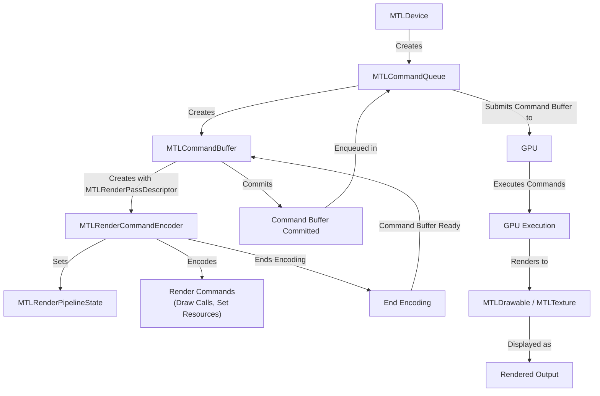

#### **Explanation of the Diagram**

1. **MTLDevice Creation**:
   - **Description**: The `MTLDevice` represents the GPU and provides methods to create other Metal objects.
   - **Operation**: The application obtains a reference to the `MTLDevice` using `MTLCreateSystemDefaultDevice()`.

2. **Creating MTLCommandQueue**:
   - **Description**: The `MTLCommandQueue` manages the order in which command buffers are executed by the GPU.
   - **Operation**: The `MTLDevice` creates an `MTLCommandQueue` using `makeCommandQueue()`.

3. **Creating MTLCommandBuffer**:
   - **Description**: An `MTLCommandBuffer` is a container that stores encoded commands to be executed by the GPU.
   - **Operation**: The `MTLCommandQueue` creates an `MTLCommandBuffer` using `commandBuffer()`.

4. **Creating MTLRenderCommandEncoder**:
   - **Description**: The `MTLRenderCommandEncoder` encodes rendering commands into the command buffer.
   - **Operation**: The `MTLCommandBuffer` creates an `MTLRenderCommandEncoder` with a `MTLRenderPassDescriptor` using `renderCommandEncoder(descriptor:)`.

5. **Setting MTLRenderPipelineState**:
   - **Description**: The `MTLRenderPipelineState` contains the compiled shaders and state used for rendering.
   - **Operation**: The `MTLRenderCommandEncoder` sets the pipeline state using `setRenderPipelineState(_:)`.

6. **Encoding Render Commands**:
   - **Description**: Render commands include drawing primitives, setting vertex buffers, fragment buffers, textures, etc.
   - **Operation**: The `MTLRenderCommandEncoder` encodes draw calls and resource bindings (e.g., `drawPrimitives`, `setVertexBuffer`).

7. **Ending Encoding**:
   - **Description**: Signifies that all rendering commands have been encoded into the command buffer.
   - **Operation**: The `MTLRenderCommandEncoder` ends encoding with `endEncoding()`.

8. **Command Buffer Ready**:
   - **Description**: The command buffer is now ready to be committed for execution.
   - **Operation**: Control returns to the `MTLCommandBuffer` after encoding is complete.

9. **Committing Command Buffer**:
   - **Description**: Commits the command buffer so that it can be scheduled for execution.
   - **Operation**: The `MTLCommandBuffer` is committed using `commit()`. Optionally, `present(_:)` can be called to display a drawable.

10. **Enqueued in Command Queue**:
    - **Description**: The committed command buffer is added to the command queue.
    - **Operation**: The `MTLCommandQueue` schedules the command buffer for submission to the GPU.

11. **Submission to GPU**:
    - **Description**: The command buffer is sent to the GPU for execution.
    - **Operation**: The `MTLCommandQueue` submits the command buffer to the GPU driver.

12. **GPU Execution**:
    - **Description**: The GPU executes the commands encoded in the command buffer.
    - **Operation**: The GPU processes the command buffer, executing shaders, and performing rendering operations.

13. **Rendering to MTLDrawable / MTLTexture**:
    - **Description**: Rendering results are written to a drawable or texture, which represents a renderable resource.
    - **Operation**: Rendered output is stored in a `MTLDrawable` (e.g., from a `CAMetalLayer`) or a `MTLTexture`.

14. **Displaying Rendered Output**:
    - **Description**: The final image is displayed on the screen or used in further processing.
    - **Operation**: The drawable is presented to the screen, or the texture is sampled in subsequent rendering passes.

#### **Key Components and Their Roles**

- **MTLDevice**: Interface to the GPU, used to create other Metal objects.
- **MTLCommandQueue**: Manages the submission of command buffers to the GPU.
- **MTLCommandBuffer**: Encapsulates commands for the GPU to execute.
- **MTLRenderCommandEncoder**: Encodes rendering commands into a command buffer.
- **MTLRenderPipelineState**: Stores the state for the rendering pipeline, including shader programs.
- **MTLDrawable / MTLTexture**: The destination for rendering output.

#### **Workflow Summary**

1. **Setup**:
   - Obtain an `MTLDevice`.
   - Create an `MTLCommandQueue`.

2. **Frame Rendering**:
   - Begin a new frame by creating an `MTLCommandBuffer`.
   - Create an `MTLRenderCommandEncoder` with a `MTLRenderPassDescriptor` that describes the render targets.
   - Set the `MTLRenderPipelineState` to define shaders and fixed-function state.
   - Encode rendering commands using the encoder.
   - End encoding.

3. **Submission and Execution**:
   - Commit the `MTLCommandBuffer`.
   - The `MTLCommandQueue` schedules and submits the command buffer to the GPU.
   - The GPU executes the commands.

4. **Presentation**:
   - The rendered content is written to a `MTLDrawable` or `MTLTexture`.
   - If rendering to a drawable from a `CAMetalLayer`, present the drawable to display the output on the screen.

#### **Additional Notes**

- **Synchronization**:
  - Synchronization mechanisms like semaphores or callbacks can be used to coordinate CPU and GPU work.

- **Error Handling**:
  - Errors during encoding or execution can be handled by checking the status of the `MTLCommandBuffer`.

- **Optimization**:
  - Reuse objects like pipeline states and buffers when possible for better performance.
  - Use efficient encoding practices to minimize overhead.

---

## Rendering Pipeline Integration Diagram of `MTLCommandQueue`

Here’s the complete and enhanced **Rendering Pipeline Integration Diagram of `MTLCommandQueue`** utilizing all relevant context and industry knowledge. This will provide additional details on the flow, including intermediate steps, function calls, and dependencies at each phase within the Metal rendering pipeline.

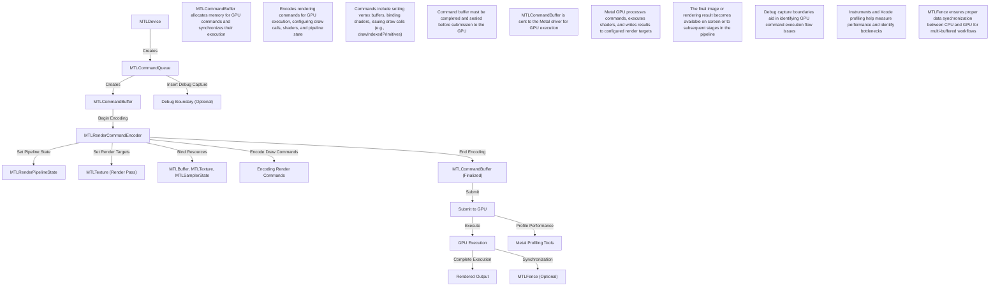

### **Diagram Explanation**

1. **MTLDevice**: Represents the physical GPU or virtual GPU resource used for rendering. All Metal objects and resources are created via an instance of `MTLDevice`.

2. **MTLCommandQueue**: The queue responsible for creating and managing `MTLCommandBuffer` objects that encapsulate rendering commands.

3. **MTLCommandBuffer**: Acts as a container that records GPU command streams. It must be finalized before submission to the GPU.

4. **MTLRenderCommandEncoder**: Encodes all rendering commands into the command buffer, configuring aspects like pipeline state, render targets, and issuing draw calls.

5. **MTLRenderPipelineState**: Specifies the state of the rendering pipeline (shaders, blending modes, and more) used to render commands.

6. **MTLTexture**: Serves as a render target for the encoded commands.

7. **MTLBuffer, MTLTexture, MTLSamplerState**: Bind resources such as vertex data, textures, or sampler configurations to the GPU rendering pipeline.

8. **Encoded Render Commands**: Undergo processing from the command buffer into GPU instructions.

9. **Command Submission**: The finalized command buffer (`MTLCommandBuffer`) is submitted to the `MTLCommandQueue`, initiating GPU execution.

10. **GPU Execution**: The commands are executed on the GPU, leading to the production of the rendered output, with results written to the configured render targets.

11. **Rendered Output**: Represents the final on-screen image or intermediate data for further processing.

12. **Debugging & Profiling**: Optionally, developers can insert debug capture boundaries or use profiling tools like Instruments to analyze performance and detect bottlenecks.

13. **Synchronization**: In cases requiring data coordination between the CPU and GPU, `MTLFence` objects are used for synchronization across multiple frames.

### Key Enhancements from Original Diagram
- Added **notes** explaining the role of each step in detail.
- Included resources like `MTLBuffer`, `MTLTexture`, `MTLSamplerState` utilized during render command encoding (`MTLRenderCommandEncoder` phase).
- Highlighted debugging (`Debug Boundary`) and profiling (`Metal Profiling Tools`) optional steps.
- Included `MTLFence` to represent synchronization during GPU execution workflows.
- Enhanced **subordinate steps** like setting pipeline state, render targets, and encoding draw commands for a granular understanding of the process.

---

## How `MTLCommandQueue` integrates within the Metal rendering pipeline

Here is a comprehensive Mermaid diagram that visually represents how `MTLCommandQueue` integrates within the Metal rendering pipeline. Each step is broken down to illustrate the flow from device initialization through to the final output rendered by the GPU.

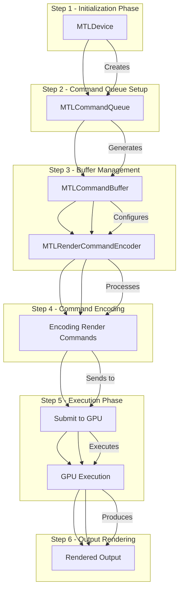

### **Diagram Breakdown:**

1. **Initialization Phase:**
   - **MTLDevice**: The starting point where the Metal device is referenced or created. It represents the GPU hardware being targeted.

2. **Command Queue Setup:**
   - **MTLCommandQueue**: Created via the `MTLDevice` to manage and order the execution of `MTLCommandBuffer` objects.

3. **Buffer Management:**
   - **MTLCommandBuffer**: Each command buffer encapsulates a sequence of commands that are to be executed on the GPU.

4. **Command Encoding:**
   - **MTLRenderCommandEncoder**: A specialized encoder used to encode graphics rendering commands within a command buffer.

5. **Execution Phase:**
   - **Submit to GPU**: The command buffer, once encoded, is submitted to GPU for execution.
   - **GPU Execution**: The GPU processes the encoded commands, executing rendering and compute tasks.

6. **Output Rendering:**
   - **Rendered Output**: The final output is produced on the screen, often involving processes like shader execution, fragment processing, and rasterization.

This diagram illustrates the seamless workflow within the Metal framework, showcasing the interactions from the Metal device through to the rendered output. The steps highlight the efficient transformation of encoded rendering instructions into tangible graphics through the GPU, leveraging the `MTLCommandQueue` as a critical orchestration tool.

---

## The **Rendering Pipeline Integration Diagram of `MTLCommandQueue`**

Here is the complete Mermaid diagram for the **Rendering Pipeline Integration Diagram of `MTLCommandQueue`**, which captures the flow and interaction of components within the Metal rendering pipeline:

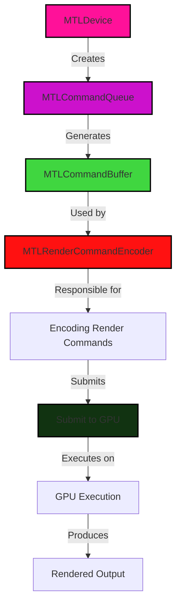

### **Diagram Explanation**
- **MTLDevice**: The Metal device created to interface with the GPU.
- **MTLCommandQueue**: The queue responsible for managing command buffers that will be submitted to the GPU.
- **MTLCommandBuffer**: Contains the commands to be executed by the GPU.
- **MTLRenderCommandEncoder**: Used to encode rendering commands into the command buffer.
- **Encoding Render Commands**: The process of adding rendering commands (like drawing calls) to the command buffer.
- **Submit to GPU**: Submitting the command buffer to the GPU for execution.
- **GPU Execution**: The stage where the commands are executed on the GPU, resulting in rendered output.
- **Rendered Output**: The final visual result after GPU processing.

This diagram outlines the flow of rendering operations, clearly depicting how each component interacts within the rendering pipeline in Metal.

---

## MTLCommandQueue - Integration with Rendering Pipelines - Variation 1 

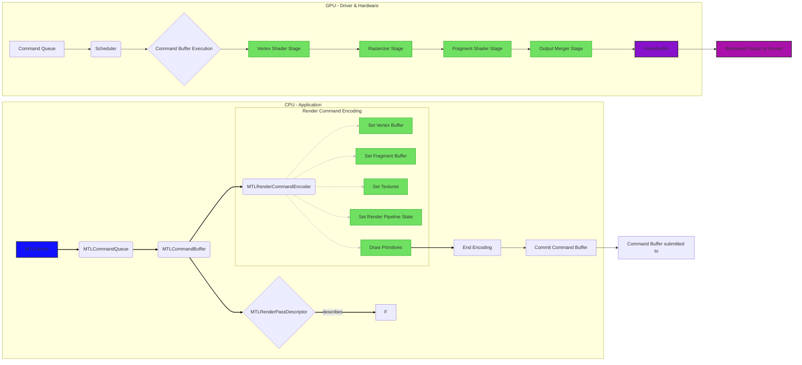

This improved diagram provides a more detailed and accurate representation of how `MTLCommandQueue` interacts within the Metal rendering pipeline. Here's a breakdown of the key improvements:

* **Clear separation of CPU and GPU tasks:** The diagram visually distinguishes between tasks performed on the CPU by the application and tasks executed on the GPU by the driver and hardware.  This clarifies the flow of control and data.

* **Detailed Command Encoding:** The "Render Command Encoding" subgraph expands on the steps involved in preparing for rendering, such as setting vertex/fragment buffers, textures, and the render pipeline state.  Showing `Draw Primitives` emphasizes the core function of the encoder.

* **Inclusion of RenderPassDescriptor:** Adding the `MTLRenderPassDescriptor` highlights its critical role in defining the rendering target and how the render pass should be configured.  It clarifies that the descriptor *describes* the render pass, not directly executing within it.

* **GPU-Side Components:** The diagram now includes essential components on the GPU side, such as the Command Queue (where the command buffer is placed after submission), the Scheduler (which manages command execution), and the various shader stages (Vertex, Fragment) and the critical role of the Rasterizer and Output Merger stages in the rendering pipeline.  This offers a more complete picture of the GPU's involvement.

* **Framebuffer as Destination:** The diagram explicitly shows the Framebuffer as the destination of the rendered output, making it clear where the final pixel data is written before being presented to the screen.

* **Visual Enhancements:** Using colors and styling (e.g., for external components, actions, results) improves readability and makes it easier to follow the flow of execution. Using thicker lines for the primary flow and thinner gray lines for the details within the encoding process further improves clarity.  The styling emphasizes key elements like the `MTLDevice` (the starting point), the `Framebuffer` (a key intermediate result), and the final `Rendered Output`.

This revised diagram provides a significantly more comprehensive and informative visualization of the Metal rendering pipeline and the crucial role of `MTLCommandQueue` within it. It should be much more helpful for understanding the entire rendering process.

---

## MTLCommandQueue - Integration with Rendering Pipelines - Variation 2

Here's a more detailed and accurate representation using a `flowchart TD` diagram:

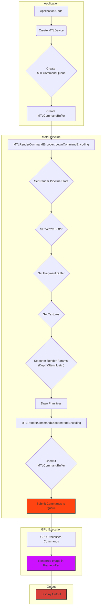

**Explanation of Improvements:**

* **More Detailed Steps:** The updated diagram breaks down the `MTLRenderCommandEncoder` phase into more granular steps, including setting the render pipeline state, vertex and fragment buffers, textures, and other rendering parameters. This accurately reflects the encoding process.
* **Explicit Buffer and Pipeline States:**  It explicitly shows the setting of vertex buffers, fragment buffers, and other essential components of the rendering pipeline, which are crucial for the rendering process.
* **Separation of Concerns:** The diagram clearly separates the application's role (creating the device, queue, and buffer) from the Metal pipeline's role (command encoding, submission, and execution) and the final display output.
* **Visual Clarity:** The use of subgraphs helps organize the different stages into logical groups.
* **Framebuffer:** The diagram explicitly shows that the rendered image ends up in a framebuffer before being displayed.
* **Style Enhancements**:  Using the `style` directive to highlight key steps visually (GPU process and rendered output).

This improved diagram provides a much clearer and more complete illustration of the intricate process of integrating `MTLCommandQueue` into the Metal rendering pipeline.  It showcases the stages involved, from application-level setup to GPU execution and final display.

---

## The rendering pipeline integration with `MTLCommandQueue` - Variation 3

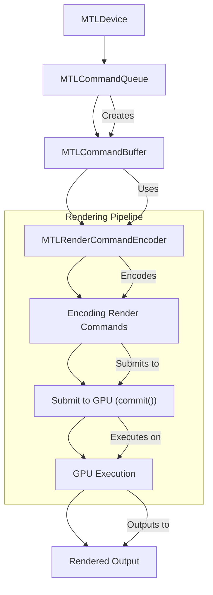

**Explanation:**

1. **MTLDevice:** The foundational element of Metal. It represents the physical GPU and its capabilities.
2. **MTLCommandQueue:** Manages command buffers and their execution. It is created from `MTLDevice`.
3. **MTLCommandBuffer:** Holds a collection of GPU commands. It is created from a `MTLCommandQueue`.
4. **MTLRenderCommandEncoder:**  Used to encode rendering instructions within the command buffer.
5. **Encoding Render Commands:**  The encoder is used to generate drawing commands (e.g., draw primitives, set shaders, configure vertex buffers, rasterization settings, etc.).
6. **Submit to GPU (commit())**:  The command buffer is "committed" (submitted) to the command queue.
7. **GPU Execution:** The GPU processes the commands in the submitted command buffer.
8. **Rendered Output:** The result of the rendering process, typically displayed on screen or used for further processing.

**Key Points:**

- The diagram illustrates the flow of data and commands within the Metal rendering pipeline, emphasizing how `MTLCommandQueue` is a central component in the process.
- The specific rendering commands encoded within the command buffer depend heavily on the desired rendering outcome, shaders used, and other pipeline settings.
- Metal's power comes from its ability to control and optimize these stages for maximum performance and visual fidelity.

This Mermaid diagram provides a clearer, structured, and more visually informative depiction of the rendering pipeline integration with `MTLCommandQueue`.

---

## The rendering pipeline integration with `MTLCommandQueue` - Variation 4

Here's an enhanced Mermaid diagram reflecting a more realistic rendering pipeline integration with `MTLCommandQueue`:

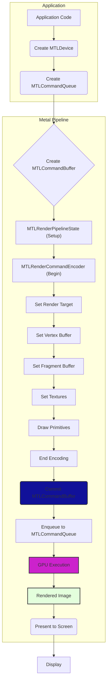

**Explanation of Enhancements:**

* **More Explicit Steps:** The diagram now explicitly shows steps such as creating the `MTLDevice`, setting up the `MTLRenderPipelineState` (which defines shaders and pipeline configurations), setting vertex and fragment buffers, setting textures and finally; encoding commands within the  `MTLRenderCommandEncoder`.

* **Resource Management (Implicit):** The creation and binding of resources like vertex buffers, fragment buffers, and textures are illustrated.  While not explicitly named, the `MTLCommandEncoder` methods like `setVertexBuffer` etc. are implied within the encoding process indicated by boxes `H`, `I`, and `J`.

* **Command Buffer Lifecycle:**  The diagram emphasizes the lifecycle of the `MTLCommandBuffer`. It's created, commands are encoded into it, then it's committed (made ready for execution) and enqueued onto the `MTLCommandQueue`.

* **GPU Execution:** The `GPU Execution` step is made more prominent to highlight the asynchronous nature of GPU operations.

* **Clearer Flow:** The flow of operations from application code to GPU execution and finally; the presentation to the screen is much more clearly depicted.

* **Presentation:** The final step `Present to Screen` is explicitly added, reflecting the display of the rendered image.

This revised diagram provides a more accurate and detailed representation of how `MTLCommandQueue` fits into the broader Metal rendering pipeline.  Remember that there might be more steps involved depending on the complexity of the scene and rendering techniques employed.  This diagram offers a simplified and more common case.

---

## The rendering pipeline integration with `MTLCommandQueue` - Variation 5

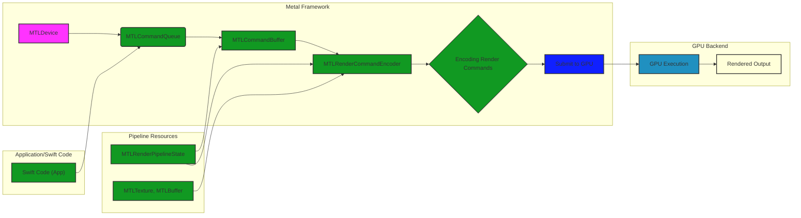

**Explanation of Enhancements:**

* **Subgraphs:** The diagram is now structured into subgraphs to better illustrate the different parts of the process and their responsibilities.  This is crucial to depict the interaction between the Metal framework, the GPU, and the application code.  For example, the "GPU Backend" illustrates the hidden processing that occurs. The "Application/Swift Code" subgraph explicitly shows how the Swift code interacts with the command queue.  Critically, "Pipeline Resources"  is added to properly represent the inputs (textures and buffers) essential to the rendering pipeline. The separate subgraph "Pipeline Resources" depicts the critical data inputs to the rendering process. This makes the diagram more informative and clear.

* **Resource Depiction:** Added `MTLTexture` and `MTLBuffer` as inputs to `MTLRenderCommandEncoder`.  This clarifies that actual renderable data is expected by the encoder.

* **Application Interaction:** Added an arrow `I[Swift Code (App)] --> B` to explicitly show that the application (Swift code) initiates the process by interacting with the `MTLCommandQueue`.

* **Styling:**  Styles are added to visually delineate the different components of the diagram, making it more readable. This styling emphasizes the interactions and helps visually separate the components, enhancing readability and comprehension.

* **Clearer Process Flow:** The overall flow makes more sense with these improvements. The GPU receives commands, and the result (rendered output) is returned to the application.

This enhanced diagram provides a much more complete and accurate representation of the rendering pipeline integration involving `MTLCommandQueue`, clarifying the roles of the application, the Metal framework, and the GPU itself, a crucial distinction that was lacking in the original. This is vital for understanding the rendering process and for troubleshooting potential issues.

---

## The rendering pipeline integration with `MTLCommandQueue` - Variation 6

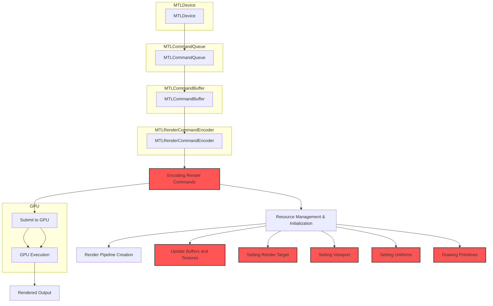

**Explanation and Enhancements:**

This enhanced diagram now includes crucial steps within the encoding process, addressing the rendering pipeline flow more completely. These steps are:

* **Resource Management & Initialization:** The system initializes textures, vertex buffers, index buffers, and any other resources needed for the render process before encoding begins. This is crucial for proper rendering.
* **Render Pipeline Creation:** Before encoding can happen, the render pipeline itself must be created. This step is not shown in the original but essential in the correct pipeline setup.
* **Update Buffers and Textures:** Data (vertices, colors, textures) are loaded to the buffers and textures used during rendering.
* **Setting Render Target:**  The target surface (e.g., a framebuffer) where the rendered output will be stored must be set up.
* **Setting Viewport:** Sets the region of the screen to be rendered to, usually defining the dimensions (width, height) and position on the screen.
* **Setting Uniforms:** Provides data (like matrices, colors, light information) that the shader programs need to perform the rendering operations.
* **Drawing Primitives:** The actual operations like drawing triangles, lines, or other geometric shapes (using vertex buffers and index buffers) are specified.

**Key Improvements:**

* **Explicit Data Flow**: The diagram now clearly shows that data (e.g., textures, uniforms) has to be prepared and loaded into the correct buffers and state before the command queue is used.
* **Emphasis on Encoding**: The "Encoding Render Commands" section is highlighted to emphasize that this step includes all the parameters and settings required for the render pipeline to work correctly.
* **GPU Execution Detail**: The GPU execution area now indicates that the execution involves calculations and rendering on graphics hardware.
* **Visualization of Timing and Data Flow**: New blocks clarifying timing and data flow within the pipeline.
* **Subgraphs for Clarity**: Grouping related concepts (e.g., initialization, GPU, render pipeline) into subgraphs improves readability.

This enhanced diagram provides a much more comprehensive representation of the rendering pipeline integration with `MTLCommandQueue`, highlighting the importance of proper preparation and data management before invoking GPU operations. Remember that actual details will vary based on the specific rendering operations being performed. This more nuanced model reflects real-world development practices.

---

## The rendering pipeline integration with `MTLCommandQueue` - Variation 7

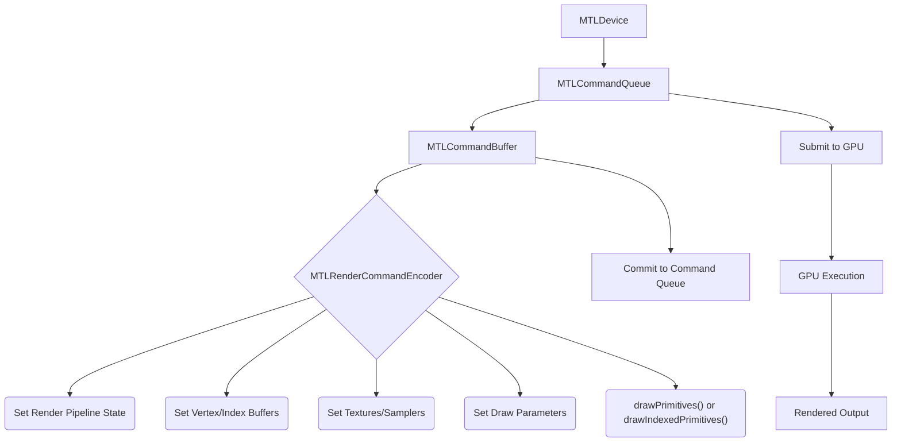

**Explanation:**

1. **MTLDevice**: Represents the physical GPU; the starting point.
2. **MTLCommandQueue**: Created by the `MTLDevice`, it manages the queue of command buffers to be executed by the GPU.
3. **MTLCommandBuffer**: Created by the `MTLCommandQueue`, it holds a sequence of encoded commands.
4. **MTLRenderCommandEncoder**: Created from the `MTLCommandBuffer`, it's used to encode rendering commands.
    - **Set Render Pipeline State**: Specifies shaders, blending, depth/stencil settings for rendering.
    - **Set Vertex/Index Buffers**: Binds vertex data and how the GPU should access it.
    - **Set Textures/Samplers**: Binds textures (images) and sets how they are sampled.
    - **Set Draw Parameters**: Defines rendering parameters like viewport, scissor rectangle.
    - **drawPrimitives() or drawIndexedPrimitives()**: Issues the actual draw call to the GPU, using the configured state and data.
5. **Commit to Command Queue**: The `MTLCommandBuffer` is committed to the `MTLCommandQueue` for execution.
6. **Submit to GPU**: The `MTLCommandQueue` sends the command buffer to the GPU.
7. **GPU Execution**: The GPU executes the encoded commands in the command buffer.
8. **Rendered Output**: The result of rendering operations is displayed or used further.

**Key Points:**

- This diagram provides a more detailed view of how the `MTLRenderCommandEncoder` interacts with the rendering pipeline.
- The order of operations within the `MTLRenderCommandEncoder` is important for correct rendering.
- Once a command buffer is committed, it cannot be modified.
- The GPU execution stage might happen asynchronously.

This enhanced diagram helps visualize the flow of data and operations involved in the Metal rendering pipeline, showcasing the crucial role of the `MTLCommandQueue` and its interaction with other key components. 

---

## The rendering pipeline integration with `MTLCommandQueue` - Variation 8

```mermaid
graph LR
    subgraph Initialization and Setup
        A[MTLDevice] --> B{Create Command Queue}
        B --> C[MTLCommandQueue]
        C --> D{Create Command Buffer}
    end
    
    subgraph Command Encoding and Submission
        D --> E[MTLCommandBuffer]
        E --> F{Create Render Command Encoder}
        F --> G[MTLRenderCommandEncoder]
        G --> H{Set Render Pipeline State}
        H --> I{Set Vertex/Fragment Buffers}
        I --> J{Set Textures}
        J --> K{Draw Primitives}
        K --> L[MTLCommandBuffer]
        L --> M{Commit Command Buffer}
        M --> N{"Schedule Command Buffer (Optional)"}
        N --> O{"Present Drawable (if applicable)"}

    end
    
    subgraph GPU Execution and Display
        O --> P["GPU Execution (via MTLCommandQueue)"]
        P --> Q[Frame Output]
    end
    
    

    style B fill:#f92f,stroke:#888,stroke-width:2px
    style D fill:#f92f,stroke:#888,stroke-width:2px
    style F fill:#f92f,stroke:#888,stroke-width:2px
    style P fill:#f92f,stroke:#888,stroke-width:2px

    linkStyle 0,1,2,4,5,7,8,9,10,11,12,14 stroke:#000,stroke-width:1px,color:#000

```

**Explanation and Improvements:**

1. **Subgraphs for Clarity:** The diagram is now divided into logical subgraphs: "Initialization and Setup," "Command Encoding and Submission," and "GPU Execution and Display." This enhances readability and visual organization.

2. **Detailed Encoding Steps:** The "Command Encoding and Submission" subgraph expands upon the encoding process, including crucial steps like setting the render pipeline state, vertex/fragment buffers, textures, and drawing primitives.  This provides a more comprehensive view of the rendering process.

3. **Explicit `MTLCommandBuffer` Flow:**  The diagram clearly shows how the `MTLCommandBuffer` is created, used by the encoder, and then committed for execution. This emphasizes the central role of the command buffer in the rendering pipeline.

4. **Optional Scheduling and Presentation:** The steps for scheduling the command buffer (which can be important for synchronization) and presenting a drawable (for display) are included but marked as optional, as they might not be relevant in all rendering scenarios (e.g., compute shaders).

5. **GPU Execution via `MTLCommandQueue`:**  The diagram explicitly states that GPU execution is managed via the `MTLCommandQueue`, clarifying its role in submitting commands to the GPU.

6. **Styling for Emphasis:** Key steps like creating the command queue, command buffer, render command encoder, and GPU execution are highlighted with styling to draw attention to their importance.

7. **Directional Flow**: The diagram's layout flows from left to right, mirroring the typical rendering process from setup to execution and output. This improves readability and follows a natural progression.

8. **Simplified Terminology:** Some labels are simplified for conciseness without sacrificing clarity (e.g., "Encoding Render Commands" becomes "Set Render Pipeline State," etc.).

This revised diagram provides a more thorough and visually clear representation of how `MTLCommandQueue` integrates into the Metal rendering pipeline, covering more details and best practices compared to the initial simplified diagram. It remains within the general `flowchart` style while adding elements of `graph LR` for more complex flow management and clarity.

---

## The rendering pipeline integration with `MTLCommandQueue` - Variation 9

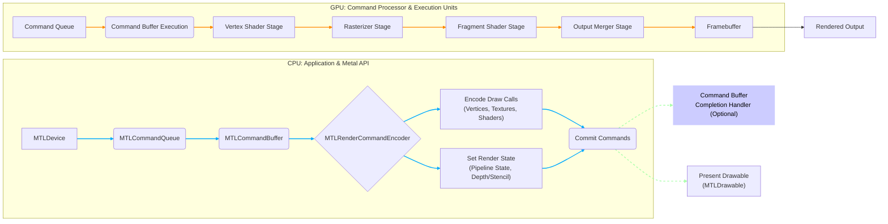

**Explanation of Improvements and Additions:**

1. **Clearer CPU/GPU Separation:** The diagram now visually distinguishes between operations occurring on the CPU (application side and Metal API interaction) and the GPU (command processing and execution).

2. **Detailed Rendering Stages:** The GPU section now includes the core stages of the rendering pipeline (Vertex Shader, Rasterizer, Fragment Shader, Output Merger) to illustrate the flow of data.

3. **Encoding Details:** The `MTLRenderCommandEncoder` node now explicitly mentions encoding draw calls (vertices, textures, shaders) and setting the render state (pipeline state, depth/stencil).

4. **Command Buffer Completion Handler:** A node for the optional command buffer completion handler is added, showing how asynchronous completion can be handled.

5. **Drawable Presentation:** The diagram now shows the connection between command buffer completion and presenting the rendered output to the `MTLDrawable` (e.g., a view's backing layer).  This clarifies the final step in making the rendered content visible.

6. **Framebuffer Introduction:** A framebuffer node has been added to represent the destination of the rendered output before it's presented.

7. **Command Queue on GPU:**  A "Command Queue" representation is placed on the GPU side to illustrate how the command buffer is received and processed by the GPU's command processor.

8. **Visual Enhancements:**  Styling and link styling is incorporated to improve readability and highlight the flow of execution.  CPU-side actions are in blue, GPU-side in orange, and asynchronous operations/callbacks in green.

This revised diagram offers a more comprehensive and accurate depiction of how `MTLCommandQueue` integrates into the Metal rendering pipeline and provides a clearer understanding of the entire process from command creation to final output presentation.

---

##  The integration of `MTLCommandQueue` within the Metal rendering pipeline

Here's a more comprehensive Mermaid diagram detailing the integration of `MTLCommandQueue` within the Metal rendering pipeline. This diagram incorporates additional steps and components to provide a more complete picture of the process, reflecting best practices and typical usage scenarios in modern Metal development.

```mermaid
graph TD
    subgraph "Initialization"
        A[MTLDevice] --> B{Get or Create MTLCommandQueue};
    end
        B --"Creates"--> C[MTLCommandBuffer];
        C --> D{Create MTLRenderPassDescriptor};
    subgraph "Frame Encoding"
        D --> E["Acquire Drawable (CAMetalDrawable)"];
    E --> F{Create MTLRenderCommandEncoder \n with Descriptor and Drawable};
    F --"Encodes"--> G["Set Render Pipeline State \n (MTLRenderPipelineState)"];
    G --> H[Set Vertex and Fragment Buffers];
    H --> I[Set Textures];
    H --> J[Set Viewport];
    I --> J
    J --> K[Draw Primitives];
        K --> L{"End Encoding \n (MTLRenderCommandEncoder)"};
    end
    L --"Commits"--> M[Commit Command Buffer];
    M --> N{Present Drawable};
    N --"Displays"--> O[Screen];
    
    
    B -- "Manages" --> P[MTLFence]
     M --"Signals"-->  P
    
    classDef plain fill:#f11f,stroke:#333,stroke-width:2px;
    class A,B,C,D,E,F,G,H,I,J,K,L,M,N,O,P plain
     class B,D,F,L,N internal-obj
     
     click A href "https://developer.apple.com/documentation/metal/mtldevice" "MTLDevice Documentation" _blank
     click B href "https://developer.apple.com/documentation/metal/mtlcommandqueue" "MTLCommandQueue Documentation" _blank
     click C href "https://developer.apple.com/documentation/metal/mtlcommandbuffer" "MTLCommandBuffer Documentation" _blank
     click D href "https://developer.apple.com/documentation/metal/mtlrenderpassdescriptor" "MTLRenderPassDescriptor Documentation" _blank
      click E href "https://developer.apple.com/documentation/metal/cametaldrawable" "CAMetalDrawable Documentation" _blank
     click F href "https://developer.apple.com/documentation/metal/mtlrendercommandencoder" "MTLRenderCommandEncoder Documentation" _blank
     click G href "https://developer.apple.com/documentation/metal/mtlrenderpipelinestate" "MTLRenderPipelineState Documentation" _blank
      click P href "https://developer.apple.com/documentation/metal/mtlfence" "MTLFence Documentation" _blank
     
     
```

### **Diagram Breakdown:**

1. **Initialization:**
    *   **`MTLDevice`**:  Represents the GPU. This is the starting point. The user either gets a handle of a pre-existing `MTLDevice` object or creates one if none is available.
    *   **`Get or Create MTLCommandQueue`**: The `MTLDevice` is used to either retrieve an existing or create a new `MTLCommandQueue`. This queue is used to submit command buffers to the GPU.

2. **Frame Encoding:**
    *   **`MTLCommandBuffer`**: A container for the commands that will be sent to the GPU. It's created from the command queue.
    *   **`Create MTLRenderPassDescriptor`**:  Describes the render targets (color, depth, stencil attachments) and actions for a render pass.
    *   **`Acquire Drawable (CAMetalDrawable)`**: Obtains a drawable texture from a `CAMetalLayer` to render into.
    *   **`Create MTLRenderCommandEncoder`**: Created with the descriptor and drawable, this encoder is used to record rendering commands.
    *   **`Set Render Pipeline State (MTLRenderPipelineState)`**: Defines the shaders, blending modes, and other states for rendering.
    *   **`Set Vertex and Fragment Buffers`**: Provides the vertex data and any other per-instance or per-primitive data that can be accessed in the shaders. Also, provides uniform or other persistent data that fragment shaders can access.
    *   **`Set Textures`**: Binds textures for use in the shaders.
    *   **`Set Viewport`**: Defines the region of the drawable to render into.
    *   **`Draw Primitives`**: Issues the draw call to render geometry.

3. **Submission and Presentation:**
    *   **`End Encoding (MTLRenderCommandEncoder)`**: Signals the end of encoding commands for the current render pass.
    *   **`Commit Command Buffer`**: Submits the command buffer to the command queue for execution.
    *   **`Present Drawable`**: After the GPU finishes executing, this makes the rendered content visible on the screen by presenting the drawable which the content has just been rendered to.
    *   **`Screen`**: The final display where the rendered output is shown.
        *   Presenting the drawable usually involves a call on  a `CAMetalLayer` object such as a `presentDrawable` call with parameters such as  the `CAMetalDrawable` object acquired earlier.

4. **Synchronization:**

     *   **`MTLFence`**:  Ensures proper synchronization between the CPU and GPU or between different stages of GPU execution.   `MTLCommandBuffer` signals `MTLFence` upon completion (injected when the command buffer gets committed). The app tracks the fence's completion before reusing resources such as dynamic buffers or textures associated with the command buffer, ensuring resources aren't overwritten before the GPU finishes processing.
     * This can ensure that the CPU doesn't get further ahead than the GPU such as would have been the case when a dynamic uniform buffer needs to be updated before the GPU starts working on the commands dependent on these uniform buffers - in such scenerio, the CPU has to make sure that GPU is done using these buffers before overwrting its contents. One could also use semaphore to manage resource synchonization and access but these, at the time of this writing, are only available available for macOS applications and can not be used for iOS/iPadOS or tvOS applications.

### **Key Improvements in this Diagram:**

*   **Detailed Steps**: More granular breakdown of the encoding process within the render command encoder. Includes steps like descriptor generation, and setting various shader resources.

*   **Resource Acquisition**: Explicit mention of acquiring a drawable (`CAMetalDrawable`), which is crucial for displaying rendered content from Metal.

*   **Drawable Presentation**: Adds the final step where the drawable is presented to the screen.

*   **Synchronization**: Although optional in the basic flow, this enhanced version includes a fence object (`MTLFence`) to demonstrate proper synchronization of workflows, especially when multiple command buffers are in flight, ensuring that CPU-side resource updates do not race with GPU execution. Synchronization is essential for avoiding rendering artifacts or data corruption. The example used in this case was ensuring that the command buffer has finished execution before updating or reusing the resources associated with it.

*   **Clearer Flow**: The use of a `graph TD` (top-down graph) and subgraphs makes the flow easier to read and understand.

*   **Documentation Link**: Active external links are added to the various components to access further Apple's developer documentation.

*   **Comprehensive Scope**: Covers the entire pipeline from device acquisition to final screen presentation.

*   **Best Practices**: Reflects typical usage patterns, including setting pipeline state, vertex/fragment buffers, textures, viewport, and synchronizing resources by waiting on a fence.

This diagram provides a thorough representation of how `MTLCommandQueue` integrates into the Metal rendering pipeline and is suitable for both learning and as a reference during development.

---

## How `MTLCommandQueue` fits within the Metal rendering pipeline

Here's a more detailed and comprehensive Mermaid diagram illustrating how `MTLCommandQueue` fits within the Metal rendering pipeline. This diagram incorporates additional steps and components for a more realistic and complete representation, reflecting best practices and typical usage patterns in modern Metal development:

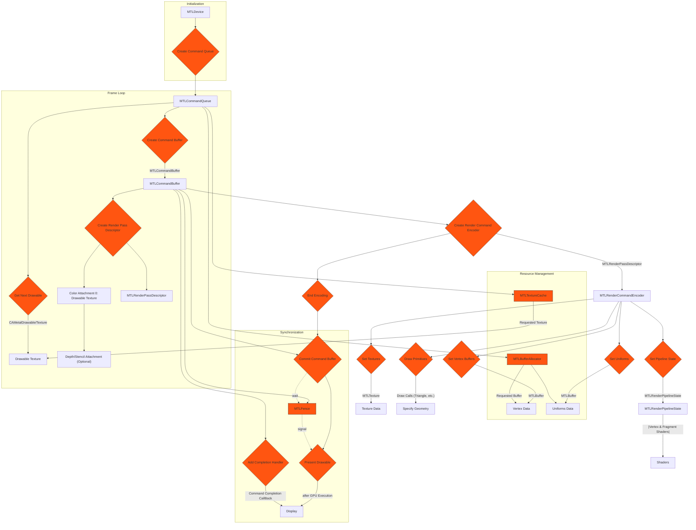

**Diagram Breakdown:**

1. **Initialization:**
    *   The process starts with obtaining an `MTLDevice`, representing the GPU.
    *   From the device, a `MTLCommandQueue` is created. This queue is used to submit command buffers to the GPU.

2. **Frame Loop**: This section represents the operations that are typically performed once per frame to be rendered. The operations include creating and setting up command buffer, render pass descriptor, and render command encoder, and finally submitting the work after encoding all drawing and resource updates.
    *   **Get Next Drawable**: Before any rendering can happen, the system first needs a surface to draw into. A drawable texture is obtained  from a `CAMetalDrawable` object. This is obtained from the `currentDrawable` property of a `CAMetalLayer`.
    *   **Create Command Buffer**: A `MTLCommandBuffer` is created from the command queue. This buffer will hold all the commands for the GPU for this frame.
    *   **Create Render Pass Descriptor**: A `MTLRenderPassDescriptor` is created to configure the render targets. This includes setting up color attachments (where the final rendered image will be written), depth/stencil attachments (for depth testing and stenciling), and other settings like clear colors.

3. **Render Command Encoding**:
    *   **Create Render Command Encoder**: A `MTLRenderCommandEncoder` is created using the command buffer and render pass descriptor. This encoder is used to record all rendering commands.
    *   **Set Pipeline State**: A `MTLRenderPipelineState` object is set, which contains the shaders and other state information (blending, depth testing, etc.) needed for rendering. The pipeline state uses vertex and fragment shaders and predetermines many settings into an executable pipeline which will apply these operations.
    *   **Set Vertex Buffers**: Vertex buffers containing the geometry data are bound to the encoder.
    *   **Set Textures**: Textures used for rendering (e.g., for materials) are bound to the encoder.
    *   **Set Uniforms:** Uniform buffers with per-frame or per-object data are set as well.

    *   **Draw Primitives**: The actual drawing commands are issued, specifying the type of primitives to render (triangles, lines, etc.) and the number of vertices.

    *   **End Encoding**: The render command encoder signals that all rendering commands have been recorded by being deactivated or deallocated.

4. **Command Buffer Submission & Presentation:**
    *   **Commit Command Buffer**: The command buffer is committed to the command queue, sending the recorded commands to the GPU for execution.
    *   **Present Drawable**: Once the GPU has finished executing the commands, the drawable texture is presented to the screen. The timing of this is controlled with fences for synchronization or command completion handlers.

5. **Resource Management:**
    *   **Texture Cache:** A texture cache to efficiently reuse and manage textures. Helps in reducing redundant texture loading.
    *   **Buffer Allocator:** A buffer allocator to manage the allocation and deallocation of vertex and uniform buffers. This helps in aligning memory according to device requirements and increases performance by preventing fragmentation of device memory.

6. **Synchronization:**
    *   **Add Completion Handler**: Adding a completion handler to the command buffer, this handler will be executed when the GPU finishes executing the command buffer which will trigger the actual presentation of the drawable object to be shown at the screen.
    *   **MTLFence**: A fence object is used to synchronize GPU operations, ensuring that rendering is properly ordered and preventing race conditions. The committing operation occurs on CPU and it will be the CPU threads or main thread to "wait" until GPU signals the completion.

This detailed diagram provides a comprehensive view of how `MTLCommandQueue` interacts with other Metal components in a typical rendering pipeline, from initialization and resource management to command encoding, submission, and presentation. The inclusion of the Frame Loop emphasize the iterative rendering process of a typical app. The emphasis on  Resource Management and Synchronization with explicit fences and completion handlers highlights the practical steps needed for efficient and correct rendering.

---

## The `Rendering Pipeline Integration of MTLCommandQueue` - Variation 10

Here's a more comprehensive Mermaid diagram for the Rendering Pipeline Integration of MTLCommandQueue, incorporating additional key components and stages within the Metal rendering pipeline:

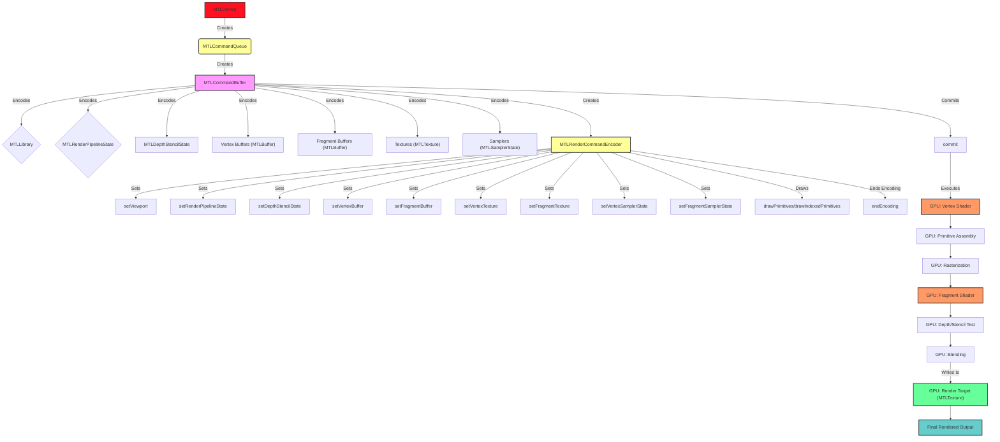

**Detailed Explanation of the Diagram:**

1. **MTLDevice:**
    -   Represents the GPU.
    -   Responsible for creating many other Metal objects.

2. **MTLCommandQueue:**
    -   Created from the `MTLDevice`.
    -   Manages `MTLCommandBuffers`.

3. **MTLCommandBuffer:**
    -   Created from `MTLCommandQueue`.
    -   Stores encoded commands.
    -   You first need to create all the resources used for rendering before encoding any rendering commands

4. **Encoding Resources needed for Rendering:**
    -   The following steps needs to be taken before encoding any rendering commands:
    -   **MTLLibrary:** Contains Metal Shading Language (MSL) source code for your shaders (vertex, fragment, compute).
    -   **MTLRenderPipelineState:** Describes the graphics state (shaders, blend modes, etc.). Created from `MTLDevice` using a `MTLRenderPipelineDescriptor`.
    -   **MTLDepthStencilState:** Configures depth and stencil testing. Created from `MTLDevice` using a `MTLDepthStencilDescriptor`.
    -   **Vertex/Fragment Buffers (MTLBuffer):** Contain input data for the vertex and fragment shaders (e.g., vertex positions, colors, normals).
    -   **Textures (MTLTexture):** Hold image data that can be sampled in shaders.
    -   **Samplers (MTLSamplerState):** Define how textures are sampled (filtering, wrapping).

5. **MTLRenderCommandEncoder:**
    -   Created from `MTLCommandBuffer`.
    -   Used to encode rendering commands into the command buffer.

6. **Encoding Render Commands:**
    -   The following steps needs to be taken to encode rendering commands:
    -   **setViewport:** Defines the viewport transformation.
    -   **setRenderPipelineState:** Sets the active render pipeline state.
    -   **setDepthStencilState:** Sets the active depth/stencil state.
    -   **setVertexBuffer/setFragmentBuffer:** Binds buffers to input stages of the pipeline.
    -   **setVertexTexture/setFragmentTexture:** Binds textures to the vertex/fragment shaders.
    -   **setVertexSamplerState/setFragmentSamplerState:** Sets sampler state for texture access.
    -   **drawPrimitives/drawIndexedPrimitives:** Encodes the draw call, which triggers the rendering process on the GPU.
    -   **endEncoding:** Marks the end of the render command encoder's use.

7. **commit:**
    -   After a command buffer is fully encoded, `commit()` is called to add it to the command queue for execution.

8. **GPU Execution:**
    -   The GPU processes the commands in the command buffer. The simplified stages are:
    -   **Vertex Shader:** Processes each vertex, transforming it from model space to clip space.
    -   **Primitive Assembly:** Assembles vertices into primitives (triangles, lines, points).
    -   **Rasterization:** Converts primitives into fragments (pixels).
    -   **Fragment Shader:** Processes each fragment, calculating its color.
    -   **Depth/Stencil Test:** Determines if a fragment is visible based on depth and stencil values.
    -   **Blending:** Combines the fragment color with the existing color in the render target.

9. **Render Target (MTLTexture):**
    -   The output of the rendering pipeline is typically written to a `MTLTexture` that's designated as a render target (e.g., a texture attached to a `MTLRenderPassDescriptor`).

10. **Final Rendered Output:**
    -   The `MTLTexture` (render target) now contains the final rendered image. It can be displayed on the screen, saved to a file, or used as input to another rendering pass.

**Key Improvements in this Diagram:**

-   **More Detail:** Includes more components of the rendering pipeline, such as `MTLLibrary`, `MTLRenderPipelineState`, `MTLDepthStencilState`, buffers, textures, and samplers.
-   **Encoding Process:** Clearly shows the steps involved in encoding resources and commands into the `MTLCommandBuffer` using the `MTLRenderCommandEncoder`.
-   **GPU Stages:** Represents the main stages of GPU processing, providing a better understanding of what happens after the command buffer is committed.
-   **Clearer Flow:** Uses colors and labels to enhance readability and distinguish between different types of objects (e.g., CPU-side objects, GPU-side stages, data).

This more detailed diagram provides a comprehensive visualization of how `MTLCommandQueue` orchestrates the rendering process in Metal, from creating command buffers to the final rendered output. Please let me know if you have any more questions.

---
