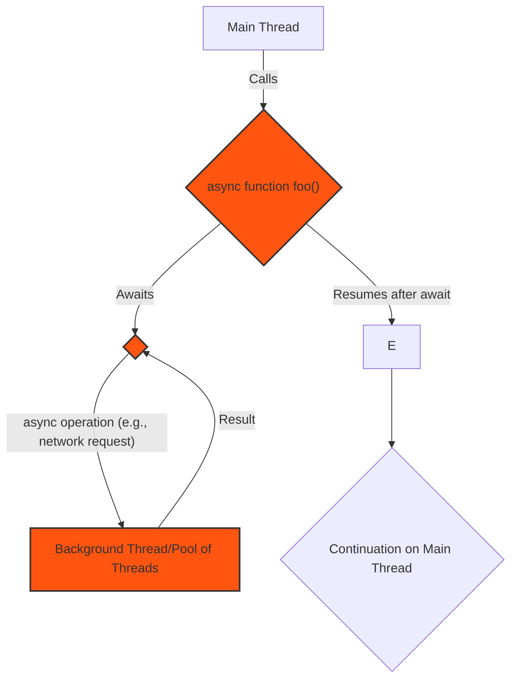
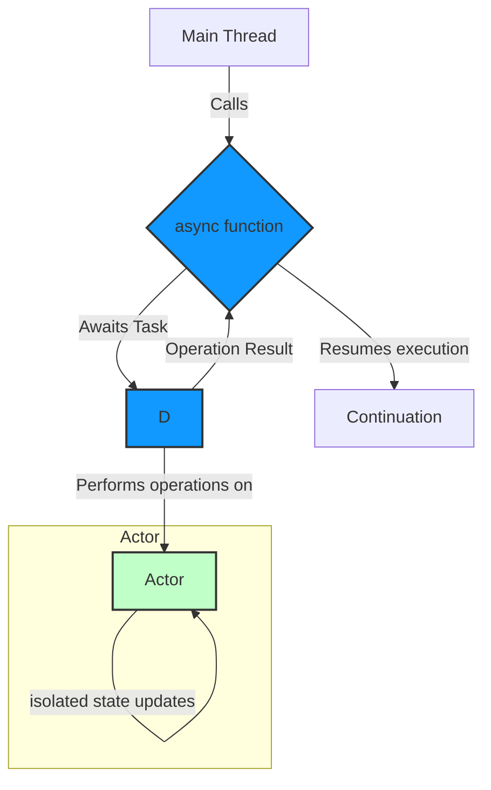
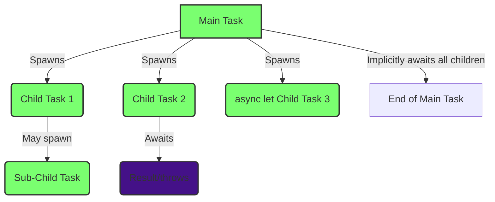
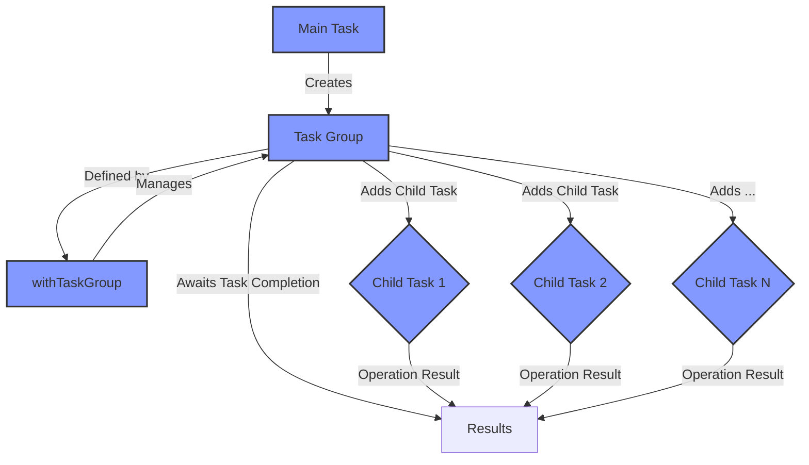
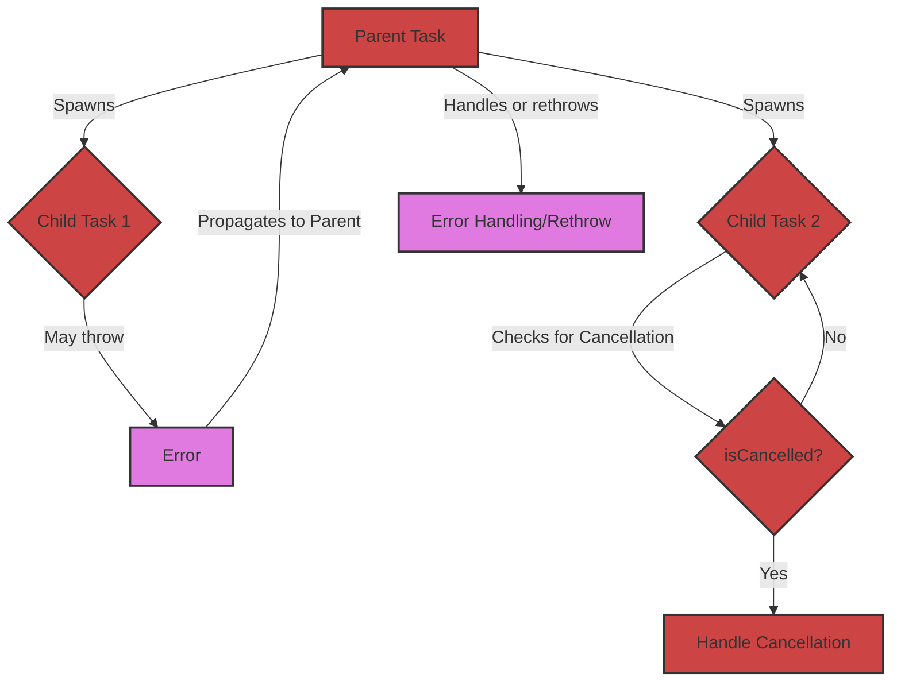
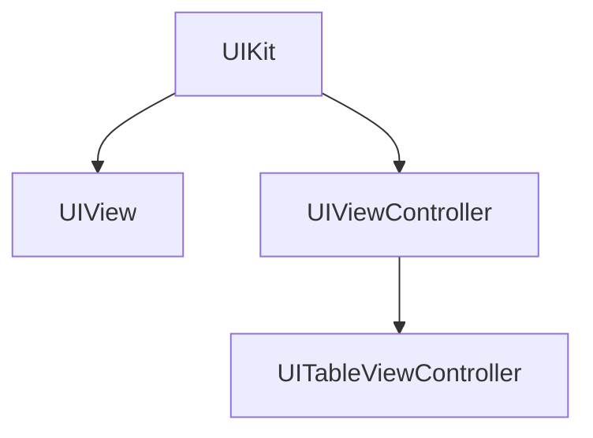

# Apple-Frameworks-in-Mermaid-Diagrams


## Table of Contents

- [Apple-Frameworks-in-Mermaid-Diagrams](#apple-frameworks-in-mermaid-diagrams)
  - [Table of Contents](#table-of-contents)
  - [Introduction](#introduction)
  - [Features](#features)
  - [Demo - Swift Concurrency in Mermaid Diagrams](#demo---swift-concurrency-in-mermaid-diagrams)
    - [1. High-Level Overview of Swift Concurrency](#1-high-level-overview-of-swift-concurrency)
    - [2. `async`/`await` and Actors](#2-asyncawait-and-actors)
    - [3. Task Hierarchy and Structured Concurrency](#3-task-hierarchy-and-structured-concurrency)
    - [4. Task Groups](#4-task-groups)
    - [5. Error Handling and Cancellation](#5-error-handling-and-cancellation)
  - [Installation](#installation)
  - [Usage](#usage)
    - [Viewing Diagrams](#viewing-diagrams)
    - [Integrating Diagrams into Your Documentation](#integrating-diagrams-into-your-documentation)
  - [Supported Frameworks](#supported-frameworks)
  - [Contributing](#contributing)
    - [How to Contribute](#how-to-contribute)
    - [Guidelines](#guidelines)
  - [Roadmap](#roadmap)
    - [License](#license)
      - [Software License](#software-license)
      - [Documentation License](#documentation-license)
  - [Contact](#contact)

## Introduction

**Apple-Frameworks-in-Mermaid-Diagrams** is a comprehensive collection of official Apple frameworks translated into Mermaid diagrams and illustrations. This project aims to provide developers, students, and enthusiasts with a quick and intuitive way to visualize and understand complex frameworks, facilitating easier learning and reference when exploring new concepts.

Mermaid is a popular JavaScript-based diagramming and charting tool that uses a simple markdown-like syntax. By leveraging Mermaid diagrams, this project ensures that the visual representations are both easy to create and maintain.

## Features

- **Comprehensive Coverage**: Includes a wide range of official Apple frameworks.
- **Easy Visualization**: Converts complex frameworks into clear and concise Mermaid diagrams.
- **Study Aid**: Ideal for students and developers learning new frameworks.
- **Quick Reference**: Easily look up framework structures and relationships.
- **Open Source**: Contributions are welcome to expand and improve the diagram collection.

---

## Demo - Swift Concurrency in Mermaid Diagrams


*Note: For more details and explanations, please refer to the dedicated notes file on this topic. Below, we illustrate the concept of Swift Concurrency through a series of Mermaid diagrams.*


### 1. High-Level Overview of Swift Concurrency

This diagram provides a simplified view of how `async/await` integrates into a program's flow.




### 2. `async`/`await` and Actors

This diagram shows how `async/await` interacts with actors, a core component of Swift's concurrency for data isolation.



### 3. Task Hierarchy and Structured Concurrency

This diagram illustrates how tasks are organized hierarchically, demonstrating structured concurrency, one of the main pillars that are important to understand the inner workings of Swift Concurrency.




### 4. Task Groups

This diagram illustrates how `withTaskGroup` can manage a dynamic number of child tasks.



### 5. Error Handling and Cancellation

This diagram demonstrates how errors and cancellation propagate through the task hierarchy.




---


## Installation

To use the diagrams in your projects or study materials, follow these steps:

1. **Clone the Repository**

```bash
git clone https://github.com/CongLeSolutionX/Apple-Frameworks-in-Mermaid-Diagrams.git
```

2. **Navigate to the Project Directory**

```bash
cd Apple-Frameworks-in-Mermaid-Diagrams
```

3. **Open the Diagrams**

   Diagrams are available in the `diagrams` folder in `.md` (Mermaid) format. You can view them using any Mermaid-compatible editor or integrate them into your documentation.

## Usage

### Viewing Diagrams
1. **Directly open each file in this repo**
   
   When opening each `.md` file in this repo, you can see the live render diagrams on each note thanks to `Obsidian` and Java engine.

2. **Install a Mermaid Viewer on your local machine**

   - You can utilize the [Mermaid Live Editor](https://mermaid.live/) or install a Mermaid extension for your preferred code editor, such as [Visual Studio Code](https://code.visualstudio.com/) with the [Mermaid Preview extension](https://marketplace.visualstudio.com/items?itemName=vstirbu.vscode-mermaid-preview) , or for your note editor, like Obsidian.
   - Open any `.md` file from this repo in your Mermaid viewer to visualize it.

### Integrating Diagrams into Your Documentation

You can embed Mermaid diagrams in Markdown files using the following syntax and keyword `mermaid`:

```markdown
mermaid 
%% Paste your Mermaid diagram code here
```

The rendered diagram from the above syntax code:



## Supported Frameworks

The project currently includes diagrams for the following Apple frameworks:
- [Metal](https://github.com/CongLeSolutionX/Apple-Frameworks-in-Mermaid-diagrams/blob/main/Metal.md)
- **UIKit**
- **Foundation**
- **Core Data**
- **SwiftUI**
- **Combine**
- **MapKit**
- **AVFoundation**

*Note: This list is continuously expanding. Contributions are welcome to add more frameworks.*

## Contributing

Contributions are what make the open-source community such an amazing place to learn and grow. Any contributions you make are **greatly appreciated**.

### How to Contribute

1. **Fork the Project**

   Click the "Fork" button at the top of this repository's page.

2. **Clone Your Fork**

```bash
git clone https://github.com/yourusername/Apple-Frameworks-in-Mermaid-Diagrams.git
```

3. **Create a New Branch**

```bash
git checkout -b feature/YourFeatureName
```

4. **Make Your Changes**

   Add new diagrams or improve existing ones in the `diagrams` folder.

5. **Commit Your Changes**

```bash
git commit -m "Add [Framework Name] diagram"
```

6. **Push to Your Fork**

```bash
git push origin feature/YourFeatureName
```

7. **Create a Pull Request**

   Go to the original repository and create a pull request from your fork.

### Guidelines

- **Consistency**: Follow the existing diagram styles and conventions.
- **Clarity**: Ensure diagrams are clear, accurate, and easy to understand.
- **Documentation**: Update the `Supported Frameworks` section if adding new frameworks.
- **Testing**: Verify diagrams render correctly in Mermaid viewers.

## Roadmap

Here’s what we’re working on next:

- Adding **framework descriptions** to diagrams for better context.
- Creating a **searchable interface** for faster navigation.
- Expanding coverage to include more niche frameworks and tools.
- Supporting **localized diagram translations** for non-English users.


### License

This project is licensed under the [MIT License](https://github.com/CongLeSolutionX/Apple-Frameworks-in-Mermaid-Diagrams/blob/main/LICENSE), which allows you to use, modify, and distribute the software as long as you provide proper credit to the original authors.

#### Software License
This software is licensed under the [MIT License](https://github.com/CongLeSolutionX/Apple-Frameworks-in-Mermaid-Diagrams/blob/main/LICENSE). You may use, copy, modify, merge, publish, distribute, and sublicense it, provided that you include the original license in all copies or substantial portions of the software.

#### Documentation License
The documentation and other creative materials for this project are licensed under the [Creative Commons Attribution 4.0 International License](https://github.com/CongLeSolutionX/Apple-Frameworks-in-Mermaid-Diagrams/blob/main/LICENSE-docs). You are free to share, adapt, and use the documentation, as long as you give appropriate credit to the original authors.


## Contact

Your Name - [conglejobs@gmail.com](mailto:conglejobs@gmail.com)

Project Link: [https://github.com/CongLeSolutionX/Apple-Frameworks-in-Mermaid-Diagrams](https://github.com/yourusername/Apple-Frameworks-in-Mermaid-Diagrams)
