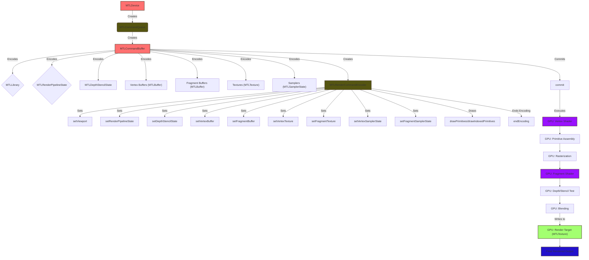
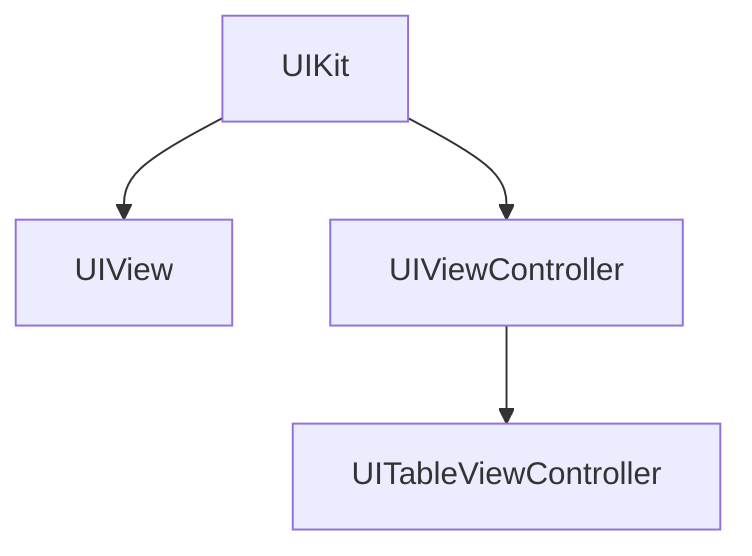

# Apple-Frameworks-in-Mermaid-Diagrams


## Table of Contents

- [Apple-Frameworks-in-Mermaid-Diagrams](#apple-frameworks-in-mermaid-diagrams)
  - [Table of Contents](#table-of-contents)
  - [Introduction](#introduction)
  - [Features](#features)
  - [Demo](#demo)
    - [Comprehensive Rendering Pipeline Integration of MTLCommandQueue including GPU Execution Stages](#comprehensive-rendering-pipeline-integration-of-mtlcommandqueue-including-gpu-execution-stages)
  - [Installation](#installation)
  - [Usage](#usage)
    - [Viewing Diagrams](#viewing-diagrams)
    - [Integrating Diagrams into Your Documentation](#integrating-diagrams-into-your-documentation)
  - [Supported Frameworks](#supported-frameworks)
  - [Contributing](#contributing)
    - [How to Contribute](#how-to-contribute)
    - [Guidelines](#guidelines)
  - [Roadmap](#roadmap)
  - [License](#license)
    - [Software License](#software-license)
    - [Documentation License](#documentation-license)
  - [Contact](#contact)

## Introduction

**Apple-Frameworks-in-Mermaid-Diagrams** is a comprehensive collection of official Apple frameworks translated into Mermaid diagrams and illustrations. This project aims to provide developers, students, and enthusiasts with a quick and intuitive way to visualize and understand complex frameworks, facilitating easier learning and reference when exploring new concepts.

Mermaid is a popular JavaScript-based diagramming and charting tool that uses a simple markdown-like syntax. By leveraging Mermaid diagrams, this project ensures that the visual representations are both easy to create and maintain.

## Features

- **Comprehensive Coverage**: Includes a wide range of official Apple frameworks.
- **Easy Visualization**: Converts complex frameworks into clear and concise Mermaid diagrams.
- **Study Aid**: Ideal for students and developers learning new frameworks.
- **Quick Reference**: Easily look up framework structures and relationships.
- **Open Source**: Contributions are welcome to expand and improve the diagram collection.

---

## Demo

### Comprehensive Rendering Pipeline Integration of MTLCommandQueue including GPU Execution Stages


*Note: For more details and explanations, please refer to the dedicated note file on this topic.*

*Also, certain diagrams have interactive nodes (as the one below) which, when clicked, navigate to the official documentation for the respective keywords.*

---





---

## Installation

To use the diagrams in your projects or study materials, follow these steps:

1. **Clone the Repository**

```bash
git clone https://github.com/CongLeSolutionX/Apple-Frameworks-in-Mermaid-Diagrams.git
```

2. **Navigate to the Project Directory**

```bash
cd Apple-Frameworks-in-Mermaid-Diagrams
```

3. **Open the Diagrams**

   Diagrams are available in `.md` (Mermaid) format. You can view them using any Mermaid-compatible editor or integrate them into your documentation.

## Usage

### Viewing Diagrams
1. **Directly open each file in this repo**
   
   - You just need to simply open each `.md` file on this repo and GitHub will render the diagrams for you.

2. **Install a Mermaid Viewer on your local machine**

   - You can utilize the [Mermaid Live Editor](https://mermaid.live/) or install a Mermaid extension for your preferred code editor, such as [Visual Studio Code](https://code.visualstudio.com/) with the [Mermaid Preview extension](https://marketplace.visualstudio.com/items?itemName=vstirbu.vscode-mermaid-preview) , or for your note editor, like Obsidian.
   - Open any `.md` file from this repo in your Mermaid viewer to visualize it.

### Integrating Diagrams into Your Documentation

You can embed Mermaid diagrams in Markdown files using the following syntax and keyword `mermaid`:

```markdown
mermaid 
%% Paste your Mermaid diagram code here
```

The rendered diagram from the above syntax code:



## Supported Frameworks

The project currently includes diagrams for the following Apple frameworks:
- [Metal](/Apple-frameworks/Metal.md)
- **UIKit**
- **Foundation**
- [Core Data](/Apple-frameworks/CoreData.md)
- **SwiftUI**
- **Combine**
- **MapKit**
- [AVFoundation](/Apple-frameworks/AVFoundation.md)

*Note: This list is continuously expanding. Please check each folder in this repo for more frameworks. Contributions are welcome to add more frameworks.*

## Contributing

Contributions are what make the open-source community such an amazing place to learn and grow. Any contributions you make are **greatly appreciated**.

### How to Contribute

1. **Fork the Project**

   Click the "Fork" button at the top of this repository's page.

2. **Clone Your Fork**

```sh
git clone https://github.com/yourusername/Apple-Frameworks-in-Mermaid-Diagrams.git
```

3. **Create a New Branch**

```sh
git checkout -b feature/YourFeatureName
```

4. **Make Your Changes**

   Add new diagrams or improve existing ones in each folder in this repo.

5. **Commit Your Changes**

```sh
git commit -m "Add [Framework Name] diagram"
```

6. **Push to Your Fork**

```sh
git push origin feature/YourFeatureName
```

7. **Create a Pull Request**

   Go to the original repository and create a pull request from your fork.

### Guidelines

- **Consistency**: Follow the existing diagram styles and conventions.
- **Clarity**: Ensure diagrams are clear, accurate, and easy to understand.
- **Testing**: Verify diagrams render correctly in Mermaid viewers.

## Roadmap

Here’s what we’re working on next:

- Adding **framework descriptions** to diagrams for better context.
- Creating a **searchable interface** for faster navigation.
- Expanding coverage to include more niche frameworks and tools.
- Supporting **localized diagram translations** for non-English users.


## License

This project is licensed under the [MIT License](LICENSE), which allows you to use, modify, and distribute the software as long as you provide proper credit to the original authors.

### Software License
This software is licensed under the [MIT License](LICENSE). You may use, copy, modify, merge, publish, distribute, and sublicense it, provided that you include the original license in all copies or substantial portions of the software.

### Documentation License
The documentation and other creative materials for this project are licensed under the [Creative Commons Attribution 4.0 International License](LICENSE-docs). You are free to share, adapt, and use the documentation, as long as you give appropriate credit to the original authors.


## Contact

[conglejobs@gmail.com](mailto:conglejobs@gmail.com)
