# Sign in with Apple - WIP

> This content is dual-licensed under your choice of the following licenses:
> 1.  **MIT License:** For the code implementations in Swift and Mermaid provided in this document.
> 2.  **Creative Commons Attribution 4.0 International License (CC BY 4.0):** For all other content, including the text, explanations, and the Mermaid diagrams and illustrations.

---

Below is a comprehensive and organized set of Mermaid diagrams for **Sign in with Apple**. These diagrams cover various aspects such as involved class structures, initialization methods, properties, methods, enumerations, protocol conformances, relationships with other classes, extensions, lifecycle, feature timelines, data handling, integrations, and best practices.

---

## **1. Class Structure and Hierarchy**

### **a. Core Class Diagram**
- **Purpose**: Illustrate the primary structure of `Sign in with Apple`, including its key classes, properties, methods, and their relationships.
- **Diagram Type**: `classDiagram`
- **Contents**:
  - **Classes**: `ASAuthorizationAppleIDProvider`, `ASAuthorizationAppleIDRequest`, `ASAuthorizationController`, `ASAuthorization`, `ASAuthorizationAppleIDCredential`, `ASAuthorizationError`, etc.
  - **Properties**: Key attributes like `user`, `fullName`, `email`, `identityToken`, `authorizationCode`, etc.
  - **Methods**: Essential functions like `createRequest()`, `performRequests()`, `credential.state`, etc.
  - **Enumerations**: Nested enums such as `ASAuthorizationAppleIDRequest.Scope`, `ASAuthorization.Error.Code`.

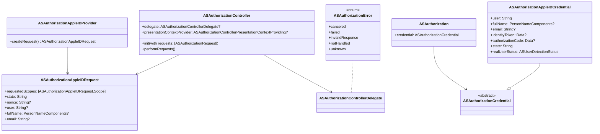

---

## **2. Initializers Overview**

### **a. Initialization Methods Diagram**
- **Purpose**: Break down the various ways to instantiate and configure `Sign in with Apple` components.
- **Diagram Type**: `flowchart`
- **Contents**:
  - **Provider Initialization**: `ASAuthorizationAppleIDProvider()`
  - **Request Configuration**: `createRequest()`, setting `requestedScopes`
  - **Controller Setup**: `ASAuthorizationController.init(with:)`, setting delegates
  - **Credential Retrieval**: Handling `ASAuthorizationAppleIDCredential`

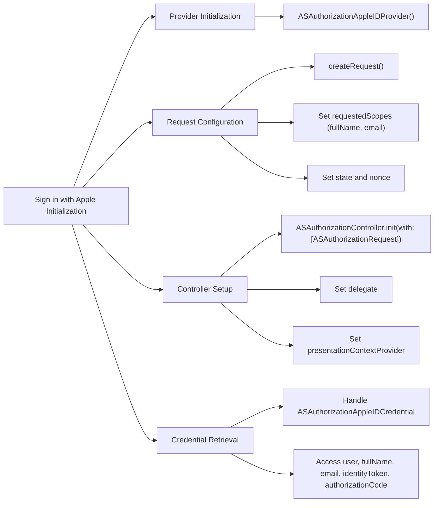

---

## **3. Properties Breakdown**

### **a. Key Properties Diagram**
- **Purpose**: Detail the main properties involved in `Sign in with Apple`.
- **Diagram Type**: `graph LR` or `classDiagram`
- **Contents**:
  - **User Information**: `user`, `fullName`, `email`
  - **Security Tokens**: `identityToken`, `authorizationCode`
  - **Request Configuration**: `requestedScopes`, `state`, `nonce`
  - **Credential Status**: `realUserStatus`

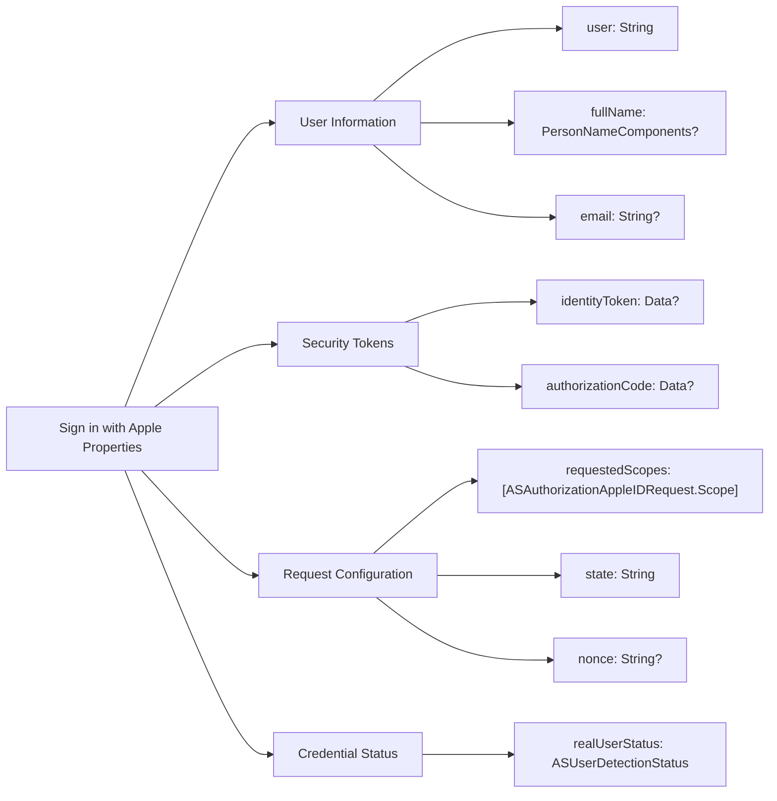

---

## **4. Methods Grouped by Functionality**

### **a. Authorization Methods**
- **Purpose**: Categorize methods based on their roles in the authorization process.
- **Diagram Type**: `flowchart TD`
- **Contents**:
  - **Creating Requests**: `createRequest()`
  - **Performing Requests**: `performRequests()`
  - **Handling Credentials**: `authorizationController(controller:didCompleteWithAuthorization:)`
  - **Error Handling**: `authorizationController(controller:didCompleteWithError:)`

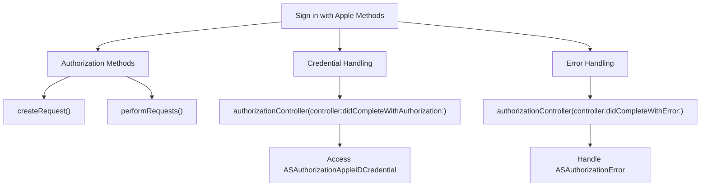

---

## **5. Enumerations and Configurations**

### **a. Enumerations Diagram**
- **Purpose**: Highlight the enums used within `Sign in with Apple` and their possible values.
- **Diagram Type**: `classDiagram`
- **Contents**:
  - **ASAuthorizationAppleIDRequest.Scope**
  - **ASUserDetectionStatus**
  - **ASAuthorizationError.Code**

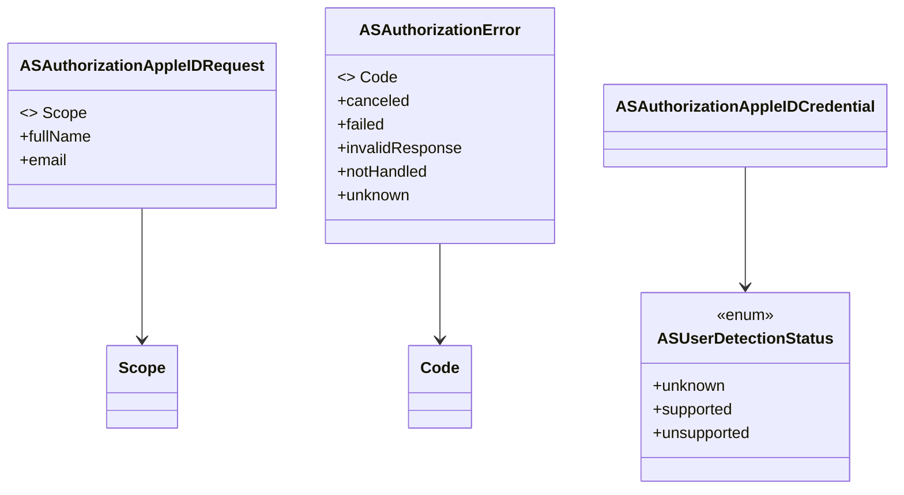

### **b. Configuration Classes Diagram**
- **Purpose**: Show the relationship between `Sign in with Apple` and its configuration classes.
- **Diagram Type**: `classDiagram`
- **Contents**:
  - **ASAuthorizationAppleIDRequest**
  - **PersonNameComponents** (for `fullName`)
  - **ASAuthorizationControllerPresentationContextProviding**

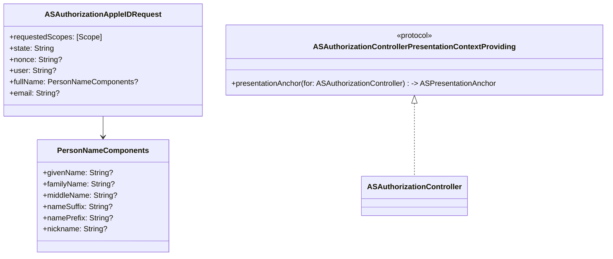

---

## **6. Protocol Conformances**

### **a. Protocols Diagram**
- **Purpose**: Display the protocols that `Sign in with Apple` classes conform to and their impact.
- **Diagram Type**: `classDiagram`
- **Contents**:
  - **ASAuthorizationControllerDelegate**
  - **ASAuthorizationControllerPresentationContextProviding**

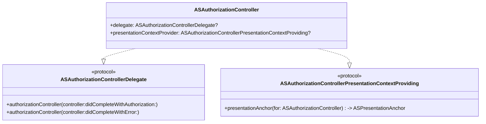

---

## **7. Relationships with Other Classes**

### **a. Related Classes Diagram**
- **Purpose**: Illustrate how `Sign in with Apple` interacts with other iOS classes and frameworks.
- **Diagram Type**: `flowchart TD`
- **Contents**:
  - **UIViewController**: Presentation context
  - **AppDelegate/SceneDelegate**: Handling incoming authorization callbacks
  - **Keychain Services**: Storing credentials securely
  - **Backend Server**: Validating identity tokens
  - **SwiftUI Views**: Integrating sign-in buttons
  - **UIKit Components**: Customizing sign-in UI

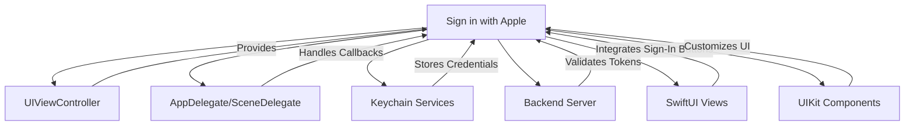

---

## **8. Extensions and Additional Functionalities**

### **a. Sign in with Apple Extensions Diagram**
- **Purpose**: Showcase the additional functionalities provided through extensions.
- **Diagram Type**: `classDiagram`
- **Contents**:
  - **UIButton**: Extensions for Apple Sign-In button styles
  - **UIViewController**: Extensions for presenting authorization controllers
  - **Data Extensions**: Handling encoding and decoding of tokens

## TODO: Fix diagram syntax error

```mermaid
classDiagram
    class UIButton {
        <<extension>>
    }

    class UIViewController {
        <<extension>>
        +presentAuthorizationController(_:)
    }

    class Data {
        <<extension>>
        +toBase64String() -> String
        +fromBase64String(_: String) -> Data?
    }

    class ASAuthorizationController {
        +performRequests()
    }

    UIButton <-- "Sign in with Apple Button Styles" 
    UIViewController <-- "Presentation Extensions"
    Data <-- "Token Handling Extensions"
```

### **b. Extensions Functionalities Flowchart**
- **Purpose**: Detail specific extended methods and their purposes.
- **Diagram Type**: `flowchart LR`
- **Contents**:
  - **Custom Sign-In Buttons**
  - **Authorization Presentation**
  - **Token Encoding/Decoding**

## TODO: Fix diagram syntax error

```mermaid
flowchart LR
    A[Sign in with Apple Extensions] --> B[Custom Sign-In Buttons]
    A --> C[Authorization Presentation]
    A --> D[Token Encoding/Decoding]

    B --> B1["UIButton.createAppleSignInButton(style:)"] -> UIButton
    C --> C1["UIViewController.presentAuthorizationController(_:)"]
    D --> D1["Data.toBase64String()"]
    D --> D2["Data.fromBase64String(_: String) -> Data?"]
    
```

---

## **9. Lifecycle and Use Cases**

### **a. Lifecycle Flowchart**
- **Purpose**: Demonstrate the typical lifecycle of a `Sign in with Apple` process within an application.
- **Diagram Type**: `flowchart TD`
- **Contents**:
  - **Initialization**
  - **User Interaction**
  - **Authorization Request**
  - **Credential Handling**
  - **Completion**
  - **Error Handling**
  - **Token Validation**
  - **User Session Management**

## TODO: Fix diagram syntax error

```mermaid
flowchart TD
    Start[Start] --> Init[Initialize ASAuthorizationAppleIDProvider]
    Init --> UserInteraction[User Taps "Sign in with Apple" Button]
    UserInteraction --> Request[Create ASAuthorizationAppleIDRequest]
    Request --> Perform[ASAuthorizationController.performRequests()]
    Perform --> Authorization[Authorization Process]

    Authorization --> Success[Handle ASAuthorizationAppleIDCredential]
    Success --> Validate[Send Identity Token to Backend]
    Validate --> Session[Manage User Session]
    Session --> End[End]

    Authorization --> Failure[Handle Error]
    Failure --> Retry[Prompt User or Log Error]
    Retry --> End
    
```

### **b. Common Use Cases Diagram**
- **Purpose**: Outline the typical scenarios where `Sign in with Apple` is utilized.
- **Diagram Type**: `flowchart TD`
- **Contents**:
  - **User Authentication**
  - **Seamless Sign-In Experience**
  - **Enhanced Privacy Control**
  - **Single Sign-On Across Devices**
  - **Secure Credential Storage**
  - **Integration with Backend Systems**

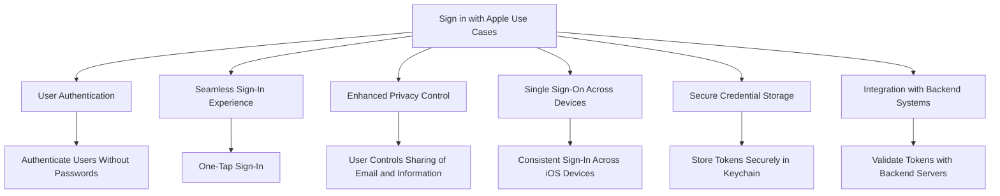

---

## **10. Feature Availability Timeline**

### **a. Feature Availability Gantt Chart**
- **Purpose**: Show when various `Sign in with Apple` features were introduced across iOS versions.
- **Diagram Type**: `gantt`
- **Contents**:
  - **iOS Versions**: 13.0, 14.0, 15.0, 16.0, 17.0
  - **Features Introduced**: Basic Sign-In, Custom Button Styles, Token Validation Enhancements, SwiftUI Integration, Enhanced Privacy Controls, Improved Error Handling.

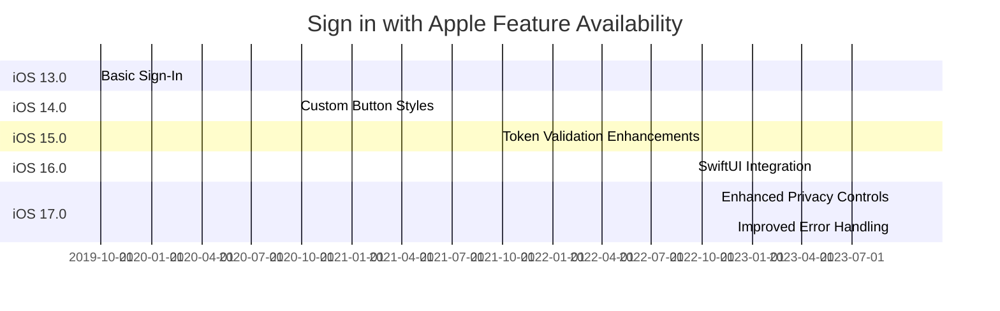

---

## **11. Data Handling and Formats**

### **a. Data Format Handling Diagram**
- **Purpose**: Explain how `Sign in with Apple` handles different data formats and security tokens.
- **Diagram Type**: `graph LR`
- **Contents**:
  - **Identity Token**: JWT format
  - **Authorization Code**: Secure token exchange
  - **User Information**: JSON payload

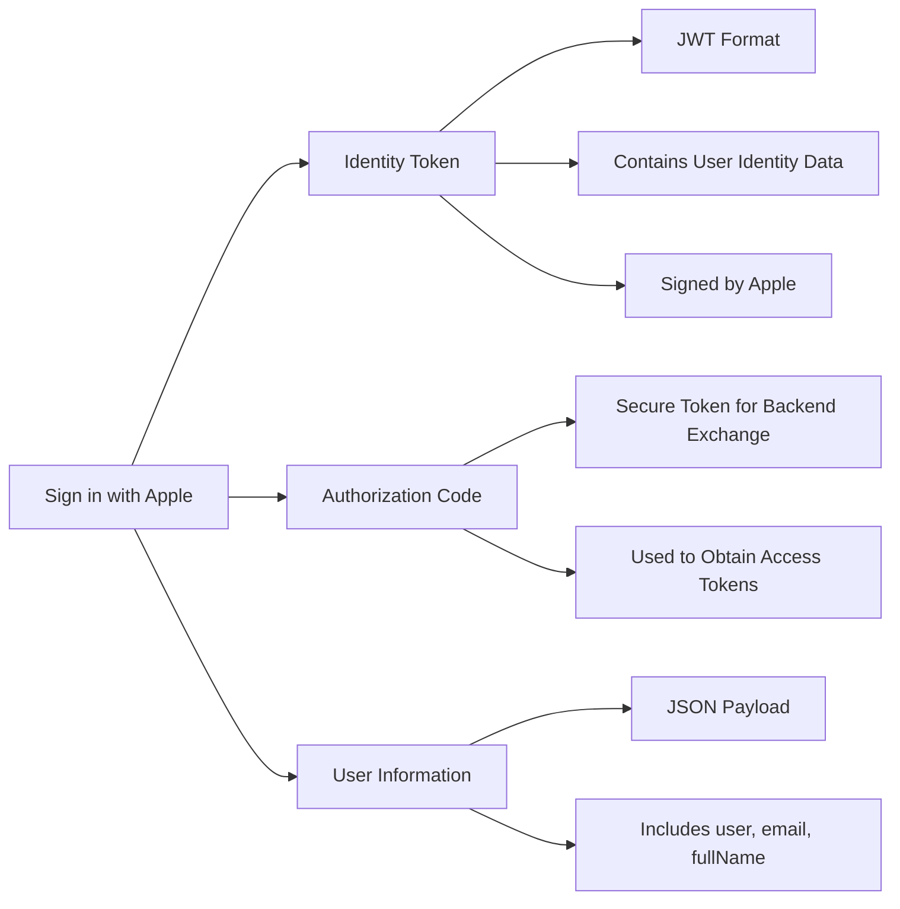

---

## **12. Integration with Other Systems**

### **a. Backend Server Integration Diagram**
- **Purpose**: Show how `Sign in with Apple` integrates with backend systems for token validation and user management.
- **Diagram Type**: `flowchart TD`
- **Contents**:
  - **Client App**: Initiates sign-in
  - **Apple Servers**: Issues tokens
  - **Backend Server**: Validates tokens, manages user data
  - **Database**: Stores user credentials and session data

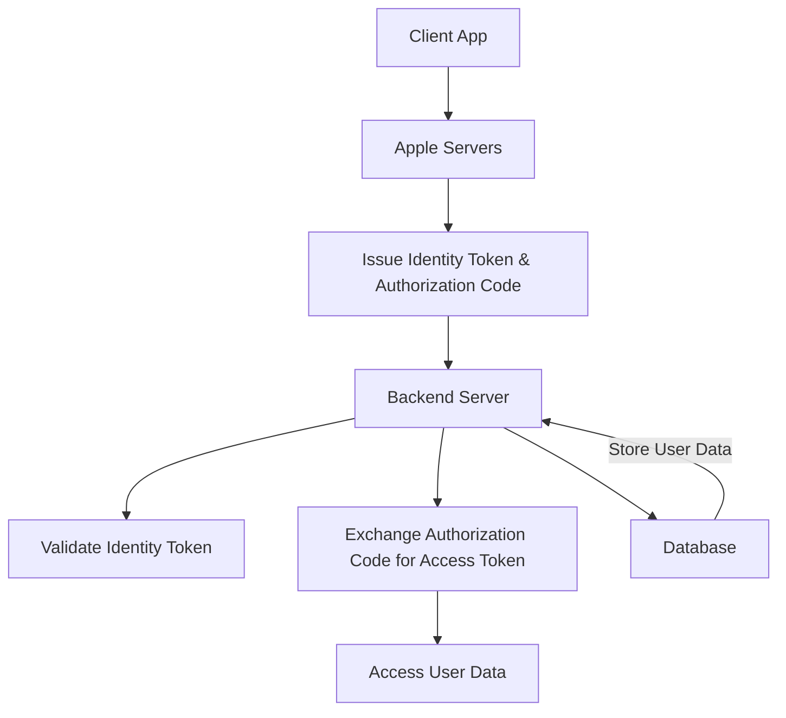

---

## **13. Summary and Best Practices**

### **a. Summary Diagram**
- **Purpose**: Provide a high-level overview of `Sign in with Apple`'s key characteristics and functionalities.
- **Diagram Type**: `graph LR` or `mindmap`
- **Contents**:
  - **Secure Authentication**
  - **Privacy Focused**
  - **Seamless Integration**
  - **Multiple Scopes & Permissions**
  - **Backend Compatibility**
  - **User Experience Enhancements**

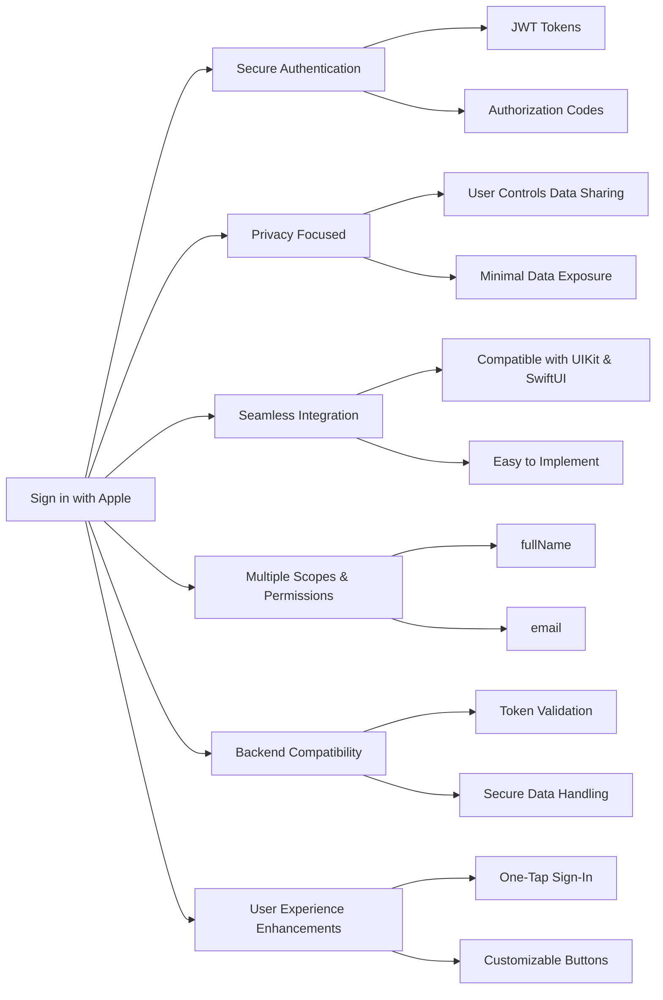

---
